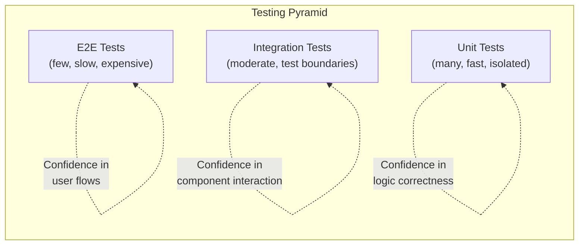

## Testing Philosophy

Tests exist to give you confidence that your code works and will continue to work as it changes. The goal is not 100% coverage — it's meaningful coverage of behavior that matters.



---

## Vitest (Modern Test Runner)

Vitest is the standard test runner for modern JavaScript/TypeScript projects. It's compatible with Jest's API but faster (native ESM, Vite-powered).

### Setup

```json
// package.json
{
    "scripts": {
        "test": "vitest",
        "test:run": "vitest run",
        "test:coverage": "vitest --coverage"
    },
    "devDependencies": {
        "vitest": "^2.0.0",
        "@vitest/coverage-v8": "^2.0.0"
    }
}
```

```typescript
// vitest.config.ts
import { defineConfig } from 'vitest/config';

export default defineConfig({
    test: {
        globals: true,
        environment: 'node', // or 'jsdom' for browser APIs
        coverage: {
            provider: 'v8',
            reporter: ['text', 'lcov'],
            thresholds: { lines: 80, branches: 80 }
        }
    }
});
```

### Basic Tests

```typescript
import { describe, it, expect, beforeEach, afterEach } from 'vitest';
import { Calculator } from './calculator';

describe('Calculator', () => {
    let calc: Calculator;
    
    beforeEach(() => {
        calc = new Calculator();
    });
    
    describe('add', () => {
        it('adds two positive numbers', () => {
            expect(calc.add(2, 3)).toBe(5);
        });
        
        it('handles negative numbers', () => {
            expect(calc.add(-1, -2)).toBe(-3);
        });
        
        it('handles floating point', () => {
            expect(calc.add(0.1, 0.2)).toBeCloseTo(0.3);
        });
    });
    
    describe('divide', () => {
        it('divides two numbers', () => {
            expect(calc.divide(10, 2)).toBe(5);
        });
        
        it('throws on division by zero', () => {
            expect(() => calc.divide(10, 0)).toThrow('Division by zero');
        });
    });
});
```

### Matchers

```typescript
// Equality
expect(value).toBe(5);                    // strict equality (===)
expect(obj).toEqual({ a: 1, b: 2 });     // deep equality
expect(obj).toStrictEqual({ a: 1 });      // deep + no extra properties

// Truthiness
expect(value).toBeTruthy();
expect(value).toBeFalsy();
expect(value).toBeNull();
expect(value).toBeUndefined();
expect(value).toBeDefined();

// Numbers
expect(value).toBeGreaterThan(3);
expect(value).toBeLessThanOrEqual(10);
expect(0.1 + 0.2).toBeCloseTo(0.3);

// Strings
expect(str).toMatch(/pattern/);
expect(str).toContain("substring");

// Arrays/Iterables
expect(arr).toContain(item);
expect(arr).toHaveLength(3);
expect(arr).toEqual(expect.arrayContaining([1, 2]));

// Objects
expect(obj).toHaveProperty("key");
expect(obj).toHaveProperty("nested.key", "value");
expect(obj).toMatchObject({ name: "Alice" }); // partial match

// Exceptions
expect(() => fn()).toThrow();
expect(() => fn()).toThrow(TypeError);
expect(() => fn()).toThrow("specific message");

// Async
await expect(asyncFn()).resolves.toBe(42);
await expect(asyncFn()).rejects.toThrow("error");
```

---

## Mocking

### Function Mocks

```typescript
import { vi, describe, it, expect } from 'vitest';

// Create a mock function
const mockFn = vi.fn();
mockFn(1, 2);

expect(mockFn).toHaveBeenCalled();
expect(mockFn).toHaveBeenCalledWith(1, 2);
expect(mockFn).toHaveBeenCalledTimes(1);

// Mock return values
const getId = vi.fn()
    .mockReturnValueOnce(1)
    .mockReturnValueOnce(2)
    .mockReturnValue(99);  // default after exhausted

getId(); // 1
getId(); // 2
getId(); // 99

// Mock async functions
const fetchData = vi.fn().mockResolvedValue({ id: 1, name: "Alice" });
const result = await fetchData(); // { id: 1, name: "Alice" }
```

### Module Mocks

```typescript
// Mock entire module
vi.mock('./database', () => ({
    query: vi.fn().mockResolvedValue([{ id: 1 }]),
    connect: vi.fn(),
    disconnect: vi.fn(),
}));

import { query } from './database'; // gets the mock

// Mock specific exports (keep others real)
vi.mock('./utils', async (importOriginal) => {
    const actual = await importOriginal<typeof import('./utils')>();
    return {
        ...actual,
        generateId: vi.fn().mockReturnValue('fixed-id'),
    };
});
```

### Spying

```typescript
import { vi } from 'vitest';

const user = {
    getName() { return "Alice"; },
    getAge() { return 30; }
};

// Spy on method (preserves original implementation)
const spy = vi.spyOn(user, 'getName');
user.getName(); // "Alice" (original runs)
expect(spy).toHaveBeenCalled();

// Spy and override
vi.spyOn(user, 'getAge').mockReturnValue(25);
user.getAge(); // 25 (overridden)

// Spy on global
vi.spyOn(console, 'error').mockImplementation(() => {});
// ... code that logs errors ...
expect(console.error).toHaveBeenCalledWith(expect.stringContaining("failed"));
```

### Timer Mocks

```typescript
import { vi, beforeEach, afterEach } from 'vitest';

beforeEach(() => {
    vi.useFakeTimers();
});

afterEach(() => {
    vi.useRealTimers();
});

it('debounces calls', () => {
    const fn = vi.fn();
    const debounced = debounce(fn, 300);
    
    debounced();
    debounced();
    debounced();
    
    expect(fn).not.toHaveBeenCalled();
    
    vi.advanceTimersByTime(300);
    
    expect(fn).toHaveBeenCalledTimes(1);
});
```

---

## Testing Async Code

```typescript
// Async/await (preferred)
it('fetches user data', async () => {
    const user = await userService.findById('123');
    expect(user).toEqual({ id: '123', name: 'Alice' });
});

// Testing rejected promises
it('throws on invalid id', async () => {
    await expect(userService.findById('')).rejects.toThrow('Invalid ID');
});

// Testing event emitters
it('emits events in order', async () => {
    const events: string[] = [];
    emitter.on('start', () => events.push('start'));
    emitter.on('end', () => events.push('end'));
    
    await emitter.process();
    
    expect(events).toEqual(['start', 'end']);
});
```

---

## Integration Testing (HTTP APIs)

```typescript
import { describe, it, expect, beforeAll, afterAll } from 'vitest';
import request from 'supertest';
import { createApp } from './app';

describe('Users API', () => {
    let app: Express;
    
    beforeAll(async () => {
        app = await createApp({ database: 'test' });
    });
    
    afterAll(async () => {
        await app.close();
    });
    
    describe('GET /api/users/:id', () => {
        it('returns user for valid id', async () => {
            const res = await request(app)
                .get('/api/users/123')
                .expect(200);
            
            expect(res.body).toMatchObject({
                id: '123',
                name: expect.any(String),
                email: expect.stringMatching(/@/),
            });
        });
        
        it('returns 404 for unknown id', async () => {
            const res = await request(app)
                .get('/api/users/nonexistent')
                .expect(404);
            
            expect(res.body.error.code).toBe('NOT_FOUND');
        });
    });
    
    describe('POST /api/users', () => {
        it('creates user with valid data', async () => {
            const res = await request(app)
                .post('/api/users')
                .send({ name: 'Bob', email: 'bob@test.com', age: 25 })
                .expect(201);
            
            expect(res.body).toHaveProperty('id');
            expect(res.body.name).toBe('Bob');
        });
        
        it('returns 400 for invalid email', async () => {
            await request(app)
                .post('/api/users')
                .send({ name: 'Bob', email: 'not-an-email', age: 25 })
                .expect(400);
        });
    });
});
```

---

## Test Organization Patterns

### Arrange-Act-Assert (AAA)

```typescript
it('applies discount to order total', () => {
    // Arrange
    const order = createOrder({ items: [{ price: 100 }, { price: 50 }] });
    const discount = { type: 'percentage', value: 10 };
    
    // Act
    const result = applyDiscount(order, discount);
    
    // Assert
    expect(result.total).toBe(135); // 150 - 10%
});
```

### Test Factories

```typescript
// factories.ts — reusable test data builders
function createUser(overrides: Partial<User> = {}): User {
    return {
        id: randomUUID(),
        name: 'Test User',
        email: 'test@example.com',
        age: 30,
        role: 'user',
        createdAt: new Date(),
        ...overrides,
    };
}

function createOrder(overrides: Partial<Order> = {}): Order {
    return {
        id: randomUUID(),
        userId: randomUUID(),
        items: [{ productId: '1', quantity: 1, price: 9.99 }],
        status: 'pending',
        ...overrides,
    };
}

// Usage in tests
it('calculates total for multiple items', () => {
    const order = createOrder({
        items: [
            { productId: '1', quantity: 2, price: 10 },
            { productId: '2', quantity: 1, price: 5 },
        ]
    });
    expect(calculateTotal(order)).toBe(25);
});
```

---

## What to Test (and What Not To)

| Test This | Don't Test This |
|-----------|----------------|
| Business logic and transformations | Framework internals |
| Edge cases and error paths | Third-party library behavior |
| Public API contracts | Private implementation details |
| Integration boundaries | Trivial getters/setters |
| State transitions | CSS styling (use visual regression) |

### Testing Principles

1. **Test behavior, not implementation** — if you refactor internals, tests shouldn't break
2. **One assertion per concept** — a test should fail for one reason
3. **Mock at boundaries** — mock HTTP, database, file system; don't mock internal modules
4. **Fast feedback** — unit tests should run in milliseconds
5. **Deterministic** — no flaky tests; control time, randomness, and external state

---

## Key Takeaways

1. **Vitest for modern projects** — fast, ESM-native, Jest-compatible API
2. **Mock boundaries, not internals** — mock `fetch`, databases, file system; test your logic directly
3. **Use test factories** — avoid repetitive test setup; make tests readable
4. **Integration tests catch more real bugs** — unit tests verify logic, integration tests verify the system works
5. **`vi.fn()` for mocks, `vi.spyOn()` for spies** — mocks replace, spies observe
6. **Fake timers for time-dependent code** — `vi.useFakeTimers()` + `vi.advanceTimersByTime()`
7. **Coverage is a guide, not a goal** — 80% meaningful coverage beats 100% trivial coverage
