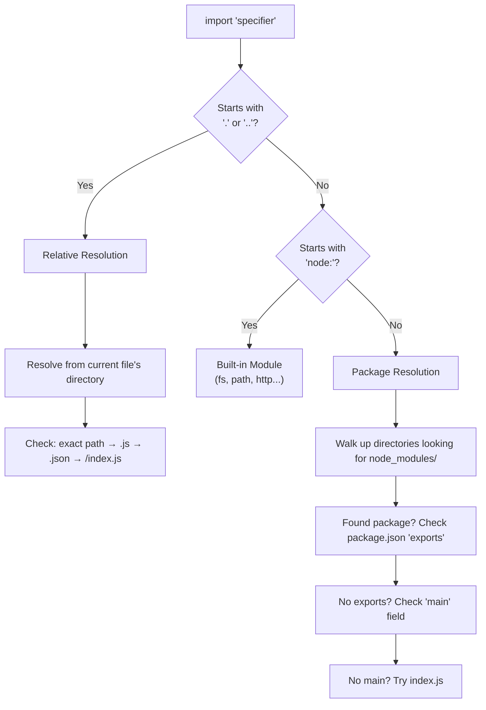

## Why Module Resolution Matters

Module resolution is the process of turning an import specifier (`import x from 'foo'`) into an actual file on disk. It's where many TypeScript/Node.js issues hide — mismatched configs, missing extensions, incompatible module formats, and confusing error messages.

---

## Module Formats

### CommonJS (CJS)

```javascript
// Synchronous, dynamic, Node.js original
const fs = require('fs');
const { add } = require('./math');

module.exports = { myFunction };
exports.helper = function() {};
```

### ES Modules (ESM)

```javascript
// Asynchronous, static, standard
import fs from 'node:fs';
import { add } from './math.js'; // extension required in Node.js ESM

export function myFunction() {}
export default class MyClass {}
```

### Interoperability

```javascript
// ESM can import CJS (default export = module.exports)
import cjsModule from './legacy.cjs'; // gets module.exports as default

// CJS cannot require() ESM synchronously
// Must use dynamic import:
const esmModule = await import('./modern.mjs');
```

---

## Node.js Resolution Algorithm



### ESM Resolution (Strict)

In Node.js ESM mode, resolution is **strict**:

```javascript
// MUST include file extension
import { add } from './math.js';      // ✓
import { add } from './math';          // ✗ ERR_MODULE_NOT_FOUND

// MUST use full path (no directory index resolution)
import utils from './utils/index.js';  // ✓
import utils from './utils';           // ✗ (no auto index.js)
```

### CJS Resolution (Lenient)

```javascript
// Extensions optional
const { add } = require('./math');     // tries: math.js, math.json, math/index.js

// Directory resolution
const utils = require('./utils');      // tries: utils.js, utils/index.js
```

---

## package.json `exports` Field

The `exports` field (Node.js 12+) is the modern way to define package entry points. It replaces `main` and provides:

- Encapsulation (consumers can only import listed paths)
- Conditional exports (different files for ESM vs CJS)
- Subpath exports

```json
{
    "name": "my-library",
    "type": "module",
    "exports": {
        ".": {
            "types": "./dist/index.d.ts",
            "import": "./dist/index.js",
            "require": "./dist/index.cjs"
        },
        "./utils": {
            "types": "./dist/utils.d.ts",
            "import": "./dist/utils.js",
            "require": "./dist/utils.cjs"
        },
        "./package.json": "./package.json"
    }
}
```

```javascript
// Consumer
import { something } from 'my-library';        // → dist/index.js
import { helper } from 'my-library/utils';     // → dist/utils.js
import { internal } from 'my-library/src/foo'; // ✗ ERROR (not in exports)
```

### Condition Order Matters

```json
{
    "exports": {
        ".": {
            "types": "./dist/index.d.ts",  // TypeScript (must be first)
            "import": "./dist/index.js",    // ESM
            "require": "./dist/index.cjs",  // CJS
            "default": "./dist/index.js"    // fallback
        }
    }
}
```

---

## TypeScript Module Resolution

TypeScript has its own resolution layer on top of Node.js:

### `moduleResolution` Options

| Mode | Behavior | Use When |
|------|----------|----------|
| `node16` / `nodenext` | Strict Node.js ESM rules | Node.js projects (recommended) |
| `bundler` | Relaxed (no extensions required) | Vite, webpack, esbuild projects |
| `node` (legacy) | CJS-only resolution | Legacy projects |

```json
// tsconfig.json
{
    "compilerOptions": {
        "module": "ESNext",
        "moduleResolution": "bundler",
        "target": "ES2022",
        "outDir": "./dist",
        "rootDir": "./src",
        "strict": true,
        "esModuleInterop": true,
        "skipLibCheck": true,
        "declaration": true
    }
}
```

### Path Aliases

```json
// tsconfig.json
{
    "compilerOptions": {
        "baseUrl": ".",
        "paths": {
            "@/*": ["src/*"],
            "@shared/*": ["packages/shared/src/*"],
            "@config": ["src/config/index.ts"]
        }
    }
}
```

```typescript
// Instead of: import { helper } from '../../../shared/utils'
import { helper } from '@shared/utils';
import { db } from '@/services/database';
```

**Important:** `paths` only affects TypeScript compilation. The runtime (Node.js) doesn't understand them. You need a runtime resolver:

```json
// For Node.js: use tsc-alias, tsconfig-paths, or bundler
// package.json
{
    "scripts": {
        "build": "tsc && tsc-alias",
        "dev": "tsx --tsconfig tsconfig.json src/index.ts"
    }
}
```

---

## Build Tools

### TypeScript Compiler (tsc)

```bash
# Type-check only (no output)
tsc --noEmit

# Compile to JavaScript
tsc

# Watch mode
tsc --watch
```

### Bundlers

| Tool | Speed | Use Case |
|------|-------|----------|
| **esbuild** | Extremely fast (Go) | Libraries, simple apps |
| **Vite** | Fast (esbuild + Rollup) | Frontend apps, dev server |
| **Rollup** | Moderate | Libraries (tree-shaking) |
| **webpack** | Slow | Complex apps (legacy) |
| **tsup** | Fast (esbuild wrapper) | Library publishing |

### tsup (Library Publishing)

```typescript
// tsup.config.ts
import { defineConfig } from 'tsup';

export default defineConfig({
    entry: ['src/index.ts'],
    format: ['esm', 'cjs'],     // dual format
    dts: true,                   // generate .d.ts
    splitting: true,
    sourcemap: true,
    clean: true,
    target: 'node20',
});
```

### Vite (Application Development)

```typescript
// vite.config.ts
import { defineConfig } from 'vite';
import { resolve } from 'path';

export default defineConfig({
    resolve: {
        alias: {
            '@': resolve(__dirname, 'src'),
        }
    },
    build: {
        target: 'es2022',
        outDir: 'dist',
    }
});
```

---

## Common Issues and Solutions

### Issue: "Cannot find module"

```text
Error: Cannot find module './utils'
```

| Cause | Solution |
|-------|----------|
| Missing extension in ESM | Add `.js` extension: `import x from './utils.js'` |
| Path alias not resolved at runtime | Use `tsc-alias` or bundler |
| Package not installed | `npm install` |
| Wrong `moduleResolution` | Match to your runtime (bundler vs node16) |

### Issue: "ERR_REQUIRE_ESM"

```text
Error [ERR_REQUIRE_ESM]: require() of ES Module not supported
```

The package is ESM-only but your project uses CJS. Solutions:

1. Switch your project to ESM (`"type": "module"`)
2. Use dynamic `import()` instead of `require()`
3. Use an older version of the package that still supports CJS

### Issue: Types Not Found

```text
Could not find a declaration file for module 'some-package'
```

Solutions:

1. Install `@types/some-package`
2. Create a declaration file: `declare module 'some-package';`
3. Check if the package has `"types"` in its package.json

---

## Dual Package Publishing

Publishing a package that works in both CJS and ESM:

```json
{
    "name": "my-lib",
    "version": "1.0.0",
    "type": "module",
    "main": "./dist/index.cjs",
    "module": "./dist/index.js",
    "types": "./dist/index.d.ts",
    "exports": {
        ".": {
            "types": "./dist/index.d.ts",
            "import": "./dist/index.js",
            "require": "./dist/index.cjs"
        }
    },
    "files": ["dist/"],
    "scripts": {
        "build": "tsup src/index.ts --format esm,cjs --dts"
    }
}
```

---

## Key Takeaways

1. **ESM is the standard** — use `"type": "module"` in new projects; CJS is legacy
2. **`moduleResolution: "bundler"`** for frontend/Vite projects; `"node16"` for pure Node.js
3. **`exports` field encapsulates packages** — consumers can only import what you explicitly expose
4. **Path aliases need runtime support** — TypeScript resolves them at compile time, but Node.js doesn't understand them
5. **Extensions are required in Node.js ESM** — `import './foo.js'`, not `import './foo'`
6. **Use tsup for library publishing** — handles dual CJS/ESM output, declarations, and tree-shaking
7. **`types` condition must come first** in exports — TypeScript reads conditions in order
