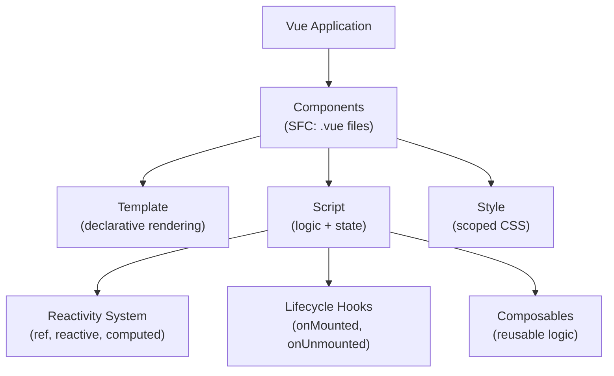
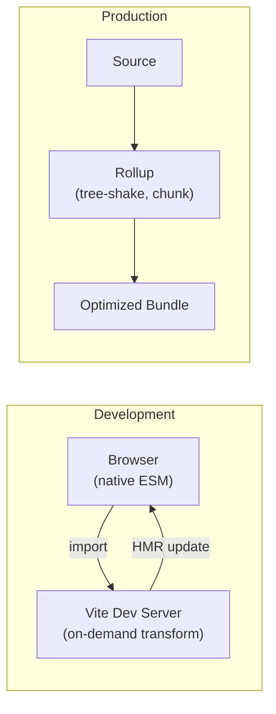
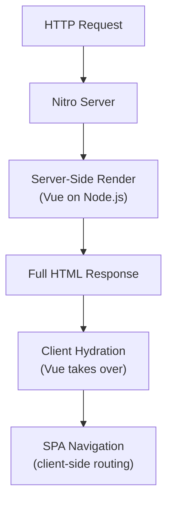

## Vue 3 Core Concepts

Vue is a progressive framework — you can adopt it incrementally, from enhancing a single page to building a full SPA. Vue 3 introduced the Composition API, a new reactivity system, and significant performance improvements.



### Single-File Components (SFC)

```vue
<script setup lang="ts">
import { ref, computed } from 'vue'

const count = ref(0)
const doubled = computed(() => count.value * 2)

function increment() {
  count.value++
}
</script>

<template>
  <button @click="increment">Count: {{ count }} (doubled: {{ doubled }})</button>
</template>

<style scoped>
button { padding: 0.5rem 1rem; }
</style>
```

`<script setup>` is the recommended syntax — it compiles to a more efficient render function and provides better TypeScript inference than the Options API.

---

## Reactivity System

Vue 3 uses JavaScript Proxies (replacing Vue 2's `Object.defineProperty`) to track dependencies and trigger updates.

| API | Use Case | Unwrap |
|-----|----------|--------|
| `ref()` | Primitives and single values | `.value` in script, auto-unwrapped in template |
| `reactive()` | Objects, arrays, maps | Direct property access (no `.value`) |
| `computed()` | Derived state (cached) | `.value` in script |
| `watch()` | Side effects on state change | — |
| `watchEffect()` | Auto-tracked side effects | — |

### Reactivity Rules

```typescript
import { ref, reactive, computed, watch } from 'vue'

// ref — use for primitives and values you might reassign
const name = ref('Alice')
const items = ref<string[]>([])

// reactive — use for objects you won't reassign
const form = reactive({ email: '', password: '' })

// computed — derived state, cached until dependencies change
const isValid = computed(() => form.email.includes('@') && form.password.length >= 8)

// watch — explicit dependency tracking with access to old/new values
watch(name, (newVal, oldVal) => {
  console.log(`Changed from ${oldVal} to ${newVal}`)
})

// watchEffect — auto-tracks all reactive dependencies used inside
watchEffect(() => {
  document.title = `Hello, ${name.value}`
})
```

### Pitfalls

- **Destructuring reactive objects** breaks reactivity — use `toRefs()` or access properties directly
- **Replacing a reactive object** doesn't trigger updates — mutate properties instead
- `ref()` on an object internally uses `reactive()` for the `.value`

---

## Component Patterns

### Props and Emits (TypeScript)

```typescript
// Props with defaults
const props = withDefaults(defineProps<{
  title: string
  count?: number
  items?: string[]
}>(), {
  count: 0,
  items: () => []
})

// Typed emits
const emit = defineEmits<{
  update: [value: string]
  delete: [id: number]
}>()
```

### Slots

```vue
<!-- Parent -->
<Card>
  <template #header>Title</template>
  <template #default>Body content</template>
  <template #footer="{ timestamp }">Updated: {{ timestamp }}</template>
</Card>

<!-- Card.vue -->
<template>
  <div class="card">
    <header><slot name="header" /></header>
    <main><slot /></main>
    <footer><slot name="footer" :timestamp="Date.now()" /></footer>
  </div>
</template>
```

### Provide / Inject

For deep component trees where prop drilling is impractical:

```typescript
// Ancestor component
import { provide, ref } from 'vue'
const theme = ref('dark')
provide('theme', theme)

// Any descendant
import { inject } from 'vue'
const theme = inject<Ref<string>>('theme', ref('light'))
```

---

## Composables

Composables are functions that encapsulate and reuse stateful logic — Vue's equivalent of React hooks.

```typescript
// composables/useFetch.ts
import { ref, watchEffect } from 'vue'

export function useFetch<T>(url: () => string) {
  const data = ref<T | null>(null)
  const error = ref<Error | null>(null)
  const loading = ref(false)

  watchEffect(async () => {
    loading.value = true
    error.value = null
    try {
      const res = await fetch(url())
      data.value = await res.json()
    } catch (e) {
      error.value = e as Error
    } finally {
      loading.value = false
    }
  })

  return { data, error, loading }
}
```

Naming convention: always prefix with `use` (`useFetch`, `useAuth`, `useLocalStorage`).

---

## Vite

Vite is a build tool that provides instant dev server startup and fast HMR (Hot Module Replacement). It uses native ES modules in development and Rollup for production builds.



### Why Vite Over Webpack

| Aspect | Webpack | Vite |
|--------|---------|------|
| Dev startup | Bundles everything first (slow) | Serves files on demand (instant) |
| HMR speed | Rebuilds affected module graph | Updates only the changed module |
| Config | Complex, plugin-heavy | Sensible defaults, minimal config |
| Production | Webpack bundler | Rollup (better tree-shaking) |

### Configuration

```typescript
// vite.config.ts
import { defineConfig } from 'vite'
import vue from '@vitejs/plugin-vue'

export default defineConfig({
  plugins: [vue()],
  resolve: {
    alias: { '@': '/src' }
  },
  server: {
    port: 3000,
    proxy: {
      '/api': 'http://localhost:8080'
    }
  }
})
```

### Key Features

- **Dependency pre-bundling** — converts CJS deps to ESM using esbuild (10–100x faster than Rollup)
- **CSS handling** — PostCSS, CSS Modules, Sass/Less out of the box
- **Environment variables** — `import.meta.env.VITE_*` (only `VITE_` prefixed are exposed to client)
- **Glob imports** — `import.meta.glob('./modules/*.ts')` for dynamic module loading

---

## Nuxt

Nuxt is a full-stack framework built on Vue and Vite. It adds server-side rendering, file-based routing, auto-imports, and a module ecosystem.



### Rendering Modes

| Mode | When | Use Case |
|------|------|----------|
| SSR (default) | Every request | Dynamic content, SEO-critical pages |
| SSG (`prerender`) | Build time | Blogs, docs, marketing pages |
| SPA | Client only | Admin panels, dashboards |
| Hybrid | Per-route | Mix of above via route rules |

```typescript
// nuxt.config.ts
export default defineNuxtConfig({
  routeRules: {
    '/': { prerender: true },
    '/dashboard/**': { ssr: false },
    '/api/**': { cors: true },
    '/blog/**': { swr: 3600 }
  }
})
```

### File-Based Routing

```text
pages/
├── index.vue              → /
├── about.vue              → /about
├── blog/
│   ├── index.vue          → /blog
│   └── [slug].vue         → /blog/:slug
└── [...slug].vue          → catch-all (404)
```

### Auto-Imports

Nuxt auto-imports Vue APIs, composables, and utilities — no manual import statements needed:

```vue
<script setup lang="ts">
// ref, computed, watch — auto-imported from vue
// useRoute, useRouter, useFetch — auto-imported from nuxt
const { data } = await useFetch('/api/posts')
const route = useRoute()
</script>
```

### Data Fetching

```typescript
// SSR-friendly — runs on server, serialized to client
const { data, error, refresh } = await useFetch('/api/users')

// Only on client
const { data } = await useFetch('/api/dashboard', { server: false })

// With caching key and transform
const { data } = await useFetch('/api/posts', {
  key: 'posts-list',
  transform: (posts) => posts.map(p => ({ id: p.id, title: p.title }))
})
```

### Server Routes (Nitro)

```typescript
// server/api/users.get.ts
export default defineEventHandler(async (event) => {
  const query = getQuery(event)
  return await db.users.findMany({ take: query.limit ?? 10 })
})

// server/api/users.post.ts
export default defineEventHandler(async (event) => {
  const body = await readBody(event)
  return await db.users.create({ data: body })
})
```

### Modules

Nuxt modules extend functionality with zero configuration:

```typescript
// nuxt.config.ts
export default defineNuxtConfig({
  modules: [
    '@pinia/nuxt',        // State management
    '@nuxt/image',        // Image optimization
    '@nuxtjs/i18n',       // Internationalization
    '@vueuse/nuxt'        // Utility composables
  ]
})
```

---

## State Management with Pinia

Pinia is the official state management library for Vue (successor to Vuex).

```typescript
// stores/counter.ts
import { defineStore } from 'pinia'

export const useCounterStore = defineStore('counter', () => {
  const count = ref(0)
  const doubled = computed(() => count.value * 2)

  function increment() {
    count.value++
  }

  return { count, doubled, increment }
})
```

```vue
<script setup>
const counter = useCounterStore()
</script>

<template>
  <button @click="counter.increment()">{{ counter.count }}</button>
</template>
```

---

## Vue Router

Vue Router is the official routing library. In Nuxt it's handled automatically via file-based routing, but standalone Vue apps configure it manually.

### Route Configuration

```typescript
import { createRouter, createWebHistory } from 'vue-router'

const router = createRouter({
  history: createWebHistory(),
  routes: [
    { path: '/', component: () => import('./pages/Home.vue') },
    { path: '/users/:id', component: () => import('./pages/User.vue'), props: true },
    {
      path: '/admin',
      component: () => import('./layouts/Admin.vue'),
      meta: { requiresAuth: true },
      children: [
        { path: '', component: () => import('./pages/admin/Dashboard.vue') },
        { path: 'users', component: () => import('./pages/admin/Users.vue') }
      ]
    },
    { path: '/:pathMatch(.*)*', component: () => import('./pages/NotFound.vue') }
  ]
})
```

### Navigation Guards

```typescript
// Global guard
router.beforeEach((to, from) => {
  if (to.meta.requiresAuth && !isAuthenticated()) {
    return { path: '/login', query: { redirect: to.fullPath } }
  }
})

// Per-route guard
{
  path: '/admin',
  beforeEnter: (to, from) => {
    if (!hasRole('admin')) return '/forbidden'
  }
}

// In-component guard (Composition API)
import { onBeforeRouteLeave } from 'vue-router'

onBeforeRouteLeave((to, from) => {
  if (hasUnsavedChanges.value) {
    return confirm('Discard unsaved changes?')
  }
})
```

### Route Composition

```typescript
import { useRoute, useRouter } from 'vue-router'

const route = useRoute()    // reactive route object (params, query, meta)
const router = useRouter()  // navigation methods

// Programmatic navigation
router.push({ name: 'user', params: { id: '123' } })
router.replace('/login')
router.go(-1)
```

---

## Nuxt Middleware

Middleware runs before rendering a page — used for auth checks, redirects, and logging.

```typescript
// middleware/auth.ts (named middleware)
export default defineNuxtRouteMiddleware((to, from) => {
  const { loggedIn } = useUserSession()
  if (!loggedIn.value) {
    return navigateTo('/login')
  }
})

// middleware/auth.global.ts (global — runs on every route)
export default defineNuxtRouteMiddleware((to) => {
  const publicRoutes = ['/', '/login', '/register']
  if (!publicRoutes.includes(to.path) && !isAuthenticated()) {
    return navigateTo('/login')
  }
})
```

Apply named middleware to specific pages:

```vue
<script setup>
definePageMeta({
  middleware: 'auth'
})
</script>
```

---

## Plugins

Plugins run once when the Vue app is created. Use them for third-party libraries, global components, or app-wide configuration.

### Vue Plugins

```typescript
// plugins/i18n.ts
import { createI18n } from 'vue-i18n'

export default defineNuxtPlugin((nuxtApp) => {
  const i18n = createI18n({
    locale: 'en',
    messages: { en: { hello: 'Hello' }, es: { hello: 'Hola' } }
  })
  nuxtApp.vueApp.use(i18n)
})
```

### Providing Helpers

```typescript
// plugins/api.ts
export default defineNuxtPlugin(() => {
  const api = $fetch.create({
    baseURL: '/api',
    onRequest({ options }) {
      const token = useCookie('token')
      if (token.value) {
        options.headers.set('Authorization', `Bearer ${token.value}`)
      }
    }
  })

  return { provide: { api } }
})

// Usage in any component: const { $api } = useNuxtApp()
```

---

## Transitions and Animations

Vue provides built-in transition components that apply CSS classes during enter/leave:

```vue
<template>
  <Transition name="fade">
    <p v-if="show">Hello</p>
  </Transition>
</template>

<style>
.fade-enter-active, .fade-leave-active {
  transition: opacity 0.3s ease;
}
.fade-enter-from, .fade-leave-to {
  opacity: 0;
}
</style>
```

### Transition Classes

| Class | When Applied |
|-------|-------------|
| `*-enter-from` | Start state of enter (removed after one frame) |
| `*-enter-active` | Active state during entire enter phase |
| `*-enter-to` | End state of enter |
| `*-leave-from` | Start state of leave |
| `*-leave-active` | Active state during entire leave phase |
| `*-leave-to` | End state of leave |

### List Transitions

```vue
<TransitionGroup name="list" tag="ul">
  <li v-for="item in items" :key="item.id">{{ item.text }}</li>
</TransitionGroup>

<style>
.list-enter-active, .list-leave-active {
  transition: all 0.3s ease;
}
.list-enter-from, .list-leave-to {
  opacity: 0;
  transform: translateX(-30px);
}
.list-move {
  transition: transform 0.3s ease;
}
</style>
```

### Page Transitions in Nuxt

```typescript
// nuxt.config.ts
export default defineNuxtConfig({
  app: {
    pageTransition: { name: 'page', mode: 'out-in' }
  }
})
```

---

## Error Handling

### Component-Level Error Handling

```typescript
import { onErrorCaptured } from 'vue'

// Catches errors from child components
onErrorCaptured((error, instance, info) => {
  reportError(error)
  return false // prevent propagation
})
```

### Global Error Handler

```typescript
// plugins/error-handler.ts
export default defineNuxtPlugin((nuxtApp) => {
  nuxtApp.vueApp.config.errorHandler = (error, instance, info) => {
    console.error('Global error:', error)
    // Send to error tracking service
  }
})
```

### Nuxt Error Handling

```vue
<!-- error.vue (app-level error page) -->
<script setup lang="ts">
const props = defineProps<{ error: { statusCode: number; message: string } }>()

function handleClear() {
  clearError({ redirect: '/' })
}
</script>

<template>
  <div>
    <h1>{{ error.statusCode }}</h1>
    <p>{{ error.message }}</p>
    <button @click="handleClear">Go Home</button>
  </div>
</template>
```

```typescript
// Throwing errors in server routes
export default defineEventHandler(() => {
  throw createError({ statusCode: 404, message: 'User not found' })
})

// In components — show error UI without navigating away
const { data, error } = await useFetch('/api/users')
```

### NuxtErrorBoundary

```vue
<template>
  <NuxtErrorBoundary>
    <SomeComponent />
    <template #error="{ error, clearError }">
      <p>Something went wrong: {{ error.message }}</p>
      <button @click="clearError">Retry</button>
    </template>
  </NuxtErrorBoundary>
</template>
```

---

## Testing Vue Components

### Unit Testing with Vitest

```typescript
import { describe, it, expect } from 'vitest'
import { mount } from '@vue/test-utils'
import Counter from './Counter.vue'

describe('Counter', () => {
  it('increments count on click', async () => {
    const wrapper = mount(Counter)
    expect(wrapper.text()).toContain('0')

    await wrapper.find('button').trigger('click')
    expect(wrapper.text()).toContain('1')
  })

  it('emits update event', async () => {
    const wrapper = mount(Counter)
    await wrapper.find('button').trigger('click')

    expect(wrapper.emitted('update')).toHaveLength(1)
    expect(wrapper.emitted('update')![0]).toEqual([1])
  })

  it('renders with props', () => {
    const wrapper = mount(Counter, { props: { initial: 5 } })
    expect(wrapper.text()).toContain('5')
  })
})
```

### Testing Composables

```typescript
import { describe, it, expect } from 'vitest'
import { useCounter } from './useCounter'

describe('useCounter', () => {
  it('increments and decrements', () => {
    const { count, increment, decrement } = useCounter(10)

    expect(count.value).toBe(10)
    increment()
    expect(count.value).toBe(11)
    decrement()
    expect(count.value).toBe(10)
  })
})
```

### Testing with Nuxt

```typescript
import { describe, it, expect } from 'vitest'
import { mountSuspended } from '@nuxt/test-utils/runtime'
import UserProfile from './UserProfile.vue'

describe('UserProfile', () => {
  it('renders user data', async () => {
    const wrapper = await mountSuspended(UserProfile, {
      props: { userId: '123' }
    })
    expect(wrapper.text()).toContain('Alice')
  })
})
```

---

## TypeScript Integration

### Typed Props and Emits

```typescript
// Complex prop types
interface Column<T> {
  key: keyof T
  label: string
  sortable?: boolean
  render?: (value: T[keyof T], row: T) => string
}

const props = defineProps<{
  columns: Column<User>[]
  data: User[]
  loading?: boolean
}>()

// Generic components (3.3+)
<script setup lang="ts" generic="T extends Record<string, unknown>">
defineProps<{ items: T[]; renderItem: (item: T) => string }>()
</script>
```

### Typed Provide/Inject

```typescript
import type { InjectionKey, Ref } from 'vue'

interface UserContext {
  user: Ref<User | null>
  login: (creds: Credentials) => Promise<void>
  logout: () => void
}

export const UserKey: InjectionKey<UserContext> = Symbol('user')

// Provider
provide(UserKey, { user, login, logout })

// Consumer — fully typed
const { user, login } = inject(UserKey)!
```

### Typed Template Refs

```vue
<script setup lang="ts">
import { ref, onMounted } from 'vue'

const inputRef = ref<HTMLInputElement | null>(null)
const childRef = ref<InstanceType<typeof MyComponent> | null>(null)

onMounted(() => {
  inputRef.value?.focus()
  childRef.value?.someExposedMethod()
})
</script>

<template>
  <input ref="inputRef" />
  <MyComponent ref="childRef" />
</template>
```

### Augmenting Global Types

```typescript
// types/env.d.ts — extend ImportMeta for Vite env variables
interface ImportMetaEnv {
  readonly VITE_API_URL: string
  readonly VITE_APP_TITLE: string
}

// types/components.d.ts — global component types (auto-generated by unplugin-vue-components)
declare module 'vue' {
  export interface GlobalComponents {
    BaseButton: typeof import('./components/BaseButton.vue')['default']
  }
}
```

---

## Key Takeaways

1. Vue 3's Composition API with `<script setup>` provides type-safe, composable logic that scales better than the Options API
2. The reactivity system uses Proxies — understand `ref` vs `reactive` and avoid destructuring reactive objects
3. Composables (`use*` functions) are the primary pattern for reusing stateful logic across components
4. Vite replaces Webpack with instant dev startup via native ESM and Rollup-based production builds
5. Nuxt adds SSR, file-based routing, auto-imports, and server routes on top of Vue + Vite
6. Nuxt's hybrid rendering lets you choose SSR, SSG, or SPA per route — not a global decision
7. Pinia provides type-safe, composable stores that integrate naturally with Vue's reactivity
8. Navigation guards (global, per-route, in-component) handle auth and access control at the routing layer
9. Nuxt middleware provides a clean pattern for route-level logic (auth, redirects) that runs before rendering
10. Vue's transition system provides declarative enter/leave animations with CSS classes or JavaScript hooks
11. Error handling spans multiple levels: `onErrorCaptured` in components, `NuxtErrorBoundary` for sections, `error.vue` for fatal errors
12. TypeScript integration is first-class — generic components, typed inject/provide, and augmentable global types
