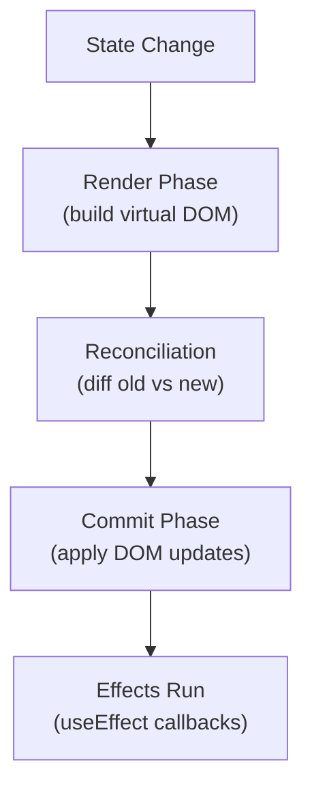
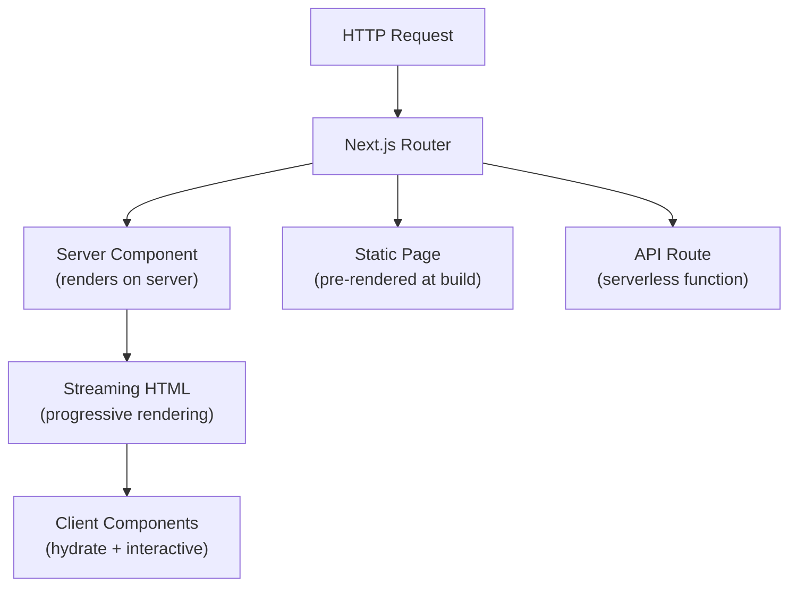
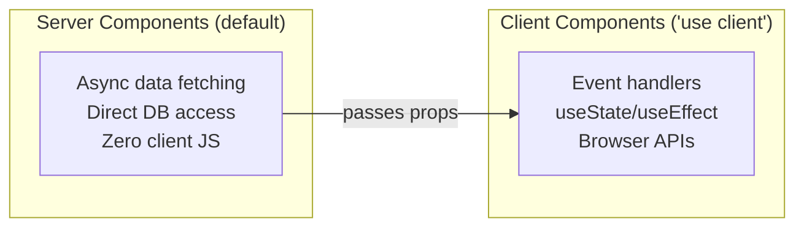
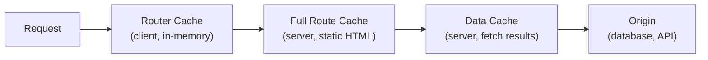

## React Core Model

React is a library for building user interfaces from components. Its core idea: UI is a function of state. When state changes, React efficiently re-renders only what's needed through a virtual DOM diffing algorithm.



### JSX and Components

```tsx
// Function component with TypeScript
interface UserCardProps {
  name: string
  email: string
  role?: 'admin' | 'user'
}

function UserCard({ name, email, role = 'user' }: UserCardProps) {
  return (
    <div className="card">
      <h2>{name}</h2>
      <p>{email}</p>
      {role === 'admin' && <span className="badge">Admin</span>}
    </div>
  )
}
```

JSX compiles to `React.createElement()` calls. It's not HTML — it's JavaScript expressions that produce a virtual DOM tree.

---

## Hooks

Hooks are functions that let you use state and lifecycle features in function components. They must be called at the top level (not inside loops, conditions, or nested functions).

### Core Hooks

| Hook | Purpose |
|------|---------|
| `useState` | Local component state |
| `useEffect` | Side effects (fetch, subscriptions, DOM manipulation) |
| `useRef` | Mutable value that persists across renders without triggering re-render |
| `useMemo` | Memoize expensive computations |
| `useCallback` | Memoize function references (for stable props) |
| `useContext` | Consume context without nesting |
| `useReducer` | Complex state logic (like Redux in a component) |

### useState and useEffect

```tsx
import { useState, useEffect } from 'react'

function UserList() {
  const [users, setUsers] = useState<User[]>([])
  const [loading, setLoading] = useState(true)

  useEffect(() => {
    let cancelled = false

    async function fetchUsers() {
      const res = await fetch('/api/users')
      const data = await res.json()
      if (!cancelled) {
        setUsers(data)
        setLoading(false)
      }
    }

    fetchUsers()
    return () => { cancelled = true } // cleanup on unmount
  }, []) // empty deps = run once on mount

  if (loading) return <p>Loading...</p>
  return <ul>{users.map(u => <li key={u.id}>{u.name}</li>)}</ul>
}
```

### useEffect Dependency Rules

| Deps Array | Behavior |
|------------|----------|
| `[]` | Run once on mount, cleanup on unmount |
| `[a, b]` | Run when `a` or `b` changes |
| Omitted | Run after every render (rarely correct) |

### useReducer for Complex State

```tsx
type Action =
  | { type: 'add'; item: Item }
  | { type: 'remove'; id: string }
  | { type: 'toggle'; id: string }

function reducer(state: Item[], action: Action): Item[] {
  switch (action.type) {
    case 'add': return [...state, action.item]
    case 'remove': return state.filter(i => i.id !== action.id)
    case 'toggle': return state.map(i =>
      i.id === action.id ? { ...i, done: !i.done } : i
    )
  }
}

const [items, dispatch] = useReducer(reducer, [])
dispatch({ type: 'add', item: { id: '1', text: 'Learn React', done: false } })
```

---

## Component Patterns

### Children and Composition

```tsx
// Layout component using children
function Layout({ children }: { children: React.ReactNode }) {
  return (
    <div className="layout">
      <Header />
      <main>{children}</main>
      <Footer />
    </div>
  )
}

// Render prop pattern
function DataFetcher<T>({ url, render }: { url: string; render: (data: T) => JSX.Element }) {
  const [data, setData] = useState<T | null>(null)
  useEffect(() => { fetch(url).then(r => r.json()).then(setData) }, [url])
  return data ? render(data) : <p>Loading...</p>
}
```

### Custom Hooks

The primary pattern for reusing stateful logic:

```tsx
function useLocalStorage<T>(key: string, initial: T) {
  const [value, setValue] = useState<T>(() => {
    const stored = localStorage.getItem(key)
    return stored ? JSON.parse(stored) : initial
  })

  useEffect(() => {
    localStorage.setItem(key, JSON.stringify(value))
  }, [key, value])

  return [value, setValue] as const
}

// Usage
const [theme, setTheme] = useLocalStorage('theme', 'dark')
```

### Context for Global State

```tsx
import { createContext, useContext, useState } from 'react'

interface AuthContext {
  user: User | null
  login: (credentials: Credentials) => Promise<void>
  logout: () => void
}

const AuthContext = createContext<AuthContext | null>(null)

export function useAuth() {
  const ctx = useContext(AuthContext)
  if (!ctx) throw new Error('useAuth must be used within AuthProvider')
  return ctx
}

export function AuthProvider({ children }: { children: React.ReactNode }) {
  const [user, setUser] = useState<User | null>(null)

  const login = async (creds: Credentials) => {
    const res = await fetch('/api/login', { method: 'POST', body: JSON.stringify(creds) })
    setUser(await res.json())
  }

  const logout = () => setUser(null)

  return <AuthContext.Provider value={{ user, login, logout }}>{children}</AuthContext.Provider>
}
```

---

## Performance

### When to Memoize

```tsx
import { memo, useMemo, useCallback } from 'react'

// memo — skip re-render if props haven't changed
const ExpensiveList = memo(function ExpensiveList({ items }: { items: Item[] }) {
  return <ul>{items.map(i => <li key={i.id}>{i.name}</li>)}</ul>
})

// useMemo — cache expensive computation
const sorted = useMemo(() => items.sort((a, b) => a.name.localeCompare(b.name)), [items])

// useCallback — stable function reference for child props
const handleClick = useCallback((id: string) => {
  dispatch({ type: 'toggle', id })
}, [])
```

**Rule of thumb:** Don't memoize by default. Measure first. React's re-rendering is fast — unnecessary memoization adds complexity without benefit.

---

## Next.js

Next.js is a full-stack React framework that adds server-side rendering, file-based routing, API routes, and build optimizations.



### App Router (Next.js 13+)

Next.js uses a file-system based router where folders define routes:

```text
app/
├── layout.tsx             → Root layout (wraps all pages)
├── page.tsx               → / (home page)
├── about/
│   └── page.tsx           → /about
├── blog/
│   ├── page.tsx           → /blog (list)
│   └── [slug]/
│       └── page.tsx       → /blog/:slug (dynamic)
├── api/
│   └── users/
│       └── route.ts       → /api/users (API endpoint)
└── (dashboard)/
    ├── layout.tsx         → Shared dashboard layout
    └── settings/
        └── page.tsx       → /settings
```

### Server vs Client Components



```tsx
// Server Component (default) — runs only on the server
async function PostList() {
  const posts = await db.posts.findMany() // direct DB access, no API needed
  return (
    <ul>
      {posts.map(post => <PostCard key={post.id} post={post} />)}
    </ul>
  )
}

// Client Component — add 'use client' directive
'use client'
import { useState } from 'react'

function LikeButton({ postId }: { postId: string }) {
  const [liked, setLiked] = useState(false)
  return <button onClick={() => setLiked(!liked)}>{liked ? '❤️' : '🤍'}</button>
}
```

**Rule:** Keep components server-side by default. Only add `'use client'` when you need interactivity, hooks, or browser APIs.

### Data Fetching

```tsx
// Server Component — fetch at the component level
async function UserProfile({ id }: { id: string }) {
  const user = await fetch(`https://api.example.com/users/${id}`, {
    next: { revalidate: 3600 } // ISR: revalidate every hour
  }).then(r => r.json())

  return <div>{user.name}</div>
}

// Static generation at build time
export async function generateStaticParams() {
  const posts = await db.posts.findMany({ select: { slug: true } })
  return posts.map(post => ({ slug: post.slug }))
}
```

### Route Handlers (API Routes)

```typescript
// app/api/users/route.ts
import { NextRequest, NextResponse } from 'next/server'

export async function GET(request: NextRequest) {
  const { searchParams } = new URL(request.url)
  const page = Number(searchParams.get('page') ?? 1)
  const users = await db.users.findMany({ skip: (page - 1) * 10, take: 10 })
  return NextResponse.json(users)
}

export async function POST(request: NextRequest) {
  const body = await request.json()
  const user = await db.users.create({ data: body })
  return NextResponse.json(user, { status: 201 })
}
```

### Server Actions

Server Actions let you call server-side functions directly from client components without creating API routes:

```tsx
// actions.ts
'use server'

export async function createPost(formData: FormData) {
  const title = formData.get('title') as string
  const content = formData.get('content') as string
  await db.posts.create({ data: { title, content } })
  revalidatePath('/blog')
}

// Client component using the action
'use client'
import { createPost } from './actions'

function NewPostForm() {
  return (
    <form action={createPost}>
      <input name="title" required />
      <textarea name="content" required />
      <button type="submit">Publish</button>
    </form>
  )
}
```

### Rendering Strategies

| Strategy | Config | Use Case |
|----------|--------|----------|
| Static (SSG) | `generateStaticParams` | Blog posts, docs, marketing |
| Dynamic (SSR) | `dynamic = 'force-dynamic'` | Personalized content, real-time data |
| ISR | `revalidate: N` | Content that changes periodically |
| Streaming | `loading.tsx` + Suspense | Progressive loading of slow sections |

---

## React vs Vue: Mental Model Comparison

| Concept | React | Vue |
|---------|-------|-----|
| State | `useState` / `useReducer` | `ref` / `reactive` |
| Side effects | `useEffect` | `watch` / `watchEffect` |
| Computed values | `useMemo` | `computed` |
| Reusable logic | Custom hooks | Composables |
| Template | JSX (JavaScript) | HTML templates (with directives) |
| Reactivity | Immutable updates (new reference) | Mutable (Proxy-based tracking) |
| Framework | Next.js | Nuxt |

---

## Suspense and Error Boundaries

### Suspense

Suspense lets you show fallback UI while child components are loading (async data, lazy-loaded components):

```tsx
import { Suspense, lazy } from 'react'

const HeavyChart = lazy(() => import('./HeavyChart'))

function Dashboard() {
  return (
    <Suspense fallback={<Skeleton />}>
      <HeavyChart />
    </Suspense>
  )
}
```

In Next.js App Router, Suspense integrates with streaming SSR — the server sends the shell immediately and streams component HTML as data resolves:

```tsx
// app/dashboard/page.tsx
import { Suspense } from 'react'

export default function DashboardPage() {
  return (
    <div>
      <h1>Dashboard</h1>
      <Suspense fallback={<p>Loading stats...</p>}>
        <AsyncStats />  {/* Server Component that awaits data */}
      </Suspense>
      <Suspense fallback={<p>Loading activity...</p>}>
        <AsyncActivity />
      </Suspense>
    </div>
  )
}
```

### Error Boundaries

Error boundaries catch JavaScript errors in their child component tree and display fallback UI instead of crashing the whole app:

```tsx
'use client'
import { Component, ReactNode } from 'react'

interface Props { children: ReactNode; fallback: ReactNode }
interface State { hasError: boolean; error: Error | null }

class ErrorBoundary extends Component<Props, State> {
  state: State = { hasError: false, error: null }

  static getDerivedStateFromError(error: Error): State {
    return { hasError: true, error }
  }

  componentDidCatch(error: Error, info: React.ErrorInfo) {
    reportError(error, info.componentStack)
  }

  render() {
    if (this.state.hasError) return this.props.fallback
    return this.props.children
  }
}

// Usage
<ErrorBoundary fallback={<p>Something went wrong</p>}>
  <UserProfile />
</ErrorBoundary>
```

In Next.js, use `error.tsx` files for route-level error handling:

```tsx
// app/dashboard/error.tsx
'use client'

export default function Error({ error, reset }: { error: Error; reset: () => void }) {
  return (
    <div>
      <h2>Something went wrong</h2>
      <p>{error.message}</p>
      <button onClick={reset}>Try again</button>
    </div>
  )
}
```

---

## Concurrent Features

React 18 introduced concurrent rendering — React can prepare multiple versions of the UI simultaneously, prioritizing urgent updates.

### useTransition

Mark state updates as non-urgent so they don't block user input:

```tsx
import { useState, useTransition } from 'react'

function SearchResults() {
  const [query, setQuery] = useState('')
  const [results, setResults] = useState<Item[]>([])
  const [isPending, startTransition] = useTransition()

  function handleChange(e: React.ChangeEvent<HTMLInputElement>) {
    setQuery(e.target.value) // urgent: update input immediately

    startTransition(() => {
      setResults(filterItems(e.target.value)) // non-urgent: can be interrupted
    })
  }

  return (
    <>
      <input value={query} onChange={handleChange} />
      {isPending && <Spinner />}
      <ItemList items={results} />
    </>
  )
}
```

### useDeferredValue

Defer re-rendering of expensive components until urgent updates are done:

```tsx
import { useDeferredValue, useMemo } from 'react'

function SearchPage({ query }: { query: string }) {
  const deferredQuery = useDeferredValue(query)
  const isStale = query !== deferredQuery

  const results = useMemo(() => search(deferredQuery), [deferredQuery])

  return (
    <div style={{ opacity: isStale ? 0.7 : 1 }}>
      <ResultsList results={results} />
    </div>
  )
}
```

---

## Next.js Middleware

Middleware runs before a request is completed — use for auth, redirects, A/B testing, geolocation:

```typescript
// middleware.ts (root of project)
import { NextResponse } from 'next/server'
import type { NextRequest } from 'next/server'

export function middleware(request: NextRequest) {
  const token = request.cookies.get('session')

  // Redirect unauthenticated users
  if (!token && request.nextUrl.pathname.startsWith('/dashboard')) {
    return NextResponse.redirect(new URL('/login', request.url))
  }

  // Add headers
  const response = NextResponse.next()
  response.headers.set('x-request-id', crypto.randomUUID())
  return response
}

// Only run on specific paths
export const config = {
  matcher: ['/dashboard/:path*', '/api/:path*']
}
```

---

## Caching and Revalidation

Next.js provides multiple caching layers:



### Caching Strategies

| Strategy | How | Use Case |
|----------|-----|----------|
| Static | Default for Server Components | Content that rarely changes |
| Time-based (ISR) | `revalidate: 60` | Content updated periodically |
| On-demand | `revalidatePath()` / `revalidateTag()` | After mutations |
| No cache | `cache: 'no-store'` | Real-time data |

```typescript
// Time-based revalidation
const posts = await fetch('https://api.example.com/posts', {
  next: { revalidate: 3600, tags: ['posts'] }
})

// On-demand revalidation after a mutation
'use server'
import { revalidateTag } from 'next/cache'

export async function createPost(data: FormData) {
  await db.posts.create({ data })
  revalidateTag('posts') // invalidate all fetches tagged 'posts'
}
```

### Opting Out of Caching

```typescript
// Per-fetch
fetch(url, { cache: 'no-store' })

// Per-route segment
export const dynamic = 'force-dynamic'
export const revalidate = 0
```

---

## Testing React Components

### Component Testing with Vitest + Testing Library

```tsx
import { describe, it, expect, vi } from 'vitest'
import { render, screen, fireEvent, waitFor } from '@testing-library/react'
import UserList from './UserList'

describe('UserList', () => {
  it('renders users after loading', async () => {
    render(<UserList />)

    expect(screen.getByText('Loading...')).toBeInTheDocument()

    await waitFor(() => {
      expect(screen.getByText('Alice')).toBeInTheDocument()
    })
  })

  it('handles click events', async () => {
    const onSelect = vi.fn()
    render(<UserList onSelect={onSelect} />)

    await waitFor(() => screen.getByText('Alice'))
    fireEvent.click(screen.getByText('Alice'))

    expect(onSelect).toHaveBeenCalledWith({ id: '1', name: 'Alice' })
  })
})
```

### Testing Custom Hooks

```tsx
import { renderHook, act } from '@testing-library/react'
import { useCounter } from './useCounter'

describe('useCounter', () => {
  it('increments and decrements', () => {
    const { result } = renderHook(() => useCounter(10))

    expect(result.current.count).toBe(10)

    act(() => result.current.increment())
    expect(result.current.count).toBe(11)

    act(() => result.current.decrement())
    expect(result.current.count).toBe(10)
  })
})
```

### Mocking Patterns

```tsx
// Mock fetch
vi.stubGlobal('fetch', vi.fn(() =>
  Promise.resolve({ ok: true, json: () => Promise.resolve([{ id: '1', name: 'Alice' }]) })
))

// Mock a module
vi.mock('./api', () => ({
  getUsers: vi.fn(() => Promise.resolve([{ id: '1', name: 'Alice' }]))
}))

// Mock next/navigation
vi.mock('next/navigation', () => ({
  useRouter: () => ({ push: vi.fn(), back: vi.fn() }),
  usePathname: () => '/dashboard'
}))
```

---

## State Management Libraries

Beyond `useState` and Context, larger apps often need dedicated state management:

### Zustand (Lightweight)

```typescript
import { create } from 'zustand'

interface CartStore {
  items: CartItem[]
  addItem: (item: CartItem) => void
  removeItem: (id: string) => void
  total: () => number
}

const useCartStore = create<CartStore>((set, get) => ({
  items: [],
  addItem: (item) => set((state) => ({ items: [...state.items, item] })),
  removeItem: (id) => set((state) => ({ items: state.items.filter(i => i.id !== id) })),
  total: () => get().items.reduce((sum, item) => sum + item.price, 0)
}))

// Usage — components only re-render when their selected slice changes
function CartCount() {
  const count = useCartStore((state) => state.items.length)
  return <span>{count}</span>
}
```

### TanStack Query (Server State)

For data that lives on the server (API responses, database records) — handles caching, background refetching, optimistic updates:

```tsx
import { useQuery, useMutation, useQueryClient } from '@tanstack/react-query'

function UserList() {
  const { data, isLoading, error } = useQuery({
    queryKey: ['users'],
    queryFn: () => fetch('/api/users').then(r => r.json()),
    staleTime: 5 * 60 * 1000 // consider fresh for 5 minutes
  })

  if (isLoading) return <Spinner />
  if (error) return <Error message={error.message} />
  return <ul>{data.map(u => <li key={u.id}>{u.name}</li>)}</ul>
}

function CreateUser() {
  const queryClient = useQueryClient()

  const mutation = useMutation({
    mutationFn: (newUser: NewUser) =>
      fetch('/api/users', { method: 'POST', body: JSON.stringify(newUser) }),
    onSuccess: () => {
      queryClient.invalidateQueries({ queryKey: ['users'] })
    }
  })

  return <form onSubmit={(e) => { e.preventDefault(); mutation.mutate(formData) }}>...</form>
}
```

### When to Use What

| Solution | Best For |
|----------|----------|
| `useState` | Local component state |
| `useReducer` | Complex local state with many transitions |
| Context | Low-frequency global state (theme, auth, locale) |
| Zustand | Shared client state across many components |
| TanStack Query | Server state (API data, caching, sync) |
| Jotai/Recoil | Atomic state (many independent pieces) |

---

## Key Takeaways

1. React's model is "UI = f(state)" — components are functions that return JSX, re-running when state changes
2. Hooks (`useState`, `useEffect`, `useReducer`) replace class lifecycle methods and must follow the rules of hooks (top-level only, consistent order)
3. Custom hooks are the primary abstraction for sharing stateful logic between components
4. Next.js App Router defaults to Server Components — only add `'use client'` when interactivity is needed
5. Server Components can fetch data directly (no API layer needed), reducing client bundle size and waterfall requests
6. Server Actions eliminate boilerplate API routes for mutations — call server functions directly from forms
7. Choose rendering strategy per route: static for content, dynamic for personalized pages, ISR for periodic updates
8. Suspense enables streaming SSR and progressive loading — wrap slow sections independently
9. Error boundaries (class components or Next.js `error.tsx`) prevent one component's crash from taking down the whole page
10. Concurrent features (`useTransition`, `useDeferredValue`) keep the UI responsive during expensive state updates
11. Next.js middleware runs at the edge before rendering — use for auth, redirects, and request modification
12. Separate client state (Zustand) from server state (TanStack Query) — they have fundamentally different caching and sync needs
