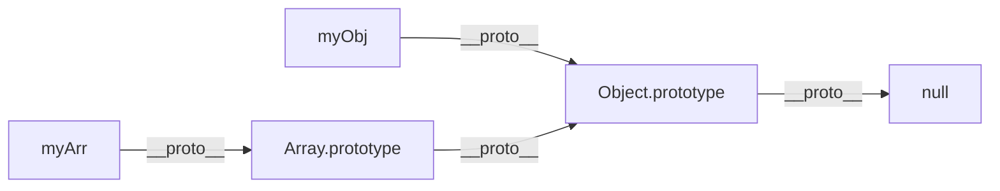
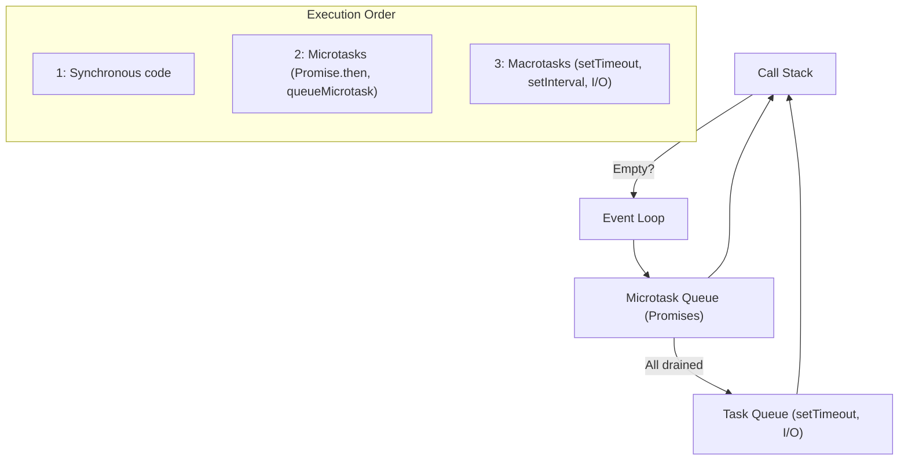
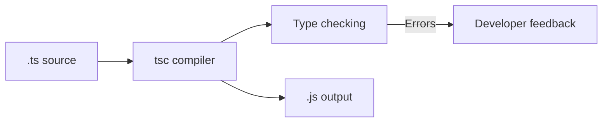
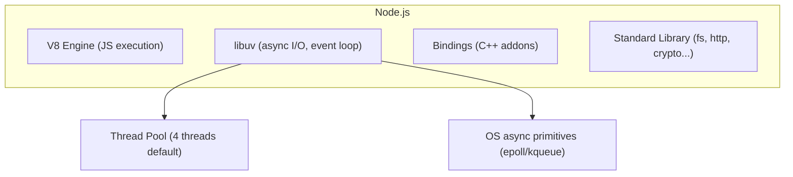
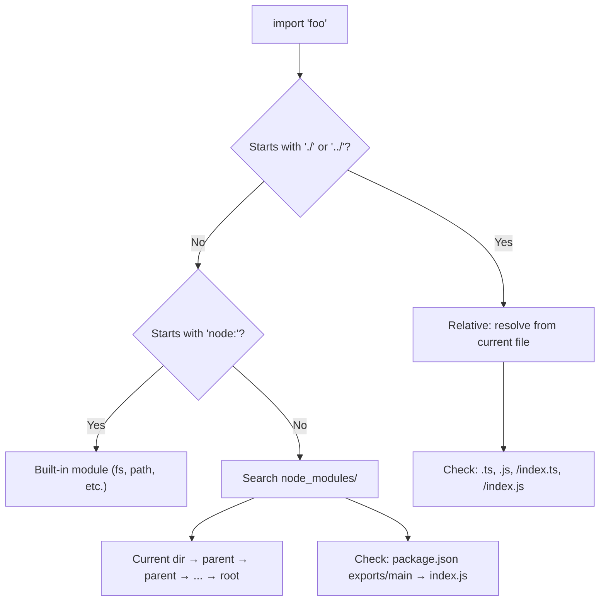
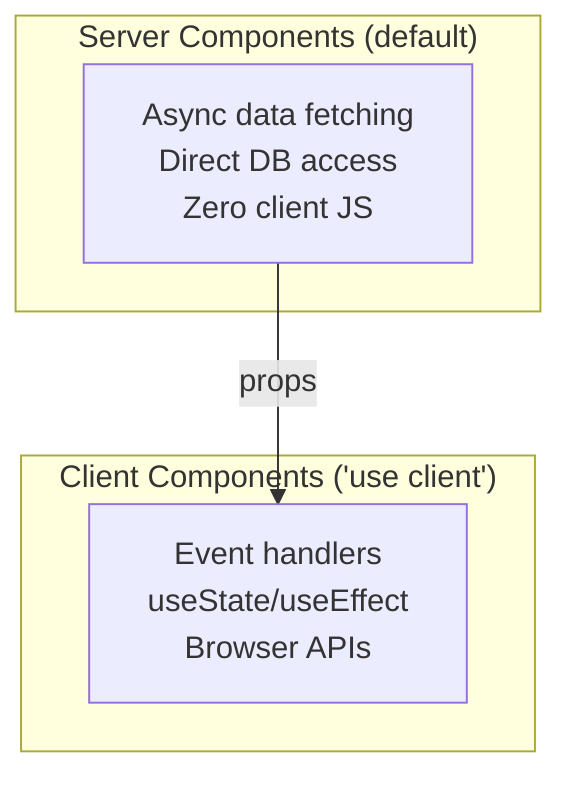

JavaScript is the language of the web — the only language that runs natively in browsers. TypeScript adds static types on top. Node.js takes the V8 engine server-side. Together, they form a full-stack ecosystem.

## Prerequisites

- Programming Logic (functions, data structures, control flow)
- Basic understanding of how the web works (HTTP, browsers)

---

## 1. JavaScript Fundamentals

### Types and Coercion

JavaScript has 7 primitive types and 1 structural type:

| Type | Example | typeof |
|------|---------|--------|
| `undefined` | `undefined` | "undefined" |
| `null` | `null` | "object" (historical bug) |
| `boolean` | `true`, `false` | "boolean" |
| `number` | `42`, `3.14`, `NaN`, `Infinity` | "number" |
| `bigint` | `9007199254740993n` | "bigint" |
| `string` | `"hello"`, `'world'` | "string" |
| `symbol` | `Symbol("id")` | "symbol" |
| `object` | `{}`, `[]`, `function(){}` | "object"/"function" |

### Type Coercion

JavaScript is **weakly typed** — it coerces types implicitly:

```javascript
"5" + 3      // "53" (number → string, concatenation)
"5" - 3      // 2 (string → number, subtraction)
"5" * "2"    // 10 (both → number)
true + true  // 2 (boolean → number)
[] + []      // "" (arrays → strings → concatenation)
[] + {}      // "[object Object]"
{} + []      // 0 (block statement + unary plus)
```

**Rule:** Use `===` (strict equality) always. Never rely on `==` (loose equality with coercion).

### Scope

```javascript
// var — function-scoped, hoisted
function example() {
    console.log(x); // undefined (hoisted, not initialized)
    var x = 10;
}

// let — block-scoped, not hoisted (TDZ)
{
    // console.log(y); // ReferenceError: temporal dead zone
    let y = 20;
}

// const — block-scoped, binding is immutable (value may be mutable)
const arr = [1, 2, 3];
arr.push(4);      // OK — mutating the array
// arr = [5, 6];  // TypeError — reassigning the binding
```

### Closures

A closure is a function that remembers its lexical scope even when executed outside that scope:

```javascript
function createCounter() {
    let count = 0; // enclosed variable
    return {
        increment: () => ++count,
        getCount: () => count,
    };
}

const counter = createCounter();
counter.increment(); // 1
counter.increment(); // 2
counter.getCount();  // 2
// count is not accessible directly — it's enclosed
```

**Use cases:** data privacy, factory functions, partial application, event handlers.

### Key Takeaway

JavaScript's type coercion and scoping rules are the source of most beginner bugs. Use `const` by default, `let` when rebinding is needed, never `var`. Always use strict equality.

---

## 2. Prototypes and `this`

### Prototypal Inheritance

Every object has an internal `[[Prototype]]` link. Property lookup walks the prototype chain:



```javascript
const animal = {
    speak() { return `${this.name} makes a sound`; }
};

const dog = Object.create(animal);
dog.name = "Rex";
dog.speak(); // "Rex makes a sound" — found via prototype chain
```

### The `this` Keyword

`this` depends on **how** a function is called, not where it's defined:

| Call Style | `this` Value |
|------------|-------------|
| `obj.method()` | `obj` |
| `func()` | `undefined` (strict) or `window` (sloppy) |
| `new Func()` | New object |
| `func.call(ctx)` | `ctx` |
| `func.apply(ctx)` | `ctx` |
| `func.bind(ctx)()` | `ctx` |
| Arrow function | Lexical (inherits from enclosing scope) |

```javascript
class Timer {
    constructor() {
        this.seconds = 0;
    }
    start() {
        // Arrow function captures `this` from start()
        setInterval(() => {
            this.seconds++; // works — `this` is the Timer instance
        }, 1000);
    }
}
```

### Key Takeaway

Prototypes are JavaScript's inheritance mechanism — classes are syntactic sugar over prototypes. Arrow functions solve most `this` confusion by capturing the enclosing `this`.

---

## 3. ES6+ Features

### Destructuring

```javascript
// Object destructuring
const { name, age, city = "Unknown" } = user;

// Array destructuring
const [first, second, ...rest] = [1, 2, 3, 4, 5];

// Function parameters
function greet({ name, greeting = "Hello" }) {
    return `${greeting}, ${name}!`;
}
```

### Spread and Rest

```javascript
// Spread — expand iterable
const merged = [...arr1, ...arr2];
const copy = { ...original, overridden: "value" };

// Rest — collect remaining
function sum(...numbers) {
    return numbers.reduce((a, b) => a + b, 0);
}
```

### Modules

```javascript
// Named exports
export function add(a, b) { return a + b; }
export const PI = 3.14159;

// Default export
export default class Calculator { ... }

// Imports
import Calculator, { add, PI } from './math.js';
import * as math from './math.js';
```

### Iterators and Generators

```javascript
// Custom iterator
const range = {
    [Symbol.iterator]() {
        let i = 0;
        return {
            next() {
                return i < 5 ? { value: i++, done: false } : { done: true };
            }
        };
    }
};

for (const n of range) console.log(n); // 0, 1, 2, 3, 4

// Generator function
function* fibonacci() {
    let [a, b] = [0, 1];
    while (true) {
        yield a;
        [a, b] = [b, a + b];
    }
}
```

### Optional Chaining and Nullish Coalescing

```javascript
// Optional chaining — short-circuits to undefined
const city = user?.address?.city;
const first = arr?.[0];
const result = obj?.method?.();

// Nullish coalescing — only null/undefined trigger fallback
const port = config.port ?? 3000;
// Unlike ||, doesn't treat 0 or "" as falsy
```

### Key Takeaway

Modern JavaScript (ES6+) is a different language from ES5. Destructuring, modules, and optional chaining eliminate entire categories of boilerplate. Use them.

---

## 4. Asynchronous JavaScript

### The Event Loop



```javascript
console.log("1");                          // sync
setTimeout(() => console.log("2"), 0);     // macrotask
Promise.resolve().then(() => console.log("3")); // microtask
console.log("4");                          // sync

// Output: 1, 4, 3, 2
```

### Callbacks → Promises → Async/Await

```javascript
// Callback hell
fs.readFile("a.txt", (err, a) => {
    fs.readFile("b.txt", (err, b) => {
        fs.readFile("c.txt", (err, c) => {
            // deeply nested, hard to handle errors
        });
    });
});

// Promises
readFile("a.txt")
    .then(a => readFile("b.txt"))
    .then(b => readFile("c.txt"))
    .catch(err => console.error(err));

// Async/await (syntactic sugar over Promises)
async function readAll() {
    try {
        const a = await readFile("a.txt");
        const b = await readFile("b.txt");
        const c = await readFile("c.txt");
        return [a, b, c];
    } catch (err) {
        console.error(err);
    }
}
```

### Concurrency Patterns

```javascript
// Parallel — all at once
const [users, posts, comments] = await Promise.all([
    fetchUsers(),
    fetchPosts(),
    fetchComments(),
]);

// Race — first to resolve/reject
const result = await Promise.race([
    fetchData(),
    timeout(5000),
]);

// allSettled — wait for all, regardless of success/failure
const results = await Promise.allSettled([
    fetchA(), fetchB(), fetchC()
]);
// [{status: "fulfilled", value: ...}, {status: "rejected", reason: ...}]
```

### Key Takeaway

JavaScript is single-threaded but non-blocking. The event loop enables concurrency without parallelism. Understand the microtask/macrotask distinction to predict execution order.

---

## 5. TypeScript: The Type System

### Why TypeScript

TypeScript adds **static types** to JavaScript. Types are erased at compile time — the output is plain JavaScript.



### Basic Types

```typescript
// Primitives
let name: string = "Alice";
let age: number = 30;
let active: boolean = true;

// Arrays
let numbers: number[] = [1, 2, 3];
let names: Array<string> = ["a", "b"];

// Tuples
let pair: [string, number] = ["age", 30];

// Enums
enum Direction { Up, Down, Left, Right }

// Literal types
type Status = "loading" | "success" | "error";
```

### Interfaces and Types

```typescript
// Interface — extendable, for object shapes
interface User {
    id: number;
    name: string;
    email: string;
    role?: string; // optional
    readonly createdAt: Date; // immutable
}

// Type alias — for unions, intersections, mapped types
type Result<T> = { success: true; data: T } | { success: false; error: string };

// Intersection
type Admin = User & { permissions: string[] };
```

### Generics

```typescript
// Generic function
function first<T>(arr: T[]): T | undefined {
    return arr[0];
}

// Generic constraint
function longest<T extends { length: number }>(a: T, b: T): T {
    return a.length >= b.length ? a : b;
}

// Generic interface
interface Repository<T> {
    findById(id: string): Promise<T | null>;
    save(entity: T): Promise<T>;
    delete(id: string): Promise<void>;
}
```

### Utility Types

```typescript
// Partial — all properties optional
type PartialUser = Partial<User>;

// Required — all properties required
type RequiredUser = Required<User>;

// Pick — subset of properties
type UserPreview = Pick<User, "id" | "name">;

// Omit — exclude properties
type UserWithoutEmail = Omit<User, "email">;

// Record — key-value map
type UserMap = Record<string, User>;

// ReturnType — extract return type
type FetchResult = ReturnType<typeof fetchUser>;
```

### Type Narrowing

```typescript
function process(value: string | number | null) {
    if (value === null) return; // narrowed: null eliminated
    
    if (typeof value === "string") {
        // narrowed: value is string
        console.log(value.toUpperCase());
    } else {
        // narrowed: value is number
        console.log(value.toFixed(2));
    }
}

// Discriminated unions
type Shape =
    | { kind: "circle"; radius: number }
    | { kind: "rectangle"; width: number; height: number };

function area(shape: Shape): number {
    switch (shape.kind) {
        case "circle": return Math.PI * shape.radius ** 2;
        case "rectangle": return shape.width * shape.height;
    }
}
```

### Key Takeaway

TypeScript's type system is structural (not nominal) — if the shape matches, it's compatible. Use discriminated unions for state machines, generics for reusable code, and utility types to avoid repetition.

---

## 6. Node.js

### Architecture



Node.js is **single-threaded for JavaScript** but uses libuv's thread pool and OS async primitives for I/O operations.

### Event Loop (Node.js specific)

```text
   ┌───────────────────────────┐
┌─>│         timers            │ ← setTimeout, setInterval
│  └─────────────┬─────────────┘
│  ┌─────────────┴─────────────┐
│  │     pending callbacks     │ ← I/O callbacks deferred
│  └─────────────┬─────────────┘
│  ┌─────────────┴─────────────┐
│  │       idle, prepare       │ ← internal
│  └─────────────┬─────────────┘
│  ┌─────────────┴─────────────┐
│  │          poll             │ ← I/O events, new connections
│  └─────────────┬─────────────┘
│  ┌─────────────┴─────────────┐
│  │          check            │ ← setImmediate
│  └─────────────┬─────────────┘
│  ┌─────────────┴─────────────┐
│  │      close callbacks      │ ← socket.on('close')
└──┴───────────────────────────┘
```

### Modules: CommonJS vs ESM

```javascript
// CommonJS (CJS) — synchronous, Node.js original
const fs = require('fs');
module.exports = { myFunction };

// ES Modules (ESM) — async, standard, future
import fs from 'node:fs';
export function myFunction() { ... }
```

| Feature | CJS | ESM |
|---------|-----|-----|
| Loading | Synchronous | Asynchronous |
| Syntax | `require`/`module.exports` | `import`/`export` |
| Top-level await | No | Yes |
| Tree-shaking | No | Yes |
| File extension | `.js` (default) | `.mjs` or `"type": "module"` |

### Streams

```javascript
import { createReadStream, createWriteStream } from 'node:fs';
import { pipeline } from 'node:stream/promises';
import { createGzip } from 'node:zlib';

// Process large files without loading into memory
await pipeline(
    createReadStream('input.log'),
    createGzip(),
    createWriteStream('input.log.gz')
);
```

### Key Takeaway

Node.js excels at I/O-heavy workloads (APIs, real-time apps) due to its non-blocking model. It's not ideal for CPU-heavy computation (use worker threads or offload to a different service).

---

## 7. npm Ecosystem

### package.json

```json
{
    "name": "my-app",
    "version": "1.0.0",
    "type": "module",
    "scripts": {
        "dev": "node --watch src/index.js",
        "build": "tsc",
        "test": "vitest",
        "lint": "eslint src/"
    },
    "dependencies": {
        "express": "^4.18.2"
    },
    "devDependencies": {
        "typescript": "^5.3.0",
        "vitest": "^1.0.0"
    }
}
```

### Version Ranges

| Syntax | Meaning |
|--------|---------|
| `1.2.3` | Exact version |
| `^1.2.3` | Compatible (≥1.2.3, <2.0.0) |
| `~1.2.3` | Patch-level (≥1.2.3, <1.3.0) |
| `>=1.0.0` | Minimum version |
| `*` | Any version |

### Workspaces (Monorepos)

```json
{
    "workspaces": ["packages/*"]
}
```

```text
my-monorepo/
├── package.json
├── packages/
│   ├── shared/
│   │   └── package.json
│   ├── frontend/
│   │   └── package.json
│   └── backend/
│       └── package.json
```

### Key Takeaway

Lock files (`package-lock.json`) ensure reproducible installs. Use workspaces for monorepos. Audit dependencies regularly (`npm audit`).

---

## 8. Error Handling Patterns

### Synchronous

```typescript
// Throw and catch
function parseConfig(raw: string): Config {
    try {
        return JSON.parse(raw);
    } catch (e) {
        throw new ConfigError(`Invalid config: ${e.message}`);
    }
}
```

### Asynchronous

```typescript
// Async/await — try/catch works naturally
async function fetchUser(id: string): Promise<User> {
    const response = await fetch(`/api/users/${id}`);
    if (!response.ok) {
        throw new ApiError(response.status, await response.text());
    }
    return response.json();
}
```

### Result Pattern (no exceptions)

```typescript
type Result<T, E = Error> =
    | { ok: true; value: T }
    | { ok: false; error: E };

function divide(a: number, b: number): Result<number, string> {
    if (b === 0) return { ok: false, error: "Division by zero" };
    return { ok: true, value: a / b };
}

const result = divide(10, 0);
if (result.ok) {
    console.log(result.value);
} else {
    console.error(result.error);
}
```

### Key Takeaway

Use try/catch for exceptional failures. Consider the Result pattern for expected failures (validation, parsing) where you want the caller to handle both paths explicitly.

---

## 9. Testing

### Vitest / Jest

```typescript
import { describe, it, expect, vi } from 'vitest';
import { fetchUser } from './api';

describe('fetchUser', () => {
    it('returns user data for valid id', async () => {
        const user = await fetchUser('123');
        expect(user).toEqual({ id: '123', name: 'Alice' });
    });

    it('throws on 404', async () => {
        await expect(fetchUser('999')).rejects.toThrow('Not found');
    });
});

// Mocking
vi.mock('./http', () => ({
    get: vi.fn().mockResolvedValue({ data: { id: '1', name: 'Alice' } }),
}));

// Spying
const spy = vi.spyOn(console, 'log');
doSomething();
expect(spy).toHaveBeenCalledWith('expected output');
```

### Testing Patterns

| Pattern | When |
|---------|------|
| Unit test | Pure functions, utilities, transformations |
| Integration test | API routes, database queries, service interactions |
| E2E test | Full user flows (Playwright, Cypress) |
| Snapshot test | UI components, serialized output |

### Key Takeaway

Test behavior, not implementation. Mock external boundaries (APIs, databases), not internal modules. Prefer integration tests for APIs — they catch more real bugs than unit tests alone.

---

## 10. Module Resolution



### TypeScript Module Resolution

```json
// tsconfig.json
{
    "compilerOptions": {
        "module": "ESNext",
        "moduleResolution": "bundler", // or "node16"
        "baseUrl": ".",
        "paths": {
            "@/*": ["src/*"],
            "@shared/*": ["packages/shared/src/*"]
        }
    }
}
```

### Key Takeaway

Module resolution is where many TypeScript/Node.js issues hide. Understand the difference between `node16` (strict, requires extensions) and `bundler` (relaxed, for Vite/webpack) resolution modes.

---

## 11. Vue Ecosystem (Vue 3, Vite, Nuxt)

### Vue 3 and the Composition API

Vue is a progressive framework — adopt incrementally from a single component to a full SPA. Vue 3's Composition API (`<script setup>`) replaces the Options API with composable, type-safe logic:

```vue
<script setup lang="ts">
import { ref, computed } from 'vue'

const count = ref(0)
const doubled = computed(() => count.value * 2)
</script>

<template>
  <button @click="count++">{{ count }} (× 2 = {{ doubled }})</button>
</template>
```

### Reactivity

| API | Use Case |
|-----|----------|
| `ref()` | Primitives, values you might reassign |
| `reactive()` | Objects you won't reassign |
| `computed()` | Derived state (cached) |
| `watch()` / `watchEffect()` | Side effects on state change |

Vue uses Proxies to track dependencies automatically. Avoid destructuring reactive objects (breaks tracking) — use `toRefs()` instead.

### Composables

Reusable stateful logic (Vue's equivalent of React hooks):

```typescript
export function useFetch<T>(url: () => string) {
  const data = ref<T | null>(null)
  const loading = ref(true)
  watchEffect(async () => {
    loading.value = true
    data.value = await fetch(url()).then(r => r.json())
    loading.value = false
  })
  return { data, loading }
}
```

### Vite

Build tool providing instant dev startup (native ESM) and Rollup-based production builds. Replaces Webpack with 10–100x faster dependency pre-bundling via esbuild.

### Nuxt

Full-stack framework on Vue + Vite adding SSR, file-based routing, auto-imports, and server routes:


- **Rendering modes:** SSR (default), SSG (prerender), SPA, or hybrid per-route
- **Auto-imports:** Vue APIs and composables available without import statements
- **Server routes:** `server/api/*.ts` with `defineEventHandler`
- **Data fetching:** `useFetch()` runs on server, serializes to client

### Key Takeaway

Vue 3 + Vite + Nuxt provides a batteries-included stack: reactive components, instant dev experience, and flexible rendering strategies per route.

---

## 12. React Ecosystem (React, Next.js)

### React Core Model

UI is a function of state. Components are functions returning JSX. When state changes, React re-renders and efficiently diffs the virtual DOM:

```tsx
function Counter() {
  const [count, setCount] = useState(0)
  return <button onClick={() => setCount(c => c + 1)}>Count: {count}</button>
}
```

### Hooks

| Hook | Purpose |
|------|---------|
| `useState` | Local state |
| `useEffect` | Side effects (fetch, subscriptions) |
| `useRef` | Mutable ref that persists across renders |
| `useMemo` / `useCallback` | Memoization (measure before using) |
| `useReducer` | Complex state transitions |
| `useContext` | Consume context values |

Rules: call at top level only, consistent order, never inside conditions.

### Custom Hooks

Primary pattern for reusing stateful logic:

```tsx
function useLocalStorage<T>(key: string, initial: T) {
  const [value, setValue] = useState<T>(() => {
    const stored = localStorage.getItem(key)
    return stored ? JSON.parse(stored) : initial
  })
  useEffect(() => { localStorage.setItem(key, JSON.stringify(value)) }, [key, value])
  return [value, setValue] as const
}
```

### Next.js (App Router)

Full-stack React framework with file-based routing, server components, and multiple rendering strategies:



- **Server Components** (default): fetch data directly, no client bundle cost
- **Client Components** (`'use client'`): only when you need interactivity or hooks
- **Server Actions** (`'use server'`): call server functions from forms without API routes
- **Rendering:** Static (SSG), Dynamic (SSR), ISR (revalidate), Streaming (Suspense)

### Key Takeaway

React + Next.js defaults to server-first rendering. Keep components on the server unless interactivity is needed. Server Actions eliminate API boilerplate for mutations.

---

## Summary

| Topic | Core Concept |
|-------|-------------|
| JS Fundamentals | Weak typing + coercion = use `===` always |
| Prototypes & this | Prototype chain for inheritance, arrow functions for `this` |
| ES6+ | Destructuring, modules, optional chaining |
| Async | Event loop: single-threaded, non-blocking |
| TypeScript | Structural types, discriminated unions, generics |
| Node.js | V8 + libuv, streams for large data |
| npm | Lock files, workspaces, semver |
| Error Handling | try/catch for exceptions, Result for expected failures |
| Testing | Vitest/Jest, mock boundaries not internals |
| Modules | CJS (legacy) → ESM (standard), path aliases |
| Vue Ecosystem | Composition API + Vite + Nuxt = progressive full-stack |
| React Ecosystem | Server Components by default, hooks for state, Next.js for full-stack |

The JS ecosystem moves fast. Focus on fundamentals (event loop, types, async patterns) — frameworks change, these don't.
