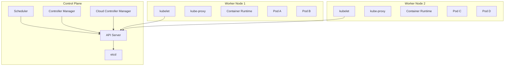
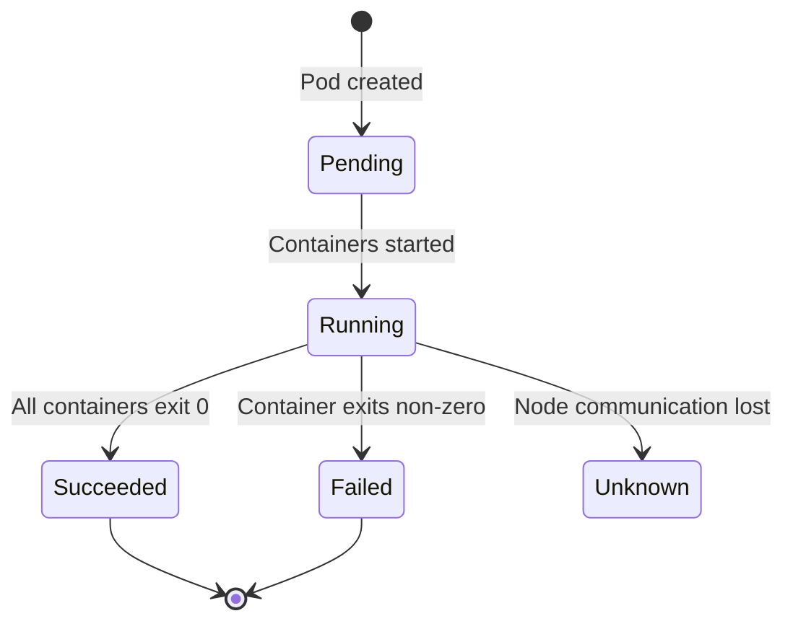

# Core Concepts

Understanding what Kubernetes solves, how a cluster is structured, and the fundamental building blocks that everything else rests upon.

---

## What Kubernetes Solves

Before Kubernetes, deploying containers at scale meant manually managing placement, networking, scaling, and failure recovery. Kubernetes automates all of this:

| Problem | Without K8s | With K8s |
|---------|-------------|----------|
| Container placement | Manual SSH, docker run | Scheduler decides optimal node |
| Scaling | Write custom scripts | `kubectl scale` or autoscaler |
| Self-healing | Monitor + restart manually | Automatic restart, reschedule |
| Service discovery | Hardcode IPs, use Consul | Built-in DNS and Services |
| Rolling updates | Downtime or custom tooling | Declarative rolling update strategy |
| Configuration | Baked into image or env files | ConfigMaps, Secrets, mounted at runtime |
| Storage | Manual volume management | Dynamic provisioning via StorageClasses |

Kubernetes provides a **declarative API** — you describe the desired state, and the system continuously reconciles actual state to match it.

---

## Cluster Architecture

A Kubernetes cluster consists of a **control plane** (the brain) and **worker nodes** (the muscle).



### Control Plane Components

| Component | Role |
|-----------|------|
| **API Server** (`kube-apiserver`) | Front door to the cluster. All communication goes through it (REST API). Validates and processes requests. |
| **etcd** | Distributed key-value store. Single source of truth for all cluster state. |
| **Scheduler** (`kube-scheduler`) | Watches for unscheduled pods, assigns them to nodes based on resource requirements, affinity, taints. |
| **Controller Manager** (`kube-controller-manager`) | Runs control loops (Deployment controller, ReplicaSet controller, Node controller, etc.) that drive actual state toward desired state. |
| **Cloud Controller Manager** | Integrates with cloud provider APIs (load balancers, routes, volumes). Optional in bare-metal clusters. |

### Worker Node Components

| Component | Role |
|-----------|------|
| **kubelet** | Agent on each node. Ensures containers described in PodSpecs are running and healthy. |
| **kube-proxy** | Maintains network rules on nodes. Implements Service abstraction (iptables/IPVS rules). |
| **Container Runtime** | Runs containers. CRI-compatible: containerd, CRI-O. Docker is no longer directly supported. |

---

## Pods

A **Pod** is the smallest deployable unit in Kubernetes — a group of one or more containers that share network and storage.

### Why Pods, Not Containers?

- Containers in a pod share `localhost` (same network namespace)
- They can share volumes
- They are co-scheduled on the same node
- They represent a single unit of deployment

### Pod Lifecycle



| Phase | Description |
|-------|-------------|
| **Pending** | Accepted by cluster, but containers not yet running (image pull, scheduling) |
| **Running** | At least one container is running or starting/restarting |
| **Succeeded** | All containers terminated successfully (exit 0) |
| **Failed** | All containers terminated, at least one with failure |
| **Unknown** | Pod state cannot be determined (node lost) |

### Basic Pod Manifest

```yaml
apiVersion: v1
kind: Pod
metadata:
  name: nginx-pod
  labels:
    app: nginx
    tier: frontend
spec:
  containers:
    - name: nginx
      image: nginx:1.27
      ports:
        - containerPort: 80
      resources:
        requests:
          memory: "64Mi"
          cpu: "100m"
        limits:
          memory: "128Mi"
          cpu: "250m"
```

### Multi-Container Patterns

Pods support multiple containers for cross-cutting concerns:

| Pattern | Purpose | Example |
|---------|---------|---------|
| **Sidecar** | Extend or enhance the main container | Log shipper, service mesh proxy (Envoy) |
| **Init Container** | Run setup tasks before the main container starts | Database migration, config file generation |
| **Ambassador** | Proxy connections to external services | Local Redis proxy that handles connection pooling |

#### Init Container Example

```yaml
apiVersion: v1
kind: Pod
metadata:
  name: app-with-init
spec:
  initContainers:
    - name: wait-for-db
      image: busybox:1.36
      command: ['sh', '-c', 'until nc -z postgres-svc 5432; do sleep 2; done']
  containers:
    - name: app
      image: myapp:1.0
      ports:
        - containerPort: 8080
```

#### Sidecar Example

```yaml
apiVersion: v1
kind: Pod
metadata:
  name: app-with-sidecar
spec:
  containers:
    - name: app
      image: myapp:1.0
      volumeMounts:
        - name: logs
          mountPath: /var/log/app
    - name: log-shipper
      image: fluent/fluent-bit:3.0
      volumeMounts:
        - name: logs
          mountPath: /var/log/app
          readOnly: true
  volumes:
    - name: logs
      emptyDir: {}
```

---

## Namespaces

Namespaces provide logical isolation within a cluster — like folders for Kubernetes resources.

| Default Namespace | Purpose |
|-------------------|---------|
| `default` | Where resources go if no namespace is specified |
| `kube-system` | System components (CoreDNS, kube-proxy, metrics-server) |
| `kube-public` | Publicly readable data (cluster-info ConfigMap) |
| `kube-node-lease` | Node heartbeat leases for health detection |

```yaml
apiVersion: v1
kind: Namespace
metadata:
  name: staging
  labels:
    env: staging
    team: backend
```

Use namespaces to:
- Separate environments (dev, staging, production) in a shared cluster
- Isolate teams or applications
- Apply resource quotas and network policies per namespace
- Scope RBAC permissions

> **Note:** Not all resources are namespaced. Nodes, PersistentVolumes, ClusterRoles, and Namespaces themselves are cluster-scoped.

---

## Labels and Selectors

Labels are key-value pairs attached to objects. Selectors query objects by their labels. This is how Kubernetes components find and group resources.

### Common Labelling Convention

```yaml
metadata:
  labels:
    app.kubernetes.io/name: myapp
    app.kubernetes.io/version: "1.4.2"
    app.kubernetes.io/component: frontend
    app.kubernetes.io/part-of: online-store
    app.kubernetes.io/managed-by: helm
```

### Selector Types

| Selector Type | Syntax | Example |
|---------------|--------|---------|
| **Equality-based** | `=`, `==`, `!=` | `env=production` |
| **Set-based** | `in`, `notin`, `exists` | `tier in (frontend, backend)` |

### How Services Use Selectors

```yaml
apiVersion: v1
kind: Service
metadata:
  name: frontend-svc
spec:
  selector:
    app: frontend        # Matches pods with label app=frontend
    tier: web
  ports:
    - port: 80
      targetPort: 8080
```

The Service routes traffic to **all pods** matching the selector — this is how load balancing works without hardcoding pod IPs.

---

## Key Takeaways

1. **Kubernetes is declarative** — you describe desired state; controllers reconcile continuously.
2. **Control plane manages, worker nodes execute** — the API server is the single entry point for all operations.
3. **Pods are the atomic unit** — not containers. Pods share network and storage between their containers.
4. **Multi-container patterns** (sidecar, init, ambassador) solve cross-cutting concerns without modifying the main application.
5. **Namespaces** provide logical isolation; **labels and selectors** provide the grouping and discovery mechanism that ties everything together.
6. **etcd is critical** — all cluster state lives there. Lose etcd without backup, lose the cluster.
