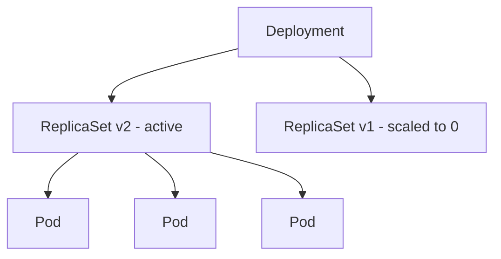

# Workloads

Higher-level abstractions that manage pods — ensuring the right number are running, handling updates gracefully, and supporting both stateless and stateful applications.

---

## Workload Resources Overview

| Resource | Use Case | Pod Identity | Scaling |
|----------|----------|--------------|---------|
| **Deployment** | Stateless apps (APIs, web servers) | Interchangeable | Horizontal (replicas) |
| **ReplicaSet** | Ensures N identical pods run (managed by Deployment) | Interchangeable | Horizontal |
| **DaemonSet** | One pod per node (agents, log collectors) | Per-node | Tied to node count |
| **StatefulSet** | Stateful apps (databases, queues) | Stable, ordered | Horizontal (ordered) |
| **Job** | Run-to-completion tasks (batch, migrations) | Ephemeral | Parallelism setting |
| **CronJob** | Scheduled Jobs | Ephemeral | Per schedule |

---

## Deployments

The most common workload resource. A Deployment manages ReplicaSets, which manage Pods.



### Deployment Manifest

```yaml
apiVersion: apps/v1
kind: Deployment
metadata:
  name: api-server
  labels:
    app: api-server
spec:
  replicas: 3
  selector:
    matchLabels:
      app: api-server
  strategy:
    type: RollingUpdate
    rollingUpdate:
      maxSurge: 1          # 1 extra pod during update
      maxUnavailable: 0    # Zero downtime
  template:
    metadata:
      labels:
        app: api-server
    spec:
      containers:
        - name: api
          image: myapp/api:2.1.0
          ports:
            - containerPort: 8080
          readinessProbe:
            httpGet:
              path: /healthz
              port: 8080
            initialDelaySeconds: 5
            periodSeconds: 10
          livenessProbe:
            httpGet:
              path: /healthz
              port: 8080
            initialDelaySeconds: 15
            periodSeconds: 20
```

### Rolling Update vs Recreate

| Strategy | Behavior | Downtime | Use When |
|----------|----------|----------|----------|
| **RollingUpdate** | Gradually replaces old pods with new | None | Default for most services |
| **Recreate** | Kills all old pods, then creates new | Yes | Schema migrations requiring single version |

### Rollback

Kubernetes keeps ReplicaSet history, allowing instant rollback:

```bash
# View rollout history
kubectl rollout history deployment/api-server

# Rollback to previous version
kubectl rollout undo deployment/api-server

# Rollback to specific revision
kubectl rollout undo deployment/api-server --to-revision=3

# Check rollout status
kubectl rollout status deployment/api-server
```

---

## ReplicaSets

A ReplicaSet ensures a specified number of pod replicas are running at all times. You rarely create ReplicaSets directly — Deployments manage them.

```yaml
apiVersion: apps/v1
kind: ReplicaSet
metadata:
  name: api-server-v2
spec:
  replicas: 3
  selector:
    matchLabels:
      app: api-server
      version: v2
  template:
    metadata:
      labels:
        app: api-server
        version: v2
    spec:
      containers:
        - name: api
          image: myapp/api:2.1.0
```

> **Rule:** If a pod matching the selector already exists (even manually created), the ReplicaSet will adopt it. Be careful with label overlaps.

---

## DaemonSets

A DaemonSet ensures one pod runs on every node (or a subset via node selectors/tolerations).

### Common Use Cases

- Log collectors (Fluent Bit, Filebeat)
- Monitoring agents (Datadog agent, node-exporter)
- Network plugins (Calico, Cilium)
- Storage daemons (CSI node plugins)

```yaml
apiVersion: apps/v1
kind: DaemonSet
metadata:
  name: log-collector
  namespace: monitoring
spec:
  selector:
    matchLabels:
      app: log-collector
  template:
    metadata:
      labels:
        app: log-collector
    spec:
      tolerations:
        - key: node-role.kubernetes.io/control-plane
          effect: NoSchedule    # Also run on control plane nodes
      containers:
        - name: fluent-bit
          image: fluent/fluent-bit:3.0
          volumeMounts:
            - name: varlog
              mountPath: /var/log
              readOnly: true
      volumes:
        - name: varlog
          hostPath:
            path: /var/log
```

---

## StatefulSets

For workloads that need **stable identity**, **ordered deployment**, and **persistent storage** — databases, message queues, distributed systems.

### What StatefulSets Guarantee

| Feature | Description |
|---------|-------------|
| **Stable network identity** | Pods get predictable names: `{name}-0`, `{name}-1`, `{name}-2` |
| **Ordered deployment** | Pods are created sequentially (0 → 1 → 2) |
| **Ordered termination** | Pods are deleted in reverse order (2 → 1 → 0) |
| **Persistent storage** | Each pod gets its own PVC that persists across rescheduling |
| **Stable DNS** | Each pod gets a DNS record: `{pod-name}.{service-name}.{namespace}.svc.cluster.local` |

```yaml
apiVersion: apps/v1
kind: StatefulSet
metadata:
  name: postgres
spec:
  serviceName: postgres-headless    # Required headless service
  replicas: 3
  selector:
    matchLabels:
      app: postgres
  template:
    metadata:
      labels:
        app: postgres
    spec:
      containers:
        - name: postgres
          image: postgres:16
          ports:
            - containerPort: 5432
          volumeMounts:
            - name: data
              mountPath: /var/lib/postgresql/data
          env:
            - name: POSTGRES_PASSWORD
              valueFrom:
                secretKeyRef:
                  name: postgres-secret
                  key: password
  volumeClaimTemplates:
    - metadata:
        name: data
      spec:
        accessModes: ["ReadWriteOnce"]
        storageClassName: gp3
        resources:
          requests:
            storage: 20Gi
```

The **headless Service** (ClusterIP: None) is required for StatefulSet DNS:

```yaml
apiVersion: v1
kind: Service
metadata:
  name: postgres-headless
spec:
  clusterIP: None
  selector:
    app: postgres
  ports:
    - port: 5432
```

This gives each pod a DNS entry: `postgres-0.postgres-headless.default.svc.cluster.local`

---

## Jobs and CronJobs

### Jobs

Run-to-completion workloads — the pod runs, finishes, and is not restarted.

```yaml
apiVersion: batch/v1
kind: Job
metadata:
  name: db-migration
spec:
  backoffLimit: 3            # Retry up to 3 times on failure
  activeDeadlineSeconds: 300 # Timeout after 5 minutes
  template:
    spec:
      restartPolicy: Never   # Required for Jobs
      containers:
        - name: migrate
          image: myapp/migrate:1.0
          command: ["python", "manage.py", "migrate"]
```

### CronJobs

Schedule Jobs using cron syntax:

```yaml
apiVersion: batch/v1
kind: CronJob
metadata:
  name: nightly-report
spec:
  schedule: "0 2 * * *"       # 2:00 AM daily
  concurrencyPolicy: Forbid   # Don't run if previous is still active
  successfulJobsHistoryLimit: 3
  failedJobsHistoryLimit: 5
  jobTemplate:
    spec:
      template:
        spec:
          restartPolicy: OnFailure
          containers:
            - name: report
              image: myapp/report-generator:1.2
```

| Concurrency Policy | Behavior |
|-------------------|----------|
| `Allow` | Multiple Jobs can run simultaneously (default) |
| `Forbid` | Skip new run if previous is still active |
| `Replace` | Cancel running Job, start new one |

---

## Pod Disruption Budgets

PDBs protect availability during voluntary disruptions (node drains, cluster upgrades).

```yaml
apiVersion: policy/v1
kind: PodDisruptionBudget
metadata:
  name: api-server-pdb
spec:
  minAvailable: 2          # At least 2 pods must stay running
  # OR: maxUnavailable: 1  # At most 1 pod can be down
  selector:
    matchLabels:
      app: api-server
```

| Field | Meaning |
|-------|---------|
| `minAvailable` | Minimum pods (or %) that must remain available |
| `maxUnavailable` | Maximum pods (or %) that can be disrupted simultaneously |

> PDBs are respected during `kubectl drain` and cluster autoscaler scale-downs, but NOT during involuntary disruptions (node crashes).

---

## Key Takeaways

1. **Deployments** are the default choice for stateless workloads — they handle rolling updates, rollbacks, and scaling.
2. **Never create ReplicaSets directly** — let Deployments manage them to get rollback capability.
3. **DaemonSets** ensure per-node coverage — essential for monitoring and logging infrastructure.
4. **StatefulSets** provide stable identity and persistent storage — required for databases and distributed systems that need predictable addressing.
5. **Jobs** are for batch work; **CronJobs** schedule them. Always set `backoffLimit` and `activeDeadlineSeconds` to prevent runaway jobs.
6. **Pod Disruption Budgets** are critical for production — they prevent cluster operations from accidentally taking down your service.
