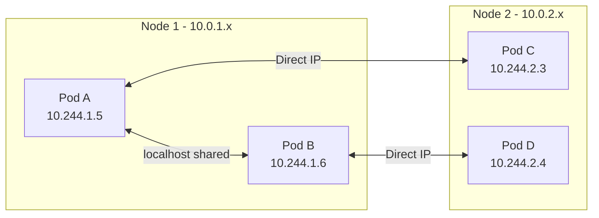
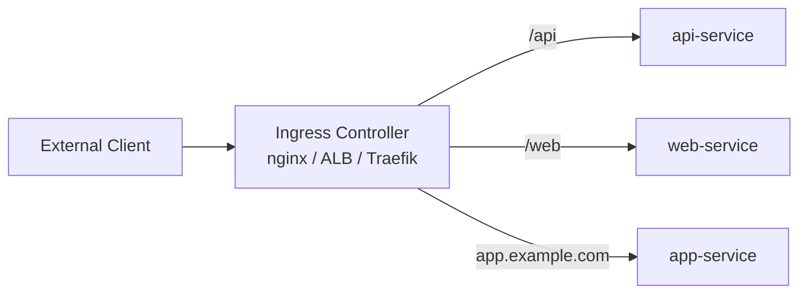

# Networking

How pods communicate with each other, how services expose pods to the cluster and the outside world, and how to control traffic flow.

---

## Pod Networking Model

Kubernetes imposes a flat networking model with three fundamental rules:

1. **Every pod gets its own IP address** — no NAT between pods
2. **All pods can communicate with all other pods** without NAT (across nodes)
3. **Agents on a node can communicate with all pods on that node**

This is implemented by CNI (Container Network Interface) plugins:

| CNI Plugin | Notable Features |
|------------|-----------------|
| **Calico** | NetworkPolicy support, BGP routing, widely used |
| **Cilium** | eBPF-based, advanced observability, identity-aware policies |
| **Flannel** | Simple overlay network (VXLAN), no NetworkPolicy |
| **AWS VPC CNI** | Pods get real VPC IPs (EKS default) |
| **Weave Net** | Encrypted overlay, easy setup |



> Containers within the same pod share the network namespace — they communicate via `localhost`.

---

## Services

Pods are ephemeral — they get new IPs when rescheduled. **Services** provide a stable endpoint (IP + DNS name) that load-balances across matching pods.

### Service Types

| Type | Scope | Use Case |
|------|-------|----------|
| **ClusterIP** | Internal to cluster | Default. Pod-to-pod communication within cluster |
| **NodePort** | External via node IP:port | Development, non-cloud environments |
| **LoadBalancer** | External via cloud LB | Production external traffic (creates cloud LB) |
| **ExternalName** | DNS CNAME | Alias to external service (e.g., RDS endpoint) |

### ClusterIP Service

```yaml
apiVersion: v1
kind: Service
metadata:
  name: backend-api
spec:
  type: ClusterIP         # Default
  selector:
    app: backend
  ports:
    - name: http
      port: 80            # Service port (what clients connect to)
      targetPort: 8080    # Container port (where pod listens)
      protocol: TCP
```

Accessible at: `backend-api.{namespace}.svc.cluster.local:80`

### NodePort Service

```yaml
apiVersion: v1
kind: Service
metadata:
  name: frontend
spec:
  type: NodePort
  selector:
    app: frontend
  ports:
    - port: 80
      targetPort: 3000
      nodePort: 30080     # Exposed on every node at this port (30000-32767)
```

### LoadBalancer Service

```yaml
apiVersion: v1
kind: Service
metadata:
  name: public-api
  annotations:
    service.beta.kubernetes.io/aws-load-balancer-type: "nlb"
    service.beta.kubernetes.io/aws-load-balancer-scheme: "internet-facing"
spec:
  type: LoadBalancer
  selector:
    app: public-api
  ports:
    - port: 443
      targetPort: 8443
```

### ExternalName Service

```yaml
apiVersion: v1
kind: Service
metadata:
  name: database
spec:
  type: ExternalName
  externalName: mydb.abc123.eu-central-1.rds.amazonaws.com
```

Pods can now connect to `database.default.svc.cluster.local` — it resolves to the RDS endpoint.

---

## Ingress

Ingress manages external HTTP/HTTPS access to services — routing by host and path, TLS termination, and more.



### Ingress Resource

```yaml
apiVersion: networking.k8s.io/v1
kind: Ingress
metadata:
  name: main-ingress
  annotations:
    nginx.ingress.kubernetes.io/rewrite-target: /
    cert-manager.io/cluster-issuer: letsencrypt-prod
spec:
  ingressClassName: nginx
  tls:
    - hosts:
        - app.example.com
      secretName: app-tls-cert
  rules:
    - host: app.example.com
      http:
        paths:
          - path: /api
            pathType: Prefix
            backend:
              service:
                name: api-service
                port:
                  number: 80
          - path: /
            pathType: Prefix
            backend:
              service:
                name: web-frontend
                port:
                  number: 80
```

### Popular Ingress Controllers

| Controller | Backed By | Strengths |
|------------|-----------|-----------|
| **NGINX Ingress** | NGINX | Most popular, feature-rich, wide community |
| **AWS ALB Ingress** | Application Load Balancer | Native AWS integration, WAF support |
| **Traefik** | Traefik Proxy | Auto-discovery, middleware chains, dashboard |
| **Istio Gateway** | Envoy | Service mesh integration, traffic splitting |

---

## NetworkPolicies

By default, all pod-to-pod traffic is allowed. NetworkPolicies act as firewall rules at the pod level.

```yaml
apiVersion: networking.k8s.io/v1
kind: NetworkPolicy
metadata:
  name: backend-policy
  namespace: production
spec:
  podSelector:
    matchLabels:
      app: backend
  policyTypes:
    - Ingress
    - Egress
  ingress:
    - from:
        - podSelector:
            matchLabels:
              app: frontend     # Only frontend pods can reach backend
        - namespaceSelector:
            matchLabels:
              env: production   # Only from production namespace
      ports:
        - protocol: TCP
          port: 8080
  egress:
    - to:
        - podSelector:
            matchLabels:
              app: database
      ports:
        - protocol: TCP
          port: 5432
    - to:                        # Allow DNS resolution
        - namespaceSelector: {}
          podSelector:
            matchLabels:
              k8s-app: kube-dns
      ports:
        - protocol: UDP
          port: 53
```

### Default Deny All (Best Practice for Production)

```yaml
apiVersion: networking.k8s.io/v1
kind: NetworkPolicy
metadata:
  name: deny-all
  namespace: production
spec:
  podSelector: {}           # Applies to all pods in namespace
  policyTypes:
    - Ingress
    - Egress
```

Then selectively allow traffic with additional policies.

> **Important:** NetworkPolicies require a CNI that supports them (Calico, Cilium). Flannel does not enforce NetworkPolicies.

---

## DNS in Kubernetes

CoreDNS runs as a Deployment in `kube-system` and provides cluster-internal DNS:

| Record Pattern | Resolves To |
|---------------|-------------|
| `{service}.{namespace}.svc.cluster.local` | Service ClusterIP |
| `{pod-ip-dashed}.{namespace}.pod.cluster.local` | Pod IP |
| `{pod-name}.{headless-svc}.{namespace}.svc.cluster.local` | Pod IP (StatefulSet) |

Within the same namespace, you can use just the service name: `backend-api` resolves to `backend-api.default.svc.cluster.local`.

### DNS Debugging

```bash
# Run a debug pod
kubectl run dns-debug --image=busybox:1.36 --rm -it -- nslookup backend-api

# Check CoreDNS pods
kubectl get pods -n kube-system -l k8s-app=kube-dns

# View CoreDNS ConfigMap
kubectl get configmap coredns -n kube-system -o yaml
```

---

## Service Mesh Basics

A service mesh adds observability, security, and traffic control at the network layer — without modifying application code.

| Feature | Without Mesh | With Mesh |
|---------|-------------|-----------|
| mTLS between services | Manual certificate management | Automatic, transparent |
| Traffic splitting | Application-level routing | Declarative traffic policies |
| Observability | Instrumentation in code | Automatic metrics, traces |
| Retries/timeouts | Code in every service | Mesh-level configuration |
| Circuit breaking | Library per language | Infrastructure-level |

### Popular Service Meshes

| Mesh | Proxy | Key Differentiator |
|------|-------|-------------------|
| **Istio** | Envoy sidecar | Full-featured, complex, industry standard |
| **Linkerd** | Rust-based sidecar | Lightweight, simple, fast |
| **Cilium Service Mesh** | eBPF (no sidecar) | Kernel-level, no sidecar overhead |
| **Consul Connect** | Envoy | HashiCorp ecosystem integration |

> **When to use a service mesh:** When you have many services needing mutual TLS, traffic control (canary deployments), or deep observability without code changes. For simple clusters (<10 services), it's often overhead.

---

## Key Takeaways

1. **Every pod gets its own IP** — the flat network model means no NAT between pods regardless of which node they're on.
2. **Services are the stable abstraction** — pods come and go, but Service IPs and DNS names are persistent.
3. **Use ClusterIP for internal, LoadBalancer for external** — NodePort is rarely appropriate in production.
4. **Ingress routes HTTP traffic** — it's the L7 entry point for external clients, handling host/path routing and TLS.
5. **NetworkPolicies are essential for security** — start with deny-all, then whitelist necessary traffic.
6. **DNS is built-in** — service discovery is automatic via CoreDNS. Use service names, not IPs.
7. **Service meshes add power but complexity** — adopt them when you genuinely need mTLS, traffic splitting, or deep observability across many services.
