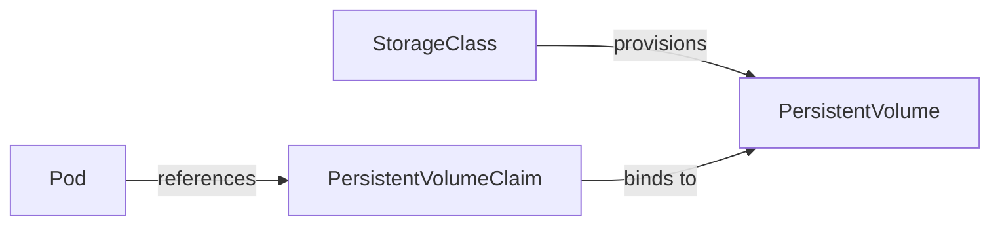

# Storage

Managing persistent and ephemeral data in Kubernetes — from temporary scratch space to durable database volumes, plus configuration and secrets injection.

---

## Volume Types Overview

| Volume Type | Persistence | Use Case |
|-------------|-------------|----------|
| `emptyDir` | Pod lifetime only | Scratch space, inter-container sharing |
| `hostPath` | Node lifetime | Node-level logs, dev/testing only |
| `configMap` | Cluster lifetime | Configuration files mounted as volumes |
| `secret` | Cluster lifetime | Sensitive data mounted as files |
| `persistentVolumeClaim` | Independent of pod | Databases, stateful workloads |
| `nfs` | External NFS server | Shared read-write across pods |
| `csi` | Depends on driver | Any storage backend via CSI standard |

---

## Volumes (Ephemeral)

### emptyDir

Created when a pod is assigned to a node. Deleted when the pod is removed.

```yaml
apiVersion: v1
kind: Pod
metadata:
  name: data-processor
spec:
  containers:
    - name: writer
      image: busybox
      command: ['sh', '-c', 'echo "data" > /cache/output.txt && sleep 3600']
      volumeMounts:
        - name: shared-cache
          mountPath: /cache
    - name: reader
      image: busybox
      command: ['sh', '-c', 'cat /cache/output.txt && sleep 3600']
      volumeMounts:
        - name: shared-cache
          mountPath: /cache
          readOnly: true
  volumes:
    - name: shared-cache
      emptyDir:
        sizeLimit: 500Mi    # Optional size limit
```

---

## Persistent Storage Model

Kubernetes decouples storage provisioning from consumption using three abstractions:



| Resource | Who Creates It | Purpose |
|----------|---------------|---------|
| **StorageClass** | Cluster admin | Defines *how* to provision storage (type, parameters) |
| **PersistentVolume (PV)** | Admin or dynamic provisioner | A piece of actual storage (EBS volume, NFS share) |
| **PersistentVolumeClaim (PVC)** | Developer | A request for storage (size, access mode) |

### PersistentVolume

```yaml
apiVersion: v1
kind: PersistentVolume
metadata:
  name: postgres-pv
spec:
  capacity:
    storage: 50Gi
  accessModes:
    - ReadWriteOnce
  persistentVolumeReclaimPolicy: Retain
  storageClassName: gp3
  csi:
    driver: ebs.csi.aws.com
    volumeHandle: vol-0abc123def456
```

### PersistentVolumeClaim

```yaml
apiVersion: v1
kind: PersistentVolumeClaim
metadata:
  name: postgres-data
spec:
  accessModes:
    - ReadWriteOnce
  storageClassName: gp3
  resources:
    requests:
      storage: 50Gi
```

### Using a PVC in a Pod

```yaml
apiVersion: v1
kind: Pod
metadata:
  name: postgres
spec:
  containers:
    - name: postgres
      image: postgres:16
      volumeMounts:
        - name: data
          mountPath: /var/lib/postgresql/data
  volumes:
    - name: data
      persistentVolumeClaim:
        claimName: postgres-data
```

### Access Modes

| Mode | Abbreviation | Description |
|------|-------------|-------------|
| ReadWriteOnce | RWO | Mounted read-write by a single node |
| ReadOnlyMany | ROX | Mounted read-only by many nodes |
| ReadWriteMany | RWX | Mounted read-write by many nodes (NFS, EFS) |
| ReadWriteOncePod | RWOP | Mounted read-write by a single pod (K8s 1.27+) |

### Reclaim Policies

| Policy | Behavior When PVC Deleted |
|--------|--------------------------|
| **Retain** | PV is preserved (manual cleanup required) |
| **Delete** | PV and underlying storage are deleted |
| **Recycle** | Deprecated — do not use |

---

## StorageClasses and Dynamic Provisioning

With dynamic provisioning, you don't create PVs manually — the StorageClass handles it automatically when a PVC is created.

```yaml
apiVersion: storage.k8s.io/v1
kind: StorageClass
metadata:
  name: gp3
  annotations:
    storageclass.kubernetes.io/is-default-class: "true"
provisioner: ebs.csi.aws.com
parameters:
  type: gp3
  iops: "3000"
  throughput: "125"
  encrypted: "true"
reclaimPolicy: Delete
volumeBindingMode: WaitForFirstConsumer   # Bind PV only when pod is scheduled
allowVolumeExpansion: true                 # Allow PVC resize
```

| Volume Binding Mode | Behavior |
|--------------------|----------|
| `Immediate` | PV provisioned as soon as PVC is created |
| `WaitForFirstConsumer` | PV provisioned in the same AZ as the pod (recommended for cloud) |

---

## CSI Drivers

The Container Storage Interface (CSI) is the standard for integrating external storage systems with Kubernetes.

| Cloud Provider | CSI Driver | Storage Types |
|---------------|-----------|---------------|
| AWS | `ebs.csi.aws.com` | EBS (gp3, io2, st1) |
| AWS | `efs.csi.aws.com` | EFS (shared filesystem) |
| GCP | `pd.csi.storage.gke.io` | Persistent Disk |
| Azure | `disk.csi.azure.com` | Azure Disk |
| Azure | `file.csi.azure.com` | Azure Files |

Install CSI drivers as cluster add-ons (usually Helm charts or cloud provider integrations).

---

## ConfigMaps

Store non-sensitive configuration data as key-value pairs or entire files.

### Creating a ConfigMap

```yaml
apiVersion: v1
kind: ConfigMap
metadata:
  name: app-config
data:
  # Simple key-value
  DATABASE_HOST: "postgres-svc"
  LOG_LEVEL: "info"
  
  # File-like key (multiline)
  nginx.conf: |
    server {
      listen 80;
      location / {
        proxy_pass http://backend:8080;
      }
    }
```

### Using ConfigMaps

**As environment variables:**

```yaml
spec:
  containers:
    - name: app
      image: myapp:1.0
      envFrom:
        - configMapRef:
            name: app-config     # All keys become env vars
      env:
        - name: DB_HOST          # Single key
          valueFrom:
            configMapKeyRef:
              name: app-config
              key: DATABASE_HOST
```

**As mounted files:**

```yaml
spec:
  containers:
    - name: nginx
      image: nginx:1.27
      volumeMounts:
        - name: config
          mountPath: /etc/nginx/conf.d
  volumes:
    - name: config
      configMap:
        name: app-config
        items:
          - key: nginx.conf
            path: default.conf    # Mounted as /etc/nginx/conf.d/default.conf
```

---

## Secrets

Store sensitive data (passwords, tokens, certificates). Base64-encoded at rest (not encrypted by default — enable encryption at rest in production).

### Creating Secrets

```yaml
apiVersion: v1
kind: Secret
metadata:
  name: db-credentials
type: Opaque
stringData:                    # Use stringData for plain text input
  username: admin
  password: "s3cur3-p@ssw0rd"
```

```bash
# Imperative creation
kubectl create secret generic db-credentials \
  --from-literal=username=admin \
  --from-literal=password='s3cur3-p@ssw0rd'

# From file
kubectl create secret generic tls-cert \
  --from-file=cert.pem=./server.crt \
  --from-file=key.pem=./server.key
```

### Mounting Secrets

```yaml
spec:
  containers:
    - name: app
      image: myapp:1.0
      env:
        - name: DB_PASSWORD
          valueFrom:
            secretKeyRef:
              name: db-credentials
              key: password
      volumeMounts:
        - name: certs
          mountPath: /etc/tls
          readOnly: true
  volumes:
    - name: certs
      secret:
        secretName: tls-cert
        defaultMode: 0400     # Read-only for owner
```

### Secret Types

| Type | Use Case |
|------|----------|
| `Opaque` | Arbitrary user-defined data (default) |
| `kubernetes.io/tls` | TLS certificate and key |
| `kubernetes.io/dockerconfigjson` | Docker registry credentials |
| `kubernetes.io/service-account-token` | ServiceAccount token |

---

## External Secret Operators

Native Kubernetes Secrets have limitations — they're base64 (not encrypted), stored in etcd, and hard to sync with external vaults. External operators solve this:

| Operator | Syncs From | Key Feature |
|----------|-----------|-------------|
| **External Secrets Operator** | AWS SSM/Secrets Manager, Vault, GCP SM, Azure KV | Most popular, multi-backend |
| **Sealed Secrets** | Encrypted in git, decrypted in-cluster | GitOps-friendly, no external dependency |
| **Vault Secrets Operator** | HashiCorp Vault | Tight Vault integration, dynamic secrets |

### External Secrets Operator Example

```yaml
apiVersion: external-secrets.io/v1beta1
kind: ExternalSecret
metadata:
  name: db-credentials
spec:
  refreshInterval: 1h
  secretStoreRef:
    name: aws-secrets-manager
    kind: ClusterSecretStore
  target:
    name: db-credentials        # K8s Secret to create
    creationPolicy: Owner
  data:
    - secretKey: username
      remoteRef:
        key: /production/database
        property: username
    - secretKey: password
      remoteRef:
        key: /production/database
        property: password
```

---

## Key Takeaways

1. **emptyDir** is for scratch space; **PersistentVolumeClaims** are for durable data that survives pod restarts.
2. **Dynamic provisioning via StorageClasses** eliminates manual PV creation — the cluster provisions storage on demand.
3. **WaitForFirstConsumer** binding mode prevents zone mismatch between pods and their volumes.
4. **ConfigMaps** for non-sensitive config, **Secrets** for sensitive data — but native Secrets are only base64 encoded, not encrypted.
5. **Mount as files** when config format matters (nginx.conf); use **env vars** for simple key-value settings.
6. **External Secrets Operators** bridge the gap between Kubernetes and enterprise secret stores — essential for production.
7. Always set **reclaim policy to Retain** for production databases — accidental PVC deletion shouldn't destroy your data.
