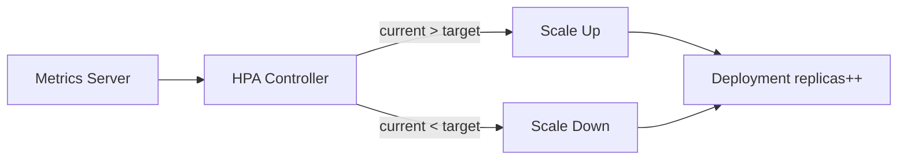

# Configuration & Scaling

Resource management, autoscaling strategies, and fine-grained pod scheduling — controlling where pods run and how much of the cluster they consume.

---

## Resource Requests and Limits

Every container should declare how much CPU and memory it needs (requests) and the maximum it may consume (limits).

```yaml
spec:
  containers:
    - name: api
      image: myapp:1.0
      resources:
        requests:
          cpu: "250m"       # 0.25 CPU cores (guaranteed minimum)
          memory: "256Mi"   # 256 MiB (guaranteed minimum)
        limits:
          cpu: "1000m"      # 1 CPU core (throttled beyond this)
          memory: "512Mi"   # 512 MiB (OOM-killed beyond this)
```

| Concept | CPU Behavior | Memory Behavior |
|---------|-------------|-----------------|
| **Request** | Guaranteed allocation; used for scheduling | Guaranteed allocation; used for scheduling |
| **Limit** | Throttled (not killed) when exceeded | **OOM-killed** when exceeded |
| **No request set** | Best-effort scheduling | Best-effort scheduling |
| **No limit set** | Can consume all available CPU | Can consume all available memory |

### QoS Classes

Kubernetes assigns a Quality of Service class based on resource declarations:

| QoS Class | Condition | Eviction Priority |
|-----------|-----------|-------------------|
| **Guaranteed** | Requests == Limits for all containers | Last to be evicted |
| **Burstable** | At least one container has requests ≠ limits | Middle |
| **BestEffort** | No requests or limits set | First to be evicted |

> **Best practice:** Always set requests. Set limits for memory (to prevent OOM). CPU limits are optional — throttling may cause latency spikes.

---

## LimitRanges

Enforce default and maximum resource values per namespace — prevents a single pod from consuming all cluster resources.

```yaml
apiVersion: v1
kind: LimitRange
metadata:
  name: default-limits
  namespace: production
spec:
  limits:
    - type: Container
      default:            # Applied if no limit is set
        cpu: "500m"
        memory: "256Mi"
      defaultRequest:     # Applied if no request is set
        cpu: "100m"
        memory: "128Mi"
      max:                # Maximum allowed
        cpu: "4000m"
        memory: "4Gi"
      min:                # Minimum allowed
        cpu: "50m"
        memory: "64Mi"
    - type: Pod
      max:
        cpu: "8000m"
        memory: "8Gi"
```

---

## ResourceQuotas

Limit the total resource consumption across all pods in a namespace.

```yaml
apiVersion: v1
kind: ResourceQuota
metadata:
  name: team-quota
  namespace: team-alpha
spec:
  hard:
    requests.cpu: "20"
    requests.memory: "40Gi"
    limits.cpu: "40"
    limits.memory: "80Gi"
    pods: "50"
    services: "20"
    persistentvolumeclaims: "30"
    configmaps: "50"
    secrets: "50"
```

| Quota Type | Controls |
|-----------|----------|
| Compute (requests/limits) | Total CPU and memory across all pods |
| Object count | Number of pods, services, PVCs, configmaps, secrets |
| Storage | Total PVC storage requests |

---

## Horizontal Pod Autoscaler (HPA)

Automatically scales the number of pod replicas based on observed metrics.

```yaml
apiVersion: autoscaling/v2
kind: HorizontalPodAutoscaler
metadata:
  name: api-hpa
spec:
  scaleTargetRef:
    apiVersion: apps/v1
    kind: Deployment
    name: api-server
  minReplicas: 3
  maxReplicas: 20
  behavior:
    scaleUp:
      stabilizationWindowSeconds: 60
      policies:
        - type: Percent
          value: 100
          periodSeconds: 60
    scaleDown:
      stabilizationWindowSeconds: 300
      policies:
        - type: Pods
          value: 1
          periodSeconds: 60
  metrics:
    - type: Resource
      resource:
        name: cpu
        target:
          type: Utilization
          averageUtilization: 70
    - type: Resource
      resource:
        name: memory
        target:
          type: Utilization
          averageUtilization: 80
    - type: Pods
      pods:
        metric:
          name: http_requests_per_second
        target:
          type: AverageValue
          averageValue: "1000"
```

### HPA Requirements

- **metrics-server** must be installed (provides CPU/memory metrics)
- Pods must have resource **requests** set (HPA calculates utilization as current/requested)
- For custom metrics: Prometheus Adapter or KEDA

### Scaling Behavior



---

## Vertical Pod Autoscaler (VPA)

Automatically adjusts CPU and memory **requests** (and optionally limits) for containers based on historical usage.

```yaml
apiVersion: autoscaling.k8s.io/v1
kind: VerticalPodAutoscaler
metadata:
  name: api-vpa
spec:
  targetRef:
    apiVersion: apps/v1
    kind: Deployment
    name: api-server
  updatePolicy:
    updateMode: "Auto"       # Auto, Recreate, Initial, Off
  resourcePolicy:
    containerPolicies:
      - containerName: api
        minAllowed:
          cpu: "100m"
          memory: "128Mi"
        maxAllowed:
          cpu: "4000m"
          memory: "4Gi"
```

| Update Mode | Behavior |
|------------|----------|
| **Off** | Only provides recommendations (safe to start with) |
| **Initial** | Sets resources only at pod creation |
| **Recreate** | Evicts and recreates pods to apply new values |
| **Auto** | Like Recreate (may use in-place resize in future) |

> **Warning:** VPA and HPA should not target the same metric (CPU/memory). Use VPA for right-sizing, HPA for scaling out.

---

## Cluster Autoscaler

Automatically adjusts the number of **nodes** in the cluster based on pending pods.

| Situation | Action |
|-----------|--------|
| Pods pending due to insufficient resources | Add nodes |
| Nodes underutilized (pods can be rescheduled elsewhere) | Remove nodes |

Cluster Autoscaler respects:
- Pod Disruption Budgets
- Node affinity/anti-affinity
- Local storage (won't drain nodes with local PVs)

Configuration is cloud-specific (EKS node groups, GKE node pools, AKS VMSS).

---

## Priority Classes

When the cluster is full, priority determines which pods get evicted to make room for higher-priority pods.

```yaml
apiVersion: scheduling.k8s.io/v1
kind: PriorityClass
metadata:
  name: high-priority
value: 1000000
globalDefault: false
preemptionPolicy: PreemptLower
description: "Critical production workloads"
---
apiVersion: scheduling.k8s.io/v1
kind: PriorityClass
metadata:
  name: low-priority
value: 100
globalDefault: false
preemptionPolicy: Never          # Don't evict others
description: "Batch jobs and dev workloads"
```

Usage in a pod:

```yaml
spec:
  priorityClassName: high-priority
  containers:
    - name: critical-service
      image: myapp:1.0
```

---

## Pod Scheduling

### Node Affinity

Attract pods to specific nodes:

```yaml
spec:
  affinity:
    nodeAffinity:
      requiredDuringSchedulingIgnoredDuringExecution:
        nodeSelectorTerms:
          - matchExpressions:
              - key: topology.kubernetes.io/zone
                operator: In
                values:
                  - eu-central-1a
                  - eu-central-1b
      preferredDuringSchedulingIgnoredDuringExecution:
        - weight: 80
          preference:
            matchExpressions:
              - key: node.kubernetes.io/instance-type
                operator: In
                values:
                  - m5.xlarge
```

### Pod Anti-Affinity

Spread pods across nodes or zones (high availability):

```yaml
spec:
  affinity:
    podAntiAffinity:
      requiredDuringSchedulingIgnoredDuringExecution:
        - labelSelector:
            matchLabels:
              app: api-server
          topologyKey: kubernetes.io/hostname   # One per node
      preferredDuringSchedulingIgnoredDuringExecution:
        - weight: 100
          podAffinityTerm:
            labelSelector:
              matchLabels:
                app: api-server
            topologyKey: topology.kubernetes.io/zone  # Spread across AZs
```

### Taints and Tolerations

Taints repel pods from nodes; tolerations allow specific pods to schedule on tainted nodes.

```bash
# Taint a node (repels all pods without matching toleration)
kubectl taint nodes gpu-node-1 gpu=true:NoSchedule
```

```yaml
# Pod that tolerates the taint
spec:
  tolerations:
    - key: "gpu"
      operator: "Equal"
      value: "true"
      effect: "NoSchedule"
  containers:
    - name: ml-training
      image: ml-model:1.0
      resources:
        limits:
          nvidia.com/gpu: 1
```

| Taint Effect | Behavior |
|-------------|----------|
| `NoSchedule` | New pods won't schedule unless they tolerate |
| `PreferNoSchedule` | Scheduler tries to avoid, but not guaranteed |
| `NoExecute` | Existing pods are evicted if they don't tolerate |

---

## Key Takeaways

1. **Always set resource requests** — the scheduler uses them for placement decisions. Without them, pods are BestEffort and first to be evicted.
2. **LimitRanges** enforce per-pod defaults; **ResourceQuotas** cap total namespace consumption — use both in multi-tenant clusters.
3. **HPA scales pods horizontally** based on metrics; it requires metrics-server and resource requests to function.
4. **VPA right-sizes pods** based on actual usage — use "Off" mode first to get recommendations before enabling auto-adjustment.
5. **Cluster Autoscaler** adds/removes nodes — it works with HPA to handle load that exceeds current capacity.
6. **Pod anti-affinity** ensures high availability by spreading replicas across failure domains (nodes, zones).
7. **Taints/tolerations** are for dedicated node pools — GPU nodes, high-memory nodes, or nodes reserved for specific teams.
