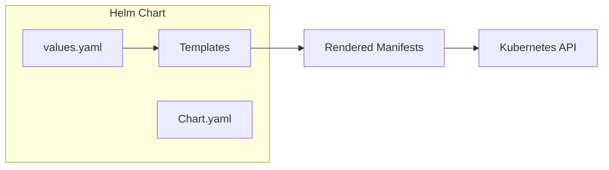
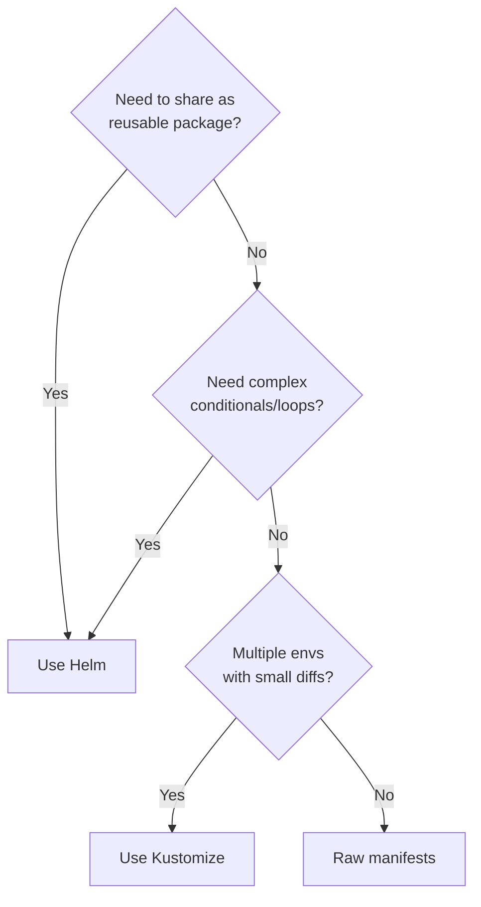

# Helm & Packaging

Packaging, templating, and managing Kubernetes applications — from Helm charts to Kustomize overlays, and when to use each approach.

---

## Why Packaging Matters

Raw Kubernetes manifests work for simple deployments, but real applications need:

- **Parameterisation** — different values per environment (dev, staging, prod)
- **Reusability** — deploy the same app pattern across teams/clusters
- **Versioning** — track which version of your manifests are deployed
- **Dependencies** — install prerequisites (databases, message queues) together

---

## Helm Overview

Helm is the package manager for Kubernetes. It packages manifests into **charts**, parameterises them with **values**, and tracks **releases**.



| Concept | Description |
|---------|-------------|
| **Chart** | A package of templated Kubernetes manifests |
| **Values** | Configuration parameters that customize a chart |
| **Release** | A specific deployment of a chart with a given set of values |
| **Repository** | A collection of charts (like npm registry for K8s) |

---

## Chart Structure

```
mychart/
├── Chart.yaml            # Metadata: name, version, dependencies
├── Chart.lock            # Locked dependency versions
├── values.yaml           # Default configuration values
├── values-prod.yaml      # Environment-specific overrides (optional)
├── templates/
│   ├── _helpers.tpl      # Template helper functions
│   ├── deployment.yaml   # Deployment template
│   ├── service.yaml      # Service template
│   ├── ingress.yaml      # Ingress template
│   ├── configmap.yaml    # ConfigMap template
│   ├── hpa.yaml          # HPA template
│   ├── serviceaccount.yaml
│   └── NOTES.txt         # Post-install instructions (shown to user)
├── charts/               # Downloaded dependencies
└── .helmignore           # Files to exclude from packaging
```

### Chart.yaml

```yaml
apiVersion: v2
name: my-api
description: A Helm chart for my API service
type: application
version: 1.2.0           # Chart version (bump on chart changes)
appVersion: "2.5.1"      # Application version being deployed

dependencies:
  - name: postgresql
    version: "~13.0"
    repository: "https://charts.bitnami.com/bitnami"
    condition: postgresql.enabled
```

### values.yaml

```yaml
replicaCount: 3

image:
  repository: myregistry/api
  tag: "2.5.1"
  pullPolicy: IfNotPresent

service:
  type: ClusterIP
  port: 80

ingress:
  enabled: true
  className: nginx
  host: api.example.com
  tls: true

resources:
  requests:
    cpu: 250m
    memory: 256Mi
  limits:
    cpu: 1000m
    memory: 512Mi

autoscaling:
  enabled: true
  minReplicas: 3
  maxReplicas: 15
  targetCPU: 70

postgresql:
  enabled: true
  auth:
    database: myapp
```

---

## Templates and Values

Templates use Go's `text/template` syntax with Helm's built-in functions and objects.

### Deployment Template

```yaml
# templates/deployment.yaml
apiVersion: apps/v1
kind: Deployment
metadata:
  name: {{ include "mychart.fullname" . }}
  labels:
    {{- include "mychart.labels" . | nindent 4 }}
spec:
  {{- if not .Values.autoscaling.enabled }}
  replicas: {{ .Values.replicaCount }}
  {{- end }}
  selector:
    matchLabels:
      {{- include "mychart.selectorLabels" . | nindent 6 }}
  template:
    metadata:
      labels:
        {{- include "mychart.selectorLabels" . | nindent 8 }}
    spec:
      containers:
        - name: {{ .Chart.Name }}
          image: "{{ .Values.image.repository }}:{{ .Values.image.tag }}"
          imagePullPolicy: {{ .Values.image.pullPolicy }}
          ports:
            - containerPort: 8080
          resources:
            {{- toYaml .Values.resources | nindent 12 }}
```

### Helper Functions (_helpers.tpl)

```yaml
# templates/_helpers.tpl
{{- define "mychart.fullname" -}}
{{- printf "%s-%s" .Release.Name .Chart.Name | trunc 63 | trimSuffix "-" }}
{{- end }}

{{- define "mychart.labels" -}}
app.kubernetes.io/name: {{ .Chart.Name }}
app.kubernetes.io/instance: {{ .Release.Name }}
app.kubernetes.io/version: {{ .Chart.AppVersion | quote }}
app.kubernetes.io/managed-by: {{ .Release.Service }}
helm.sh/chart: {{ printf "%s-%s" .Chart.Name .Chart.Version }}
{{- end }}

{{- define "mychart.selectorLabels" -}}
app.kubernetes.io/name: {{ .Chart.Name }}
app.kubernetes.io/instance: {{ .Release.Name }}
{{- end }}
```

### Built-in Objects

| Object | Contains |
|--------|----------|
| `.Values` | Values from values.yaml and overrides |
| `.Release` | Release info (Name, Namespace, Revision, IsInstall, IsUpgrade) |
| `.Chart` | Chart.yaml contents |
| `.Capabilities` | Cluster capabilities (API versions, K8s version) |
| `.Template` | Current template info (Name, BasePath) |

---

## Chart Repositories

```bash
# Add a repository
helm repo add bitnami https://charts.bitnami.com/bitnami
helm repo update

# Search for charts
helm search repo nginx
helm search hub prometheus    # Search Artifact Hub

# Pull chart for inspection
helm pull bitnami/postgresql --untar
```

### OCI Registries (Modern Approach)

Helm 3.8+ supports storing charts in OCI-compliant registries (ECR, GCR, Docker Hub):

```bash
helm push mychart-1.2.0.tgz oci://123456789.dkr.ecr.eu-central-1.amazonaws.com/charts
helm install my-release oci://123456789.dkr.ecr.eu-central-1.amazonaws.com/charts/mychart --version 1.2.0
```

---

## Release Management

```bash
# Install a release
helm install my-api ./mychart -f values-prod.yaml -n production

# Upgrade (applies changes)
helm upgrade my-api ./mychart -f values-prod.yaml -n production

# Install or upgrade (idempotent)
helm upgrade --install my-api ./mychart -f values-prod.yaml -n production

# Rollback
helm rollback my-api 2      # Roll back to revision 2

# View history
helm history my-api -n production

# Uninstall
helm uninstall my-api -n production

# Dry-run (preview without applying)
helm upgrade --install my-api ./mychart -f values-prod.yaml --dry-run --debug
```

---

## Hooks

Helm hooks execute resources at specific points in the release lifecycle.

| Hook | When It Runs |
|------|-------------|
| `pre-install` | Before any release resources are installed |
| `post-install` | After all resources are installed |
| `pre-upgrade` | Before an upgrade |
| `post-upgrade` | After an upgrade |
| `pre-delete` | Before a release is deleted |
| `pre-rollback` | Before a rollback |

```yaml
# templates/migration-job.yaml
apiVersion: batch/v1
kind: Job
metadata:
  name: {{ include "mychart.fullname" . }}-migrate
  annotations:
    "helm.sh/hook": pre-upgrade
    "helm.sh/hook-weight": "0"
    "helm.sh/hook-delete-policy": hook-succeeded
spec:
  template:
    spec:
      restartPolicy: Never
      containers:
        - name: migrate
          image: "{{ .Values.image.repository }}:{{ .Values.image.tag }}"
          command: ["python", "manage.py", "migrate"]
```

---

## Kustomize

Kustomize takes a different approach — no templating language. Instead, it uses **patches and overlays** on top of plain YAML manifests.

### Kustomize Structure

```
app/
├── base/
│   ├── kustomization.yaml
│   ├── deployment.yaml
│   ├── service.yaml
│   └── configmap.yaml
└── overlays/
    ├── dev/
    │   ├── kustomization.yaml
    │   └── replica-patch.yaml
    └── prod/
        ├── kustomization.yaml
        ├── replica-patch.yaml
        └── resource-patch.yaml
```

### Base kustomization.yaml

```yaml
# base/kustomization.yaml
apiVersion: kustomize.config.k8s.io/v1beta1
kind: Kustomization
resources:
  - deployment.yaml
  - service.yaml
  - configmap.yaml
commonLabels:
  app: my-api
```

### Production Overlay

```yaml
# overlays/prod/kustomization.yaml
apiVersion: kustomize.config.k8s.io/v1beta1
kind: Kustomization
resources:
  - ../../base
namePrefix: prod-
namespace: production
patches:
  - path: replica-patch.yaml
  - path: resource-patch.yaml
images:
  - name: myregistry/api
    newTag: "2.5.1"
```

```yaml
# overlays/prod/replica-patch.yaml
apiVersion: apps/v1
kind: Deployment
metadata:
  name: my-api
spec:
  replicas: 5
```

Apply with:
```bash
kubectl apply -k overlays/prod/
```

---

## When to Use What

| Approach | Best For | Strengths | Weaknesses |
|----------|----------|-----------|------------|
| **Raw manifests** | Simple apps, learning, small teams | No tooling required, fully transparent | No parameterisation, copy-paste across envs |
| **Helm** | Reusable packages, shared charts, complex apps with dependencies | Powerful templating, versioned releases, rollback, ecosystem | Template complexity, hard to debug rendered output |
| **Kustomize** | GitOps workflows, environment overlays, teams that dislike templating | Built into kubectl, plain YAML, declarative patches | Less powerful than Helm, no release management |
| **Helm + Kustomize** | Best of both worlds | Helm for packaging, Kustomize for last-mile env patches | Two tools to understand |

### Decision Flowchart



---

## Key Takeaways

1. **Helm is the standard for packaging** — it handles dependencies, versioning, and release management.
2. **Chart version ≠ app version** — bump chart version on template changes, app version on code changes.
3. **Always use `--dry-run`** before applying Helm upgrades to production.
4. **Kustomize is built into kubectl** — it's simpler for environment overlays without a templating language.
5. **Hooks** enable pre/post lifecycle actions (database migrations, cache warming) without external tooling.
6. **OCI registries** are the modern way to store charts — treat them like container images.
7. In practice, many teams use **Helm for third-party charts** (nginx-ingress, prometheus) and **Kustomize for in-house apps** — pick what fits your workflow.
