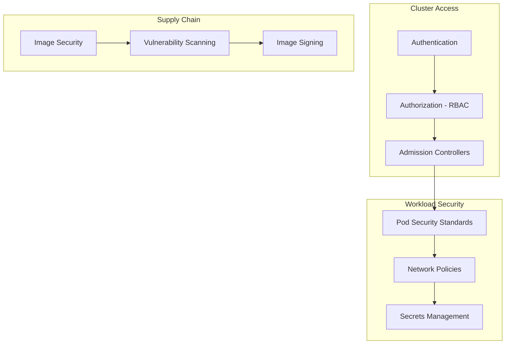

# Security

Controlling access to the cluster and its resources, securing workloads, managing secrets safely, and hardening the supply chain.

---

## Security Layers



---

## RBAC (Role-Based Access Control)

RBAC controls **who** can do **what** on **which resources**. It's the primary authorization mechanism in Kubernetes.

### RBAC Components

| Resource | Scope | Purpose |
|----------|-------|---------|
| **Role** | Namespace | Defines permissions within a namespace |
| **ClusterRole** | Cluster-wide | Defines permissions across all namespaces |
| **RoleBinding** | Namespace | Grants a Role to a user/group/service account |
| **ClusterRoleBinding** | Cluster-wide | Grants a ClusterRole cluster-wide |

### Role Example

```yaml
apiVersion: rbac.authorization.k8s.io/v1
kind: Role
metadata:
  name: pod-reader
  namespace: production
rules:
  - apiGroups: [""]             # Core API group
    resources: ["pods", "pods/log"]
    verbs: ["get", "list", "watch"]
  - apiGroups: [""]
    resources: ["services"]
    verbs: ["get", "list"]
  - apiGroups: ["apps"]
    resources: ["deployments"]
    verbs: ["get", "list", "watch"]
```

### ClusterRole Example

```yaml
apiVersion: rbac.authorization.k8s.io/v1
kind: ClusterRole
metadata:
  name: namespace-admin
rules:
  - apiGroups: ["", "apps", "batch"]
    resources: ["*"]
    verbs: ["*"]
  - apiGroups: ["networking.k8s.io"]
    resources: ["ingresses", "networkpolicies"]
    verbs: ["get", "list", "create", "update", "delete"]
```

### RoleBinding

```yaml
apiVersion: rbac.authorization.k8s.io/v1
kind: RoleBinding
metadata:
  name: dev-team-access
  namespace: production
subjects:
  - kind: Group
    name: dev-team
    apiGroup: rbac.authorization.k8s.io
  - kind: User
    name: alice@example.com
    apiGroup: rbac.authorization.k8s.io
  - kind: ServiceAccount
    name: ci-deployer
    namespace: ci-cd
roleRef:
  kind: Role
  name: pod-reader
  apiGroup: rbac.authorization.k8s.io
```

### Common Verbs

| Verb | HTTP Method | Action |
|------|------------|--------|
| `get` | GET | Read a single resource |
| `list` | GET (collection) | List resources |
| `watch` | GET (streaming) | Watch for changes |
| `create` | POST | Create a resource |
| `update` | PUT | Replace a resource |
| `patch` | PATCH | Partially update |
| `delete` | DELETE | Delete a resource |

> **Principle of least privilege:** Start with no permissions and grant only what's needed. Use `kubectl auth can-i` to verify permissions.

---

## ServiceAccounts

Every pod runs as a ServiceAccount. If not specified, it uses the `default` SA in the namespace.

```yaml
apiVersion: v1
kind: ServiceAccount
metadata:
  name: app-service-account
  namespace: production
  annotations:
    # For AWS IAM Roles for Service Accounts (IRSA)
    eks.amazonaws.com/role-arn: arn:aws:iam::123456789:role/app-role
automountServiceAccountToken: false    # Don't mount token unless needed
```

### Binding a ServiceAccount to a Role

```yaml
apiVersion: rbac.authorization.k8s.io/v1
kind: RoleBinding
metadata:
  name: app-sa-binding
  namespace: production
subjects:
  - kind: ServiceAccount
    name: app-service-account
    namespace: production
roleRef:
  kind: Role
  name: app-permissions
  apiGroup: rbac.authorization.k8s.io
```

### Using a ServiceAccount in a Pod

```yaml
spec:
  serviceAccountName: app-service-account
  automountServiceAccountToken: false    # Only mount if API access needed
  containers:
    - name: app
      image: myapp:1.0
```

---

## Pod Security Standards

Pod Security Standards (PSS) replaced the deprecated PodSecurityPolicy. They define three profiles enforced via namespace labels.

| Profile | Description | Example Restrictions |
|---------|-------------|---------------------|
| **Privileged** | Unrestricted (system workloads) | None |
| **Baseline** | Minimal restrictions (prevents known privilege escalations) | No `hostNetwork`, no `privileged` containers |
| **Restricted** | Heavily restricted (security best practice) | Must run as non-root, read-only root filesystem, no capabilities |

### Enforcing via Namespace Labels

```yaml
apiVersion: v1
kind: Namespace
metadata:
  name: production
  labels:
    pod-security.kubernetes.io/enforce: restricted
    pod-security.kubernetes.io/audit: restricted
    pod-security.kubernetes.io/warn: restricted
```

### Restricted Pod Example

```yaml
apiVersion: v1
kind: Pod
metadata:
  name: secure-app
spec:
  securityContext:
    runAsNonRoot: true
    runAsUser: 1000
    runAsGroup: 1000
    fsGroup: 1000
    seccompProfile:
      type: RuntimeDefault
  containers:
    - name: app
      image: myapp:1.0
      securityContext:
        allowPrivilegeEscalation: false
        readOnlyRootFilesystem: true
        capabilities:
          drop:
            - ALL
      volumeMounts:
        - name: tmp
          mountPath: /tmp
  volumes:
    - name: tmp
      emptyDir: {}       # Writable temp dir since root FS is read-only
```

---

## Network Policies for Segmentation

Use NetworkPolicies to enforce micro-segmentation — only allow traffic between services that need to communicate.

### Zero-Trust Pattern

```yaml
# Step 1: Deny all traffic in the namespace
apiVersion: networking.k8s.io/v1
kind: NetworkPolicy
metadata:
  name: default-deny-all
  namespace: production
spec:
  podSelector: {}
  policyTypes:
    - Ingress
    - Egress
---
# Step 2: Allow specific paths
apiVersion: networking.k8s.io/v1
kind: NetworkPolicy
metadata:
  name: allow-frontend-to-backend
  namespace: production
spec:
  podSelector:
    matchLabels:
      app: backend
  ingress:
    - from:
        - podSelector:
            matchLabels:
              app: frontend
      ports:
        - port: 8080
---
# Step 3: Allow DNS (required for service discovery)
apiVersion: networking.k8s.io/v1
kind: NetworkPolicy
metadata:
  name: allow-dns
  namespace: production
spec:
  podSelector: {}
  egress:
    - to:
        - namespaceSelector:
            matchLabels:
              kubernetes.io/metadata.name: kube-system
          podSelector:
            matchLabels:
              k8s-app: kube-dns
      ports:
        - port: 53
          protocol: UDP
        - port: 53
          protocol: TCP
```

---

## Secrets Management

### Options Comparison

| Solution | How It Works | Best For |
|----------|-------------|----------|
| **Native Secrets** | Base64 in etcd (enable encryption at rest) | Simple setups, non-sensitive config |
| **Sealed Secrets** | Encrypted in git, controller decrypts in-cluster | GitOps workflows |
| **External Secrets Operator** | Syncs from external vault → K8s Secret | Enterprise (AWS SM, Vault, GCP SM) |
| **HashiCorp Vault + CSI** | Mounts secrets from Vault as volumes | Dynamic secrets, lease management |

### Sealed Secrets

Encrypt secrets so they can be safely stored in Git:

```bash
# Install kubeseal CLI
# Encrypt a secret
kubectl create secret generic db-creds \
  --from-literal=password=supersecret \
  --dry-run=client -o yaml | kubeseal --format yaml > sealed-secret.yaml
```

```yaml
apiVersion: bitnami.com/v1alpha1
kind: SealedSecret
metadata:
  name: db-creds
  namespace: production
spec:
  encryptedData:
    password: AgBy3i...encrypted...data==
```

Only the controller running in the cluster can decrypt it.

### Vault with External Secrets Operator

```yaml
apiVersion: external-secrets.io/v1beta1
kind: SecretStore
metadata:
  name: vault-backend
  namespace: production
spec:
  provider:
    vault:
      server: "https://vault.internal:8200"
      path: "secret"
      auth:
        kubernetes:
          mountPath: "kubernetes"
          role: "production-app"
---
apiVersion: external-secrets.io/v1beta1
kind: ExternalSecret
metadata:
  name: app-secrets
spec:
  refreshInterval: 15m
  secretStoreRef:
    name: vault-backend
    kind: SecretStore
  target:
    name: app-secrets
  data:
    - secretKey: api-key
      remoteRef:
        key: secret/data/production/app
        property: api-key
```

---

## Image Security

| Practice | Tool/Approach |
|----------|--------------|
| **Minimal base images** | Use distroless, Alpine, or scratch |
| **Vulnerability scanning** | Trivy, Grype, Snyk in CI pipeline |
| **Image signing** | Cosign (Sigstore) — verify provenance |
| **Private registries** | ECR, GCR, Harbor with access control |
| **No latest tag** | Always use immutable tags (sha256 digest or semver) |
| **Read-only filesystem** | Set `readOnlyRootFilesystem: true` |

### Image Pull Policy

```yaml
spec:
  containers:
    - name: app
      image: myregistry/app@sha256:abc123...  # Immutable digest
      imagePullPolicy: IfNotPresent
  imagePullSecrets:
    - name: registry-credentials
```

---

## Admission Controllers

Admission controllers intercept API requests after authentication/authorization but before persistence. They can **validate** or **mutate** requests.

| Controller | Purpose |
|-----------|---------|
| **PodSecurity** | Enforces Pod Security Standards (built-in) |
| **OPA/Gatekeeper** | Custom policy enforcement (Rego language) |
| **Kyverno** | Kubernetes-native policies (YAML-based, easier than OPA) |
| **MutatingWebhook** | Modifies resources (inject sidecars, add labels) |
| **ValidatingWebhook** | Rejects non-compliant resources |

### Kyverno Policy Example

```yaml
apiVersion: kyverno.io/v1
kind: ClusterPolicy
metadata:
  name: require-labels
spec:
  validationFailureAction: Enforce
  rules:
    - name: require-team-label
      match:
        any:
          - resources:
              kinds:
                - Deployment
                - StatefulSet
      validate:
        message: "All workloads must have a 'team' label."
        pattern:
          metadata:
            labels:
              team: "?*"
```

---

## Key Takeaways

1. **RBAC is mandatory** — never disable it. Start with zero permissions and grant incrementally.
2. **Every pod should use a dedicated ServiceAccount** — don't rely on the default SA. Disable token auto-mounting unless API access is needed.
3. **Pod Security Standards** replace PodSecurityPolicy — enforce `restricted` profile in production namespaces.
4. **Network Policies implement zero-trust** — deny all by default, whitelist required paths. Always allow DNS egress.
5. **Native Secrets are not encrypted** by default — enable etcd encryption at rest, or better, use External Secrets Operator or Sealed Secrets.
6. **Scan images in CI** — vulnerabilities in base images are the most common attack vector. Use minimal base images and pin digests.
7. **Admission controllers are the last line of defense** — use Kyverno or OPA/Gatekeeper to enforce organizational policies programmatically.
