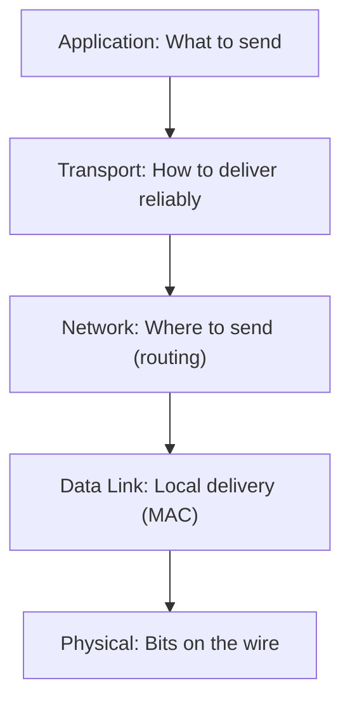
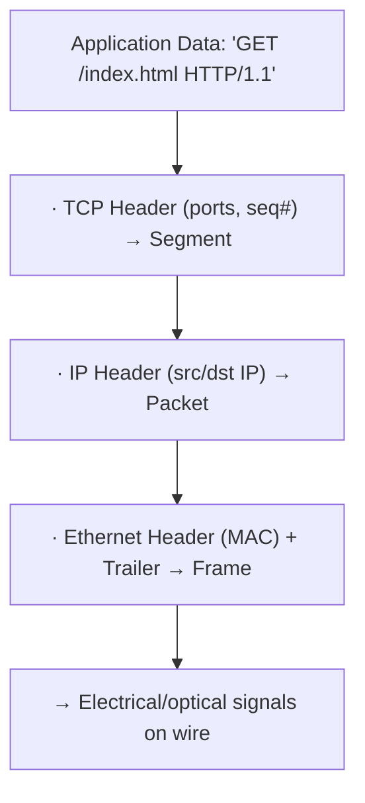

## Why Layered Models?

Networking is complex — it involves physical signals, addressing, routing, reliability, and application logic. Layered models break this complexity into manageable pieces where each layer has a single responsibility and communicates only with adjacent layers.



---

## The OSI Model (7 Layers)

A theoretical reference model — useful for understanding and troubleshooting:

| Layer | Name | Function | Protocols | PDU |
|-------|------|----------|-----------|-----|
| 7 | Application | User-facing services | HTTP, DNS, SMTP, SSH | Data |
| 6 | Presentation | Encoding, encryption | TLS, JPEG, ASCII | Data |
| 5 | Session | Connection management | NetBIOS, RPC | Data |
| 4 | Transport | End-to-end delivery | TCP, UDP | Segment |
| 3 | Network | Routing between networks | IP, ICMP | Packet |
| 2 | Data Link | Local delivery | Ethernet, Wi-Fi | Frame |
| 1 | Physical | Bits on the medium | Cables, radio waves | Bits |

**PDU** = Protocol Data Unit (the name for data at each layer).

---

## The TCP/IP Model (4 Layers)

What actually runs the internet — a practical simplification:

| TCP/IP Layer | OSI Equivalent | Key Protocols |
|-------------|----------------|---------------|
| Application | 5 + 6 + 7 | HTTP, DNS, SSH, TLS |
| Transport | 4 | TCP, UDP |
| Internet | 3 | IP, ICMP, ARP |
| Network Access | 1 + 2 | Ethernet, Wi-Fi |

The TCP/IP model merges the top three OSI layers into "Application" and the bottom two into "Network Access" — because in practice, these boundaries are blurry.

---

## Encapsulation

As data moves down the stack, each layer wraps it with its own header:



On the receiving end, each layer strips its header (decapsulation) and passes data up.

### What Each Header Contains

| Layer | Header Contains |
|-------|----------------|
| TCP | Source port, destination port, sequence number, flags |
| IP | Source IP, destination IP, TTL, protocol |
| Ethernet | Source MAC, destination MAC, EtherType |

---

## How Layers Interact in Practice

When you type `https://example.com` in a browser:

1. **Application (7):** Browser constructs HTTP GET request
2. **Presentation (6):** TLS encrypts the request
3. **Session (5):** TLS session established
4. **Transport (4):** TCP segments the data, adds port 443
5. **Network (3):** IP adds source/destination addresses, router determines path
6. **Data Link (2):** Ethernet frame with MAC of next hop (router)
7. **Physical (1):** Electrical signals on the cable

---

## Troubleshooting by Layer

| Symptom | Likely Layer | Check |
|---------|-------------|-------|
| No link light | Physical (1) | Cable, port, NIC |
| Can't reach local devices | Data Link (2) | ARP table, switch, VLAN |
| Can't reach remote networks | Network (3) | IP config, routing, firewall |
| Connection timeouts | Transport (4) | Port open? Firewall? TCP handshake? |
| Wrong content / errors | Application (7) | HTTP status, DNS, app config |

```bash
# Layer 1-3: Can I reach the IP?
ping 93.184.216.34

# Layer 3: Is DNS working?
dig example.com

# Layer 4: Is the port open?
nc -zv example.com 443

# Layer 7: Does the app respond correctly?
curl -v https://example.com
```

---

## Key Takeaways

1. **OSI is for understanding**, TCP/IP is for building — know both
2. **Encapsulation** adds headers going down, strips them going up
3. **Each layer only talks to adjacent layers** — this enables modularity
4. **Troubleshoot bottom-up** — physical → network → transport → application
5. **Most problems are at Layer 3 (routing/IP) or Layer 7 (application)**
