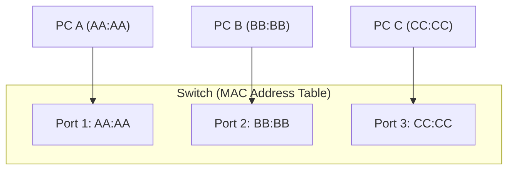
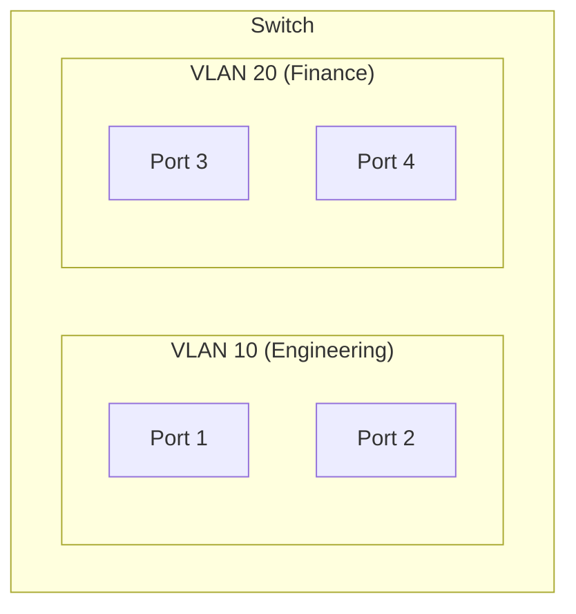
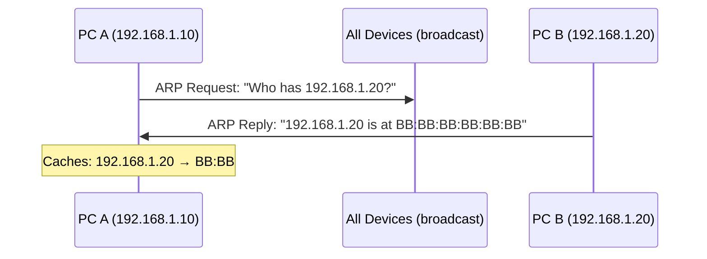

## Physical Layer (Layer 1)

The physical layer converts bits into signals and transmits them over a medium.

### Transmission Media

| Medium | Speed | Distance | Use Case |
|--------|-------|----------|----------|
| Cat5e (copper) | 1 Gbps | 100m | Office LAN |
| Cat6a (copper) | 10 Gbps | 100m | Data center |
| Single-mode fiber | 100+ Gbps | 80+ km | Long-haul, WAN |
| Multi-mode fiber | 10-100 Gbps | 300-550m | Data center |
| Wi-Fi 6 (802.11ax) | 9.6 Gbps (theoretical) | ~30m indoor | Wireless LAN |

---

## Data Link Layer (Layer 2)

Responsible for **local delivery** — getting frames from one device to another on the same network segment.

### MAC Addresses

Every network interface has a unique 48-bit MAC (Media Access Control) address:

```text
3C:22:FB:01:A2:B7
└──────┘ └──────┘
  OUI      Device ID
(vendor)  (unique per NIC)
```

| Type | Address | Purpose |
|------|---------|---------|
| Unicast | `3C:22:FB:01:A2:B7` | One specific device |
| Broadcast | `FF:FF:FF:FF:FF:FF` | All devices on segment |
| Multicast | `01:00:5E:xx:xx:xx` | Group of devices |

---

## Ethernet Frames

```text
┌──────────┬──────────┬──────┬─────────────────┬─────┐
│ Dst MAC  │ Src MAC  │ Type │    Payload       │ FCS │
│ (6 bytes)│ (6 bytes)│(2 B) │ (46-1500 bytes)  │(4 B)│
└──────────┴──────────┴──────┴─────────────────┴─────┘
```

| Field | Purpose |
|-------|---------|
| Destination MAC | Who should receive this frame |
| Source MAC | Who sent it |
| EtherType | What protocol is inside (0x0800 = IPv4, 0x0806 = ARP) |
| Payload | The actual data (IP packet) |
| FCS | Frame Check Sequence (error detection) |

---

## Switches

A switch operates at Layer 2 — it forwards frames based on MAC addresses.



### How a Switch Learns

1. Frame arrives on port 1 from MAC `AA:AA`
2. Switch records: "MAC `AA:AA` is on port 1"
3. Frame is destined for MAC `BB:BB`
4. Switch looks up `BB:BB` → port 2
5. Frame forwarded only to port 2 (not flooded)

If the destination MAC is unknown, the switch **floods** the frame to all ports (except the source port).

### Switch vs Hub

| Device | Intelligence | Traffic |
|--------|-------------|---------|
| Hub | None | Floods everything to all ports |
| Switch | MAC table | Forwards only to correct port |

---

## VLANs (Virtual LANs)

VLANs logically segment a physical switch into separate broadcast domains:



- Devices in VLAN 10 cannot communicate with VLAN 20 at Layer 2
- Inter-VLAN communication requires a router (Layer 3)
- **Trunk ports** carry multiple VLANs between switches (802.1Q tagging)

---

## ARP (Address Resolution Protocol)

Bridges Layer 3 (IP) and Layer 2 (MAC) — "I know the IP, what's the MAC?"



```bash
# View ARP cache
arp -a
ip neigh show    # Linux

# Clear ARP cache
sudo arp -d 192.168.1.20
```

### ARP Poisoning (Security Risk)

An attacker sends fake ARP replies, associating their MAC with the gateway's IP — intercepting all traffic (man-in-the-middle). Mitigation: Dynamic ARP Inspection (DAI), static ARP entries.

---

## Key Takeaways

1. **Layer 2 = local delivery** using MAC addresses within a network segment
2. **Switches learn** MAC-to-port mappings and forward intelligently
3. **VLANs** segment networks logically without physical separation
4. **ARP** resolves IP → MAC (essential for local communication)
5. **Broadcast domain** = all devices that receive a broadcast frame (bounded by routers/VLANs)
6. **You rarely configure Layer 2 in the cloud** — but understanding it helps debug connectivity issues
