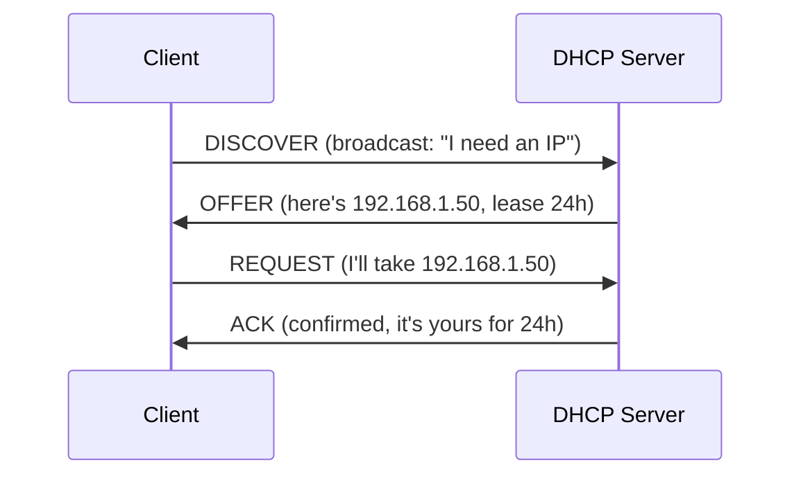

## IPv4 Addresses

A 32-bit number that uniquely identifies a device on a network, written as four decimal octets:

```text
192.168.1.100
 │    │   │  │
 └────┴───┴──┴── Each octet: 0-255 (8 bits)

Binary: 11000000.10101000.00000001.01100100
Decimal:    192  .   168  .    1   .   100
```

---

## Subnetting and CIDR

### CIDR Notation

CIDR (Classless Inter-Domain Routing) notation: `IP/prefix_length`

The prefix identifies the **network portion**, the remaining bits identify the **host**:

```text
10.0.1.50/24
├── Network: 10.0.1   (first 24 bits — fixed)
└── Host:    .50      (last 8 bits — variable)

Network address: 10.0.1.0    (all host bits = 0)
Broadcast:       10.0.1.255  (all host bits = 1)
Usable hosts:    10.0.1.1 – 10.0.1.254 (254 hosts)
```

### Subnet Mask

The subnet mask marks which bits are network (1) and which are host (0):

| CIDR | Subnet Mask | Network Bits | Host Bits | Usable Hosts |
|------|-------------|:---:|:---:|---:|
| /8 | 255.0.0.0 | 8 | 24 | 16,777,214 |
| /16 | 255.255.0.0 | 16 | 16 | 65,534 |
| /20 | 255.255.240.0 | 20 | 12 | 4,094 |
| /24 | 255.255.255.0 | 24 | 8 | 254 |
| /26 | 255.255.255.192 | 26 | 6 | 62 |
| /28 | 255.255.255.240 | 28 | 4 | 14 |
| /32 | 255.255.255.255 | 32 | 0 | 1 (single host) |

**Formula:** Usable hosts = 2^(32 - prefix) - 2 (subtract network and broadcast addresses)

### Subnetting Example

Split `10.0.0.0/16` into four equal subnets:

```text
Original: 10.0.0.0/16 (65,534 hosts)

Split into /18s (borrow 2 bits from host → 4 subnets):
  10.0.0.0/18    → 10.0.0.1   – 10.0.63.254   (16,382 hosts)
  10.0.64.0/18   → 10.0.64.1  – 10.0.127.254  (16,382 hosts)
  10.0.128.0/18  → 10.0.128.1 – 10.0.191.254  (16,382 hosts)
  10.0.192.0/18  → 10.0.192.1 – 10.0.255.254  (16,382 hosts)
```

---

## Private vs Public IP Ranges

### Private Ranges (RFC 1918)

Not routable on the internet — used inside organizations and cloud VPCs:

| Range | CIDR | Size | Typical Use |
|-------|------|------|-------------|
| 10.0.0.0 – 10.255.255.255 | 10.0.0.0/8 | 16M addresses | Cloud VPCs, large orgs |
| 172.16.0.0 – 172.31.255.255 | 172.16.0.0/12 | 1M addresses | Medium networks |
| 192.168.0.0 – 192.168.255.255 | 192.168.0.0/16 | 65K addresses | Home/small office |

### Special Addresses

| Address | Purpose |
|---------|---------|
| 127.0.0.0/8 | Loopback (localhost) |
| 169.254.0.0/16 | Link-local (APIPA — no DHCP) |
| 0.0.0.0 | "Any" address (listen on all interfaces) |
| 255.255.255.255 | Limited broadcast |

---

## IPv6

128-bit addresses — solves IPv4 exhaustion (4.3 billion → 340 undecillion):

```text
Full:       2001:0db8:85a3:0000:0000:8a2e:0370:7334
Shortened:  2001:db8:85a3::8a2e:370:7334
            (leading zeros dropped, consecutive zero groups → ::)
```

### IPv6 Address Types

| Type | Prefix | Purpose |
|------|--------|---------|
| Global unicast | `2000::/3` | Public internet (like public IPv4) |
| Link-local | `fe80::/10` | Same network segment only |
| Loopback | `::1` | Localhost |
| Multicast | `ff00::/8` | One-to-many |

### IPv4 vs IPv6

| Feature | IPv4 | IPv6 |
|---------|------|------|
| Address size | 32 bits | 128 bits |
| Notation | Dotted decimal | Colon hexadecimal |
| NAT required | Yes (address scarcity) | No (enough addresses) |
| Header | Variable length | Fixed 40 bytes |
| ARP | Yes | Replaced by NDP |

---

## DHCP (Dynamic Host Configuration Protocol)

Automatically assigns IP addresses to devices:



DHCP provides: IP address, subnet mask, default gateway, DNS servers.

---

## Cloud Networking Context

In AWS VPCs:

```text
VPC CIDR: 10.0.0.0/16

Subnets:
  Public:  10.0.1.0/24  (web servers, load balancers)
  Private: 10.0.10.0/24 (app servers, databases)
  
AWS reserves 5 IPs per subnet:
  .0 (network), .1 (gateway), .2 (DNS), .3 (reserved), .255 (broadcast)
  
/24 subnet: 256 - 5 = 251 usable IPs
```

---

## Key Takeaways

1. **CIDR notation** (`/24`, `/16`) defines network vs host boundary
2. **Private ranges** (10.x, 172.16-31.x, 192.168.x) are for internal use
3. **Subnetting** divides networks — essential for VPC design
4. **AWS reserves 5 IPs** per subnet — plan accordingly
5. **IPv6 is the future** but IPv4 + NAT dominates current infrastructure
6. **Know your /24 = 254 hosts, /16 = 65K hosts** for quick capacity planning
