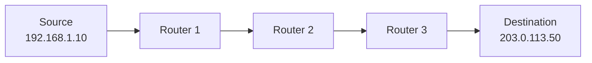
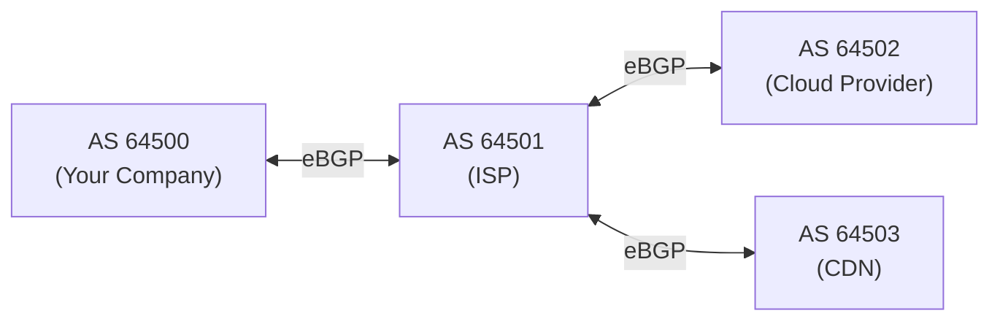

## What is Routing?

Routing is the process of selecting a path for network traffic across one or more networks. Routers examine the destination IP address of each packet and decide where to forward it next.



Each router makes an independent forwarding decision based on its routing table — it doesn't know the full path, only the next hop.

---

## Routing Tables

Every router (and every host) has a routing table:

```text
Destination        Gateway          Interface    Metric
0.0.0.0/0          192.168.1.1      eth0         100     ← default route
192.168.1.0/24     directly connected  eth0      0       ← local network
10.0.0.0/16        10.0.0.1         eth1         50      ← static route
172.16.5.0/24      10.0.0.5         eth1         60      ← learned route
```

### Key Fields

| Field | Purpose |
|-------|---------|
| Destination | Network prefix to match against |
| Gateway | Next-hop IP (or "directly connected") |
| Interface | Which NIC to send the packet out |
| Metric | Cost/preference (lower = preferred) |

### Longest Prefix Match

When multiple routes match, the **most specific** (longest prefix) wins:

```text
Packet destination: 10.0.5.100

Matching routes:
  0.0.0.0/0    → matches (default)
  10.0.0.0/16  → matches (more specific)
  10.0.5.0/24  → matches (MOST specific — wins!)
```

---

## Default Route

The "catch-all" route — used when no more specific route matches:

```text
0.0.0.0/0 via 192.168.1.1
```

This means: "For any destination I don't have a specific route for, send to 192.168.1.1 (my gateway)."

In cloud VPCs, the default route typically points to an Internet Gateway (for public subnets) or NAT Gateway (for private subnets).

---

## Static vs Dynamic Routing

| Aspect | Static | Dynamic |
|--------|--------|---------|
| Configuration | Manual | Automatic (protocol) |
| Adapts to failures | No (manual update) | Yes (reconverges) |
| Scalability | Small networks | Large networks |
| CPU/memory | Minimal | Higher |
| Use case | Default routes, simple topologies | Enterprise, ISP, cloud |

### Static Route Example

```bash
# Linux
ip route add 10.0.5.0/24 via 10.0.0.5

# AWS VPC route table
Destination: 10.0.5.0/24 → Target: VPC Peering Connection
```

---

## Dynamic Routing Protocols

### Interior Gateway Protocols (IGP) — Within an Organization

| Protocol | Type | Convergence | Use Case |
|----------|------|-------------|----------|
| OSPF | Link-state | Fast (seconds) | Enterprise, data centers |
| IS-IS | Link-state | Fast | ISPs, large networks |
| EIGRP | Hybrid | Fast | Cisco-only environments |
| RIP | Distance-vector | Slow (minutes) | Legacy, small networks |

### Exterior Gateway Protocol (EGP) — Between Organizations

**BGP (Border Gateway Protocol)** — the protocol that runs the internet:



- **AS (Autonomous System):** A network under single administrative control
- **eBGP:** Between different ASes (internet routing)
- **iBGP:** Within the same AS

BGP selects paths based on policies (not just shortest path) — this is how ISPs control traffic flow and implement peering agreements.

---

## Routing in the Cloud (AWS)

### VPC Route Tables

Every subnet is associated with a route table:

```text
Public Subnet Route Table:
  10.0.0.0/16    → local (within VPC)
  0.0.0.0/0      → igw-abc123 (Internet Gateway)

Private Subnet Route Table:
  10.0.0.0/16    → local (within VPC)
  0.0.0.0/0      → nat-xyz789 (NAT Gateway)
```

### Route Targets

| Target | Purpose |
|--------|---------|
| local | Traffic within the VPC |
| igw-xxx | Internet Gateway (public internet) |
| nat-xxx | NAT Gateway (outbound internet for private subnets) |
| pcx-xxx | VPC Peering Connection |
| tgw-xxx | Transit Gateway |
| vpgw-xxx | Virtual Private Gateway (VPN) |
| eni-xxx | Network Interface (appliance) |

---

## Troubleshooting Routing

```bash
# View routing table
ip route show              # Linux
route -n                   # Linux (legacy)
netstat -rn                # macOS

# Trace the path to a destination
traceroute 8.8.8.8        # shows each hop
mtr 8.8.8.8               # continuous traceroute

# Test if a route exists
ip route get 10.0.5.100   # which route would be used?
```

### Common Issues

| Symptom | Likely Cause |
|---------|-------------|
| "No route to host" | Missing route in table |
| Asymmetric routing | Different paths for request/response |
| Black hole | Route exists but target is down |
| Timeout to specific subnet | Missing route or security group |

---

## Key Takeaways

1. **Longest prefix match** determines which route is used
2. **Default route (0.0.0.0/0)** is the catch-all — every host needs one
3. **Static routes** for simple/cloud setups, **dynamic** for large networks
4. **BGP** runs the internet — routes between autonomous systems
5. **VPC route tables** control traffic flow in cloud networking
6. **`traceroute`** shows the path packets take — essential for debugging
