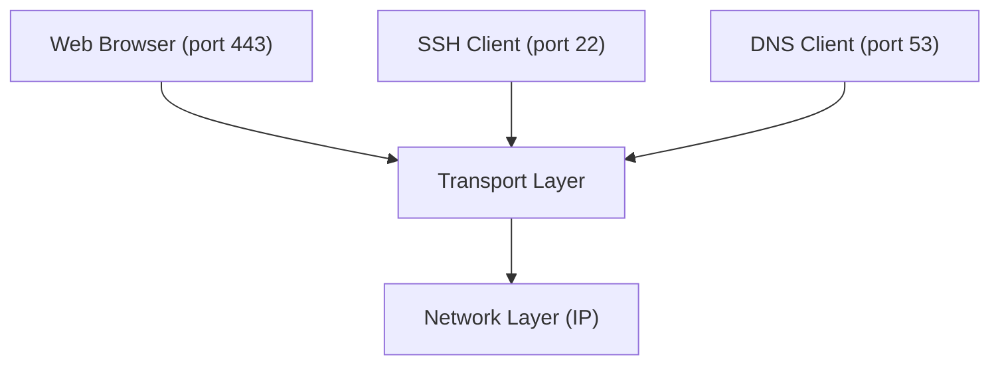
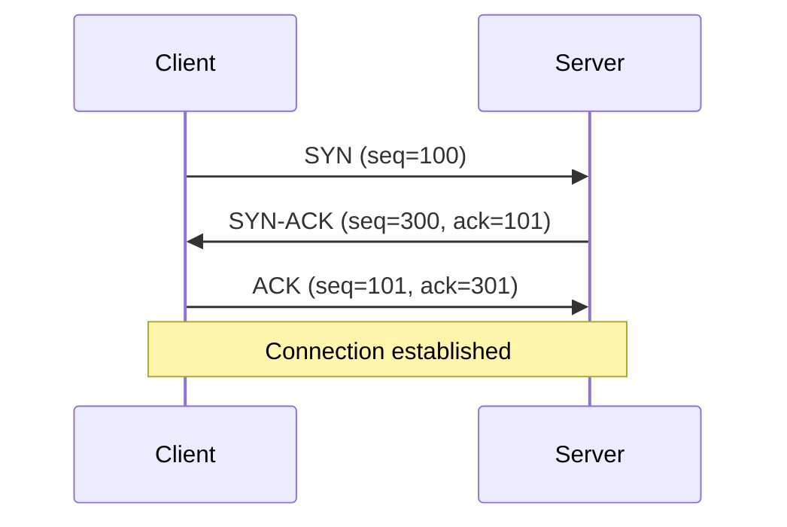
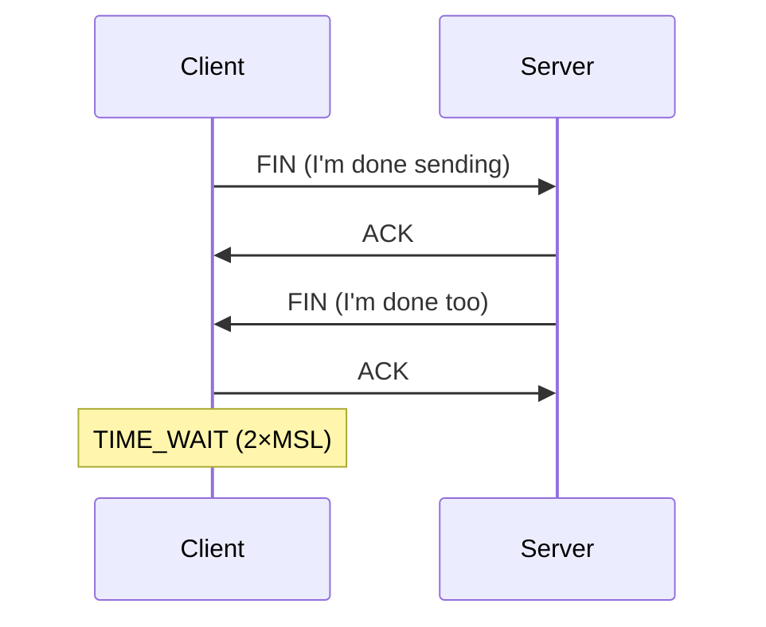
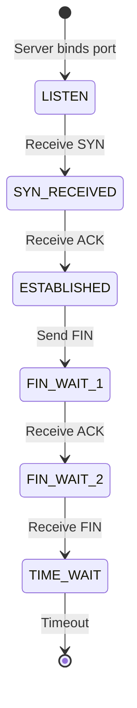

## Role of the Transport Layer

The transport layer provides **end-to-end communication** between applications on different hosts. It multiplexes connections using ports and (in TCP's case) ensures reliable delivery.



---

## TCP (Transmission Control Protocol)

Reliable, ordered, connection-oriented. Used when every byte must arrive correctly.

### Three-Way Handshake



### TCP Features

| Feature | Mechanism |
|---------|-----------|
| Reliability | Acknowledgments + retransmission |
| Ordering | Sequence numbers |
| Flow control | Sliding window (receiver advertises capacity) |
| Congestion control | Slow start, congestion avoidance, fast retransmit |
| Connection state | SYN → ESTABLISHED → FIN → CLOSED |

### TCP Connection Teardown



**TIME_WAIT:** Client waits ~60s to ensure the final ACK arrives. This is why you see many TIME_WAIT connections on busy servers.

### TCP States



---

## UDP (User Datagram Protocol)

Unreliable, unordered, connectionless — but minimal overhead.

```text
┌──────────┬──────────┬──────────┬──────────┐
│ Src Port │ Dst Port │  Length  │ Checksum │  ← 8 bytes total
└──────────┴──────────┴──────────┴──────────┘
│              Payload                        │
└─────────────────────────────────────────────┘
```

No handshake, no acknowledgment, no retransmission, no ordering.

---

## TCP vs UDP Comparison

| Feature | TCP | UDP |
|---------|-----|-----|
| Connection | Yes (handshake) | No |
| Reliability | Guaranteed delivery | Best-effort |
| Ordering | Guaranteed | No |
| Header size | 20-60 bytes | 8 bytes |
| Speed | Slower (overhead) | Faster |
| Flow control | Yes | No |
| Congestion control | Yes | No |

### When to Use Each

| Use TCP | Use UDP |
|---------|---------|
| Web (HTTP/HTTPS) | DNS queries |
| Email (SMTP, IMAP) | Video/audio streaming |
| File transfer (FTP, SCP) | Online gaming |
| Database connections | VoIP |
| SSH | DHCP |
| APIs (REST, gRPC) | IoT telemetry |

---

## Ports

Ports identify specific applications on a host (0-65535):

| Range | Name | Purpose |
|-------|------|---------|
| 0-1023 | Well-known | System services (requires root) |
| 1024-49151 | Registered | Application services |
| 49152-65535 | Ephemeral | Client-side (auto-assigned) |

### Common Ports

| Port | Protocol | Service |
|------|----------|---------|
| 22 | TCP | SSH |
| 25 | TCP | SMTP |
| 53 | TCP/UDP | DNS |
| 80 | TCP | HTTP |
| 443 | TCP | HTTPS |
| 3306 | TCP | MySQL |
| 5432 | TCP | PostgreSQL |
| 6379 | TCP | Redis |
| 8080 | TCP | HTTP (alternate) |
| 8443 | TCP | HTTPS (alternate) |

### Socket = IP + Port

A connection is uniquely identified by a 5-tuple:

```text
(Protocol, Source IP, Source Port, Destination IP, Destination Port)
(TCP, 192.168.1.10, 52431, 93.184.216.34, 443)
```

---

## TCP Performance Considerations

### Window Size and Throughput

```text
Throughput ≤ Window Size / Round-Trip Time

Example: 64KB window, 100ms RTT
  64KB / 0.1s = 640 KB/s (only 5 Mbps!)
```

TCP Window Scaling (RFC 1323) allows windows up to 1GB.

### Nagle's Algorithm

Buffers small writes to reduce packet count. Can cause latency for interactive protocols — disable with `TCP_NODELAY`.

### Keep-Alive

Detects dead connections by sending periodic probes:

```text
Client ←→ Server
         [no data for 2 hours]
Client → Keep-alive probe
Server → ACK (still alive)
```

---

## Troubleshooting

```bash
# Check listening ports
ss -tlnp                    # TCP listening, with process
ss -ulnp                    # UDP listening

# Check established connections
ss -tnp                     # TCP connections with process

# Check for TIME_WAIT accumulation
ss -s                       # summary statistics

# Test port connectivity
nc -zv host 443             # TCP connect test
nc -zu host 53              # UDP test
```

---

## Key Takeaways

1. **TCP = reliable** (web, APIs, databases), **UDP = fast** (DNS, streaming, gaming)
2. **Three-way handshake** establishes TCP connections (SYN → SYN-ACK → ACK)
3. **Ports** identify applications — know the common ones (22, 80, 443, 5432)
4. **TIME_WAIT is normal** — it ensures clean connection closure
5. **A socket is IP:Port** — the 5-tuple uniquely identifies a connection
6. **`ss -tlnp`** is your go-to for checking what's listening
