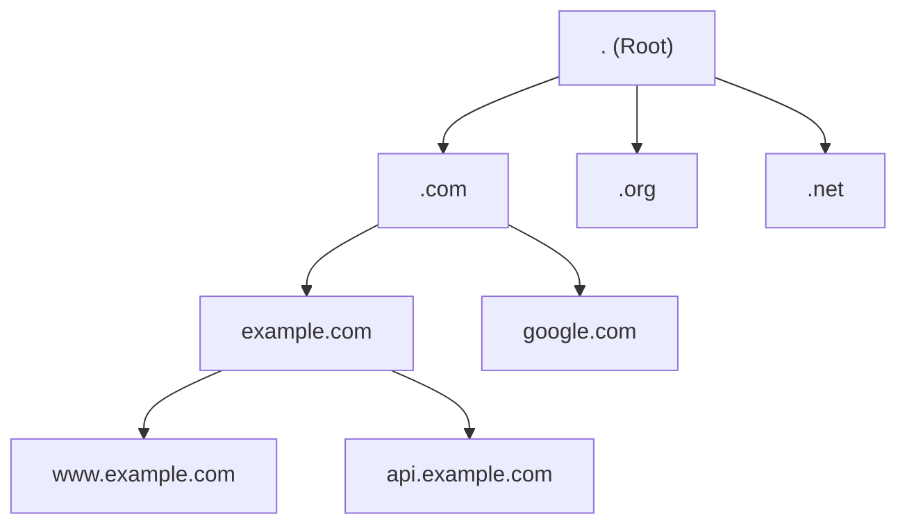
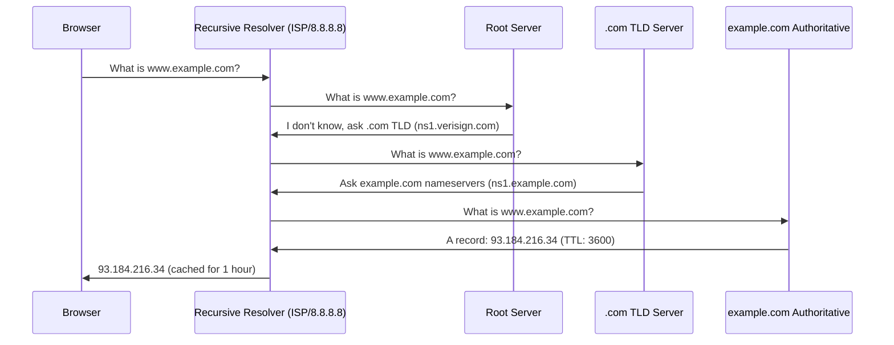

## What is DNS?

DNS translates human-readable domain names into IP addresses. It's a distributed, hierarchical database — the "phone book" of the internet.


Without DNS, you'd need to memorize IP addresses for every website.

---

## DNS Hierarchy



| Level | Example | Managed By |
|-------|---------|-----------|
| Root | `.` | ICANN (13 root server clusters) |
| TLD | `.com`, `.org`, `.io` | Registry operators |
| Domain | `example.com` | Domain owner |
| Subdomain | `www.example.com` | Domain owner |

---

## DNS Resolution Process



### Resolver Types

| Type | Role | Example |
|------|------|---------|
| Stub resolver | Client's local DNS (asks recursive) | Your OS |
| Recursive resolver | Does the full lookup | 8.8.8.8, 1.1.1.1, ISP DNS |
| Authoritative | Holds the actual records | ns1.example.com |

---

## DNS Record Types

| Type | Purpose | Example |
|------|---------|---------|
| **A** | IPv4 address | `example.com → 93.184.216.34` |
| **AAAA** | IPv6 address | `example.com → 2606:2800:220:1:...` |
| **CNAME** | Alias to another name | `www.example.com → example.com` |
| **MX** | Mail server | `example.com → mail.example.com (pri 10)` |
| **TXT** | Arbitrary text | SPF, DKIM, domain verification |
| **NS** | Nameserver delegation | `example.com → ns1.example.com` |
| **SOA** | Zone authority metadata | Serial, refresh, retry, expire |
| **SRV** | Service location | `_http._tcp.example.com → web:8080` |
| **PTR** | Reverse DNS (IP → name) | `34.216.184.93 → example.com` |
| **CAA** | Certificate authority authorization | Which CAs can issue certs |

### CNAME Rules

- Cannot coexist with other records at the same name
- Cannot be used at the zone apex (`example.com`) — only subdomains
- AWS Route 53 "Alias" records solve the apex limitation

---

## TTL (Time To Live)

How long resolvers cache a record (in seconds):

| TTL | Duration | Use Case |
|-----|----------|----------|
| 60 | 1 minute | During migrations, failover |
| 300 | 5 minutes | Dynamic services |
| 3600 | 1 hour | Standard websites |
| 86400 | 1 day | Stable infrastructure |

**Lower TTL** = faster propagation of changes, but more DNS queries (higher load).

**Migration pattern:** Lower TTL days before a change, make the change, verify, then raise TTL back.

---

## DNS Caching Layers

```text
Browser cache (seconds) → OS cache (minutes) → Router → Recursive resolver (TTL) → Authoritative
```

```bash
# Flush DNS cache
# macOS
sudo dscacheutil -flushcache; sudo killall -HUP mDNSResponder

# Linux (systemd-resolved)
sudo systemd-resolve --flush-caches

# Windows
ipconfig /flushdns
```

---

## DNS Tools

### dig — The Standard DNS Tool

```bash
# Basic query
dig example.com

# Specific record type
dig example.com MX
dig example.com TXT

# Query specific resolver
dig @8.8.8.8 example.com

# Short output
dig +short example.com

# Trace full resolution path
dig +trace example.com

# Reverse lookup
dig -x 93.184.216.34
```

### nslookup (simpler, cross-platform)

```bash
nslookup example.com
nslookup -type=MX example.com
nslookup example.com 8.8.8.8
```

---

## DNS Security

| Threat | Description | Mitigation |
|--------|-------------|-----------|
| DNS spoofing | Fake responses redirect traffic | DNSSEC |
| DNS cache poisoning | Corrupt resolver cache | DNSSEC, randomized ports |
| DNS tunneling | Exfiltrate data via DNS queries | Monitor query patterns |
| DDoS via DNS | Amplification attacks | Rate limiting, anycast |

### DNSSEC

Adds cryptographic signatures to DNS records — resolvers can verify authenticity:

```text
example.com.  A     93.184.216.34
example.com.  RRSIG A  (signature proving the A record is authentic)
```

---

## DNS in Cloud (AWS Route 53)

| Feature | Purpose |
|---------|---------|
| Hosted zones | Manage DNS records for your domains |
| Alias records | Point to AWS resources (ALB, CloudFront, S3) at zone apex |
| Health checks | Monitor endpoints, failover on failure |
| Routing policies | Simple, weighted, latency, geolocation, failover |
| Private hosted zones | DNS resolution within VPCs only |

---

## Key Takeaways

1. **DNS is hierarchical** — root → TLD → authoritative
2. **A records** map names to IPs; **CNAME** creates aliases
3. **TTL controls caching** — lower before changes, raise after
4. **`dig +short`** for quick lookups, **`dig +trace`** for debugging
5. **DNS is often the first thing to check** when "the site is down"
6. **Propagation isn't instant** — TTL determines how fast changes spread
