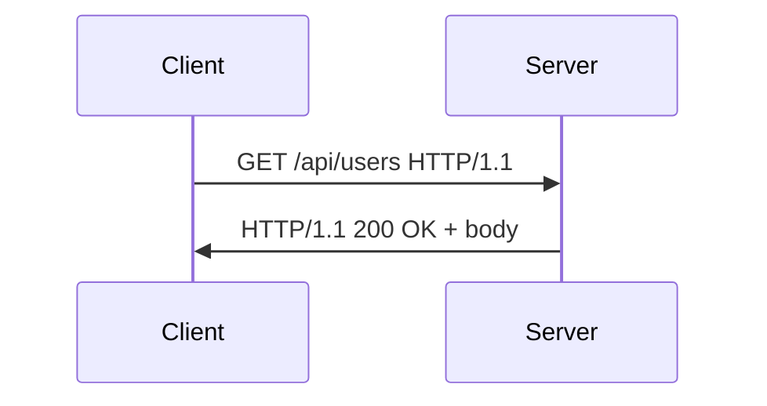
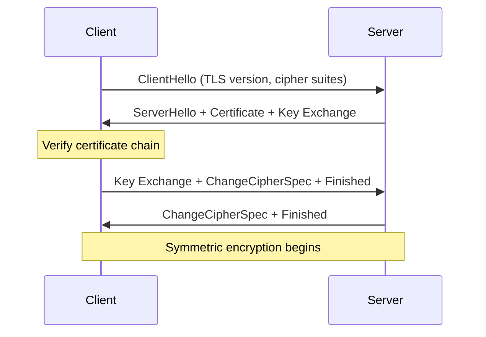
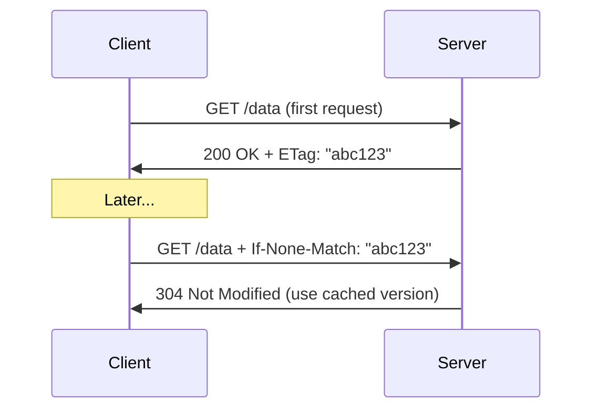
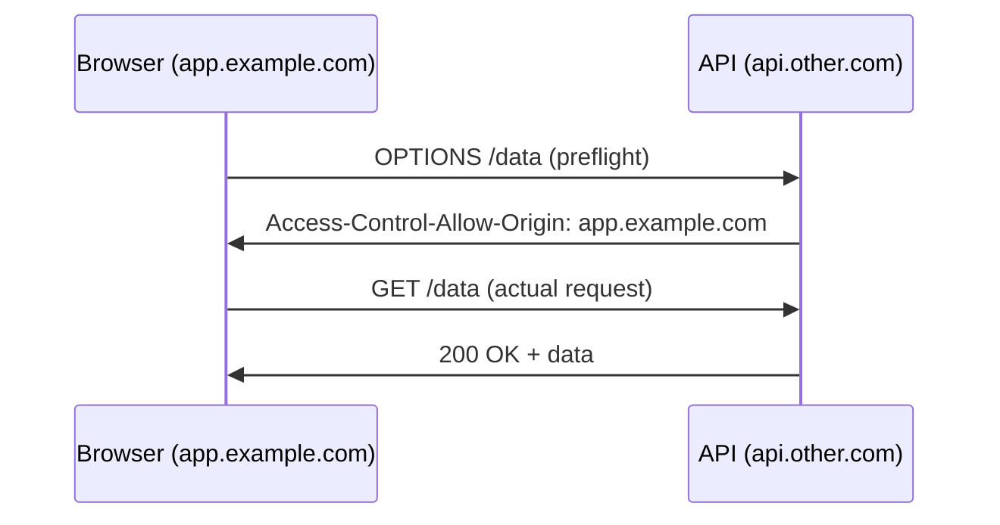

## What is HTTP?

HTTP (HyperText Transfer Protocol) is the application-layer protocol for the web. It's a request-response protocol — a client sends a request, a server returns a response.



---

## HTTP Request Structure

```text
GET /api/users?page=1 HTTP/1.1       ← Request line
Host: api.example.com                 ← Headers
Authorization: Bearer eyJhbG...
Accept: application/json
                                      ← Empty line (end of headers)
                                      ← Body (for POST/PUT)
```

### HTTP Methods

| Method | Purpose | Idempotent | Safe | Has Body |
|--------|---------|:---:|:---:|:---:|
| GET | Retrieve resource | ✅ | ✅ | No |
| POST | Create resource | ❌ | ❌ | Yes |
| PUT | Replace resource entirely | ✅ | ❌ | Yes |
| PATCH | Partial update | ❌ | ❌ | Yes |
| DELETE | Remove resource | ✅ | ❌ | Optional |
| HEAD | Get headers only (no body) | ✅ | ✅ | No |
| OPTIONS | Get allowed methods (CORS preflight) | ✅ | ✅ | No |

**Idempotent:** Multiple identical requests have the same effect as one.
**Safe:** Doesn't modify server state.

---

## HTTP Response Structure

```text
HTTP/1.1 200 OK                       ← Status line
Content-Type: application/json        ← Headers
Cache-Control: max-age=3600
Content-Length: 1234
                                      ← Empty line
{"users": [...]}                      ← Body
```

### Status Codes

| Range | Category | Key Codes |
|-------|----------|-----------|
| **1xx** | Informational | 101 Switching Protocols (WebSocket) |
| **2xx** | Success | 200 OK, 201 Created, 204 No Content |
| **3xx** | Redirection | 301 Moved Permanently, 302 Found, 304 Not Modified |
| **4xx** | Client Error | 400 Bad Request, 401 Unauthorized, 403 Forbidden, 404 Not Found, 429 Too Many Requests |
| **5xx** | Server Error | 500 Internal Server Error, 502 Bad Gateway, 503 Service Unavailable, 504 Gateway Timeout |

### Important Distinctions

| Code | Meaning |
|------|---------|
| 401 | Not authenticated (who are you?) |
| 403 | Not authorized (you can't do this) |
| 502 | Upstream server returned invalid response |
| 503 | Server overloaded or in maintenance |
| 504 | Upstream server didn't respond in time |

---

## Headers

### Common Request Headers

| Header | Purpose | Example |
|--------|---------|---------|
| Host | Target server | `api.example.com` |
| Authorization | Credentials | `Bearer eyJhbG...` |
| Content-Type | Body format | `application/json` |
| Accept | Desired response format | `application/json` |
| User-Agent | Client identifier | `Mozilla/5.0...` |
| Cookie | Session data | `session_id=abc123` |

### Common Response Headers

| Header | Purpose | Example |
|--------|---------|---------|
| Content-Type | Body format | `application/json; charset=utf-8` |
| Cache-Control | Caching rules | `max-age=3600, public` |
| Set-Cookie | Set client cookie | `session_id=abc; HttpOnly; Secure` |
| Location | Redirect target | `https://example.com/new-path` |
| X-Request-Id | Request tracing | `req-abc-123-def` |

---

## HTTPS and TLS

HTTPS = HTTP over TLS. Provides:

- **Encryption** — data can't be read in transit
- **Integrity** — data can't be modified in transit
- **Authentication** — server proves its identity via certificate

### TLS Handshake (Simplified)



### Certificate Chain

```text
Root CA (trusted by OS/browser)
  └── Intermediate CA
        └── Server Certificate (example.com)
```

The client verifies the chain up to a trusted root CA.

---

## HTTP Versions

| Feature | HTTP/1.1 | HTTP/2 | HTTP/3 |
|---------|----------|--------|--------|
| Year | 1997 | 2015 | 2022 |
| Transport | TCP | TCP | QUIC (UDP) |
| Multiplexing | No (1 req per connection) | Yes (streams) | Yes |
| Header compression | No | HPACK | QPACK |
| Server push | No | Yes | Yes |
| Head-of-line blocking | Yes | At TCP level | No |
| Connection setup | TCP + TLS (2-3 RTT) | Same | 0-1 RTT |

### HTTP/2 Key Improvement

Multiple requests share one TCP connection via streams — eliminates the need for multiple connections:

```text
HTTP/1.1: 6 parallel connections needed
  Conn 1: GET /style.css
  Conn 2: GET /script.js
  Conn 3: GET /image.png
  ...

HTTP/2: 1 connection, multiplexed
  Stream 1: GET /style.css
  Stream 2: GET /script.js
  Stream 3: GET /image.png
  (all interleaved on same connection)
```

---

## Caching

### Cache-Control Header

```text
Cache-Control: public, max-age=3600        # CDN + browser cache for 1h
Cache-Control: private, max-age=600        # Browser only, 10 min
Cache-Control: no-cache                    # Must revalidate before using
Cache-Control: no-store                    # Never cache (sensitive data)
```

### Conditional Requests



---

## CORS (Cross-Origin Resource Sharing)

Browsers block requests from one origin to another unless the server explicitly allows it:



---

## Key Takeaways

1. **HTTP is stateless** — each request is independent (cookies/tokens add state)
2. **Know your status codes** — 2xx success, 4xx client error, 5xx server error
3. **HTTPS is mandatory** — TLS provides encryption + integrity + authentication
4. **HTTP/2 multiplexes** — one connection, many parallel requests
5. **Cache-Control** determines caching behavior — critical for performance
6. **CORS** is a browser security mechanism — servers must opt in
