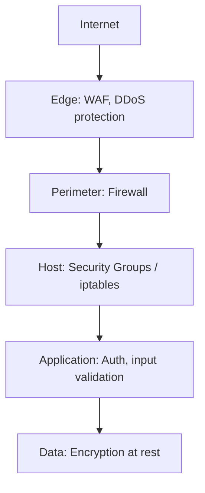
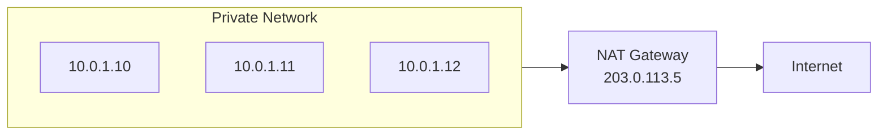
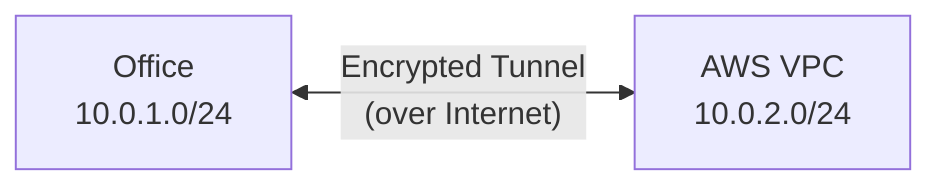
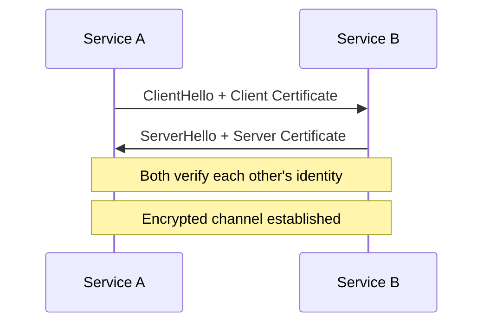
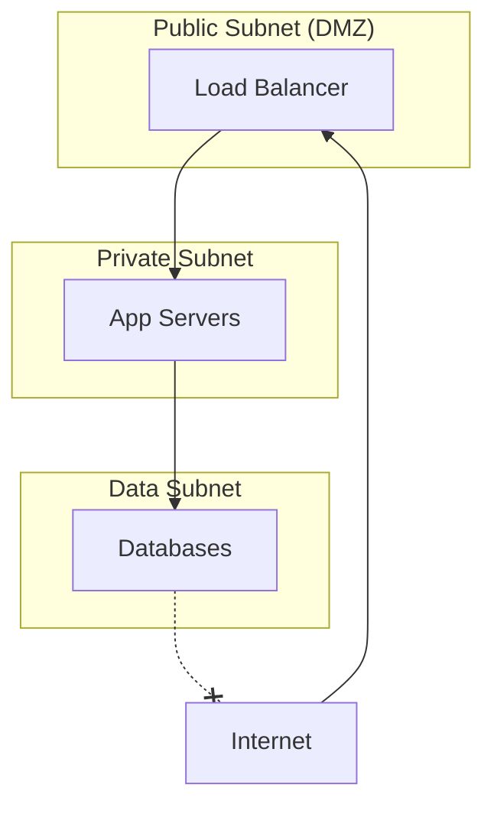

## Defense in Depth

Network security uses multiple layers — if one fails, others still protect:



---

## Firewalls

### Types

| Type | Layer | What It Inspects | Example |
|------|-------|-----------------|---------|
| Packet filter | 3-4 | IP, port, protocol | iptables, ACLs |
| Stateful | 3-4 | Connection state + packets | AWS Security Groups |
| Application (WAF) | 7 | HTTP content, patterns | AWS WAF, Cloudflare |
| Next-gen (NGFW) | 3-7 | Deep packet inspection | Palo Alto, Fortinet |

### Stateful vs Stateless

| Aspect | Stateless (NACLs) | Stateful (Security Groups) |
|--------|-------------------|---------------------------|
| Tracks connections | No | Yes |
| Return traffic | Must explicitly allow | Automatically allowed |
| Rule evaluation | All rules, in order | All rules, most permissive wins |
| Use case | Subnet-level control | Instance-level control |

### Security Group Example (AWS)

```text
Inbound Rules:
  Allow TCP 443 from 0.0.0.0/0        (HTTPS from anywhere)
  Allow TCP 22 from 10.0.0.0/16       (SSH from VPC only)

Outbound Rules:
  Allow All traffic to 0.0.0.0/0       (default — allow all outbound)
```

**Principle of least privilege:** Only open ports that are needed, only from sources that need access.

---

## NAT (Network Address Translation)

Allows private IPs to communicate with the internet through a shared public IP:



### NAT Types

| Type | Direction | Use Case |
|------|-----------|----------|
| SNAT (Source NAT) | Outbound | Private hosts access internet |
| DNAT (Destination NAT) | Inbound | Port forwarding to internal servers |
| PAT (Port Address Translation) | Outbound | Many-to-one (most common) |

In AWS: **NAT Gateway** provides SNAT for private subnets.

---

## VPN (Virtual Private Network)

Encrypted tunnel over public internet — extends a private network:



### VPN Types

| Type | Use Case | Protocol |
|------|----------|----------|
| Site-to-Site | Connect two networks | IPsec |
| Client VPN | Remote worker access | OpenVPN, WireGuard |
| AWS VPN | Connect on-premises to VPC | IPsec over Internet |
| Direct Connect | Dedicated private link (not VPN) | Physical fiber |

---

## TLS/SSL

Encrypts data in transit between client and server (covered in detail in HTTP/HTTPS section).

### mTLS (Mutual TLS)

Both sides present certificates — used for service-to-service communication:



Use cases: microservice mesh, API gateways, zero-trust networks.

---

## Common Attack Types

| Attack | Layer | Description | Mitigation |
|--------|-------|-------------|-----------|
| DDoS | 3-7 | Overwhelm with traffic | WAF, rate limiting, CDN |
| SYN flood | 4 | Exhaust TCP connection table | SYN cookies, rate limiting |
| DNS amplification | 7 | Reflect/amplify via DNS | Rate limiting, BCP38 |
| Man-in-the-middle | 4-7 | Intercept communications | TLS, certificate pinning |
| Port scanning | 4 | Discover open services | Firewall, IDS |
| ARP spoofing | 2 | Redirect local traffic | DAI, static ARP |

---

## Network Segmentation

Isolate workloads to limit blast radius:



| Zone | Access | Contains |
|------|--------|----------|
| Public (DMZ) | Internet-facing | Load balancers, bastion hosts |
| Private | Internal only | Application servers |
| Data | Highly restricted | Databases, caches |

---

## Zero Trust

Traditional: "Trust everything inside the network perimeter."
Zero Trust: "Never trust, always verify."

| Principle | Implementation |
|-----------|---------------|
| Verify identity | mTLS, OAuth tokens for every request |
| Least privilege | Minimal permissions per service |
| Assume breach | Encrypt everything, log everything |
| Micro-segmentation | Per-service security groups |

---

## Key Takeaways

1. **Defense in depth** — multiple layers, not a single firewall
2. **Least privilege** — only open what's needed, from where it's needed
3. **Stateful firewalls** (Security Groups) track connections automatically
4. **NAT** hides private IPs behind a public IP
5. **TLS everywhere** — encrypt all traffic, even internal
6. **Segment networks** — public, private, data zones with strict boundaries
7. **Zero trust** — verify every request regardless of network location
