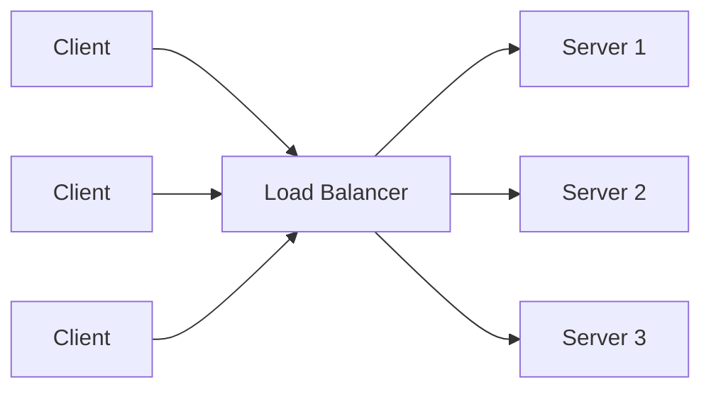
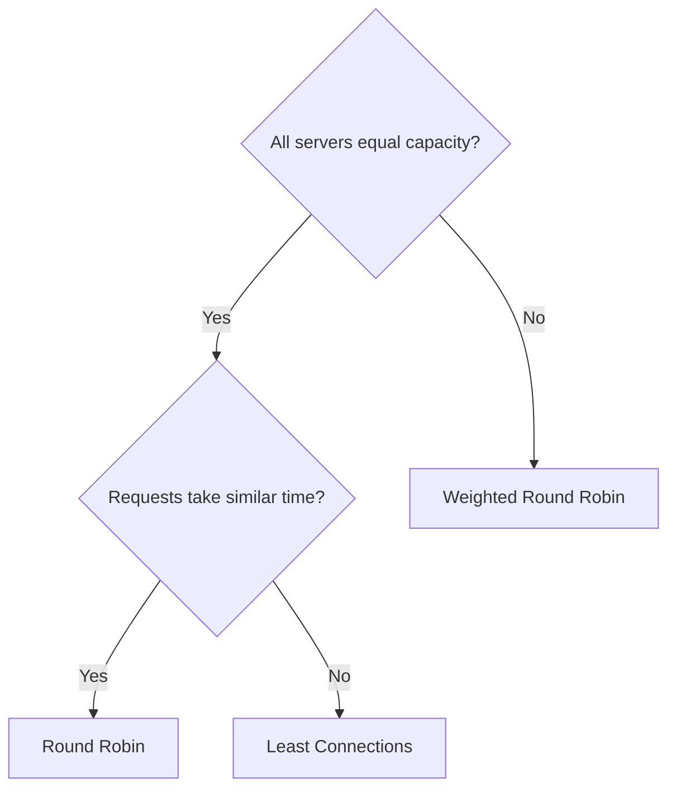
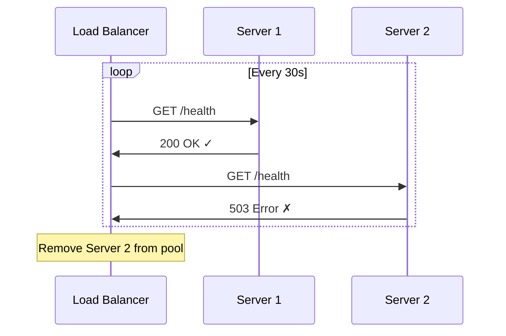
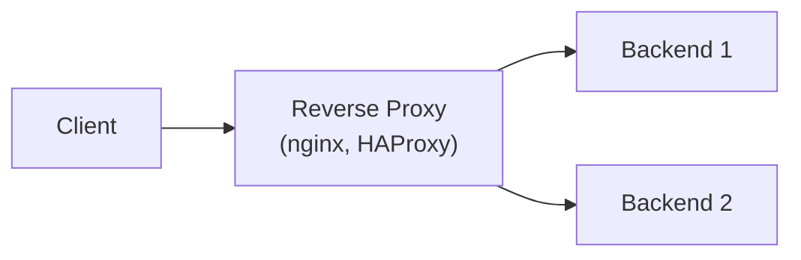

## Why Load Balance?

A single server has finite capacity. Load balancing distributes traffic across multiple servers to achieve:

- **High availability** — if one server fails, others handle traffic
- **Scalability** — add servers to handle more load
- **Performance** — distribute work evenly



---

## Load Balancing Algorithms

| Algorithm | How It Works | Best For |
|-----------|-------------|----------|
| Round Robin | Rotate sequentially | Equal-capacity servers |
| Weighted Round Robin | Rotate with weights (2:1:1) | Mixed-capacity servers |
| Least Connections | Send to server with fewest active connections | Variable request duration |
| Least Response Time | Send to fastest-responding server | Heterogeneous backends |
| IP Hash | Hash client IP → consistent server | Session affinity without cookies |
| Random | Random selection | Simple, effective at scale |

### Choosing an Algorithm



---

## Layer 4 vs Layer 7 Load Balancing

| Aspect | Layer 4 (Transport) | Layer 7 (Application) |
|--------|--------------------|-----------------------|
| Inspects | IP + Port | HTTP headers, URL, cookies |
| Speed | Faster (less processing) | Slower (deep inspection) |
| Routing decisions | Based on IP/port only | Based on URL path, headers, content |
| TLS termination | Pass-through or terminate | Always terminates |
| Use case | TCP/UDP services, databases | Web applications, APIs |

### Layer 7 Routing Examples

```text
/api/*        → API server pool
/static/*     → CDN or static server pool
/admin/*      → Admin server (restricted)
Host: mobile.* → Mobile-optimized servers
```

---

## AWS Load Balancer Types

| Type | Layer | Protocols | Use Case |
|------|-------|-----------|----------|
| ALB (Application) | 7 | HTTP, HTTPS, gRPC | Web apps, APIs, microservices |
| NLB (Network) | 4 | TCP, UDP, TLS | High performance, static IPs |
| CLB (Classic) | 4/7 | HTTP, TCP | Legacy (avoid for new projects) |

---

## Health Checks

Load balancers must know which backends are healthy:



### Health Check Configuration

| Parameter | Typical Value | Purpose |
|-----------|--------------|---------|
| Path | `/health` or `/healthz` | Endpoint to check |
| Interval | 30s | How often to check |
| Timeout | 5s | Max wait for response |
| Healthy threshold | 3 | Consecutive successes to mark healthy |
| Unhealthy threshold | 2 | Consecutive failures to mark unhealthy |

### Health Check Best Practices

- Check actual dependencies (database, cache) — not just "process is running"
- Return quickly — don't do expensive operations
- Separate liveness (is the process alive?) from readiness (can it serve traffic?)

---

## Reverse Proxy

A reverse proxy sits in front of servers and handles client requests on their behalf:



### Functions Beyond Load Balancing

| Function | Benefit |
|----------|---------|
| TLS termination | Backends don't handle encryption |
| Caching | Reduce backend load for static content |
| Compression | gzip/brotli responses |
| Rate limiting | Protect backends from abuse |
| Request routing | Path-based routing to different services |
| Header manipulation | Add/remove/modify headers |
| Connection pooling | Reuse backend connections |

---

## Session Persistence (Sticky Sessions)

Some applications need the same client to reach the same server:

| Method | How | Trade-off |
|--------|-----|-----------|
| Cookie-based | LB sets a cookie with server ID | Requires cookie support |
| IP hash | Hash client IP to server | Breaks with NAT/proxies |
| Application-managed | Externalize session (Redis) | Best — no stickiness needed |

**Best practice:** Externalize session state (Redis, DynamoDB) so any server can handle any request. Avoid sticky sessions when possible.

---

## High Availability Patterns

### Active-Active

All servers handle traffic simultaneously:

```text
LB → Server 1 (active)
   → Server 2 (active)
   → Server 3 (active)
```

### Active-Passive (Failover)

Standby takes over when primary fails:

```text
LB → Server 1 (active) ← handles all traffic
   → Server 2 (standby) ← takes over on failure
```

### Multi-AZ

Distribute across availability zones for datacenter-level resilience:

```text
AZ-a: Server 1, Server 2
AZ-b: Server 3, Server 4
LB distributes across both AZs
```

---

## Key Takeaways

1. **Round Robin** for simple cases, **Least Connections** for variable workloads
2. **Layer 7 (ALB)** for HTTP routing, **Layer 4 (NLB)** for raw TCP/UDP performance
3. **Health checks are critical** — unhealthy servers must be removed automatically
4. **Externalize session state** — avoid sticky sessions
5. **Reverse proxies** do more than load balance: TLS, caching, rate limiting
6. **Multi-AZ** for high availability — survive datacenter failures
