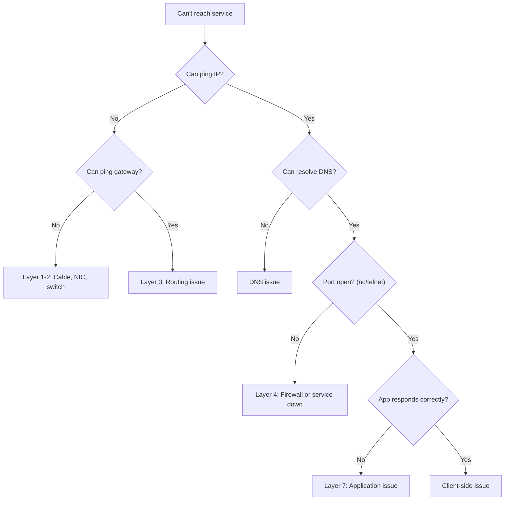

## Systematic Approach

Network troubleshooting follows the layers — start at the bottom and work up:



---

## ping — Basic Connectivity

Tests Layer 3 (IP) reachability using ICMP echo:

```bash
# Basic connectivity test
ping 8.8.8.8                    # test by IP (bypasses DNS)
ping google.com                 # test DNS + connectivity

# Limit packet count
ping -c 4 host                  # send 4 packets and stop

# Set timeout
ping -W 2 host                  # 2-second timeout per packet
```

### Interpreting Results

```text
PING 8.8.8.8: 64 bytes from 8.8.8.8: icmp_seq=1 ttl=118 time=12.3 ms
```

| Field | Meaning |
|-------|---------|
| ttl=118 | Hops remaining (started at 128 → 10 hops) |
| time=12.3 ms | Round-trip time |
| packet loss | % of packets that didn't return |

**Note:** Some hosts block ICMP — no ping response doesn't always mean unreachable.

---

## traceroute — Path Discovery

Shows every router (hop) between you and the destination:

```bash
traceroute google.com           # UDP probes (Linux/macOS)
traceroute -I google.com       # ICMP probes
mtr google.com                  # continuous traceroute (best tool)
```

### Reading traceroute Output

```text
 1  192.168.1.1      1.2 ms    ← your gateway
 2  10.0.0.1         5.3 ms    ← ISP router
 3  * * *                       ← router doesn't respond (filtered)
 4  72.14.232.70    15.2 ms    ← internet backbone
 5  8.8.8.8         12.1 ms    ← destination
```

`* * *` means the router doesn't respond to probes — not necessarily a problem.

---

## dig — DNS Queries

The standard tool for DNS troubleshooting:

```bash
# Query A record
dig example.com

# Specific record type
dig example.com MX
dig example.com NS
dig example.com TXT

# Query specific DNS server
dig @8.8.8.8 example.com

# Short output (just the answer)
dig +short example.com

# Full resolution trace
dig +trace example.com

# Reverse lookup (IP → name)
dig -x 93.184.216.34

# Check if record is cached (show TTL remaining)
dig example.com | grep -A1 "ANSWER SECTION"
```

---

## nc (netcat) — Port Testing

Test if a TCP/UDP port is reachable:

```bash
# TCP port test (connect and disconnect)
nc -zv host 443                 # -z: scan, -v: verbose
nc -zv host 80 443 8080        # multiple ports

# With timeout
nc -zv -w 3 host 5432          # 3-second timeout

# UDP port test
nc -zuv host 53
```

### Output Interpretation

```text
Connection to host port 443 [tcp/https] succeeded!    ← port open
nc: connect to host port 3306: Connection refused     ← port closed
nc: connect to host port 3306: Operation timed out    ← filtered (firewall)
```

---

## curl — HTTP Debugging

```bash
# Basic request
curl https://api.example.com/health

# Verbose (shows TLS handshake, headers)
curl -v https://api.example.com/health

# Just status code
curl -o /dev/null -s -w "%{http_code}\n" URL

# Timing breakdown
curl -o /dev/null -s -w "DNS: %{time_namelookup}s\nConnect: %{time_connect}s\nTLS: %{time_appconnect}s\nTotal: %{time_total}s\n" URL

# Follow redirects
curl -L URL

# Custom headers
curl -H "Authorization: Bearer TOKEN" URL

# POST with JSON body
curl -X POST -H "Content-Type: application/json" -d '{"key":"value"}' URL
```

### Timing Breakdown

```text
DNS:     0.012s    ← DNS resolution
Connect: 0.045s    ← TCP handshake
TLS:     0.120s    ← TLS handshake
Total:   0.250s    ← Full request
```

If DNS is slow → DNS server issue. If Connect is slow → network latency. If TLS is slow → certificate chain or cipher negotiation.

---

## ss / netstat — Local Network State

```bash
# Listening TCP ports with process name
ss -tlnp

# All TCP connections
ss -tnp

# UDP listeners
ss -ulnp

# Connection summary (states count)
ss -s

# Filter by state
ss state established
ss state time-wait

# Filter by port
ss -tn sport = :443
ss -tn dport = :5432
```

---

## tcpdump — Packet Capture

When you need to see actual packets on the wire:

```bash
# Capture HTTP traffic
tcpdump -i eth0 port 80

# Capture traffic to/from specific host
tcpdump -i any host 10.0.1.5

# Capture DNS queries
tcpdump -i any port 53

# Save to file (open in Wireshark)
tcpdump -i eth0 -w capture.pcap

# Read saved capture
tcpdump -r capture.pcap

# Show packet contents (ASCII)
tcpdump -A -i eth0 port 80

# Limit capture count
tcpdump -c 100 -i eth0 port 443
```

---

## Quick Reference: Which Tool When

| Symptom | First Tool | What to Check |
|---------|-----------|---------------|
| "Site is down" | `curl -v` | HTTP response, status code |
| "Can't connect" | `ping` then `nc -zv` | IP reachability, port open |
| "Slow response" | `curl -w` timing | Which phase is slow |
| "DNS not resolving" | `dig +short` | Record exists, correct value |
| "Intermittent failures" | `mtr` | Packet loss at specific hop |
| "Connection refused" | `ss -tlnp` | Is the service listening? |
| "Weird behavior" | `tcpdump` | What's actually on the wire |

---

## Key Takeaways

1. **Troubleshoot bottom-up:** ping → DNS → port → application
2. **`ping`** tests IP connectivity (but ICMP may be blocked)
3. **`dig +short`** for quick DNS checks, **`dig +trace`** for full debugging
4. **`nc -zv`** tests if a port is open (faster than telnet)
5. **`curl -v`** shows the full HTTP conversation including TLS
6. **`ss -tlnp`** shows what's listening on your server
7. **`tcpdump`** is the last resort — shows raw packets
