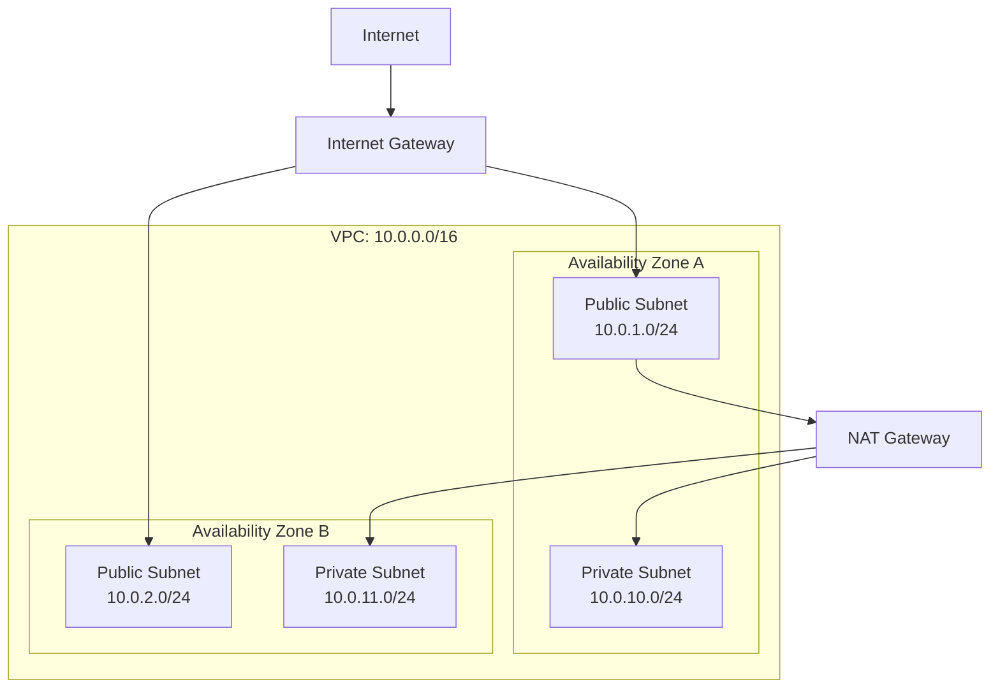
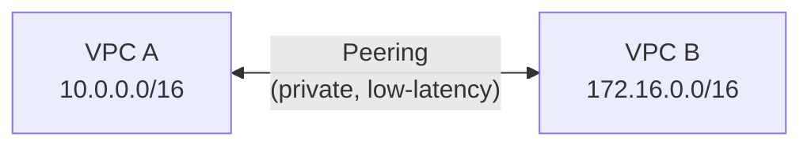
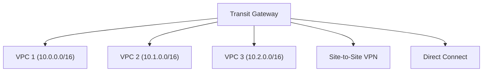
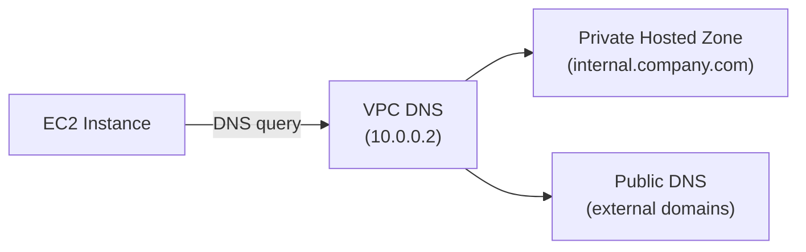

## From Physical to Virtual

Cloud networking uses the same concepts as physical networking (subnets, routing, firewalls) but everything is software-defined and API-driven.

| Physical | Cloud Equivalent |
|----------|-----------------|
| Router | Route table |
| Firewall | Security group / NACL |
| Switch/VLAN | Subnet |
| NAT device | NAT Gateway |
| Physical network | VPC |
| Leased line | Direct Connect |
| VPN appliance | VPN Gateway |

---

## VPC (Virtual Private Cloud)

An isolated virtual network within a cloud provider's infrastructure:



### VPC Design Decisions

| Decision | Recommendation |
|----------|---------------|
| CIDR size | /16 (65K IPs) — room to grow |
| Subnet size | /24 (251 usable in AWS) per AZ per tier |
| AZ count | Minimum 2 for high availability |
| Tiers | Public, Private, Data (3 tiers) |

### Public vs Private Subnets

| Aspect | Public Subnet | Private Subnet |
|--------|--------------|----------------|
| Route to internet | Via Internet Gateway | Via NAT Gateway |
| Inbound from internet | Yes (if SG allows) | No |
| Public IP | Auto-assigned or Elastic IP | None |
| Contains | Load balancers, bastion hosts | App servers, databases |

---

## Route Tables

Every subnet has an associated route table:

```text
Public Subnet Route Table:
  Destination     Target
  10.0.0.0/16     local           ← within VPC
  0.0.0.0/0       igw-abc123      ← internet via IGW

Private Subnet Route Table:
  Destination     Target
  10.0.0.0/16     local           ← within VPC
  0.0.0.0/0       nat-xyz789      ← internet via NAT (outbound only)
```

---

## Security: Security Groups vs NACLs

| Feature | Security Group | NACL |
|---------|---------------|------|
| Level | Instance (ENI) | Subnet |
| State | Stateful (return traffic auto-allowed) | Stateless (must allow both directions) |
| Rules | Allow only | Allow and Deny |
| Evaluation | All rules (most permissive wins) | Rules in order (first match) |
| Default | Deny all inbound, allow all outbound | Allow all |

### Typical Security Group Setup

```text
Web Server SG:
  Inbound:  TCP 443 from 0.0.0.0/0 (HTTPS)
  Inbound:  TCP 80 from 0.0.0.0/0 (HTTP)
  
App Server SG:
  Inbound:  TCP 8080 from Web-Server-SG (only from LB)
  
Database SG:
  Inbound:  TCP 5432 from App-Server-SG (only from app)
```

**Key pattern:** Reference security groups by ID, not CIDR — this way, rules adapt as instances scale.

---

## VPC Connectivity

### VPC Peering

Direct connection between two VPCs:



- Non-transitive: A↔B and B↔C does NOT mean A↔C
- CIDRs must not overlap
- Can peer across accounts and regions

### Transit Gateway

Hub-and-spoke for connecting many VPCs:



- Transitive: all attached VPCs can communicate
- Centralized routing and security
- Scales to thousands of VPCs

### When to Use What

| Scenario | Solution |
|----------|----------|
| 2-3 VPCs need to talk | VPC Peering |
| Many VPCs + on-premises | Transit Gateway |
| Dedicated private link to AWS | Direct Connect |
| Encrypted tunnel over internet | Site-to-Site VPN |

---

## VPC Endpoints

Access AWS services without traversing the internet:

| Type | Services | How It Works | Cost |
|------|----------|-------------|------|
| Gateway | S3, DynamoDB | Route table entry | Free |
| Interface | All others (SQS, SNS, etc.) | ENI in your subnet | Per-hour + per-GB |

### Why Use Endpoints?

- **Security** — traffic stays on AWS backbone (never touches internet)
- **Performance** — lower latency, no NAT Gateway bottleneck
- **Cost** — no NAT Gateway data processing charges for AWS API calls

---

## DNS in VPCs

### Route 53 Resolver



- VPC DNS is always at VPC CIDR + 2 (e.g., 10.0.0.2)
- **Private Hosted Zones** resolve only within associated VPCs
- **Resolver Endpoints** forward DNS between VPC and on-premises

---

## Network Architecture Patterns

### Three-Tier Architecture

```text
Internet → ALB (public subnet) → App (private subnet) → DB (private subnet)
```

### Service Mesh

```text
Service A ←→ Sidecar Proxy ←→ Sidecar Proxy ←→ Service B
                    (mTLS, observability, routing)
```

### Hub-and-Spoke

```text
Shared Services VPC (hub)
  ├── Workload VPC 1 (spoke)
  ├── Workload VPC 2 (spoke)
  └── On-premises (spoke via VPN/DX)
```

---

## Key Takeaways

1. **VPC = your isolated network** — design CIDR carefully (can't change later)
2. **Public subnets** have IGW route; **private subnets** use NAT for outbound
3. **Security Groups are stateful** — prefer them over NACLs for instance-level control
4. **Reference SGs by ID** in rules — scales with auto-scaling groups
5. **VPC Peering** for few VPCs, **Transit Gateway** for many
6. **VPC Endpoints** save cost and improve security for AWS service access
7. **Multi-AZ** is the minimum for production — survive AZ failures
