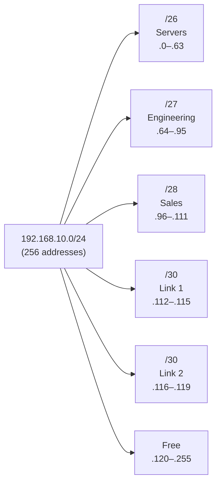
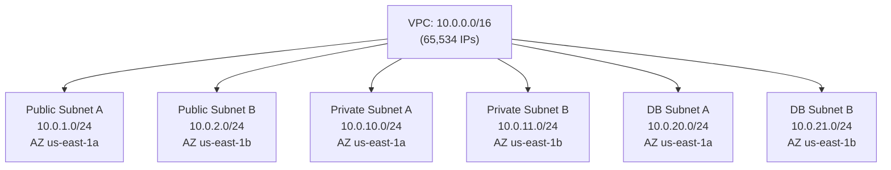

## What Is Subnetting?

Subnetting divides a large IP network into smaller, logical sub-networks. It's one of the most fundamental skills in networking — every network engineer, cloud architect, and system administrator must understand it fluently.

### Why Subnet?

| Reason | Explanation |
|--------|-------------|
| **Reduce broadcast domains** | Fewer hosts receiving every broadcast = less noise, better performance |
| **Improve security** | Isolate sensitive systems (databases, management) from general traffic |
| **Efficient IP allocation** | Don't waste a /16 (65,534 hosts) when you only need 30 |
| **Routing efficiency** | Smaller, summarizable networks reduce routing table size |
| **Organizational structure** | Map network topology to departments, floors, functions |

---

## IP Address Structure

An IPv4 address is 32 bits, written as four octets in dotted-decimal:

```
192.168.1.100
 ↓       ↓
Network  Host
portion  portion
```

The **subnet mask** determines where the network portion ends and the host portion begins.

### Binary Representation

```
IP:     192.168.1.100
Binary: 11000000.10101000.00000001.01100100

Mask:   255.255.255.0
Binary: 11111111.11111111.11111111.00000000
        ←——— Network (24 bits) ———→←Host→
```

**The mask is always a contiguous block of 1s followed by a contiguous block of 0s.** There are no gaps.

---

## CIDR Notation (Classless Inter-Domain Routing)

CIDR replaced the old classful system (Class A/B/C). The notation `/n` means the first `n` bits are the network portion:

```
192.168.1.0/24

/24 means:  11111111.11111111.11111111.00000000
            ←—— 24 bits = network ——→←8 = host→
```

### CIDR Quick Reference

| CIDR | Subnet Mask | Total IPs | Usable Hosts | Common Name |
|------|-------------|-----------|--------------|-------------|
| /32 | 255.255.255.255 | 1 | 0 | Host route |
| /31 | 255.255.255.254 | 2 | 2* | Point-to-point link |
| /30 | 255.255.255.252 | 4 | 2 | Point-to-point |
| /29 | 255.255.255.248 | 8 | 6 | Tiny subnet |
| /28 | 255.255.255.240 | 16 | 14 | Small subnet |
| /27 | 255.255.255.224 | 32 | 30 | Small office |
| /26 | 255.255.255.192 | 64 | 62 | Medium subnet |
| /25 | 255.255.255.128 | 128 | 126 | Large subnet |
| /24 | 255.255.255.0 | 256 | 254 | Standard LAN |
| /23 | 255.255.254.0 | 512 | 510 | Large LAN |
| /22 | 255.255.252.0 | 1,024 | 1,022 | Campus |
| /21 | 255.255.248.0 | 2,048 | 2,046 | Large campus |
| /20 | 255.255.240.0 | 4,096 | 4,094 | Data center |
| /16 | 255.255.0.0 | 65,536 | 65,534 | Corporate |
| /8 | 255.0.0.0 | 16,777,216 | 16,777,214 | Large ISP |

**/31 is special:** RFC 3021 allows point-to-point links with no network/broadcast address.

### Formula

```
Total addresses = 2^(32 - prefix)
Usable hosts    = 2^(32 - prefix) - 2   (subtract network address and broadcast)
```

---

## Subnet Calculations (Step by Step)

### Given: 10.0.0.0/22 — What's the range?

**Step 1:** Determine host bits = 32 - 22 = 10 bits

**Step 2:** Total addresses = 2^10 = 1,024

**Step 3:** Network address = 10.0.0.0 (all host bits = 0)

**Step 4:** Broadcast address = last address = 10.0.3.255

```
10.0.0.0 in binary:    00001010.00000000.000000|00.00000000
                        ←——— 22 network bits —→←10 host bits→

Network:    00001010.00000000.000000|00.00000000 = 10.0.0.0
Broadcast:  00001010.00000000.000000|11.11111111 = 10.0.3.255
First host: 10.0.0.1
Last host:  10.0.3.254
Usable:     1,022 hosts
```

### The "Magic Number" Shortcut

For subnet calculations in the interesting octet:

```
Magic number = 256 - subnet mask value in that octet
```

**Example:** /22 → mask = 255.255.252.0

The "interesting octet" is the 3rd: 252

Magic number = 256 - 252 = **4**

Subnets in 10.0.0.0/22 increment by 4 in the 3rd octet:
- 10.0.0.0 – 10.0.3.255
- 10.0.4.0 – 10.0.7.255
- 10.0.8.0 – 10.0.11.255
- ...

---

## Subnetting a Network (Dividing Into Smaller Subnets)

### Problem: You have 10.1.0.0/24 and need 4 subnets

**Step 1:** How many bits to borrow? Need 4 subnets → 2^2 = 4, so borrow 2 bits

**Step 2:** New prefix = /24 + 2 = /26

**Step 3:** Each /26 has 2^6 = 64 addresses (62 usable hosts)

**Result:**

| Subnet | Network Address | First Host | Last Host | Broadcast | Usable |
|--------|----------------|------------|-----------|-----------|--------|
| 1 | 10.1.0.0/26 | 10.1.0.1 | 10.1.0.62 | 10.1.0.63 | 62 |
| 2 | 10.1.0.64/26 | 10.1.0.65 | 10.1.0.126 | 10.1.0.127 | 62 |
| 3 | 10.1.0.128/26 | 10.1.0.129 | 10.1.0.190 | 10.1.0.191 | 62 |
| 4 | 10.1.0.192/26 | 10.1.0.193 | 10.1.0.254 | 10.1.0.255 | 62 |

---

## Finding the Subnet of a Given IP

### Problem: What subnet is 172.16.45.200/21 in?

**Step 1:** /21 means the interesting octet is the 3rd (21 = 16 + 5, so 5 bits borrowed from 3rd octet)

**Step 2:** Mask in 3rd octet: 5 bits of network → 11111000 = 248

**Step 3:** Magic number = 256 - 248 = 8

**Step 4:** Subnets increment by 8: ...40, 48, 56...

**Step 5:** 45 falls between 40 and 48, so:
- Network: 172.16.40.0/21
- Broadcast: 172.16.47.255
- Range: 172.16.40.1 – 172.16.47.254

**Verification in binary:**
```
IP:     172.16.  00101|101  .200    (| marks network/host boundary)
Network: 172.16. 00101|000  .000  = 172.16.40.0
Broadcast: 172.16. 00101|111.255  = 172.16.47.255
```

---

## VLSM (Variable Length Subnet Masking)

VLSM allows subnets of different sizes within the same network — allocate exactly what each segment needs.

### Problem: Allocate from 192.168.10.0/24

| Segment | Hosts Needed | Subnet Size |
|---------|-------------|-------------|
| Server farm | 60 | /26 (62 usable) |
| Engineering | 28 | /27 (30 usable) |
| Sales | 12 | /28 (14 usable) |
| Point-to-point link 1 | 2 | /30 (2 usable) |
| Point-to-point link 2 | 2 | /30 (2 usable) |

**Rule: Allocate largest subnets first** to avoid fragmentation.

### Solution:

| Segment | Subnet | Range | Usable |
|---------|--------|-------|--------|
| Server farm | 192.168.10.0/26 | .1 – .62 | 62 |
| Engineering | 192.168.10.64/27 | .65 – .94 | 30 |
| Sales | 192.168.10.96/28 | .97 – .110 | 14 |
| Link 1 | 192.168.10.112/30 | .113 – .114 | 2 |
| Link 2 | 192.168.10.116/30 | .117 – .118 | 2 |
| Remaining | 192.168.10.120/29 – .255 | Available for future | — |



---

## Supernetting (Route Summarization / Aggregation)

The reverse of subnetting — combine multiple smaller networks into one larger advertisement:

### Problem: Summarize these routes

```
192.168.0.0/24
192.168.1.0/24
192.168.2.0/24
192.168.3.0/24
```

**Step 1:** Write the 3rd octet in binary:
```
0: 00000000
1: 00000001
2: 00000010
3: 00000011
   ↑↑↑↑↑↑←— first 6 bits identical, last 2 differ
```

**Step 2:** Common bits = 24 - 2 = 22 bits → /22

**Summary route: 192.168.0.0/22** (covers all four /24s)

### When to Summarize

- At routing boundaries (between areas in OSPF, between ASes in BGP)
- To reduce routing table size
- Only works when networks are **contiguous and properly aligned** to power-of-2 boundaries

---

## Private IP Ranges (RFC 1918)

| Range | CIDR | Addresses | Typical Use |
|-------|------|-----------|-------------|
| 10.0.0.0 – 10.255.255.255 | 10.0.0.0/8 | 16.7M | Large enterprises, cloud VPCs |
| 172.16.0.0 – 172.31.255.255 | 172.16.0.0/12 | 1.05M | Medium networks |
| 192.168.0.0 – 192.168.255.255 | 192.168.0.0/16 | 65K | Home/small office |

---

## Subnetting in Cloud (AWS VPCs)

In AWS, subnetting is mandatory for VPC design:



**AWS reserves 5 IPs per subnet:** network, VPC router (.1), DNS (.2), future use (.3), and broadcast.

So a /24 in AWS gives you 256 - 5 = **251 usable** (not 254).

---

## Practice Problems

### Problem 1
**Given:** 172.20.0.0/16. Create 8 equal subnets.

<details>
<summary>Solution</summary>

Borrow 3 bits (2^3 = 8). New prefix: /19. Each has 2^13 = 8,192 addresses (8,190 usable).

| # | Network | Broadcast |
|---|---------|-----------|
| 1 | 172.20.0.0/19 | 172.20.31.255 |
| 2 | 172.20.32.0/19 | 172.20.63.255 |
| 3 | 172.20.64.0/19 | 172.20.95.255 |
| ... | increment by 32 in 3rd octet | ... |
| 8 | 172.20.224.0/19 | 172.20.255.255 |

</details>

### Problem 2
**Given:** Host IP 10.50.172.88/20. Find the network, broadcast, and range.

<details>
<summary>Solution</summary>

/20: 3rd octet mask = 11110000 = 240. Magic number = 256 - 240 = 16.

172 ÷ 16 = 10.75 → floor = 10 × 16 = 160.

- Network: 10.50.160.0/20
- Broadcast: 10.50.175.255
- First host: 10.50.160.1
- Last host: 10.50.175.254
- Usable: 4,094 hosts

</details>

### Problem 3
**Given:** Need subnets for: 500 hosts, 200 hosts, 50 hosts, 2 hosts. Use 10.10.0.0/22.

<details>
<summary>Solution</summary>

Sorted largest-first:
- 500 hosts → /23 (510 usable): 10.10.0.0/23 (.0.1 – .1.254)
- 200 hosts → /24 (254 usable): 10.10.2.0/24 (.2.1 – .2.254)
- 50 hosts → /26 (62 usable): 10.10.3.0/26 (.3.1 – .3.62)
- 2 hosts → /30 (2 usable): 10.10.3.64/30 (.3.65 – .3.66)
- Remaining: 10.10.3.68 – 10.10.3.255

Total /22 = 1024 IPs. Used: 512 + 256 + 64 + 4 = 836. Remaining: 188.

</details>

---

## Key Takeaways

1. **The subnet mask splits network from host** — it's always a contiguous block of 1s
2. **Usable hosts = 2^(host bits) - 2** — subtract network address and broadcast
3. **The magic number shortcut** (256 - mask) gives you the subnet increment
4. **VLSM** enables efficient allocation — assign subnets sized to actual need, largest first
5. **Supernetting** is the reverse — combine contiguous subnets into one summary route
6. **AWS reserves 5 IPs per subnet** — plan accordingly (a /28 gives you only 11 usable, not 14)
7. **Binary is the source of truth** — when confused, write it in binary and the answer becomes obvious
8. **Memorize the /24 to /30 range** — these are used daily in real network design
