Networking is how computers communicate. Every web request, API call, database query, and cloud service interaction relies on networking fundamentals. Understanding these concepts is essential for debugging, designing distributed systems, and working with cloud infrastructure.

## Prerequisites

- IT Fundamentals (basic computer architecture)
- Binary and hexadecimal number systems

---

## 1. OSI and TCP/IP Models

### OSI Model (7 Layers)

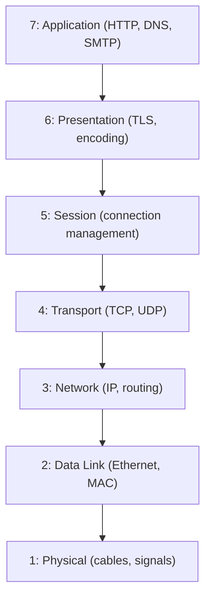

### TCP/IP Model (4 Layers — What's Actually Used)

| TCP/IP Layer | OSI Equivalent | Protocols | Unit |
|-------------|----------------|-----------|------|
| Application | 5, 6, 7 | HTTP, DNS, SMTP, SSH | Data |
| Transport | 4 | TCP, UDP | Segment/Datagram |
| Internet | 3 | IP, ICMP, ARP | Packet |
| Network Access | 1, 2 | Ethernet, Wi-Fi | Frame |

### Encapsulation

```text
Application data: "GET /index.html HTTP/1.1..."
    ↓ + TCP header (ports, sequence numbers)
TCP segment
    ↓ + IP header (source/destination IP)
IP packet
    ↓ + Ethernet header (MAC addresses) + trailer
Ethernet frame
    ↓ converted to electrical/optical signals
Physical transmission
```

### Key Takeaway

The OSI model is a teaching tool. TCP/IP is what runs the internet. Data flows down the stack (encapsulation) on send and up the stack (decapsulation) on receive. Each layer adds its own header.

---

## 2. Physical and Data Link Layers

### Ethernet

The dominant LAN technology. Uses MAC addresses for local delivery.

**MAC Address:** 48-bit hardware address, globally unique.

```text
Format: AA:BB:CC:DD:EE:FF
Example: 3c:22:fb:01:a2:b7
         └─────┘ └─────┘
         OUI      Device ID
         (vendor)
```

### Switching

A switch operates at Layer 2 — it forwards frames based on MAC addresses.

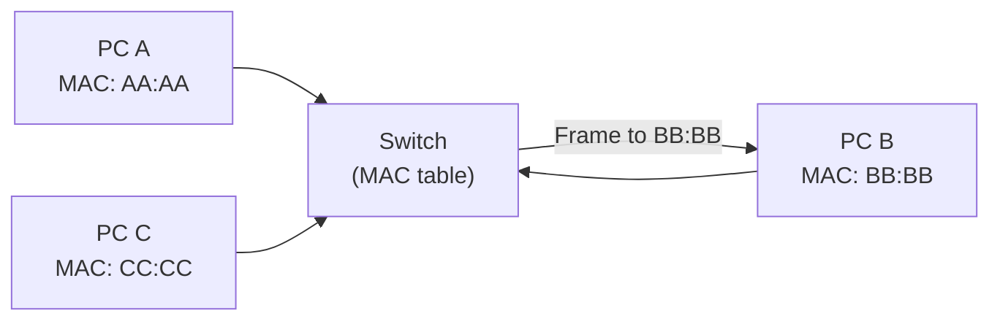

**MAC Address Table:**

| Port | MAC Address |
|------|-------------|
| 1 | AA:AA:AA:AA:AA:AA |
| 2 | BB:BB:BB:BB:BB:BB |
| 3 | CC:CC:CC:CC:CC:CC |

### ARP (Address Resolution Protocol)

Maps IP addresses to MAC addresses on the local network:

```text
"Who has 192.168.1.5? Tell 192.168.1.1"
→ Broadcast to all devices on the LAN
← "192.168.1.5 is at AA:BB:CC:DD:EE:FF"
```

### Key Takeaway

Layer 2 handles local delivery within a network segment using MAC addresses. Switches learn which MAC is on which port. ARP bridges the gap between IP (Layer 3) and MAC (Layer 2).

---

## 3. IP Addressing

### IPv4

32-bit address, written as four octets in decimal:

```text
192.168.1.100
│   │   │  │
└───┴───┴──┴── Each octet: 0-255 (8 bits)

Binary: 11000000.10101000.00000001.01100100
```

### Subnetting and CIDR

CIDR notation: `IP/prefix_length` — the prefix identifies the network, the rest identifies the host.

```text
10.0.0.0/24
├── Network: 10.0.0 (first 24 bits)
└── Host: .0 to .255 (last 8 bits = 256 addresses)

10.0.0.0/16
├── Network: 10.0 (first 16 bits)
└── Host: .0.0 to .255.255 (65,536 addresses)
```

### Common CIDR Blocks

| CIDR | Subnet Mask | Hosts | Use |
|------|-------------|-------|-----|
| /32 | 255.255.255.255 | 1 | Single host |
| /24 | 255.255.255.0 | 254 | Small network |
| /16 | 255.255.0.0 | 65,534 | Medium network |
| /8 | 255.0.0.0 | 16,777,214 | Large network |

### Private IP Ranges (RFC 1918)

| Range | CIDR | Typical Use |
|-------|------|-------------|
| 10.0.0.0 – 10.255.255.255 | 10.0.0.0/8 | Large organizations, cloud VPCs |
| 172.16.0.0 – 172.31.255.255 | 172.16.0.0/12 | Medium networks |
| 192.168.0.0 – 192.168.255.255 | 192.168.0.0/16 | Home/small office |

### IPv6

128-bit address — solves IPv4 exhaustion:

```text
2001:0db8:85a3:0000:0000:8a2e:0370:7334
     └── can be shortened ──┘
2001:db8:85a3::8a2e:370:7334
```

### Key Takeaway

Subnetting is essential for cloud networking (VPCs, security groups). Know how to calculate network/host portions from CIDR notation. Private ranges are used inside VPCs; public IPs face the internet.

---

## 4. Routing

### How Routing Works

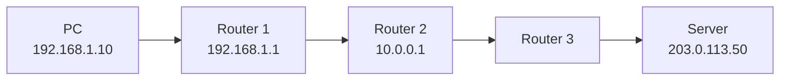

A router examines the destination IP and consults its **routing table** to decide where to forward the packet.

### Routing Table

```text
Destination      Gateway         Interface    Metric
0.0.0.0/0        192.168.1.1     eth0         100    ← default route
192.168.1.0/24   directly connected  eth0     0      ← local network
10.0.0.0/16      10.0.0.1        eth1         50     ← static route
```

**Longest prefix match:** When multiple routes match, the most specific (longest prefix) wins.

### Static vs Dynamic Routing

| Type | Use Case | Examples |
|------|----------|---------|
| Static | Small networks, default routes | Manual configuration |
| OSPF | Within an organization (IGP) | Link-state, fast convergence |
| BGP | Between organizations (EGP) | Path-vector, internet backbone |

### BGP (Border Gateway Protocol)

BGP is how the internet works — it routes between autonomous systems (AS):

```text
AS 64500 (Your ISP) ←→ AS 64501 (Cloud Provider) ←→ AS 64502 (CDN)
```

### Key Takeaway

Routing is the mechanism that gets packets across networks. Default routes handle "everything else." Cloud networking (VPC route tables, transit gateways) uses the same concepts as physical networking.

---

## 5. Transport Layer: TCP vs UDP

### TCP (Transmission Control Protocol)

Reliable, ordered, connection-oriented:

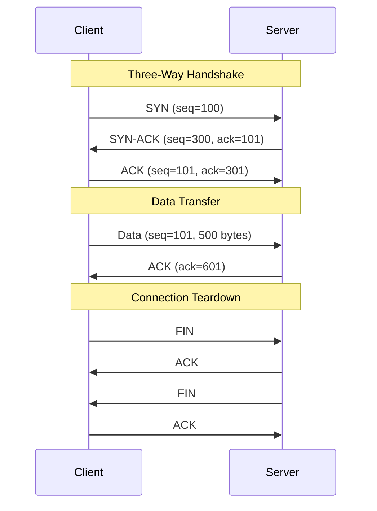

**TCP Features:**

- **Reliability** — retransmits lost packets
- **Ordering** — sequence numbers ensure correct order
- **Flow control** — receiver advertises window size
- **Congestion control** — slow start, congestion avoidance

### UDP (User Datagram Protocol)

Unreliable, unordered, connectionless — but fast:

```text
Client → [UDP Datagram] → Server
         No handshake
         No acknowledgment
         No retransmission
```

### TCP vs UDP

| Feature | TCP | UDP |
|---------|-----|-----|
| Connection | Yes (handshake) | No |
| Reliability | Guaranteed delivery | Best-effort |
| Ordering | Guaranteed | No |
| Speed | Slower (overhead) | Faster |
| Use cases | HTTP, SSH, email, databases | DNS, video streaming, gaming, VoIP |

### Ports

| Port | Service |
|------|---------|
| 22 | SSH |
| 53 | DNS |
| 80 | HTTP |
| 443 | HTTPS |
| 3306 | MySQL |
| 5432 | PostgreSQL |
| 6379 | Redis |
| 8080 | HTTP (alternate) |

### Key Takeaway

TCP guarantees delivery at the cost of latency. UDP trades reliability for speed. Most web traffic uses TCP (HTTP/HTTPS). Real-time applications (gaming, video) often use UDP.

---

## 6. DNS (Domain Name System)

### How DNS Resolution Works

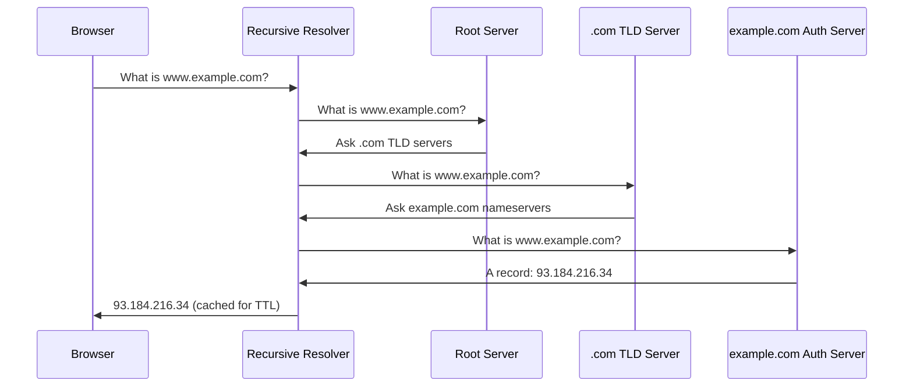

### Record Types

| Type | Purpose | Example |
|------|---------|---------|
| A | IPv4 address | `example.com → 93.184.216.34` |
| AAAA | IPv6 address | `example.com → 2606:2800:220:1:...` |
| CNAME | Canonical name (alias) | `www.example.com → example.com` |
| MX | Mail exchange | `example.com → mail.example.com (priority 10)` |
| TXT | Text (verification, SPF, DKIM) | `example.com → "v=spf1 include:..."` |
| NS | Nameserver | `example.com → ns1.example.com` |
| SOA | Start of Authority | Zone metadata (serial, refresh, retry) |
| SRV | Service location | `_sip._tcp.example.com → sipserver:5060` |
| PTR | Reverse DNS | `34.216.184.93.in-addr.arpa → example.com` |

### DNS Caching

```text
Browser cache → OS cache → Router cache → ISP resolver cache → Authoritative
     (seconds)    (minutes)   (minutes)      (TTL-based)         (source of truth)
```

**TTL (Time To Live):** How long resolvers cache the record. Lower TTL = faster propagation of changes, more DNS queries.

### Key Takeaway

DNS is the phone book of the internet. Understanding DNS is critical for debugging connectivity issues, configuring domains, and managing cloud infrastructure. Use `dig` or `nslookup` to troubleshoot.

---

## 7. HTTP/HTTPS

### HTTP Request/Response

```text
Request:
GET /api/users HTTP/1.1
Host: api.example.com
Authorization: Bearer eyJhbG...
Accept: application/json

Response:
HTTP/1.1 200 OK
Content-Type: application/json
Cache-Control: max-age=3600

{"users": [...]}
```

### HTTP Methods

| Method | Purpose | Idempotent | Safe |
|--------|---------|------------|------|
| GET | Retrieve resource | Yes | Yes |
| POST | Create resource | No | No |
| PUT | Replace resource | Yes | No |
| PATCH | Partial update | No | No |
| DELETE | Remove resource | Yes | No |
| HEAD | Get headers only | Yes | Yes |
| OPTIONS | Get allowed methods | Yes | Yes |

### Status Codes

| Range | Category | Common Codes |
|-------|----------|-------------|
| 1xx | Informational | 101 Switching Protocols |
| 2xx | Success | 200 OK, 201 Created, 204 No Content |
| 3xx | Redirection | 301 Moved Permanently, 304 Not Modified |
| 4xx | Client Error | 400 Bad Request, 401 Unauthorized, 403 Forbidden, 404 Not Found, 429 Too Many Requests |
| 5xx | Server Error | 500 Internal Server Error, 502 Bad Gateway, 503 Service Unavailable, 504 Gateway Timeout |

### TLS Handshake (HTTPS)

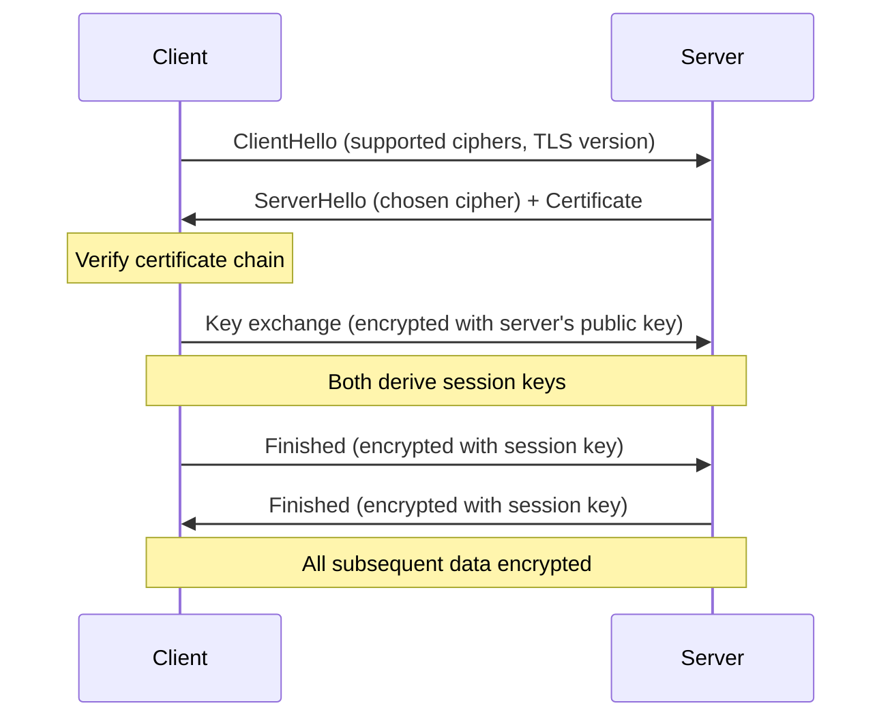

### HTTP/2 and HTTP/3

| Feature | HTTP/1.1 | HTTP/2 | HTTP/3 |
|---------|----------|--------|--------|
| Multiplexing | No (one request per connection) | Yes (streams) | Yes |
| Header compression | No | HPACK | QPACK |
| Server push | No | Yes | Yes |
| Transport | TCP | TCP | QUIC (UDP) |
| Head-of-line blocking | Yes | At TCP level | No |

### Key Takeaway

HTTP is the foundation of web communication. Understand methods, status codes, and headers for API design and debugging. HTTPS (TLS) is mandatory — it provides encryption, integrity, and authentication.

---

## 8. Network Security

### Firewalls

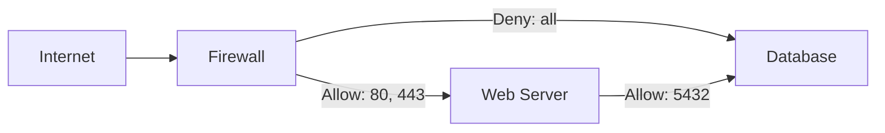

| Type | Layer | Example |
|------|-------|---------|
| Packet filter | 3-4 | iptables, security groups |
| Stateful | 3-4 | AWS Security Groups |
| Application (WAF) | 7 | AWS WAF, Cloudflare |

### NAT (Network Address Translation)

Allows private IPs to access the internet through a single public IP:

```text
Private Network          NAT Gateway          Internet
192.168.1.10 ──┐
192.168.1.11 ──┼──→ 203.0.113.1 ──→ Destination
192.168.1.12 ──┘    (public IP)
```

### VPN (Virtual Private Network)

Encrypted tunnel over public internet:

```text
Office A ←──[Encrypted Tunnel over Internet]──→ Office B
10.0.1.0/24                                      10.0.2.0/24
```

### mTLS (Mutual TLS)

Both client and server present certificates — used for service-to-service communication:

```text
Service A ←→ Service B
Both verify each other's identity via certificates
```

### Key Takeaway

Defense in depth: firewalls at network edge, security groups per service, encryption in transit (TLS), and authentication at every layer. Never expose databases directly to the internet.

---

## 9. Load Balancing and Reverse Proxies

### Load Balancing Algorithms

| Algorithm | How It Works | Best For |
|-----------|-------------|----------|
| Round Robin | Rotate through servers sequentially | Equal-capacity servers |
| Weighted Round Robin | Rotate with weights | Mixed-capacity servers |
| Least Connections | Send to server with fewest active connections | Variable request duration |
| IP Hash | Hash client IP to pick server | Session affinity |
| Random | Random selection | Simple, surprisingly effective |

### Reverse Proxy

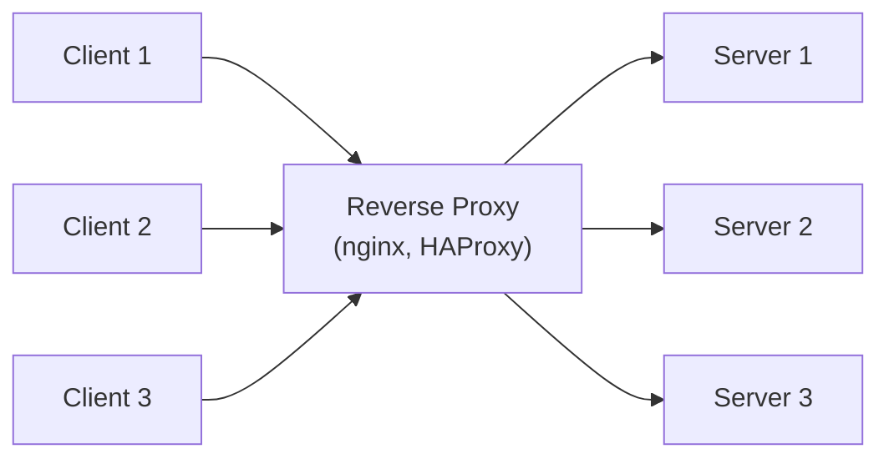

**Functions:**

- Load balancing
- TLS termination
- Caching
- Compression
- Rate limiting
- Request routing

### Health Checks

```text
Load Balancer → GET /health → Server
                ← 200 OK (healthy)
                ← 503 (unhealthy → remove from pool)
```

### Key Takeaway

Load balancers distribute traffic and provide high availability. Reverse proxies add security and performance layers. Always configure health checks to automatically remove unhealthy backends.

---

## 10. Troubleshooting Tools

### ping — Test Connectivity

```bash
ping 8.8.8.8              # test IP connectivity
ping google.com           # test DNS + connectivity
ping -c 4 host            # send 4 packets and stop
```

### traceroute — Path Discovery

```bash
traceroute google.com     # show each hop to destination
# Linux: traceroute, macOS: traceroute, Windows: tracert
```

### dig — DNS Queries

```bash
dig example.com           # query A record
dig example.com MX        # query MX records
dig @8.8.8.8 example.com  # query specific resolver
dig +short example.com    # concise output
dig +trace example.com    # full resolution path
```

### netstat / ss — Network Connections

```bash
ss -tlnp                  # listening TCP ports with process
ss -tunap                 # all connections with process
netstat -an               # all connections (legacy)
```

### curl — HTTP Requests

```bash
curl -v https://api.example.com/health    # verbose (shows headers)
curl -o /dev/null -s -w "%{http_code}\n" URL  # just status code
curl -X POST -H "Content-Type: application/json" -d '{"key":"value"}' URL
```

### tcpdump — Packet Capture

```bash
tcpdump -i eth0 port 80           # capture HTTP traffic
tcpdump -i any host 10.0.1.5      # traffic to/from specific host
tcpdump -i eth0 -w capture.pcap   # save to file (open in Wireshark)
```

### Troubleshooting Flow

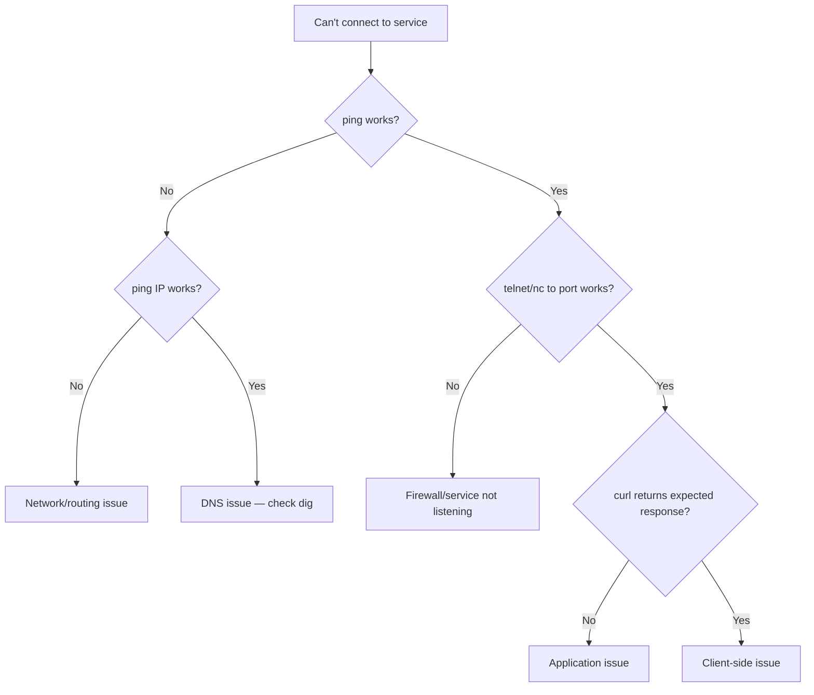

### Key Takeaway

Troubleshoot layer by layer: physical → network → transport → application. Start with `ping` (connectivity), then `dig` (DNS), then `curl` (application). Use `tcpdump` when you need to see actual packets.

---

## 11. Cloud Networking

### VPC (Virtual Private Cloud)

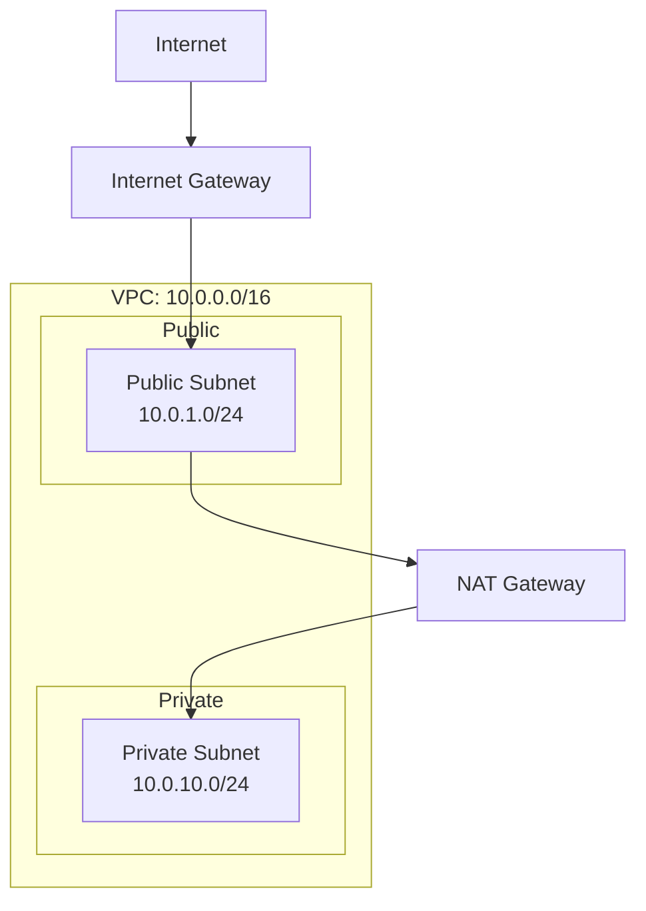

### VPC Peering

Direct connection between two VPCs (no internet transit):

```text
VPC A (10.0.0.0/16) ←→ VPC B (172.16.0.0/16)
         Peering connection (private, low-latency)
```

**Limitations:** Non-transitive (A↔B and B↔C doesn't mean A↔C).

### Transit Gateway

Hub-and-spoke for connecting many VPCs:

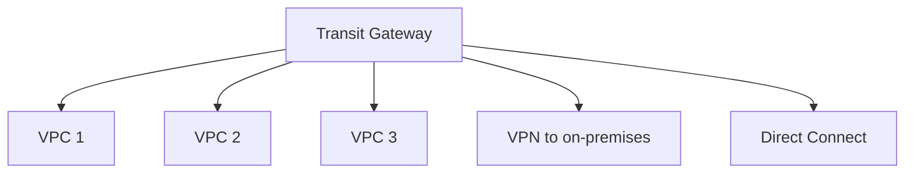

### VPC Endpoints

Access AWS services without going through the internet:

| Type | Use Case |
|------|----------|
| Gateway endpoint | S3, DynamoDB (free) |
| Interface endpoint | All other AWS services (ENI in your subnet) |

### Key Takeaway

Cloud networking uses the same concepts as physical networking (subnets, routing, firewalls) but virtualized. VPCs isolate workloads. Use private subnets + NAT for security. VPC endpoints keep traffic off the public internet.

---

## Summary

| Topic | Core Concept |
|-------|-------------|
| OSI/TCP-IP | Layered model — each layer has a job |
| Data Link | MAC addresses, switches, local delivery |
| IP Addressing | CIDR notation, subnetting, private ranges |
| Routing | Routing tables, longest prefix match, BGP |
| TCP vs UDP | Reliable+slow vs fast+unreliable |
| DNS | Name → IP resolution, record types, caching |
| HTTP/HTTPS | Methods, status codes, TLS encryption |
| Security | Firewalls, NAT, VPN, mTLS |
| Load Balancing | Distribute traffic, health checks, HA |
| Troubleshooting | Layer-by-layer: ping → dig → curl → tcpdump |
| Cloud Networking | VPCs, peering, transit gateways, endpoints |

Networking is invisible when it works and the first suspect when it doesn't. Master the fundamentals (IP, TCP, DNS, HTTP) and you can debug any connectivity issue — whether it's a local Docker network or a multi-region cloud deployment.
