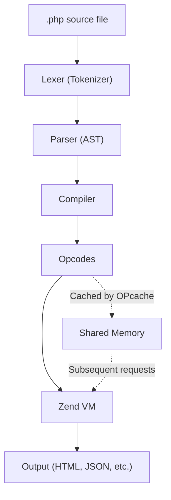

## The PHP Runtime

PHP originally stood for "Personal Home Page" (now "PHP: Hypertext Preprocessor" — a recursive acronym). It's an interpreted language compiled to opcodes at request time, executed by the Zend Engine virtual machine.

### Execution Model



**Key insight:** Without OPcache, PHP re-compiles every file on every request. With OPcache (enabled by default since PHP 5.5), compiled opcodes persist in shared memory across requests — massive performance win.

### PHP-FPM (FastCGI Process Manager)

In production, PHP doesn't run as a CGI script. PHP-FPM manages a pool of worker processes:

- Web server (Nginx/Apache) passes requests to PHP-FPM via FastCGI protocol
- Each worker handles one request at a time
- Worker processes are pre-forked (no fork-per-request overhead)
- Configurable: `pm.max_children`, `pm.start_servers`, `pm.max_requests`

---

## Basic Syntax

### PHP Tags

```php
<?php
// All PHP code goes between opening and closing tags
echo "Hello, World!";
// The closing ?> tag is OMITTED in files that contain only PHP (best practice)
```

### Variables

Variables start with `$`. No declaration keyword needed — PHP is dynamically typed:

```php
<?php
$name = "PHP";           // string
$version = 8.3;          // float
$isModern = true;        // bool
$nothing = null;         // null
$count = 42;             // int
```

### Variable Naming Rules

- Must start with `$` followed by a letter or underscore
- Case-sensitive (`$Name` ≠ `$name`)
- Convention: `$camelCase` for variables, `UPPER_CASE` for constants

### Constants

```php
<?php
// Define with const (compile-time)
const PI = 3.14159;

// Or define() (runtime — can be conditional)
define('MAX_RETRIES', 3);

// Class constants
class Config {
    public const VERSION = '2.0';
}
```

---

## Scalar Types

### Integers

```php
<?php
$decimal = 42;
$negative = -17;
$octal = 0o755;       // Octal (PHP 8.1+)
$hex = 0xFF;           // Hexadecimal
$binary = 0b101010;    // Binary
$readable = 1_000_000; // Underscore separators (PHP 7.4+)

// Integer overflow silently converts to float
$big = PHP_INT_MAX + 1; // becomes float
```

### Floats

```php
<?php
$price = 19.99;
$scientific = 1.2e3;  // 1200.0
$tiny = 7E-10;

// ⚠️ Never compare floats directly
var_dump(0.1 + 0.2 == 0.3);  // false! (floating-point representation)
var_dump(abs(0.1 + 0.2 - 0.3) < PHP_FLOAT_EPSILON);  // true
```

### Strings

PHP has four string syntaxes:

```php
<?php
// Single-quoted: literal, no interpolation
$literal = 'Hello $name';  // "Hello $name"

// Double-quoted: interpolation + escape sequences
$greeting = "Hello $name\n";  // "Hello PHP\n"

// Heredoc: multi-line with interpolation
$html = <<<HTML
<div class="container">
    <h1>$name</h1>
</div>
HTML;

// Nowdoc: multi-line without interpolation (like single-quotes)
$template = <<<'SQL'
SELECT * FROM users WHERE name = :name
SQL;
```

### Booleans

Falsy values in PHP (everything else is truthy):

| Value | Type |
|-------|------|
| `false` | bool |
| `0` | int |
| `0.0` | float |
| `""` | empty string |
| `"0"` | string "0" (uniquely PHP!) |
| `[]` | empty array |
| `null` | null |

---

## Type Juggling and Comparison

PHP performs implicit type coercion. This is the source of many bugs:

```php
<?php
// Loose comparison (==) with type juggling
var_dump(0 == "foo");    // false in PHP 8+ (was true in PHP 7!)
var_dump("" == null);    // true
var_dump(1 == "1");      // true
var_dump(1 == true);     // true

// Strict comparison (===) — no type conversion
var_dump(1 === "1");     // false
var_dump(1 === true);    // false
```

**Rule: Always use `===` and `!==` unless you have a specific reason not to.**

### Type Casting

```php
<?php
$str = "42 apples";
$int = (int) $str;        // 42
$float = (float) "3.14";  // 3.14
$bool = (bool) "";         // false
$arr = (array) $obj;       // object properties become array keys
```

---

## Operators

### Arithmetic

```php
<?php
$a + $b    // addition
$a - $b    // subtraction
$a * $b    // multiplication
$a / $b    // division (returns float if not evenly divisible)
$a % $b    // modulo
$a ** $b   // exponentiation (PHP 5.6+)
intdiv($a, $b)  // integer division
```

### String Concatenation

```php
<?php
$full = $first . ' ' . $last;  // dot operator
$full .= '!';                   // append
```

### Null-Safe and Null Coalescing

```php
<?php
// Null coalescing operator (??) — returns left if not null, else right
$name = $_GET['name'] ?? 'Guest';

// Null coalescing assignment (??=)
$config['timeout'] ??= 30;

// Null-safe operator (?->) — short-circuits to null (PHP 8.0+)
$country = $user?->address?->country;  // null if any part is null
```

### Spaceship Operator

```php
<?php
// Returns -1, 0, or 1
$result = $a <=> $b;

// Useful for sorting
usort($users, fn($a, $b) => $a->age <=> $b->age);
```

---

## Output

```php
<?php
echo "Hello";          // Language construct, no return value, multiple args
print "Hello";         // Language construct, returns 1 (usable in expressions)
var_dump($var);        // Type + value — debugging
print_r($array);       // Human-readable array/object — debugging
var_export($data);     // Valid PHP representation — exportable
```

---

## PHP Configuration (php.ini)

Key settings every developer should know:

| Directive | Default | Production Recommendation |
|-----------|---------|--------------------------|
| `display_errors` | On | **Off** (log them instead) |
| `error_reporting` | E_ALL | E_ALL |
| `log_errors` | Off | **On** |
| `memory_limit` | 128M | Tune per app (128M–512M) |
| `max_execution_time` | 30 | 30 (or more for CLI) |
| `upload_max_filesize` | 2M | Match your needs |
| `opcache.enable` | 1 | 1 (always) |
| `opcache.validate_timestamps` | 1 | **0** in production (better perf) |

---

## Key Takeaways

1. PHP is **compiled to opcodes** then executed by the Zend VM — OPcache prevents recompilation
2. **PHP-FPM** is the production runtime — a pool of pre-forked worker processes
3. **Use strict comparison (`===`)** — type juggling with `==` is a bug factory
4. **`"0"` is falsy** — this is unique to PHP and catches people off guard
5. The **null coalescing (`??`) and null-safe (`?->`) operators** eliminate verbose null checks
6. **php.ini** controls critical behavior — always set `display_errors = Off` in production
