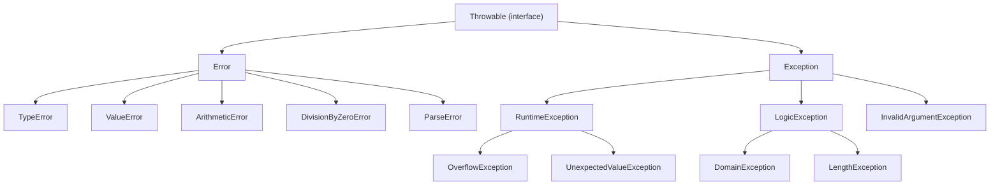

## PHP's Error Model

PHP has two parallel error systems — legacy errors and modern exceptions. Understanding both is essential.

### The Error Hierarchy (PHP 7+)



**Key distinction:**
- `Error` — programming mistakes that should not be caught in normal flow (type errors, parse errors)
- `Exception` — recoverable conditions that business logic should handle

---

## Try / Catch / Finally

```php
<?php
try {
    $result = riskyOperation();
} catch (SpecificException $e) {
    // Handle specific exception type
    logger()->error('Operation failed', ['error' => $e->getMessage()]);
    $result = fallbackValue();
} catch (AnotherException | YetAnotherException $e) {
    // Catch multiple types (PHP 7.1+)
    handleMultiple($e);
} catch (\Throwable $e) {
    // Last resort — catches both Error and Exception
    logger()->critical('Unexpected error', ['exception' => $e]);
    throw $e; // Re-throw if you can't handle it
} finally {
    // Always runs — cleanup, close resources
    cleanup();
}
```

### Non-Capturing Catches (PHP 8.0+)

When you don't need the exception object:

```php
<?php
try {
    $config = parseConfig($file);
} catch (ParseException) {
    // Don't need $e — just know it failed
    $config = getDefaultConfig();
}
```

---

## Custom Exceptions

```php
<?php
// Domain-specific exception with context
class InsufficientFundsException extends \RuntimeException
{
    public function __construct(
        private readonly float $balance,
        private readonly float $amount,
        ?\Throwable $previous = null,
    ) {
        parent::__construct(
            sprintf('Cannot withdraw %.2f: balance is %.2f', $amount, $balance),
            0,
            $previous,
        );
    }

    public function getBalance(): float { return $this->balance; }
    public function getAmount(): float { return $this->amount; }
}

// Throwing with context
throw new InsufficientFundsException(balance: 50.00, amount: 100.00);
```

### Exception Best Practices

| Practice | Reasoning |
|----------|-----------|
| Create domain-specific exceptions | Callers can catch exactly what they can handle |
| Include context in the exception | Don't just say "failed" — say what, why, what was attempted |
| Catch specific types, not `\Exception` | Overly broad catches hide bugs |
| Re-throw if you can't handle it | Don't swallow exceptions silently |
| Use `$previous` parameter | Preserves the exception chain for debugging |
| `finally` for cleanup | Runs regardless of exception — close files, connections |

---

## Legacy Error Handling

PHP still has traditional errors (`E_WARNING`, `E_NOTICE`, etc.) for some operations:

```php
<?php
// This triggers E_WARNING, not an exception
$file = fopen('/nonexistent', 'r');  // Warning + returns false

// Convert errors to exceptions globally
set_error_handler(function (int $severity, string $message, string $file, int $line): never {
    throw new \ErrorException($message, 0, $severity, $file, $line);
});

// Or suppress and check (less ideal but sometimes necessary)
$result = @file_get_contents($url);
if ($result === false) {
    throw new FileReadException("Failed to read: $url");
}
```

### Error Levels

| Level | Severity | Example |
|-------|----------|---------|
| `E_ERROR` | Fatal | Call to undefined function |
| `E_WARNING` | Warning | File not found, invalid argument |
| `E_NOTICE` | Notice | Undefined variable, undefined index |
| `E_DEPRECATED` | Deprecation | Using a feature marked for removal |
| `E_STRICT` | Suggestion | PHP coding standards (mostly removed in 8.x) |

---

## Assertions

Use assertions for development-time invariant checks:

```php
<?php
// Development: throws AssertionError
// Production: completely compiled out (zero overhead)
assert($divisor !== 0, 'Divisor must not be zero');
assert($age >= 0 && $age <= 150, "Invalid age: $age");

// In php.ini:
// Development: zend.assertions=1 (active)
// Production:  zend.assertions=-1 (compiled out entirely)
```

---

## Key Takeaways

1. **Use `Throwable`** as the broadest catch — it covers both `Error` and `Exception`
2. **Create domain exceptions** with context data — make errors actionable
3. **Don't catch what you can't handle** — let it bubble up to a handler that can
4. **`finally` always runs** — use it for resource cleanup (files, connections, locks)
5. **Convert legacy errors** to exceptions with `set_error_handler` for consistent error flow
6. **Assertions** are for invariants during development — they have zero cost in production
