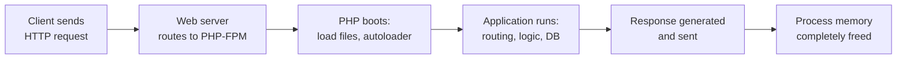

## The PHP Request Lifecycle

PHP is fundamentally request-oriented — each request starts fresh with no shared state:



**Shared-nothing architecture:** Every request starts with a clean slate. No state leaks between requests (unlike Node.js or Java servlets). This makes PHP inherently safe from many concurrency bugs, but means you need external storage (sessions, databases, caches) for state.

---

## Superglobals

PHP populates these arrays automatically from the HTTP request:

| Variable | Contains |
|----------|----------|
| `$_GET` | Query string parameters (`?key=value`) |
| `$_POST` | POST body (form-urlencoded or multipart) |
| `$_REQUEST` | Merged GET + POST + COOKIE (avoid — ambiguous) |
| `$_SERVER` | Server/request metadata (headers, method, URI) |
| `$_FILES` | Uploaded files |
| `$_COOKIE` | Cookies sent by client |
| `$_SESSION` | Session data (after `session_start()`) |
| `$_ENV` | Environment variables |

### Common `$_SERVER` Values

```php
<?php
$_SERVER['REQUEST_METHOD'];   // GET, POST, PUT, DELETE
$_SERVER['REQUEST_URI'];      // /path?query=string
$_SERVER['HTTP_HOST'];        // example.com
$_SERVER['REMOTE_ADDR'];      // Client IP
$_SERVER['HTTP_USER_AGENT'];  // Browser identification
$_SERVER['HTTPS'];            // 'on' if HTTPS
```

---

## Handling Input Safely

**Never trust superglobals directly.** Always validate and sanitize:

```php
<?php
// Retrieve with default
$page = (int) ($_GET['page'] ?? 1);
$search = trim($_GET['q'] ?? '');

// Validate
$email = filter_input(INPUT_POST, 'email', FILTER_VALIDATE_EMAIL);
if ($email === false || $email === null) {
    throw new ValidationException('Invalid email');
}

// Filter functions
$id = filter_input(INPUT_GET, 'id', FILTER_VALIDATE_INT, ['options' => ['min_range' => 1]]);
$url = filter_input(INPUT_POST, 'website', FILTER_VALIDATE_URL);
```

---

## Sessions

Sessions maintain state across requests using a session ID (stored in a cookie):

```php
<?php
session_start();  // Must be called before any output

// Write
$_SESSION['user_id'] = $user->getId();
$_SESSION['cart'] = [];

// Read
$userId = $_SESSION['user_id'] ?? null;

// Destroy (logout)
session_destroy();
$_SESSION = [];

// Regenerate ID (prevent session fixation attacks)
session_regenerate_id(true);
```

### Session Security

| Setting | Recommended | Why |
|---------|-------------|-----|
| `session.cookie_httponly` | `1` | Prevent JavaScript access to session cookie |
| `session.cookie_secure` | `1` | Only send cookie over HTTPS |
| `session.cookie_samesite` | `Strict` or `Lax` | Prevent CSRF |
| `session.use_strict_mode` | `1` | Reject uninitialized session IDs |
| `session.gc_maxlifetime` | `1800` | Session expires after 30 min inactivity |

---

## Sending Responses

### Headers

```php
<?php
// Must be set before any output
header('Content-Type: application/json');
header('X-Custom-Header: value');
http_response_code(404);

// Redirect
header('Location: /dashboard');
exit;  // Always exit after redirect!
```

### JSON Responses

```php
<?php
header('Content-Type: application/json');
echo json_encode([
    'status' => 'success',
    'data' => $results,
], JSON_THROW_ON_ERROR | JSON_UNESCAPED_UNICODE);
exit;
```

### File Downloads

```php
<?php
header('Content-Type: application/pdf');
header('Content-Disposition: attachment; filename="report.pdf"');
header('Content-Length: ' . filesize($path));
readfile($path);
exit;
```

---

## File Uploads

```php
<?php
if ($_SERVER['REQUEST_METHOD'] === 'POST' && isset($_FILES['avatar'])) {
    $file = $_FILES['avatar'];
    
    // Validate
    if ($file['error'] !== UPLOAD_ERR_OK) {
        throw new UploadException('Upload failed');
    }
    
    // Check size (also enforce in php.ini)
    if ($file['size'] > 5 * 1024 * 1024) {
        throw new UploadException('File too large (max 5MB)');
    }
    
    // Validate MIME type (don't trust $file['type'] — client-provided)
    $finfo = new finfo(FILEINFO_MIME_TYPE);
    $mime = $finfo->file($file['tmp_name']);
    if (!in_array($mime, ['image/jpeg', 'image/png', 'image/webp'], true)) {
        throw new UploadException('Invalid file type');
    }
    
    // Generate safe filename (never use the original name directly)
    $extension = match ($mime) {
        'image/jpeg' => 'jpg',
        'image/png'  => 'png',
        'image/webp' => 'webp',
    };
    $filename = bin2hex(random_bytes(16)) . '.' . $extension;
    
    // Move to permanent location
    move_uploaded_file($file['tmp_name'], "/uploads/$filename");
}
```

---

## Key Takeaways

1. **PHP is shared-nothing** — each request starts clean, state lives in sessions/DB/cache
2. **Never use superglobals directly** — validate with `filter_input()` or explicit casting
3. **`session_regenerate_id(true)`** after login — prevents session fixation attacks
4. **Always `exit` after `header('Location: ...')`** — code continues running otherwise
5. **Don't trust `$_FILES['type']`** — validate MIME type server-side with `finfo`
6. **Generate random filenames** for uploads — user-supplied names can contain path traversal attacks
