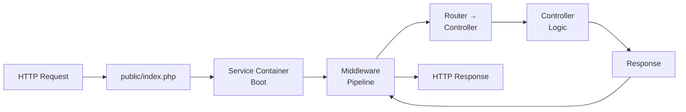

## The Two Major Frameworks

Modern PHP development almost always uses a framework. The two dominant choices:

| Aspect | Laravel | Symfony |
|--------|---------|---------|
| Philosophy | Convention over configuration, DX-first | Explicit configuration, flexibility |
| Learning curve | Gentle — lots of "magic" helpers | Steeper — more boilerplate, more control |
| Best for | Rapid application development, startups, APIs | Enterprise apps, complex domains, microservices |
| ORM | Eloquent (Active Record) | Doctrine (Data Mapper) |
| Template engine | Blade | Twig |
| CLI | Artisan | Console component |
| DI Container | Built-in (service container) | Full autowiring container |
| Ecosystem | Laravel Forge, Vapor, Nova, Horizon | Bundles, Flex, recipes |

---

## Laravel Overview

### Request Lifecycle



### Routing

```php
<?php
// routes/web.php
Route::get('/users', [UserController::class, 'index']);
Route::post('/users', [UserController::class, 'store']);
Route::get('/users/{user}', [UserController::class, 'show']);  // Route model binding

// API resource routes (generates index, store, show, update, destroy)
Route::apiResource('products', ProductController::class);
```

### Controllers

```php
<?php
class UserController extends Controller
{
    public function index(): JsonResponse
    {
        $users = User::paginate(20);
        return response()->json($users);
    }

    public function store(CreateUserRequest $request): JsonResponse
    {
        $user = User::create($request->validated());
        return response()->json($user, 201);
    }

    // Route model binding — Laravel auto-fetches User by ID
    public function show(User $user): JsonResponse
    {
        return response()->json($user->load('orders'));
    }
}
```

### Eloquent ORM (Active Record)

```php
<?php
class User extends Model
{
    protected $fillable = ['name', 'email', 'password'];
    protected $hidden = ['password'];
    
    // Relationships
    public function orders(): HasMany
    {
        return $this->hasMany(Order::class);
    }

    public function roles(): BelongsToMany
    {
        return $this->belongsToMany(Role::class);
    }
}

// Usage
$users = User::where('active', true)
    ->orderBy('name')
    ->with('orders')  // Eager load to prevent N+1
    ->paginate(20);
```

---

## Symfony Overview

### Architecture

Symfony is a collection of decoupled components. You can use individual components (like HttpFoundation, Console, Mailer) without the full framework.

### Routing

```php
<?php
// src/Controller/UserController.php
#[Route('/api/users')]
class UserController extends AbstractController
{
    #[Route('', methods: ['GET'])]
    public function index(UserRepository $repo): JsonResponse
    {
        return $this->json($repo->findAll());
    }

    #[Route('/{id}', methods: ['GET'])]
    public function show(User $user): JsonResponse  // ParamConverter
    {
        return $this->json($user);
    }

    #[Route('', methods: ['POST'])]
    public function create(Request $request, EntityManagerInterface $em): JsonResponse
    {
        $user = new User();
        $user->setName($request->get('name'));
        $em->persist($user);
        $em->flush();
        return $this->json($user, 201);
    }
}
```

### Doctrine ORM (Data Mapper)

```php
<?php
#[ORM\Entity(repositoryClass: UserRepository::class)]
#[ORM\Table(name: 'users')]
class User
{
    #[ORM\Id, ORM\GeneratedValue, ORM\Column]
    private ?int $id = null;

    #[ORM\Column(length: 255)]
    private string $name;

    #[ORM\OneToMany(mappedBy: 'user', targetEntity: Order::class)]
    private Collection $orders;

    public function __construct()
    {
        $this->orders = new ArrayCollection();
    }
    
    // Getters and setters...
}
```

**Key difference from Eloquent:** Doctrine entities are plain PHP objects — no base class needed. The ORM maps them to tables via attributes/annotations.

---

## Choosing Between Them

| Choose Laravel when... | Choose Symfony when... |
|----------------------|---------------------|
| Rapid prototyping / MVPs | Long-lived enterprise applications |
| Small–medium teams | Large teams needing explicit contracts |
| CRUD-heavy applications | Complex business domains (DDD) |
| You value developer experience | You value explicit architecture |
| Built-in everything (auth, queues, etc.) | Picking exactly the components you need |

---

## Key Takeaways

1. **Both are excellent choices** — pick based on team size, project complexity, and philosophy preference
2. **Laravel favors convention** — less code, more "magic", faster to start
3. **Symfony favors explicitness** — more code, more control, better for complex domains
4. **Eloquent (Active Record)** — model IS the query builder. Doctrine (Data Mapper) — model is a plain object
5. **You can use Symfony components in any project** — they're standalone packages
6. **Always eager-load relationships** (`with()` in Laravel, `JOIN` in Doctrine DQL) to avoid N+1 queries
