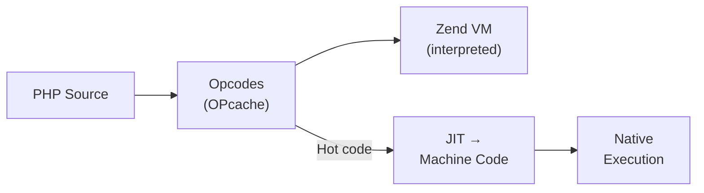
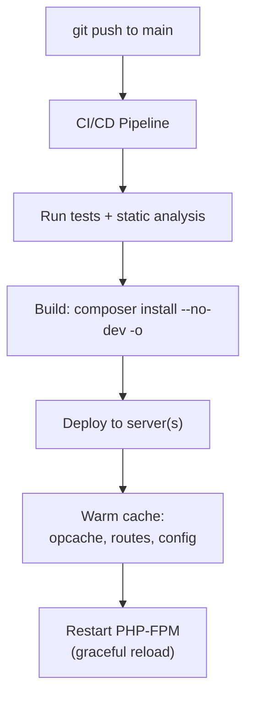

## OPcache

OPcache stores compiled PHP opcodes in shared memory, eliminating re-parsing/compiling on each request:

```ini
; php.ini — production OPcache settings
opcache.enable=1
opcache.memory_consumption=256
opcache.interned_strings_buffer=16
opcache.max_accelerated_files=20000
opcache.validate_timestamps=0        ; Don't check file modification times in production
opcache.save_comments=1              ; Required for annotations/attributes
opcache.jit_buffer_size=100M         ; JIT compilation (PHP 8.0+)
opcache.jit=1255                     ; Enable JIT (tracing mode)
```

**Critical setting:** `opcache.validate_timestamps=0` in production means PHP never checks if files changed on disk — you must restart PHP-FPM after deployment.

### JIT Compiler (PHP 8.0+)

The JIT compiles hot opcodes to native machine code at runtime:



JIT benefits mathematical/CPU-bound code significantly. For typical web apps (I/O-bound), the improvement is modest (5–15%).

---

## PHP-FPM Tuning

```ini
; /etc/php-fpm.d/www.conf

; Static pool — predictable memory usage (recommended for dedicated servers)
pm = static
pm.max_children = 50    ; RAM available / RAM per worker (e.g., 8GB / 160MB ≈ 50)

; Dynamic pool — scales with traffic (shared hosting, variable load)
pm = dynamic
pm.max_children = 50
pm.start_servers = 10
pm.min_spare_servers = 5
pm.max_spare_servers = 20
pm.max_requests = 500   ; Recycle workers after N requests (prevents memory leaks)
```

### Calculating `max_children`

```
max_children = Available RAM / Average worker memory usage
```

Monitor with: `ps aux | grep php-fpm | awk '{sum += $6} END {print sum/NR " KB avg"}'`

---

## Application-Level Performance

### N+1 Query Problem

```php
<?php
// ❌ N+1: 1 query for users + N queries for each user's orders
$users = User::all();
foreach ($users as $user) {
    echo $user->orders->count();  // Lazy load triggers query per user
}

// ✅ Eager loading: 2 queries total
$users = User::with('orders')->get();
foreach ($users as $user) {
    echo $user->orders->count();  // Already loaded
}
```

### Caching

```php
<?php
// APCu — in-memory per-server cache (fastest for single-server)
apcu_store('config', $config, 3600);
$config = apcu_fetch('config');

// Redis/Memcached — distributed cache (multi-server)
$cache = new Redis();
$cache->set('user:1', serialize($user), 3600);
$user = unserialize($cache->get('user:1'));

// Framework cache (PSR-6/PSR-16 compatible)
$value = $cache->get('expensive.query', function () {
    return $this->repository->computeExpensiveReport();
});
```

### Profiling

| Tool | Purpose |
|------|---------|
| Xdebug (profiling mode) | Generate cachegrind files for call-graph analysis |
| Blackfire | Production-safe profiler with web UI |
| Tideways | APM for PHP — distributed tracing |
| SPX | Lightweight sampling profiler |

---

## Deployment

### Modern PHP Deployment Flow



### Deployment Checklist

```bash
# 1. Install production dependencies only
composer install --no-dev --optimize-autoloader --classmap-authoritative

# 2. Clear and warm caches (framework-specific)
php artisan config:cache     # Laravel
php artisan route:cache
php artisan view:cache
php bin/console cache:clear  # Symfony
php bin/console cache:warmup

# 3. Run database migrations
php artisan migrate --force   # Laravel
php bin/console doctrine:migrations:migrate --no-interaction  # Symfony

# 4. Reload PHP-FPM (picks up new OPcache)
sudo systemctl reload php-fpm
```

### Docker Deployment

```dockerfile
FROM php:8.3-fpm-alpine

# Install extensions
RUN docker-php-ext-install pdo_mysql opcache

# Copy OPcache production config
COPY docker/php/opcache.ini /usr/local/etc/php/conf.d/opcache.ini

# Copy application
COPY --chown=www-data:www-data . /app
WORKDIR /app

# Install dependencies
RUN composer install --no-dev --optimize-autoloader --no-scripts

# Expose FPM
EXPOSE 9000
CMD ["php-fpm"]
```

---

## Security Checklist for Production

| Setting | Value | Why |
|---------|-------|-----|
| `display_errors` | Off | Never show errors to users |
| `expose_php` | Off | Don't advertise PHP version in headers |
| `allow_url_fopen` | Off (if possible) | Prevent remote file inclusion |
| `disable_functions` | `exec,system,passthru,shell_exec` | Reduce attack surface |
| `open_basedir` | `/app:/tmp` | Restrict file access to app directory |
| `session.cookie_httponly` | 1 | Prevent XSS session theft |
| `session.cookie_secure` | 1 | HTTPS only |

---

## Key Takeaways

1. **OPcache is mandatory** — without it, PHP recompiles every file on every request
2. **`validate_timestamps=0` in production** — restart PHP-FPM to apply code changes
3. **JIT helps CPU-bound code** — minimal impact on typical I/O-bound web apps
4. **Tune `pm.max_children`** based on available RAM and per-worker memory usage
5. **Eager-load relationships** — N+1 queries are the #1 performance killer in PHP apps
6. **`composer install --no-dev -o`** in production — optimized autoloader, no dev packages
7. **Always `display_errors=Off`** in production — log errors, don't expose them
