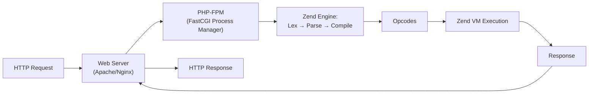

PHP is a server-side scripting language that powers over 75% of websites with known server-side technology. Despite its chaotic early history, modern PHP (8.x) is a fast, type-safe, well-designed language with a mature ecosystem. It's the backbone of WordPress, Laravel, Symfony, and Drupal.

## Prerequisites

- Programming Logic (variables, control flow, functions, data structures)
- Basic understanding of HTTP (how web requests work)

---

## Sections

1. [Syntax, Types, and the Runtime]()
2. [Control Flow and Functions]()
3. [Arrays and Strings]()
4. [Object-Oriented PHP]()
5. [Error Handling and Exceptions]()
6. [The Type System (PHP 8.x)]()
7. [Namespaces, Autoloading, and Composer]()
8. [Working with Databases (PDO)]()
9. [HTTP, Sessions, and the Request Lifecycle]()
10. [Testing with PHPUnit]()
11. [Modern PHP Patterns and Architecture]()
12. [Frameworks: Laravel and Symfony]()
13. [Performance, OpCache, and Deployment]()

---

## How PHP Executes

## Why Learn PHP Today?

| Reason | Detail |
|--------|--------|
| **Market share** | 75%+ of web — WordPress alone is 40%+ of all sites |
| **Mature ecosystem** | Composer, Laravel, Symfony, PHPUnit, static analysis (PHPStan, Psalm) |
| **Modern language features** | Enums, fibers, readonly properties, union/intersection types, match expressions |
| **Fast** | PHP 8.x with JIT is competitive with other interpreted languages |
| **Easy deployment** | Shared hosting, Docker, PaaS — runs everywhere |
| **Jobs** | Enormous demand, especially in CMS, e-commerce, and enterprise |
