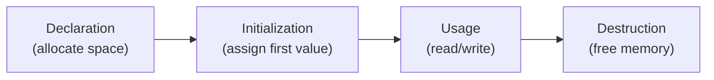
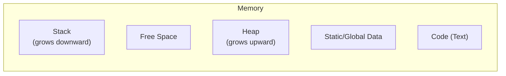

## What is a Variable?

A variable is a named reference to a location in memory where a value is stored. The name is for humans; the computer only cares about the memory address.

```text
Declaration:  int age = 25;

What happens:
1. Compiler allocates 4 bytes (for int) at address 0x7FFF001A
2. Stores the value 25 in those bytes
3. Associates the name "age" with address 0x7FFF001A
```

### Variable Lifecycle



In most languages, destruction is automatic — either when the variable goes out of scope (stack) or when the garbage collector reclaims it (heap).

---

## Primitive Data Types

### Integers

Whole numbers stored in fixed-size binary representation.

| Type | Bits | Range | Use Case |
|------|------|-------|----------|
| int8 / byte | 8 | -128 to 127 | Flags, small counters |
| int16 / short | 16 | -32,768 to 32,767 | Rarely used |
| int32 / int | 32 | -2.1B to 2.1B | Default for most integers |
| int64 / long | 64 | ±9.2 × 10¹⁸ | Timestamps, large IDs |
| uint32 | 32 | 0 to 4.2B | Array indices, sizes |

**Two's complement** is how negative numbers are stored:

```text
 5 in 8 bits: 00000101
-5 in 8 bits: 11111011 (invert bits + add 1)
```

**Overflow:** When a value exceeds the type's range, it wraps around:

```text
int8 max = 127
127 + 1 = -128 (overflow!)
```

### Floating Point (IEEE 754)

Decimal numbers stored as sign + exponent + mantissa:

```text
float (32-bit):  1 bit sign | 8 bits exponent | 23 bits mantissa
double (64-bit): 1 bit sign | 11 bits exponent | 52 bits mantissa
```

**Precision issues:**

```text
0.1 + 0.2 = 0.30000000000000004  (in most languages)
```

This is not a bug — it's a fundamental limitation of binary floating-point representation. `0.1` cannot be represented exactly in binary, just like `1/3` cannot be represented exactly in decimal.

**When precision matters** (money, scientific computation): use decimal types (`BigDecimal` in Java, `Decimal` in Python) or integer cents.

### Booleans

True or false. Internally stored as 0 (false) or 1 (true), but often occupies a full byte or word due to memory alignment.

**Truthy and falsy values** (in dynamically typed languages):

```text
Falsy: 0, "", null, undefined, NaN, false, [] (language-dependent)
Truthy: everything else
```

### Characters and Strings

A **character** is a single symbol. A **string** is a sequence of characters.

**Encoding matters:**

| Encoding | Bytes per char | Range |
|----------|---------------|-------|
| ASCII | 1 | 128 characters (English only) |
| Latin-1 | 1 | 256 characters (Western European) |
| UTF-8 | 1-4 | All Unicode (variable width) |
| UTF-16 | 2-4 | All Unicode (Java, JavaScript internal) |
| UTF-32 | 4 | All Unicode (fixed width, wasteful) |

**String immutability:** In many languages (Java, Python, JavaScript), strings are immutable — modifying a string creates a new one. This matters for performance in loops.

---

## Memory Layout

### Stack vs Heap



| Feature | Stack | Heap |
|---------|-------|------|
| Allocation | Automatic (function call) | Manual or GC-managed |
| Speed | Very fast (pointer bump) | Slower (find free block) |
| Size | Limited (1-8 MB typical) | Large (limited by RAM) |
| Lifetime | Until function returns | Until freed/collected |
| Access | LIFO order | Any order |
| Stores | Local variables, function args, return addresses | Objects, dynamic arrays, closures |

### Value Types vs Reference Types

```text
Value type (stored directly):
┌─────────────────┐
│ age: 25         │  ← value is right here on the stack
└─────────────────┘

Reference type (stored indirectly):
┌─────────────────┐     ┌──────────────────────┐
│ user: 0x8A3F    │ ──→ │ {name: "Alice", ...} │  ← object on heap
└─────────────────┘     └──────────────────────┘
   stack (reference)           heap (object)
```

**Implications:**

- Copying a value type creates an independent copy
- Copying a reference type copies the pointer — both variables point to the same object
- Comparing value types compares values; comparing reference types compares addresses (unless overridden)

---

## Type Systems

### Static vs Dynamic Typing

| Aspect | Static (Java, C, TypeScript) | Dynamic (Python, JavaScript, Ruby) |
|--------|------------------------------|-------------------------------------|
| Type checking | Compile time | Runtime |
| Declaration | Types declared explicitly (or inferred) | No type declarations |
| Errors caught | Before running | While running |
| Flexibility | Less (but safer) | More (but riskier) |
| Refactoring | Easier (compiler helps) | Harder (tests must catch) |

### Strong vs Weak Typing

| Aspect | Strong (Python, Java) | Weak (JavaScript, C) |
|--------|----------------------|---------------------|
| Implicit coercion | Rejected | Allowed |
| `"5" + 3` | Error | `"53"` (JS) or undefined behavior (C) |
| Safety | Higher | Lower |

### Type Inference

Modern static languages infer types without explicit declarations:

```text
// TypeScript
const name = "Alice";  // inferred as string
const age = 30;        // inferred as number

// Kotlin
val items = listOf(1, 2, 3)  // inferred as List<Int>

// Rust
let x = 5;  // inferred as i32
```

---

## Hypothetical Use Cases

### Use Case 1: Financial Calculation System

**Problem:** A banking system calculates interest on savings accounts.

**Wrong approach:**

```python
balance = 1000.00
rate = 0.035
# After 30 years of compound interest with floating point...
# Accumulated errors could mean cents or even dollars off
```

**Right approach:**

```python
from decimal import Decimal
balance = Decimal("1000.00")
rate = Decimal("0.035")
# Exact decimal arithmetic — no floating point errors
```

**Lesson:** Choose types based on the domain. Money requires exact decimal arithmetic.

### Use Case 2: Sensor Data Processing

**Problem:** An IoT system collects temperature readings from 10,000 sensors every second.

**Considerations:**

- Temperature range: -50°C to 150°C with 0.1° precision
- 10,000 readings/second × 86,400 seconds/day = 864 million readings/day

**Type choice:**

- `int16` storing temperature × 10 (e.g., 235 = 23.5°C): 2 bytes per reading
- `float32`: 4 bytes per reading
- `float64`: 8 bytes per reading

**Impact:** Using int16 instead of float64 saves 5.2 GB/day of storage. At scale, type choice directly affects infrastructure cost.

### Use Case 3: User ID System

**Problem:** A social platform needs unique user IDs.

**Options:**

- `int32`: max 2.1 billion users (Instagram hit this limit)
- `int64`: max 9.2 × 10¹⁸ (effectively unlimited)
- `UUID` (128-bit string): globally unique, no coordination needed, but larger

**Trade-off:** int64 is compact and fast for database indexes. UUID is better for distributed systems where multiple services create IDs independently.

---

## Common Pitfalls

### 1. Integer Overflow

```c
// C: unsigned int wraps silently
unsigned int x = 4294967295;  // max uint32
x + 1;  // 0 (wrapped!)

// Java: signed int wraps
int x = Integer.MAX_VALUE;  // 2147483647
x + 1;  // -2147483648 (wrapped!)
```

**Prevention:** Use larger types, check before arithmetic, or use languages with arbitrary-precision integers (Python).

### 2. Null/Nil References

```java
String name = null;
name.length();  // NullPointerException!
```

**Prevention:** Use Optional types, null-safe operators (`?.`), or languages that eliminate null (Rust's `Option<T>`).

### 3. String Comparison

```java
String a = new String("hello");
String b = new String("hello");
a == b;       // false (different objects!)
a.equals(b);  // true (same content)
```

**Prevention:** Always use `.equals()` for content comparison in Java. In Python, `==` compares content by default.

### 4. Floating Point Comparison

```python
0.1 + 0.2 == 0.3  # False!
abs((0.1 + 0.2) - 0.3) < 1e-9  # True (epsilon comparison)
```

**Prevention:** Never compare floats with `==`. Use epsilon comparison or exact types.

---

## Key Takeaways

1. **Choose types deliberately** — they affect correctness, performance, and storage
2. **Understand memory layout** — stack for locals, heap for dynamic data
3. **Know your type system** — static catches bugs early, dynamic gives flexibility
4. **Respect precision limits** — integers overflow, floats lose precision
5. **Value vs reference** — copying behavior differs fundamentally
