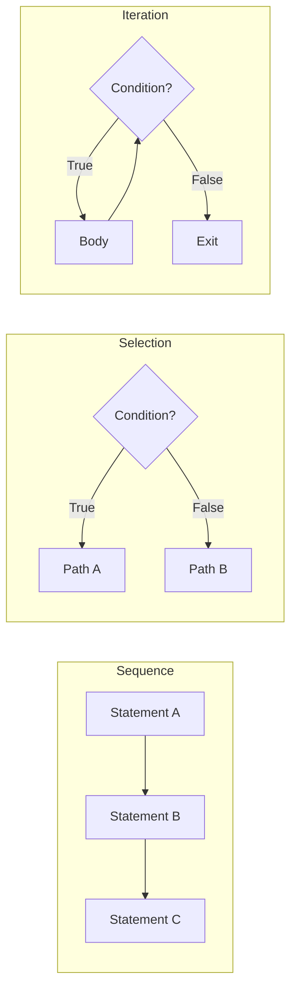
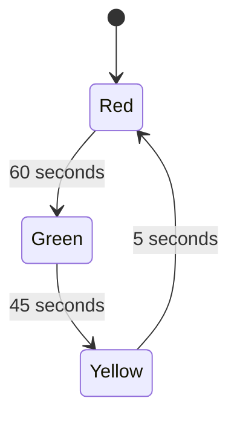

Control flow determines the execution order of statements. Without it, programs would be strictly sequential — no decisions, no repetition, no branching.

## The Three Fundamental Structures

Every algorithm can be expressed using only three structures (Böhm-Jacopini theorem):



---

## Conditionals (Selection)

### If/Else

The most basic decision structure:

```python
def classify_temperature(celsius):
    if celsius >= 40:
        return "extreme heat"
    elif celsius >= 30:
        return "hot"
    elif celsius >= 20:
        return "comfortable"
    elif celsius >= 10:
        return "cool"
    elif celsius >= 0:
        return "cold"
    else:
        return "freezing"
```

### Guard Clauses

Instead of deeply nested if/else, use early returns:

```python
# BAD — deeply nested
def process_order(order):
    if order is not None:
        if order.is_valid():
            if order.has_stock():
                if order.payment_confirmed():
                    ship(order)
                else:
                    raise PaymentError()
            else:
                raise StockError()
        else:
            raise ValidationError()
    else:
        raise ValueError("No order")

# GOOD — guard clauses (flat, readable)
def process_order(order):
    if order is None:
        raise ValueError("No order")
    if not order.is_valid():
        raise ValidationError()
    if not order.has_stock():
        raise StockError()
    if not order.payment_confirmed():
        raise PaymentError()
    ship(order)
```

### Switch/Match (Multi-way Branching)

When comparing one value against many options:

```python
# Python 3.10+ match statement
def http_status_message(code):
    match code:
        case 200:
            return "OK"
        case 301:
            return "Moved Permanently"
        case 404:
            return "Not Found"
        case 500:
            return "Internal Server Error"
        case _ if 400 <= code < 500:
            return "Client Error"
        case _ if 500 <= code < 600:
            return "Server Error"
        case _:
            return "Unknown"
```

### Ternary/Conditional Expressions

Single-line conditionals for simple cases:

```python
# Python
status = "active" if user.is_verified else "pending"

# JavaScript
const label = count === 1 ? "item" : "items";

# Java
String size = length > 100 ? "large" : "small";
```

**Rule:** Use ternary only when both branches are simple expressions. If you need logic, use a full if/else.

---

## Loops (Iteration)

### For Loops — Known Iterations

Use when you know how many times to iterate (or you're iterating over a collection):

```python
# Iterate over a collection
for user in users:
    send_notification(user)

# Iterate with index
for i, item in enumerate(items):
    print(f"{i + 1}. {item}")

# Iterate a range
for i in range(0, 100, 5):  # 0, 5, 10, ..., 95
    print(i)

# Iterate over key-value pairs
for key, value in config.items():
    print(f"{key} = {value}")
```

### While Loops — Unknown Iterations

Use when you loop until a condition changes:

```python
# Retry with backoff
def fetch_with_retry(url, max_retries=3):
    attempt = 0
    delay = 1
    
    while attempt < max_retries:
        response = requests.get(url)
        if response.status_code == 200:
            return response.json()
        
        attempt += 1
        time.sleep(delay)
        delay *= 2  # exponential backoff
    
    raise ConnectionError(f"Failed after {max_retries} attempts")
```

### Do-While (Execute at Least Once)

```java
// Java — guarantees at least one execution
Scanner scanner = new Scanner(System.in);
String input;
do {
    System.out.print("Enter 'quit' to exit: ");
    input = scanner.nextLine();
    processInput(input);
} while (!input.equals("quit"));
```

Python doesn't have do-while, but you can emulate it:

```python
while True:
    input_val = input("Enter 'quit' to exit: ")
    process_input(input_val)
    if input_val == "quit":
        break
```

### Loop Control

```python
# break — exit the loop entirely
for item in items:
    if item.is_critical_error():
        log_error(item)
        break  # stop processing

# continue — skip to next iteration
for file in files:
    if file.endswith(".tmp"):
        continue  # skip temp files
    process(file)

# else on loops (Python) — runs if loop completed without break
for user in users:
    if user.is_admin():
        admin = user
        break
else:
    # No admin found — loop completed without break
    raise NoAdminError("No admin user exists")
```

---

## Nested Control Flow

### Nested Loops

```python
# Matrix multiplication (O(n³))
def multiply_matrices(a, b):
    rows_a, cols_a = len(a), len(a[0])
    rows_b, cols_b = len(b), len(b[0])
    
    result = [[0] * cols_b for _ in range(rows_a)]
    
    for i in range(rows_a):
        for j in range(cols_b):
            for k in range(cols_a):
                result[i][j] += a[i][k] * b[k][j]
    
    return result
```

### Breaking Out of Nested Loops

```python
# Using a flag
found = False
for row in matrix:
    for cell in row:
        if cell == target:
            found = True
            break
    if found:
        break

# Better: extract to a function
def find_in_matrix(matrix, target):
    for i, row in enumerate(matrix):
        for j, cell in enumerate(row):
            if cell == target:
                return (i, j)
    return None
```

---

## Hypothetical Use Cases

### Use Case 1: Traffic Light Controller

```python
class TrafficLight:
    def __init__(self):
        self.state = "red"
        self.timer = 0
    
    def tick(self):
        """Called every second."""
        self.timer += 1
        
        match self.state:
            case "red":
                if self.timer >= 60:
                    self.state = "green"
                    self.timer = 0
            case "green":
                if self.timer >= 45:
                    self.state = "yellow"
                    self.timer = 0
            case "yellow":
                if self.timer >= 5:
                    self.state = "red"
                    self.timer = 0
```



### Use Case 2: Input Validation Pipeline

```python
def validate_registration(data):
    """Validate user registration with multiple rules."""
    errors = []
    
    # Required fields
    for field in ["email", "password", "name"]:
        if field not in data or not data[field].strip():
            errors.append(f"{field} is required")
    
    if errors:
        return {"valid": False, "errors": errors}
    
    # Email format
    if "@" not in data["email"] or "." not in data["email"].split("@")[1]:
        errors.append("Invalid email format")
    
    # Password strength
    password = data["password"]
    if len(password) < 8:
        errors.append("Password must be at least 8 characters")
    if not any(c.isupper() for c in password):
        errors.append("Password must contain an uppercase letter")
    if not any(c.isdigit() for c in password):
        errors.append("Password must contain a digit")
    
    return {"valid": len(errors) == 0, "errors": errors}
```

### Use Case 3: Pagination Iterator

```python
def fetch_all_pages(api_url, page_size=100):
    """Fetch all pages from a paginated API."""
    all_items = []
    page = 1
    
    while True:
        response = requests.get(api_url, params={"page": page, "size": page_size})
        data = response.json()
        
        items = data["items"]
        all_items.extend(items)
        
        # Exit conditions
        if len(items) < page_size:  # last page (partial)
            break
        if page >= data.get("total_pages", float("inf")):
            break
        
        page += 1
    
    return all_items
```

### Use Case 4: Game Loop

```python
def game_loop():
    """Main game loop — runs until player quits."""
    game_state = initialize_game()
    clock = pygame.time.Clock()
    
    while game_state.running:
        # 1. Handle input
        for event in pygame.event.get():
            if event.type == pygame.QUIT:
                game_state.running = False
                continue
            handle_input(game_state, event)
        
        # 2. Update state
        game_state.update(clock.get_time())
        
        # 3. Check win/lose conditions
        if game_state.player.health <= 0:
            show_game_over()
            break
        if game_state.objectives_complete():
            show_victory()
            break
        
        # 4. Render
        render(game_state)
        clock.tick(60)  # 60 FPS cap
```

---

## Common Pitfalls

### 1. Off-by-One Errors

```python
# BAD — misses last element
for i in range(len(items) - 1):  # should be range(len(items))
    process(items[i])

# BAD — index out of bounds
for i in range(1, len(items) + 1):  # items[len(items)] doesn't exist
    process(items[i])
```

### 2. Infinite Loops

```python
# BAD — condition never becomes false
i = 10
while i > 0:
    print(i)
    # forgot: i -= 1

# BAD — floating point comparison
x = 0.0
while x != 1.0:  # may never be exactly 1.0
    x += 0.1
```

### 3. Modifying Collection During Iteration

```python
# BAD — modifying list while iterating
for item in items:
    if item.is_expired():
        items.remove(item)  # skips elements!

# GOOD — filter to new list
items = [item for item in items if not item.is_expired()]

# GOOD — iterate over copy
for item in items[:]:  # slice creates a copy
    if item.is_expired():
        items.remove(item)
```

### 4. Short-Circuit Evaluation Gotchas

```python
# AND short-circuits: if first is False, second is never evaluated
if user is not None and user.is_active():  # safe — won't call .is_active() on None
    ...

# OR short-circuits: if first is True, second is never evaluated
result = cached_value or expensive_computation()  # only computes if cache is empty
```

---

## Key Takeaways

1. **Sequence, selection, iteration** — these three structures can express any algorithm
2. **Guard clauses** over deep nesting — flat code is readable code
3. **Choose the right loop** — `for` when you know iterations, `while` when you don't
4. **Always ensure termination** — every loop needs a condition that will eventually be false
5. **Avoid modifying collections during iteration** — use filters or copies instead
