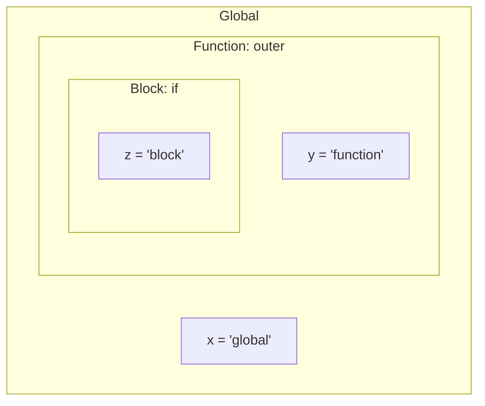

## Functions

A function encapsulates a unit of work — it takes inputs, performs computation, and produces output. Functions are the primary tool for managing complexity in software.

### Anatomy of a Function

```python
def calculate_shipping(weight_kg: float, distance_km: float, express: bool = False) -> float:
    """
    Calculate shipping cost based on weight, distance, and speed.
    
    Args:
        weight_kg: Package weight in kilograms
        distance_km: Shipping distance in kilometers
        express: Whether to use express delivery
        
    Returns:
        Shipping cost in euros
    """
    base_rate = 2.50
    weight_rate = 0.75 * weight_kg
    distance_rate = 0.01 * distance_km
    
    cost = base_rate + weight_rate + distance_rate
    
    if express:
        cost *= 1.5
    
    return round(cost, 2)
```

**Components:**

- **Name** — describes what it does (verb + noun)
- **Parameters** — inputs with types and defaults
- **Body** — the logic
- **Return value** — the output
- **Docstring** — documentation for humans

### Pure Functions

A pure function:

1. Always returns the same output for the same inputs (deterministic)
2. Has no side effects (doesn't modify external state)

```python
# PURE — same input always gives same output, no side effects
def add(a: int, b: int) -> int:
    return a + b

# IMPURE — depends on external state
total = 0
def add_to_total(n: int) -> int:
    global total
    total += n  # side effect: modifies global state
    return total

# IMPURE — non-deterministic
def get_timestamp() -> float:
    return time.time()  # different result each call
```

**Why pure functions matter:**

- Easy to test (no setup/teardown)
- Easy to reason about (no hidden dependencies)
- Safe to parallelize (no shared state)
- Cacheable (memoization)

### Function Composition

Build complex behavior from simple functions:

```python
def normalize(text: str) -> str:
    return text.strip().lower()

def remove_punctuation(text: str) -> str:
    return "".join(c for c in text if c.isalnum() or c.isspace())

def tokenize(text: str) -> list[str]:
    return text.split()

# Compose
def process_text(text: str) -> list[str]:
    return tokenize(remove_punctuation(normalize(text)))

# Or with a pipeline helper
from functools import reduce
def pipe(value, *functions):
    return reduce(lambda v, f: f(v), functions, value)

result = pipe("  Hello, World!  ", normalize, remove_punctuation, tokenize)
# ["hello", "world"]
```

### Higher-Order Functions

Functions that take functions as arguments or return functions:

```python
# Takes a function as argument
def apply_to_all(items, transform):
    return [transform(item) for item in items]

prices_with_tax = apply_to_all(prices, lambda p: p * 1.21)

# Returns a function
def multiplier(factor):
    def multiply(x):
        return x * factor
    return multiply

double = multiplier(2)
triple = multiplier(3)
double(5)  # 10
triple(5)  # 15
```

---

## Scope

Scope defines where a variable is visible and accessible.

### Lexical (Static) Scope

Variables are resolved based on where they are **defined** in the source code, not where they are **called**:

```python
x = "global"

def outer():
    x = "outer"
    
    def inner():
        print(x)  # "outer" — resolved by looking at enclosing scope
    
    inner()

outer()
```

### Scope Levels



**Python's LEGB rule** (lookup order):

1. **L**ocal — inside the current function
2. **E**nclosing — in enclosing function(s)
3. **G**lobal — module level
4. **B**uilt-in — Python's built-in names

```python
x = "global"

def outer():
    x = "enclosing"
    
    def inner():
        x = "local"
        print(x)  # "local" (L)
    
    inner()
    print(x)  # "enclosing" (E from inner's perspective, L from outer's)

outer()
print(x)  # "global" (G)
```

### Closures

A closure is a function that captures variables from its enclosing scope:

```python
def make_counter(start=0):
    count = start  # captured by the returned function
    
    def increment():
        nonlocal count
        count += 1
        return count
    
    return increment

counter_a = make_counter(0)
counter_b = make_counter(100)

counter_a()  # 1
counter_a()  # 2
counter_b()  # 101 — independent state
```

**Use cases for closures:**

- Factory functions (create configured functions)
- Data privacy (encapsulate state without classes)
- Callbacks and event handlers
- Partial application

### Variable Shadowing

When an inner scope declares a variable with the same name as an outer scope:

```python
x = 10

def example():
    x = 20  # shadows the global x — does NOT modify it
    print(x)  # 20

example()
print(x)  # 10 — unchanged
```

**Danger:** Shadowing can cause subtle bugs when you think you're modifying the outer variable but you're actually creating a new local one.

---

## Recursion

A function that calls itself to solve a problem by breaking it into smaller instances of the same problem.

### Structure of Recursive Functions

Every recursive function needs:

1. **Base case** — the simplest instance that can be solved directly
2. **Recursive case** — break the problem down and call self with a smaller input
3. **Progress toward base case** — each call must get closer to the base case

```python
def factorial(n: int) -> int:
    # Base case
    if n <= 1:
        return 1
    # Recursive case (n is smaller each time → progress)
    return n * factorial(n - 1)
```

### Call Stack Visualization

```text
factorial(5)
├── 5 * factorial(4)
│   ├── 4 * factorial(3)
│   │   ├── 3 * factorial(2)
│   │   │   ├── 2 * factorial(1)
│   │   │   │   └── return 1  ← base case
│   │   │   └── return 2 * 1 = 2
│   │   └── return 3 * 2 = 6
│   └── return 4 * 6 = 24
└── return 5 * 24 = 120
```

Each call adds a **stack frame** — memory for local variables and the return address. Too many calls → **stack overflow**.

### Classic Recursive Problems

#### Binary Search

```python
def binary_search(arr: list, target, low: int = 0, high: int = None) -> int:
    if high is None:
        high = len(arr) - 1
    
    # Base case: not found
    if low > high:
        return -1
    
    mid = (low + high) // 2
    
    if arr[mid] == target:
        return mid  # Base case: found
    elif arr[mid] < target:
        return binary_search(arr, target, mid + 1, high)  # Search right
    else:
        return binary_search(arr, target, low, mid - 1)  # Search left
```

#### Tree Traversal

```python
class TreeNode:
    def __init__(self, value, left=None, right=None):
        self.value = value
        self.left = left
        self.right = right

def inorder(node: TreeNode) -> list:
    """Left → Root → Right (gives sorted order for BST)."""
    if node is None:
        return []  # Base case
    return inorder(node.left) + [node.value] + inorder(node.right)

def tree_depth(node: TreeNode) -> int:
    """Maximum depth of the tree."""
    if node is None:
        return 0  # Base case
    return 1 + max(tree_depth(node.left), tree_depth(node.right))
```

#### Directory Traversal

```python
from pathlib import Path

def find_files(directory: Path, extension: str) -> list[Path]:
    """Recursively find all files with given extension."""
    results = []
    
    for item in directory.iterdir():
        if item.is_file() and item.suffix == extension:
            results.append(item)
        elif item.is_dir():
            results.extend(find_files(item, extension))  # Recurse into subdirectory
    
    return results
```

### Tail Recursion

A recursive call is **tail recursive** if it's the very last operation in the function (nothing happens after the recursive call returns):

```python
# NOT tail recursive — multiplication happens AFTER the recursive call
def factorial(n):
    if n <= 1:
        return 1
    return n * factorial(n - 1)  # must multiply after return

# Tail recursive — recursive call IS the last operation
def factorial_tail(n, accumulator=1):
    if n <= 1:
        return accumulator
    return factorial_tail(n - 1, n * accumulator)  # nothing after this
```

Some languages (Scheme, Haskell, Scala) optimize tail recursion into a loop (no stack growth). Python and Java do **not** — use iteration for deep recursion in these languages.

### Recursion vs Iteration

| Aspect | Recursion | Iteration |
|--------|-----------|-----------|
| Readability | Often clearer for tree/divide-and-conquer | Clearer for simple sequences |
| Performance | Stack overhead per call | No overhead |
| Stack risk | Stack overflow on deep recursion | No risk |
| State | Implicit (call stack) | Explicit (variables) |
| Best for | Trees, graphs, divide-and-conquer | Linear sequences, known iterations |

**Rule of thumb:** Use recursion when the problem is naturally recursive (trees, nested structures, divide-and-conquer). Use iteration for everything else.

---

## Hypothetical Use Cases

### Use Case 1: Configuration Builder (Closures)

```python
def create_api_client(base_url: str, api_key: str, timeout: int = 30):
    """Factory that creates a configured API client function."""
    
    def request(method: str, path: str, data=None):
        url = f"{base_url}{path}"
        headers = {"Authorization": f"Bearer {api_key}"}
        response = requests.request(method, url, json=data, headers=headers, timeout=timeout)
        response.raise_for_status()
        return response.json()
    
    return request

# Create configured clients
prod_api = create_api_client("https://api.prod.example.com", "prod-key-xxx")
staging_api = create_api_client("https://api.staging.example.com", "staging-key-yyy", timeout=60)

# Use them — configuration is captured in the closure
users = prod_api("GET", "/users")
```

### Use Case 2: Permission Checker (Recursion)

```python
def has_permission(user, resource, permission, visited=None):
    """Check if user has permission, following group inheritance."""
    if visited is None:
        visited = set()
    
    # Prevent infinite loops in circular group membership
    if user.id in visited:
        return False
    visited.add(user.id)
    
    # Direct permission check
    if permission in user.permissions_for(resource):
        return True
    
    # Check inherited permissions from groups (recursive)
    for group in user.groups:
        if has_permission(group, resource, permission, visited):
            return True
    
    return False
```

### Use Case 3: Memoization (Pure Functions + Caching)

```python
from functools import lru_cache

@lru_cache(maxsize=1000)
def fibonacci(n: int) -> int:
    """Fibonacci with memoization — O(n) instead of O(2^n)."""
    if n <= 1:
        return n
    return fibonacci(n - 1) + fibonacci(n - 2)

# Without memoization: fibonacci(40) takes seconds
# With memoization: fibonacci(40) is instant (cached results)
```

---

## Key Takeaways

1. **Functions should do one thing** — if you can't name it clearly, it's doing too much
2. **Prefer pure functions** — they're testable, cacheable, and parallelizable
3. **Understand scope** — know where your variables live and die
4. **Closures capture state** — powerful for factories and callbacks
5. **Recursion needs a base case** — without it, you get stack overflow
6. **Match the tool to the problem** — recursion for trees, iteration for sequences
