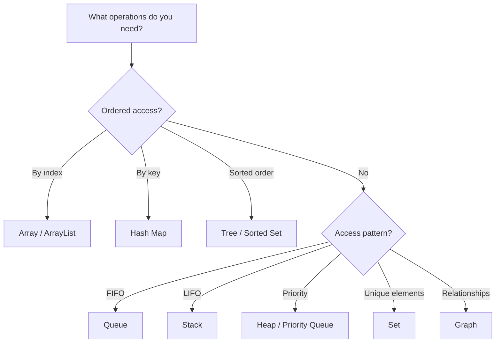
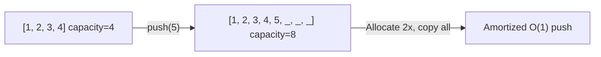
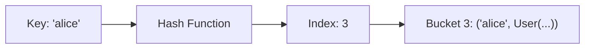

Data structures organize data for efficient access and modification. The right structure can make the difference between an algorithm that runs in milliseconds and one that takes hours.

## Choosing a Data Structure



---

## Arrays and Dynamic Arrays

### Static Arrays

Fixed-size, contiguous memory block. The most fundamental data structure.

```text
Memory layout (int array of size 5):
Address:  0x100  0x104  0x108  0x10C  0x110
Value:    [  10 ][  20 ][  30 ][  40 ][  50 ]
Index:       0      1      2      3      4

Access arr[3]: base_address + (3 × element_size) = 0x100 + 12 = 0x10C → 40
```

**Why O(1) access:** Direct address calculation — no searching needed.

### Dynamic Arrays (ArrayList, Vec, list)

Automatically resize when full:



**Amortized O(1) append:** Most appends are O(1) (just write to next slot). Occasionally O(n) when resizing. Averaged over n operations → O(1) per operation.

### Operations Complexity

| Operation | Static Array | Dynamic Array |
|-----------|-------------|---------------|
| Access by index | O(1) | O(1) |
| Search (unsorted) | O(n) | O(n) |
| Search (sorted) | O(log n) binary search | O(log n) |
| Append | N/A (fixed) | O(1) amortized |
| Insert at index | O(n) shift | O(n) shift |
| Delete at index | O(n) shift | O(n) shift |
| Insert at beginning | O(n) | O(n) |

### Use Case: Time Series Data

```python
class TimeSeriesBuffer:
    """Fixed-size circular buffer for sensor readings."""
    
    def __init__(self, capacity: int):
        self.buffer = [None] * capacity
        self.capacity = capacity
        self.head = 0
        self.count = 0
    
    def add(self, reading: float):
        self.buffer[self.head] = reading
        self.head = (self.head + 1) % self.capacity
        self.count = min(self.count + 1, self.capacity)
    
    def average(self) -> float:
        if self.count == 0:
            return 0.0
        return sum(r for r in self.buffer[:self.count] if r is not None) / self.count
    
    def latest(self, n: int) -> list:
        """Get the n most recent readings."""
        result = []
        idx = (self.head - 1) % self.capacity
        for _ in range(min(n, self.count)):
            result.append(self.buffer[idx])
            idx = (idx - 1) % self.capacity
        return result
```

---

## Linked Lists

### Singly Linked List

Each node stores data and a pointer to the next node:

```text
Head → [10|→] → [20|→] → [30|→] → [40|∅]

Node structure:
┌──────┬──────┐
│ data │ next │
└──────┴──────┘
```

```python
class Node:
    def __init__(self, data, next_node=None):
        self.data = data
        self.next = next_node

class LinkedList:
    def __init__(self):
        self.head = None
        self.size = 0
    
    def prepend(self, data):
        """O(1) — insert at beginning."""
        self.head = Node(data, self.head)
        self.size += 1
    
    def find(self, data):
        """O(n) — search for value."""
        current = self.head
        while current:
            if current.data == data:
                return current
            current = current.next
        return None
    
    def delete(self, data):
        """O(n) — find and remove."""
        if self.head and self.head.data == data:
            self.head = self.head.next
            self.size -= 1
            return True
        
        current = self.head
        while current and current.next:
            if current.next.data == data:
                current.next = current.next.next
                self.size -= 1
                return True
            current = current.next
        return False
```

### Doubly Linked List

Each node has pointers to both next and previous:

```text
∅ ← [←|10|→] ⇄ [←|20|→] ⇄ [←|30|→] → ∅
      head                       tail
```

**Advantage:** O(1) deletion when you have a reference to the node (no need to find the previous node).

### When to Use Linked Lists

| Use Case | Why Linked List |
|----------|----------------|
| LRU Cache | O(1) move-to-front with doubly linked list |
| Undo history | O(1) push/pop at head |
| Music playlist | O(1) insert/remove anywhere (given position) |
| Memory allocator | Free list of available blocks |

**When NOT to use:** Random access, cache-friendly iteration (arrays are better due to memory locality).

---

## Stacks

### LIFO — Last In, First Out

```python
class Stack:
    def __init__(self):
        self._items = []
    
    def push(self, item):
        self._items.append(item)
    
    def pop(self):
        if self.is_empty():
            raise IndexError("Stack is empty")
        return self._items.pop()
    
    def peek(self):
        if self.is_empty():
            raise IndexError("Stack is empty")
        return self._items[-1]
    
    def is_empty(self) -> bool:
        return len(self._items) == 0
```

### Use Case: Balanced Parentheses Checker

```python
def is_balanced(expression: str) -> bool:
    """Check if brackets are properly balanced."""
    stack = []
    pairs = {")": "(", "]": "[", "}": "{"}
    
    for char in expression:
        if char in "([{":
            stack.append(char)
        elif char in ")]}":
            if not stack or stack[-1] != pairs[char]:
                return False
            stack.pop()
    
    return len(stack) == 0

is_balanced("({[]})")   # True
is_balanced("({[}])")   # False — mismatched
is_balanced("((())")    # False — unclosed
```

### Use Case: Undo/Redo System

```python
class UndoRedoManager:
    def __init__(self):
        self.undo_stack = []
        self.redo_stack = []
    
    def execute(self, command):
        """Execute a command and push to undo stack."""
        command.execute()
        self.undo_stack.append(command)
        self.redo_stack.clear()  # new action invalidates redo history
    
    def undo(self):
        if not self.undo_stack:
            return
        command = self.undo_stack.pop()
        command.reverse()
        self.redo_stack.append(command)
    
    def redo(self):
        if not self.redo_stack:
            return
        command = self.redo_stack.pop()
        command.execute()
        self.undo_stack.append(command)
```

---

## Queues

### FIFO — First In, First Out

```python
from collections import deque

class Queue:
    def __init__(self):
        self._items = deque()
    
    def enqueue(self, item):
        self._items.append(item)
    
    def dequeue(self):
        if self.is_empty():
            raise IndexError("Queue is empty")
        return self._items.popleft()  # O(1) with deque
    
    def peek(self):
        return self._items[0]
    
    def is_empty(self) -> bool:
        return len(self._items) == 0
```

### Priority Queue

Elements dequeue in priority order, not insertion order:

```python
import heapq

class PriorityQueue:
    def __init__(self):
        self._heap = []
        self._counter = 0  # for stable ordering of equal priorities
    
    def push(self, item, priority: int):
        heapq.heappush(self._heap, (priority, self._counter, item))
        self._counter += 1
    
    def pop(self):
        _, _, item = heapq.heappop(self._heap)
        return item
```

### Use Case: Task Scheduler

```python
class TaskScheduler:
    """Process tasks by priority — lower number = higher priority."""
    
    def __init__(self):
        self.queue = PriorityQueue()
    
    def add_task(self, task_name: str, priority: int):
        self.queue.push(task_name, priority)
    
    def process_next(self) -> str:
        return self.queue.pop()

scheduler = TaskScheduler()
scheduler.add_task("Send email", priority=3)
scheduler.add_task("Process payment", priority=1)  # highest priority
scheduler.add_task("Update cache", priority=5)
scheduler.add_task("Log event", priority=4)

scheduler.process_next()  # "Process payment" (priority 1)
scheduler.process_next()  # "Send email" (priority 3)
```

---

## Hash Maps (Dictionaries)

### How Hashing Works



```python
# Simplified hash map implementation
class HashMap:
    def __init__(self, capacity=16):
        self.capacity = capacity
        self.buckets = [[] for _ in range(capacity)]
        self.size = 0
    
    def _hash(self, key) -> int:
        return hash(key) % self.capacity
    
    def put(self, key, value):
        index = self._hash(key)
        bucket = self.buckets[index]
        
        # Update existing key
        for i, (k, v) in enumerate(bucket):
            if k == key:
                bucket[i] = (key, value)
                return
        
        # New key
        bucket.append((key, value))
        self.size += 1
        
        # Resize if load factor > 0.75
        if self.size / self.capacity > 0.75:
            self._resize()
    
    def get(self, key, default=None):
        index = self._hash(key)
        for k, v in self.buckets[index]:
            if k == key:
                return v
        return default
```

### Collision Resolution

When two keys hash to the same index:

**Chaining** (most common): Each bucket is a linked list/array of entries.

**Open addressing:** Probe the next available slot (linear probing, quadratic probing, double hashing).

### Use Case: Word Frequency Counter

```python
def word_frequency(text: str) -> dict[str, int]:
    """Count word occurrences — O(n) time, O(k) space where k = unique words."""
    freq = {}
    for word in text.lower().split():
        word = word.strip(".,!?;:")
        freq[word] = freq.get(word, 0) + 1
    return freq

# Sort by frequency
sorted_freq = sorted(freq.items(), key=lambda x: x[1], reverse=True)
```

### Use Case: Two-Sum Problem

```python
def two_sum(numbers: list[int], target: int) -> tuple[int, int]:
    """Find two indices whose values sum to target — O(n) with hash map."""
    seen = {}  # value → index
    
    for i, num in enumerate(numbers):
        complement = target - num
        if complement in seen:
            return (seen[complement], i)
        seen[num] = i
    
    return None
```

---

## Trees

### Binary Search Tree (BST)

```python
class BSTNode:
    def __init__(self, key, value=None):
        self.key = key
        self.value = value
        self.left = None
        self.right = None

class BST:
    def __init__(self):
        self.root = None
    
    def insert(self, key, value=None):
        self.root = self._insert(self.root, key, value)
    
    def _insert(self, node, key, value):
        if node is None:
            return BSTNode(key, value)
        if key < node.key:
            node.left = self._insert(node.left, key, value)
        elif key > node.key:
            node.right = self._insert(node.right, key, value)
        else:
            node.value = value  # update existing
        return node
    
    def search(self, key):
        node = self.root
        while node:
            if key == node.key:
                return node.value
            elif key < node.key:
                node = node.left
            else:
                node = node.right
        return None
```

### Balanced vs Unbalanced

```text
Balanced (O(log n)):        Unbalanced (O(n) — degenerate):
       4                    1
      / \                    \
     2   6                    2
    / \ / \                    \
   1  3 5  7                    3
                                 \
                                  4
```

Inserting sorted data into a BST creates a linked list. Self-balancing trees (AVL, Red-Black) prevent this.

### Use Case: Autocomplete System

```python
class TrieNode:
    def __init__(self):
        self.children = {}
        self.is_end = False
        self.frequency = 0

class Autocomplete:
    def __init__(self):
        self.root = TrieNode()
    
    def insert(self, word: str, frequency: int = 1):
        node = self.root
        for char in word:
            if char not in node.children:
                node.children[char] = TrieNode()
            node = node.children[char]
        node.is_end = True
        node.frequency += frequency
    
    def suggest(self, prefix: str, limit: int = 5) -> list[str]:
        """Find top suggestions for a prefix."""
        node = self.root
        for char in prefix:
            if char not in node.children:
                return []
            node = node.children[char]
        
        # DFS to find all words with this prefix
        results = []
        self._collect(node, prefix, results)
        
        # Sort by frequency, return top N
        results.sort(key=lambda x: x[1], reverse=True)
        return [word for word, freq in results[:limit]]
    
    def _collect(self, node, prefix, results):
        if node.is_end:
            results.append((prefix, node.frequency))
        for char, child in node.children.items():
            self._collect(child, prefix + char, results)
```

---

## Graphs

### Representations

```python
# Adjacency List (most common — good for sparse graphs)
graph = {
    "A": [("B", 5), ("C", 2)],
    "B": [("D", 1)],
    "C": [("D", 4), ("E", 3)],
    "D": [("E", 6)],
    "E": [],
}

# Adjacency Matrix (good for dense graphs)
#     A  B  C  D  E
# A [ 0, 5, 2, 0, 0 ]
# B [ 0, 0, 0, 1, 0 ]
# C [ 0, 0, 0, 4, 3 ]
# D [ 0, 0, 0, 0, 6 ]
# E [ 0, 0, 0, 0, 0 ]
```

### BFS — Shortest Path (Unweighted)

```python
from collections import deque

def bfs_shortest_path(graph: dict, start: str, end: str) -> list[str]:
    """Find shortest path in unweighted graph."""
    queue = deque([(start, [start])])
    visited = {start}
    
    while queue:
        node, path = queue.popleft()
        
        if node == end:
            return path
        
        for neighbor, _ in graph.get(node, []):
            if neighbor not in visited:
                visited.add(neighbor)
                queue.append((neighbor, path + [neighbor]))
    
    return []  # no path found
```

### DFS — Cycle Detection

```python
def has_cycle(graph: dict) -> bool:
    """Detect cycle in directed graph using DFS."""
    WHITE, GRAY, BLACK = 0, 1, 2
    color = {node: WHITE for node in graph}
    
    def dfs(node):
        color[node] = GRAY  # currently being explored
        
        for neighbor, _ in graph.get(node, []):
            if color[neighbor] == GRAY:
                return True  # back edge → cycle!
            if color[neighbor] == WHITE and dfs(neighbor):
                return True
        
        color[node] = BLACK  # fully explored
        return False
    
    return any(dfs(node) for node in graph if color[node] == WHITE)
```

### Use Case: Social Network (Degrees of Separation)

```python
def degrees_of_separation(social_graph: dict, person_a: str, person_b: str) -> int:
    """Find shortest connection path between two people."""
    if person_a == person_b:
        return 0
    
    queue = deque([(person_a, 0)])
    visited = {person_a}
    
    while queue:
        person, distance = queue.popleft()
        
        for friend in social_graph.get(person, []):
            if friend == person_b:
                return distance + 1
            if friend not in visited:
                visited.add(friend)
                queue.append((friend, distance + 1))
    
    return -1  # not connected
```

---

## Complexity Comparison

| Structure | Access | Search | Insert | Delete | Space |
|-----------|--------|--------|--------|--------|-------|
| Array | O(1) | O(n) | O(n) | O(n) | O(n) |
| Linked List | O(n) | O(n) | O(1)* | O(1)* | O(n) |
| Stack | O(n) | O(n) | O(1) | O(1) | O(n) |
| Queue | O(n) | O(n) | O(1) | O(1) | O(n) |
| Hash Map | N/A | O(1) avg | O(1) avg | O(1) avg | O(n) |
| BST (balanced) | O(log n) | O(log n) | O(log n) | O(log n) | O(n) |
| Heap | O(1) min/max | O(n) | O(log n) | O(log n) | O(n) |

*When you have a reference to the position.

---

## Key Takeaways

1. **No universal best structure** — choose based on your access patterns
2. **Hash maps are your default** — O(1) lookup covers most needs
3. **Arrays for ordered, indexed data** — cache-friendly and simple
4. **Trees for sorted data** — when you need range queries or ordered iteration
5. **Graphs for relationships** — social networks, dependencies, routes
6. **Know the trade-offs** — fast insert often means slow search, and vice versa
