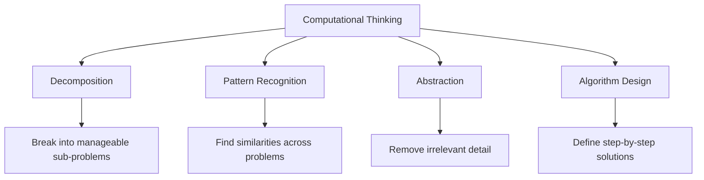
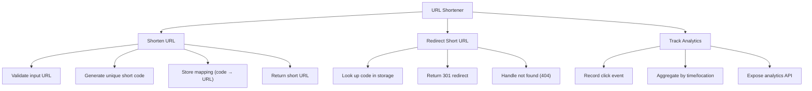
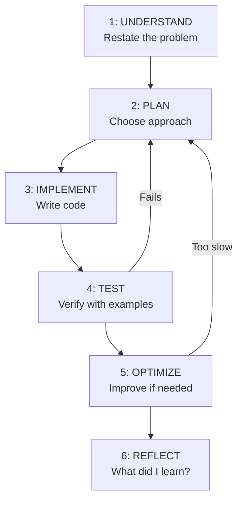

Computational thinking is the process of formulating problems so they can be solved systematically. It's not about computers — it's about structured problem-solving that happens to be executable by machines.

---

## The Four Pillars



---

## Decomposition

### Breaking Problems Down

Every complex system is made of simpler parts. Decomposition is identifying those parts and their relationships.

#### Example: Build an e-commerce checkout system

Level 0 (monolithic): "Process a customer order"

Level 1 (decomposed):

1. Validate cart contents
2. Calculate totals (subtotal, tax, shipping)
3. Process payment
4. Update inventory
5. Create order record
6. Send confirmation email
7. Trigger fulfillment

Level 2 (further decomposed — "Process payment"):

1. Validate payment method
2. Check for fraud indicators
3. Authorize with payment gateway
4. Handle success/failure
5. Store transaction record

Each sub-problem is now small enough to implement and test independently.

### Decomposition Strategies

| Strategy | When to Use | Example |
|----------|-------------|---------|
| **Functional** | Clear input/output steps | Data pipeline: extract → transform → load |
| **Object-based** | Entities with state + behavior | User, Order, Product, Cart |
| **Event-based** | Reactive systems | OrderPlaced → UpdateInventory, SendEmail |
| **Layer-based** | Separation of concerns | UI → Business Logic → Data Access |

### Use Case: URL Shortener

**Problem:** Build a URL shortening service (like bit.ly).

**Decomposition:**



Each box is independently implementable and testable.

---

## Pattern Recognition

### Identifying Recurring Structures

When you see the same shape repeated, you've found a pattern that can be generalized.

#### Pattern: Retry with backoff

Appears in:

- HTTP client retrying failed requests
- Database connection retry
- Message queue consumer retry
- File upload retry

```python
def retry_with_backoff(operation, max_retries=3, base_delay=1.0):
    """Generic retry pattern — works for any operation."""
    for attempt in range(max_retries):
        try:
            return operation()
        except Exception as e:
            if attempt == max_retries - 1:
                raise
            delay = base_delay * (2 ** attempt)  # exponential backoff
            time.sleep(delay)
```

#### Pattern: Producer-Consumer

Appears in:

- Web server handling requests (accept → queue → worker processes)
- Log aggregation (apps produce logs → queue → storage consumes)
- Video encoding (upload → queue → encoder processes)

```python
import queue
import threading

def producer(q, items):
    for item in items:
        q.put(item)
    q.put(None)  # sentinel: "no more items"

def consumer(q, process_fn):
    while True:
        item = q.get()
        if item is None:
            break
        process_fn(item)
        q.task_done()
```

#### Pattern: Map-Filter-Reduce

Transform collections in three steps:

1. **Map** — transform each element
2. **Filter** — keep elements matching a condition
3. **Reduce** — combine elements into a single result

```python
# Calculate total revenue from premium customers
total_revenue = (
    orders
    |> map(lambda o: {"customer": o.customer, "amount": o.total})  # extract
    |> filter(lambda o: o["customer"].is_premium)                   # filter
    |> reduce(lambda acc, o: acc + o["amount"], 0)                  # aggregate
)

# In Python:
from functools import reduce
premium_orders = [o for o in orders if o.customer.is_premium]
total_revenue = sum(o.total for o in premium_orders)
```

---

## Abstraction

### Hiding Complexity

Abstraction means exposing only what's necessary and hiding implementation details.

**Levels of abstraction in a web request:**

```text
User clicks "Buy" button
    ↓ (UI abstraction)
JavaScript sends HTTP POST to /api/orders
    ↓ (HTTP abstraction)
TCP connection established, data sent as packets
    ↓ (TCP abstraction)
IP packets routed across networks
    ↓ (IP abstraction)
Ethernet frames transmitted over physical medium
    ↓ (Physical abstraction)
Electrical signals on copper wire
```

Each layer only knows about the layer directly below it. The UI developer doesn't think about TCP packets.

### Good Abstractions

```python
# BAD — leaks implementation details
class UserRepository:
    def get_user_by_sql(self, sql_query: str) -> User:
        # Caller must know SQL and database schema
        ...

# GOOD — hides implementation
class UserRepository:
    def find_by_email(self, email: str) -> User | None:
        # Caller doesn't know if it's SQL, MongoDB, or an API
        ...
    
    def find_active_users(self, since: datetime) -> list[User]:
        ...
```

### The Right Level of Abstraction

Too little abstraction → code is coupled to implementation details, hard to change.
Too much abstraction → code is over-engineered, hard to understand.

```python
# Too abstract — what does this even do?
class AbstractStrategyFactoryProvider:
    def create_strategy_factory(self, context: AbstractContext) -> AbstractFactory:
        ...

# Just right — clear purpose, hides implementation
class EmailSender:
    def send(self, to: str, subject: str, body: str) -> bool:
        ...
```

**Rule:** Abstractions should match the domain language. If a non-programmer stakeholder can understand the interface names, you're at the right level.

---

## Algorithm Design

### Problem-Solving Framework



### Step 1: Understand

Before writing any code:

- Restate the problem in your own words
- Identify inputs and outputs
- Clarify constraints (size limits, time requirements)
- Work through examples by hand
- Identify edge cases

**Example:** "Find the longest substring without repeating characters"

- Input: string `"abcabcbb"`
- Output: integer `3` (the substring `"abc"`)
- Edge cases: empty string → 0, single char → 1, all same chars → 1

### Step 2: Plan

Choose an approach before coding:

```python
# Approach 1: Brute force — check all substrings O(n³)
# Approach 2: Sliding window — expand/contract window O(n)

# Sliding window plan:
# - Maintain a window [left, right]
# - Expand right, adding chars to a set
# - If duplicate found, shrink from left until no duplicate
# - Track maximum window size
```

### Step 3: Implement

```python
def longest_unique_substring(s: str) -> int:
    char_set = set()
    left = 0
    max_length = 0
    
    for right in range(len(s)):
        while s[right] in char_set:
            char_set.remove(s[left])
            left += 1
        
        char_set.add(s[right])
        max_length = max(max_length, right - left + 1)
    
    return max_length
```

### Step 4: Test

```python
assert longest_unique_substring("abcabcbb") == 3
assert longest_unique_substring("bbbbb") == 1
assert longest_unique_substring("pwwkew") == 3
assert longest_unique_substring("") == 0
assert longest_unique_substring("a") == 1
assert longest_unique_substring("abcdefg") == 7  # entire string
```

---

## Real-World Problem Decomposition

### Use Case: Design a Rate Limiter

**Problem:** Limit API requests to 100 per minute per user.

**Decomposition:**

1. **Identify the user** — extract user ID from request (API key, JWT, IP)
2. **Track requests** — store timestamps of recent requests per user
3. **Check limit** — count requests in the last 60 seconds
4. **Enforce** — allow or reject with 429 status

**Pattern recognition:** This is a sliding window problem (same pattern as "longest substring").

**Algorithm choice:** Sliding window counter with a sorted set of timestamps.

```python
import time
from collections import defaultdict

class RateLimiter:
    def __init__(self, max_requests: int, window_seconds: int):
        self.max_requests = max_requests
        self.window_seconds = window_seconds
        self.requests = defaultdict(list)  # user_id → [timestamps]
    
    def is_allowed(self, user_id: str) -> bool:
        now = time.time()
        window_start = now - self.window_seconds
        
        # Remove expired timestamps
        self.requests[user_id] = [
            ts for ts in self.requests[user_id] if ts > window_start
        ]
        
        # Check limit
        if len(self.requests[user_id]) >= self.max_requests:
            return False
        
        # Record this request
        self.requests[user_id].append(now)
        return True
```

**Abstraction:** The caller just asks `is_allowed(user_id)` — they don't know about sliding windows or timestamp lists.

### Use Case: Design a Notification System

**Problem:** Send notifications to users via email, SMS, or push — with preferences, rate limiting, and retry.

**Decomposition:**

```text
NotificationSystem
├── NotificationRouter
│   ├── Check user preferences (email? SMS? push?)
│   ├── Check quiet hours
│   └── Route to appropriate channel
├── Channels
│   ├── EmailChannel (SMTP integration)
│   ├── SMSChannel (Twilio integration)
│   └── PushChannel (Firebase integration)
├── RateLimiter
│   └── Max 5 notifications per hour per user
├── RetryManager
│   └── Retry failed sends with exponential backoff
└── TemplateEngine
    └── Render notification content from templates
```

**Pattern recognition:**

- Router → Strategy pattern
- Channels → Adapter pattern (same interface, different implementations)
- Retry → Retry with backoff pattern
- Rate limiting → Sliding window pattern

---

## Thinking Techniques

### Working Backwards

Start from the desired output and work backwards to the input:

**Problem:** "Generate all valid combinations of n pairs of parentheses"

**Output for n=3:** `["((()))", "(()())", "(())()", "()(())", "()()()"]`

**Working backwards:**

- A valid combination has n open and n close parens
- At any point, open count ≥ close count
- This is a tree of choices: at each step, add `(` or `)`
- Prune branches where close > open (invalid)

```python
def generate_parentheses(n: int) -> list[str]:
    results = []
    
    def backtrack(current: str, open_count: int, close_count: int):
        if len(current) == 2 * n:
            results.append(current)
            return
        
        if open_count < n:
            backtrack(current + "(", open_count + 1, close_count)
        if close_count < open_count:
            backtrack(current + ")", open_count, close_count + 1)
    
    backtrack("", 0, 0)
    return results
```

### Simplify First

Solve a simpler version, then generalize:

**Problem:** "Find the shortest path in a weighted graph"

1. First solve: shortest path in an unweighted graph (BFS)
2. Then add: weights (Dijkstra's algorithm)
3. Then add: negative weights (Bellman-Ford)

### Visualize

Draw the problem:

- Arrays → draw the elements with indices
- Trees → draw the nodes and edges
- Graphs → draw vertices and connections
- State machines → draw states and transitions

---

## Key Takeaways

1. **Decompose before coding** — break the problem into pieces you can hold in your head
2. **Recognize patterns** — most problems are variations of known patterns
3. **Abstract at the right level** — hide complexity but don't over-engineer
4. **Solve simple cases first** — then generalize
5. **The best programmers think more than they type** — planning prevents rework
6. **Every complex system is simple parts composed** — find the parts, define the composition
