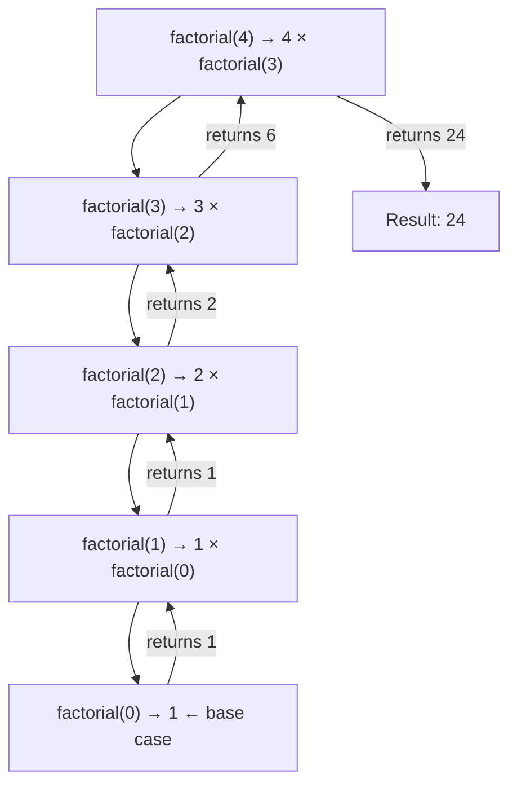
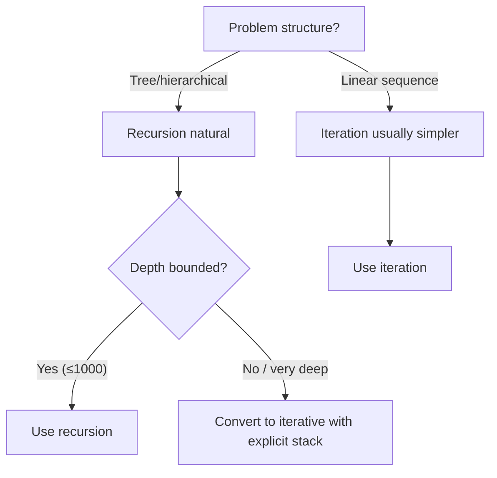

Recursion is a strategy where a function solves a problem by reducing it to smaller instances of the same problem. Section 03 introduced the concept — this section explores recursive thinking in depth, visualises the call stack, and tackles classic recursive problems.

---

## Recursive Thinking

Every recursive solution requires two components:

| Component | Purpose | Example (factorial) |
|-----------|---------|---------------------|
| **Base case** | Stops recursion, returns a known value | `factorial(0) = 1` |
| **Recursive case** | Reduces the problem toward the base case | `factorial(n) = n × factorial(n-1)` |

### The Reduction Pattern

Recursive thinking means asking: *"If I already had the answer for a smaller input, how would I build the answer for the current input?"*

```python
def sum_list(items):
    """Sum all elements by reducing the problem one element at a time."""
    if not items:          # Base case: empty list sums to 0
        return 0
    return items[0] + sum_list(items[1:])  # Current + solution to smaller problem
```

### Multiple Base Cases

Some problems require more than one base case:

```python
def fibonacci(n):
    """Fibonacci needs TWO base cases because it references two prior values."""
    if n == 0:
        return 0
    if n == 1:
        return 1
    return fibonacci(n - 1) + fibonacci(n - 2)
```

---

## Call Stack Visualisation

Every recursive call creates a new **stack frame** holding local variables and the return address. Understanding this is crucial for debugging and analysing recursion.

### Factorial Call Stack

```python
def factorial(n):
    if n == 0:
        return 1
    return n * factorial(n - 1)

# Calling factorial(4):
```



### Stack Frame Table

| Call | n | Waiting for | Returns |
|------|---|-------------|---------|
| `factorial(4)` | 4 | `factorial(3)` | 4 × 6 = 24 |
| `factorial(3)` | 3 | `factorial(2)` | 3 × 2 = 6 |
| `factorial(2)` | 2 | `factorial(1)` | 2 × 1 = 2 |
| `factorial(1)` | 1 | `factorial(0)` | 1 × 1 = 1 |
| `factorial(0)` | 0 | — (base case) | 1 |

> **Stack overflow** occurs when recursion never reaches a base case and the stack grows until memory is exhausted. Always verify your base case is reachable.

---

## Recursive vs Iterative

Any recursive solution can be rewritten iteratively (and vice versa). The choice depends on clarity and constraints.

| Criterion | Recursive | Iterative |
|-----------|-----------|-----------|
| **Clarity** | Often more natural for tree/divide-and-conquer problems | Better for simple loops |
| **Stack usage** | One frame per call (risk of overflow) | Constant stack space |
| **Performance** | May repeat work (e.g., naive Fibonacci) | Usually no redundant computation |
| **State management** | Implicit via call stack | Explicit via variables/data structures |

### Fibonacci: Recursive vs Iterative

```python
# Recursive — O(2ⁿ) time, O(n) stack space
def fib_recursive(n):
    if n <= 1:
        return n
    return fib_recursive(n - 1) + fib_recursive(n - 2)

# Iterative — O(n) time, O(1) space
def fib_iterative(n):
    if n <= 1:
        return n
    prev, curr = 0, 1
    for _ in range(2, n + 1):
        prev, curr = curr, prev + curr
    return curr
```

### When to Choose Recursion



---

## Tail Recursion

A function is **tail-recursive** when the recursive call is the last operation — no computation happens after it returns.

```python
# NOT tail-recursive: multiplication happens AFTER the recursive call returns
def factorial(n):
    if n == 0:
        return 1
    return n * factorial(n - 1)  # must multiply after return

# Tail-recursive: accumulator carries the result forward
def factorial_tail(n, accumulator=1):
    if n == 0:
        return accumulator
    return factorial_tail(n - 1, n * accumulator)  # nothing after this call
```

### Why It Matters

Some languages (Scheme, Haskell, many functional languages) optimise tail calls into loops — reusing the same stack frame. This eliminates stack overflow risk.

**Python does NOT optimise tail recursion.** Both versions consume O(n) stack frames. In Python, if stack depth is a concern, convert to iteration.

| Language | Tail Call Optimisation |
|----------|----------------------|
| Scheme / Racket | ✅ Guaranteed by spec |
| Haskell | ✅ Via lazy evaluation |
| Kotlin | ✅ With `tailrec` keyword |
| JavaScript | ⚠️ Spec says yes, most engines don't |
| Python | ❌ No |
| Java | ❌ No |

---

## Common Recursive Problems

### 1. Power Calculation (Divide and Conquer)

```python
def power(base, exp):
    """Calculate base^exp using recursive halving — O(log n)."""
    if exp == 0:
        return 1
    if exp % 2 == 0:
        half = power(base, exp // 2)
        return half * half
    else:
        return base * power(base, exp - 1)
```

### 2. Binary Search (Recursive)

```python
def binary_search(arr, target, low=0, high=None):
    """Search sorted array recursively — O(log n)."""
    if high is None:
        high = len(arr) - 1
    if low > high:
        return -1  # Base case: not found

    mid = (low + high) // 2
    if arr[mid] == target:
        return mid
    elif arr[mid] < target:
        return binary_search(arr, target, mid + 1, high)
    else:
        return binary_search(arr, target, low, mid - 1)
```

### 3. Tree Traversal

Trees are inherently recursive structures — each subtree is itself a tree.

```python
class TreeNode:
    def __init__(self, value, left=None, right=None):
        self.value = value
        self.left = left
        self.right = right

def inorder(node):
    """Left → Root → Right (gives sorted order for BSTs)."""
    if node is None:
        return []
    return inorder(node.left) + [node.value] + inorder(node.right)

def preorder(node):
    """Root → Left → Right (useful for copying/serialising trees)."""
    if node is None:
        return []
    return [node.value] + preorder(node.left) + preorder(node.right)

def tree_height(node):
    """Height = 1 + max height of subtrees."""
    if node is None:
        return 0
    return 1 + max(tree_height(node.left), tree_height(node.right))
```

### 4. Directory Walking

File systems are tree structures — recursion navigates them naturally.

```python
import os

def find_files(directory, extension):
    """Recursively find all files with a given extension."""
    results = []
    for entry in os.listdir(directory):
        full_path = os.path.join(directory, entry)
        if os.path.isdir(full_path):
            results.extend(find_files(full_path, extension))  # Recurse into subdirectory
        elif entry.endswith(extension):
            results.append(full_path)
    return results

# Usage: find_files("/home/user/projects", ".py")
```

### 5. Generate All Permutations

```python
def permutations(items):
    """Generate all orderings of items."""
    if len(items) <= 1:
        return [items]
    result = []
    for i, item in enumerate(items):
        rest = items[:i] + items[i+1:]
        for perm in permutations(rest):
            result.append([item] + perm)
    return result

# permutations([1, 2, 3]) → [[1,2,3], [1,3,2], [2,1,3], [2,3,1], [3,1,2], [3,2,1]]
```

---

## Recursion Pitfalls

| Pitfall | Symptom | Solution |
|---------|---------|----------|
| Missing base case | `RecursionError` / stack overflow | Ensure every path reaches a base case |
| Base case never reached | Infinite recursion | Verify input moves toward base case each call |
| Excessive recomputation | Exponential slowdown | Add memoisation (see Dynamic Programming section) |
| Mutating shared state | Incorrect results | Pass copies or use return values, not mutations |
| Deep recursion in Python | `RecursionError` at ~1000 depth | Convert to iterative with explicit stack |

### Converting Recursion to Iteration

Any recursion can be made iterative using an explicit stack:

```python
def inorder_iterative(root):
    """Iterative in-order traversal using an explicit stack."""
    result = []
    stack = []
    current = root

    while current or stack:
        while current:
            stack.append(current)
            current = current.left
        current = stack.pop()
        result.append(current.value)
        current = current.right

    return result
```

---

## Key Takeaways

1. **Every recursion needs a base case** — without one, the function never terminates.
2. **Think reductively** — assume you have the answer for a smaller problem; use it to solve the current one.
3. **The call stack is finite** — Python defaults to ~1000 frames. Deep recursion needs iteration.
4. **Trees and hierarchies are natural fits** — file systems, DOM, organisational charts.
5. **Tail recursion matters in some languages** — but not Python or Java.
6. **Recursive ≠ efficient by default** — naive Fibonacci is O(2ⁿ). Memoisation or iteration fixes this.
7. **When in doubt, trace the stack** — draw the call chain to verify correctness.
