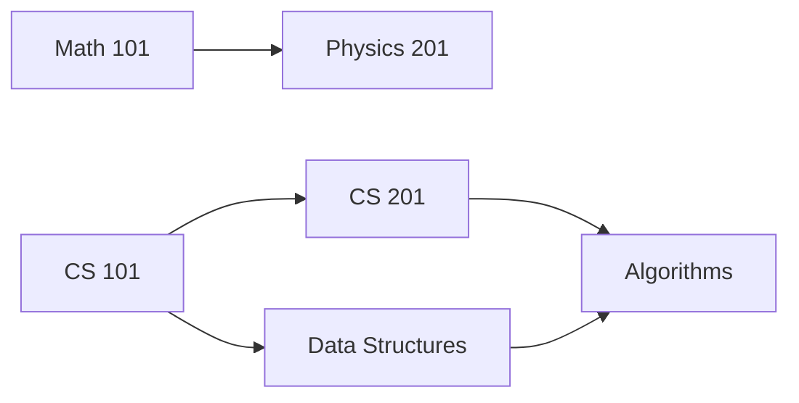

Graphs model relationships between entities — social networks, road maps, dependency chains, web links. This section covers graph representations, traversal algorithms, shortest paths, and topological ordering.

---

## Graph Fundamentals

A graph **G = (V, E)** consists of vertices (nodes) and edges (connections between nodes).

| Property | Directed | Undirected |
|----------|----------|------------|
| Edge meaning | A → B (one-way) | A — B (both ways) |
| Example | Web links, task dependencies | Friendships, roads |
| Edge count (complete) | V × (V-1) | V × (V-1) / 2 |

| Term | Definition |
|------|-----------|
| **Degree** | Number of edges connected to a vertex |
| **Path** | Sequence of vertices connected by edges |
| **Cycle** | Path that starts and ends at the same vertex |
| **Connected** | Path exists between every pair of vertices |
| **Weighted** | Edges carry a numeric cost/distance |
| **DAG** | Directed Acyclic Graph — directed, no cycles |

---

## Graph Representations

### Adjacency Matrix

A 2D array where `matrix[i][j] = 1` (or the weight) if an edge exists from vertex i to vertex j.

```python
# Undirected graph with 4 vertices: 0-1, 0-2, 1-3, 2-3
matrix = [
    [0, 1, 1, 0],  # vertex 0 connects to 1, 2
    [1, 0, 0, 1],  # vertex 1 connects to 0, 3
    [1, 0, 0, 1],  # vertex 2 connects to 0, 3
    [0, 1, 1, 0],  # vertex 3 connects to 1, 2
]
```

### Adjacency List

Each vertex stores a list of its neighbours. More memory-efficient for sparse graphs.

```python
# Same graph using adjacency list (dict of lists)
graph = {
    0: [1, 2],
    1: [0, 3],
    2: [0, 3],
    3: [1, 2],
}

# Weighted graph: store (neighbour, weight) tuples
weighted_graph = {
    'A': [('B', 4), ('C', 2)],
    'B': [('A', 4), ('D', 5)],
    'C': [('A', 2), ('D', 1)],
    'D': [('B', 5), ('C', 1)],
}
```

### Comparison

| Criterion | Adjacency Matrix | Adjacency List |
|-----------|-----------------|----------------|
| Space | O(V²) | O(V + E) |
| Check edge exists | O(1) | O(degree) |
| Find all neighbours | O(V) | O(degree) |
| Add edge | O(1) | O(1) |
| Best for | Dense graphs, quick edge lookup | Sparse graphs, traversal |

---

## Breadth-First Search (BFS)

BFS explores all neighbours at the current depth before moving deeper. It uses a **queue** (FIFO).

```python
from collections import deque

def bfs(graph, start):
    """Visit all reachable vertices level by level."""
    visited = set()
    queue = deque([start])
    visited.add(start)
    order = []

    while queue:
        vertex = queue.popleft()
        order.append(vertex)

        for neighbour in graph[vertex]:
            if neighbour not in visited:
                visited.add(neighbour)
                queue.append(neighbour)

    return order
```

### BFS Properties

| Property | Value |
|----------|-------|
| Time complexity | O(V + E) |
| Space complexity | O(V) |
| Finds shortest path? | ✅ Yes (unweighted graphs) |
| Data structure | Queue |
| Traversal pattern | Level by level |

### BFS for Shortest Path (Unweighted)

```python
def shortest_path_bfs(graph, start, end):
    """Find shortest path in unweighted graph."""
    queue = deque([(start, [start])])
    visited = {start}

    while queue:
        vertex, path = queue.popleft()
        if vertex == end:
            return path

        for neighbour in graph[vertex]:
            if neighbour not in visited:
                visited.add(neighbour)
                queue.append((neighbour, path + [neighbour]))

    return None  # No path exists
```

---

## Depth-First Search (DFS)

DFS explores as deep as possible along each branch before backtracking. It uses a **stack** (or recursion).

```python
def dfs_recursive(graph, vertex, visited=None):
    """Visit all reachable vertices, going deep first."""
    if visited is None:
        visited = set()
    visited.add(vertex)
    result = [vertex]

    for neighbour in graph[vertex]:
        if neighbour not in visited:
            result.extend(dfs_recursive(graph, neighbour, visited))

    return result
```

For iterative DFS, replace the call stack with an explicit stack data structure (see Recursion section for the conversion pattern).

### BFS vs DFS Comparison

| Criterion | BFS | DFS |
|-----------|-----|-----|
| Strategy | Breadth first (level by level) | Depth first (as deep as possible) |
| Data structure | Queue | Stack (or recursion) |
| Shortest path (unweighted) | ✅ Yes | ❌ No |
| Memory usage | O(branching_factor^depth) | O(depth) |
| Complete (finds solution if exists) | ✅ Yes | ✅ Yes (finite graphs) |

---

## Dijkstra's Algorithm (Shortest Path — Weighted)

Finds the shortest path from a source to all other vertices in a **non-negative weight** graph.

```python
import heapq

def dijkstra(graph, start):
    """
    Find shortest distances from start to all vertices.
    graph: {vertex: [(neighbour, weight), ...]}
    Returns: {vertex: shortest_distance}
    """
    distances = {vertex: float('inf') for vertex in graph}
    distances[start] = 0
    priority_queue = [(0, start)]  # (distance, vertex)
    visited = set()

    while priority_queue:
        current_dist, current = heapq.heappop(priority_queue)

        if current in visited:
            continue
        visited.add(current)

        for neighbour, weight in graph[current]:
            distance = current_dist + weight
            if distance < distances[neighbour]:
                distances[neighbour] = distance
                heapq.heappush(priority_queue, (distance, neighbour))

    return distances
```

| Property | Value |
|----------|-------|
| Time complexity | O((V + E) log V) with binary heap |
| Space complexity | O(V) |
| Handles negative weights? | ❌ No (use Bellman-Ford) |
| Greedy? | ✅ Yes |

---

## Topological Sort

A linear ordering of vertices in a DAG such that for every edge A → B, A appears before B. Used for task scheduling, build systems, and course prerequisites.

```python
def topological_sort(graph):
    """
    Kahn's algorithm: repeatedly remove vertices with no incoming edges.
    graph: {vertex: [list of vertices this vertex points to]}
    """
    # Calculate in-degrees
    in_degree = {v: 0 for v in graph}
    for vertex in graph:
        for neighbour in graph[vertex]:
            in_degree[neighbour] = in_degree.get(neighbour, 0) + 1

    # Start with vertices that have no dependencies
    queue = deque([v for v in in_degree if in_degree[v] == 0])
    result = []

    while queue:
        vertex = queue.popleft()
        result.append(vertex)
        for neighbour in graph[vertex]:
            in_degree[neighbour] -= 1
            if in_degree[neighbour] == 0:
                queue.append(neighbour)

    if len(result) != len(graph):
        raise ValueError("Graph has a cycle — topological sort impossible")

    return result
```



---

## Cycle Detection

### In Directed Graphs (DFS with colouring)

```python
def has_cycle_directed(graph):
    """Detect cycle using three-colour DFS (WHITE/GREY/BLACK)."""
    WHITE, GREY, BLACK = 0, 1, 2
    colour = {v: WHITE for v in graph}

    def dfs(vertex):
        colour[vertex] = GREY  # Currently being explored
        for neighbour in graph[vertex]:
            if colour[neighbour] == GREY:  # Back edge = cycle
                return True
            if colour[neighbour] == WHITE and dfs(neighbour):
                return True
        colour[vertex] = BLACK  # Fully explored
        return False

    return any(dfs(v) for v in graph if colour[v] == WHITE)
```

### In Undirected Graphs

For undirected graphs, a cycle exists if DFS encounters a visited vertex that is not the direct parent:

```python
def has_cycle_undirected(graph):
    """Detect cycle in undirected graph via DFS."""
    visited = set()

    def dfs(vertex, parent):
        visited.add(vertex)
        for neighbour in graph[vertex]:
            if neighbour not in visited:
                if dfs(neighbour, vertex):
                    return True
            elif neighbour != parent:
                return True  # Back edge = cycle
        return False

    return any(dfs(v, None) for v in graph if v not in visited)
```

---

## Connected Components

```python
def connected_components(graph):
    """Find all connected components using BFS."""
    visited = set()
    components = []

    for vertex in graph:
        if vertex not in visited:
            component = bfs(graph, vertex)  # reuse BFS from above
            visited.update(component)
            components.append(component)

    return components
```

---

## Practical Applications

| Problem | Graph Model | Algorithm |
|---------|-------------|-----------|
| GPS navigation | Cities/roads (weighted) | Dijkstra |
| Social networks | People/friendships | BFS (degrees of separation) |
| Task scheduling | Tasks/dependencies (DAG) | Topological sort |
| Deadlock detection | Processes/resources | Cycle detection |
| Web crawling | Pages/links | BFS |
| Package managers | Packages/dependencies | Topological sort |

---

## Key Takeaways

1. **Choose your representation wisely** — adjacency lists for sparse graphs (most real-world cases), matrices for dense graphs or when you need O(1) edge lookup.
2. **BFS finds shortest paths in unweighted graphs** — it's the go-to for "minimum steps" problems.
3. **DFS is the backbone of cycle detection and topological sort** — its backtracking nature reveals structure.
4. **Dijkstra requires non-negative weights** — if you have negative edges, use Bellman-Ford.
5. **Topological sort only works on DAGs** — if a cycle exists, no valid ordering is possible.
6. **Graphs are everywhere** — whenever you see relationships, dependencies, or connections, think graph.
7. **Both BFS and DFS are O(V + E)** — the choice between them depends on what property you need, not performance.
