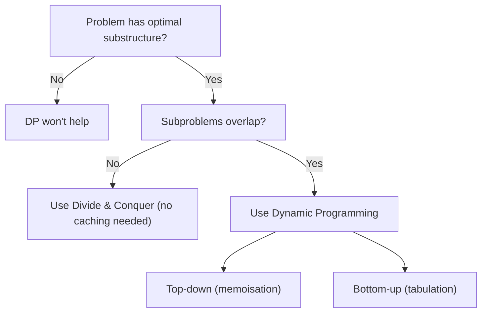
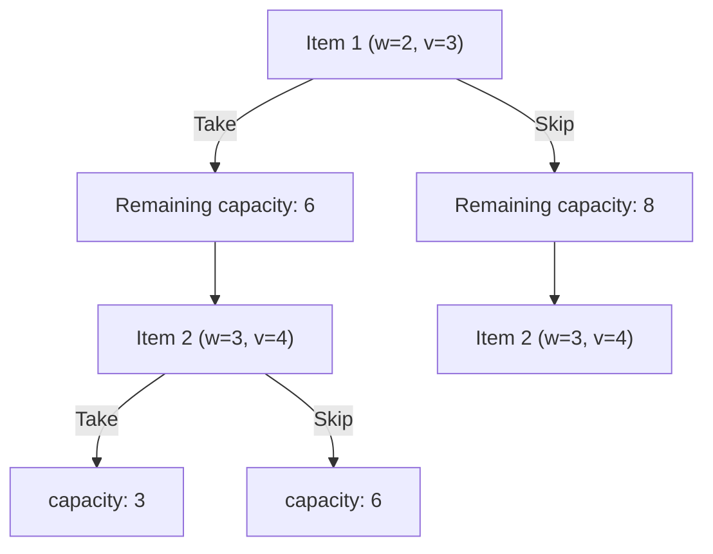
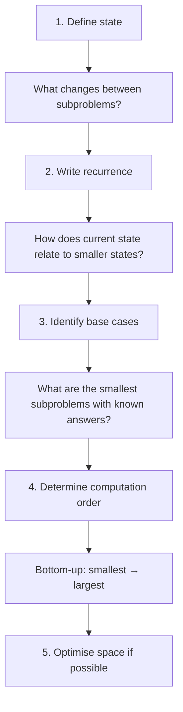

Dynamic programming (DP) is an optimisation technique that solves complex problems by breaking them into overlapping subproblems, solving each subproblem once, and storing the result. It transforms exponential brute-force solutions into polynomial ones.

---

## When Does DP Apply?

A problem is suitable for dynamic programming when it exhibits **both** properties:

| Property | Definition | Test |
|----------|-----------|------|
| **Overlapping subproblems** | The same smaller problems are solved repeatedly | Draw the recursion tree — do you see repeated nodes? |
| **Optimal substructure** | The optimal solution contains optimal solutions to subproblems | Can you express the answer in terms of answers to smaller inputs? |



---

## Memoisation vs Tabulation

### Top-Down (Memoisation)

Write the natural recursive solution, then cache results to avoid recomputation.

```python
from functools import lru_cache

@lru_cache(maxsize=None)
def fib(n):
    """Fibonacci with memoisation — O(n) time, O(n) space."""
    if n <= 1:
        return n
    return fib(n - 1) + fib(n - 2)
```

Or manually:

```python
def fib_memo(n, cache=None):
    if cache is None:
        cache = {}
    if n in cache:
        return cache[n]
    if n <= 1:
        return n
    cache[n] = fib_memo(n - 1, cache) + fib_memo(n - 2, cache)
    return cache[n]
```

### Bottom-Up (Tabulation)

Build the solution iteratively from the smallest subproblems upward.

```python
def fib_tab(n):
    """Fibonacci with tabulation — O(n) time, O(n) space."""
    if n <= 1:
        return n
    dp = [0] * (n + 1)
    dp[1] = 1
    for i in range(2, n + 1):
        dp[i] = dp[i - 1] + dp[i - 2]
    return dp[n]
```

### Comparison

| Aspect | Memoisation (Top-Down) | Tabulation (Bottom-Up) |
|--------|----------------------|----------------------|
| Approach | Recursive + cache | Iterative + table |
| Solves all subproblems? | Only needed ones | All subproblems |
| Stack overflow risk? | Yes (deep recursion) | No |
| Easier to write? | Often yes (natural recursion) | Sometimes requires more thought |
| Space optimisable? | Harder | Often can reduce to O(1) |

### Space Optimisation

When a DP solution only depends on the previous row/state, you can discard older entries:

```python
def fib_optimised(n):
    """Fibonacci with O(1) space — only keep last two values."""
    if n <= 1:
        return n
    prev, curr = 0, 1
    for _ in range(2, n + 1):
        prev, curr = curr, prev + curr
    return curr
```

---

## Classic DP Problems

### 1. Coin Change (Minimum Coins)

**Problem:** Given coin denominations and a target amount, find the minimum number of coins needed.

**Recurrence:** `dp[amount] = min(dp[amount - coin] + 1) for each coin`

```python
def coin_change(coins, amount):
    """Minimum coins to make amount. Returns -1 if impossible."""
    dp = [float('inf')] * (amount + 1)
    dp[0] = 0  # Base case: 0 coins for amount 0

    for a in range(1, amount + 1):
        for coin in coins:
            if coin <= a and dp[a - coin] + 1 < dp[a]:
                dp[a] = dp[a - coin] + 1

    return dp[amount] if dp[amount] != float('inf') else -1

# coin_change([1, 5, 10, 25], 37) → 4 (25 + 10 + 1 + 1)
```

| Amount | Coins considered | dp value |
|--------|-----------------|----------|
| 0 | — | 0 |
| 1 | 1 | 1 |
| 5 | 1, 5 | 1 (use 5) |
| 10 | 1, 5, 10 | 1 (use 10) |
| 37 | all | 4 (25+10+1+1) |

### 2. 0/1 Knapsack

**Problem:** Given items with weights and values, maximise value without exceeding capacity.

**Recurrence:** `dp[i][w] = max(dp[i-1][w], dp[i-1][w - weight[i]] + value[i])`

```python
def knapsack(weights, values, capacity):
    """0/1 Knapsack — each item used at most once."""
    n = len(weights)
    dp = [[0] * (capacity + 1) for _ in range(n + 1)]

    for i in range(1, n + 1):
        for w in range(capacity + 1):
            dp[i][w] = dp[i - 1][w]  # Don't take item i
            if weights[i - 1] <= w:
                take = dp[i - 1][w - weights[i - 1]] + values[i - 1]
                dp[i][w] = max(dp[i][w], take)

    return dp[n][capacity]

# knapsack([2, 3, 4, 5], [3, 4, 5, 6], 8) → 10
```



### 3. Longest Common Subsequence (LCS)

**Problem:** Find the longest sequence that appears in both strings (not necessarily contiguous).

**Recurrence:**
- If `a[i] == b[j]`: `dp[i][j] = dp[i-1][j-1] + 1`
- Else: `dp[i][j] = max(dp[i-1][j], dp[i][j-1])`

```python
def lcs(a, b):
    """Length of longest common subsequence."""
    m, n = len(a), len(b)
    dp = [[0] * (n + 1) for _ in range(m + 1)]

    for i in range(1, m + 1):
        for j in range(1, n + 1):
            if a[i - 1] == b[j - 1]:
                dp[i][j] = dp[i - 1][j - 1] + 1
            else:
                dp[i][j] = max(dp[i - 1][j], dp[i][j - 1])

    return dp[m][n]

# lcs("ABCBDAB", "BDCAB") → 4 ("BCAB")
```

### 4. Edit Distance (Levenshtein)

**Problem:** Minimum insertions, deletions, and substitutions to transform one string into another.

**Recurrence:**
- If `a[i] == b[j]`: `dp[i][j] = dp[i-1][j-1]` (no operation needed)
- Else: `dp[i][j] = 1 + min(dp[i-1][j], dp[i][j-1], dp[i-1][j-1])`

```python
def edit_distance(a, b):
    """Minimum edits to transform string a into string b."""
    m, n = len(a), len(b)
    dp = [[0] * (n + 1) for _ in range(m + 1)]

    # Base cases: transforming to/from empty string
    for i in range(m + 1):
        dp[i][0] = i  # Delete all characters
    for j in range(n + 1):
        dp[0][j] = j  # Insert all characters

    for i in range(1, m + 1):
        for j in range(1, n + 1):
            if a[i - 1] == b[j - 1]:
                dp[i][j] = dp[i - 1][j - 1]
            else:
                dp[i][j] = 1 + min(
                    dp[i - 1][j],      # Delete from a
                    dp[i][j - 1],      # Insert into a
                    dp[i - 1][j - 1],  # Replace in a
                )

    return dp[m][n]

# edit_distance("kitten", "sitting") → 3
```

| | "" | s | i | t | t | i | n | g |
|---|---|---|---|---|---|---|---|---|
| "" | 0 | 1 | 2 | 3 | 4 | 5 | 6 | 7 |
| k | 1 | 1 | 2 | 3 | 4 | 5 | 6 | 7 |
| i | 2 | 2 | 1 | 2 | 3 | 4 | 5 | 6 |
| t | 3 | 3 | 2 | 1 | 2 | 3 | 4 | 5 |
| t | 4 | 4 | 3 | 2 | 1 | 2 | 3 | 4 |
| e | 5 | 5 | 4 | 3 | 2 | 2 | 3 | 4 |
| n | 6 | 6 | 5 | 4 | 3 | 3 | 2 | 3 |

---

## Recognising DP Problems

### Signal Phrases

| Phrase in problem statement | Likely DP pattern |
|-----------------------------|-------------------|
| "Find the minimum/maximum..." | Optimisation DP |
| "Count the number of ways..." | Counting DP |
| "Is it possible to..." | Boolean DP (feasibility) |
| "Find the longest/shortest..." | Sequence DP |
| "Partition into..." | Subset DP |

### DP Problem Categories

| Category | Examples | State typically represents |
|----------|----------|--------------------------|
| **Linear** | Fibonacci, climbing stairs, house robber | Position/index |
| **Grid** | Unique paths, minimum path sum | (row, col) |
| **String** | Edit distance, LCS, palindromes | (i, j) positions in strings |
| **Knapsack** | 0/1 knapsack, subset sum, coin change | (item_index, remaining_capacity) |
| **Interval** | Matrix chain multiplication, burst balloons | (left, right) boundaries |
| **Tree** | Max path sum, house robber III | Node + taken/not-taken |

### The DP Problem-Solving Framework



---

## DP vs Other Techniques

| Technique | Overlapping subproblems? | Optimal substructure? | Example |
|-----------|------------------------|----------------------|---------|
| **Brute Force** | Recomputes everything | N/A | Try all possibilities |
| **Divide & Conquer** | No (independent subproblems) | Yes | Merge sort |
| **Greedy** | N/A (no subproblems) | Yes (local optimum = global) | Huffman coding |
| **Dynamic Programming** | Yes | Yes | Knapsack, edit distance |

---

## Key Takeaways

1. **DP = recursion + caching** — if you can write a correct recursive solution, you can add memoisation to make it efficient.
2. **Look for overlapping subproblems** — draw the recursion tree. Repeated nodes mean DP applies.
3. **Define your state clearly** — the state is what you need to know to compute the answer. Get this right and the recurrence follows.
4. **Start with brute force** — write the naive recursive solution first, then optimise.
5. **Tabulation allows space optimisation** — if you only need the previous row, reduce from O(n²) to O(n).
6. **Practice pattern recognition** — most DP problems fit a known category (linear, grid, string, knapsack, interval).
7. **The hard part is the recurrence** — once you have it, implementation is mechanical.
