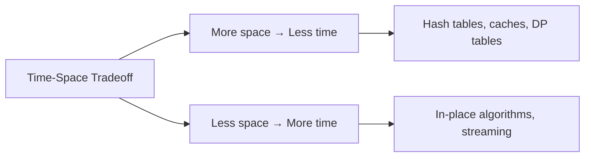
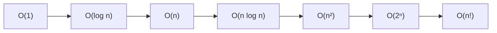

Section 06 introduced Big-O notation and common complexity classes. This section goes deeper — covering formal analysis techniques, space complexity, amortised analysis, and practical measurement. The goal is to move from "memorising complexities" to "deriving them yourself."

---

## Big-O: The Formal Definition

**O(f(n))** describes an upper bound on growth rate:

> T(n) is O(f(n)) if there exist constants c > 0 and n₀ ≥ 0 such that T(n) ≤ c·f(n) for all n ≥ n₀.

In practice: drop constants, drop lower-order terms, keep the dominant term.

```python
# T(n) = 3n² + 7n + 42
# Dominant term: n²
# Therefore: O(n²)

# T(n) = 5·log(n) + 1000
# Dominant term: log(n)
# Therefore: O(log n)
```

### Related Notations

| Notation | Meaning | Analogy |
|----------|---------|---------|
| **O(f(n))** | Upper bound (at most) | ≤ |
| **Ω(f(n))** | Lower bound (at least) | ≥ |
| **Θ(f(n))** | Tight bound (exactly) | = |
| **o(f(n))** | Strict upper (less than) | < |
| **ω(f(n))** | Strict lower (greater than) | > |

In interviews and daily work, **O(f(n))** is used for everything. Θ is technically more precise when stating exact complexity.

---

## Time Complexity: Deriving It Yourself

### Technique 1: Count Loop Iterations

```python
# Single loop: O(n)
for i in range(n):
    do_something()  # O(1) work per iteration → n × O(1) = O(n)

# Nested loops: O(n²)
for i in range(n):
    for j in range(n):
        do_something()  # n × n × O(1) = O(n²)

# Nested but dependent: still O(n²)
for i in range(n):
    for j in range(i):     # j runs 0, 1, 2, ..., n-1 times
        do_something()     # Total: 0+1+2+...+(n-1) = n(n-1)/2 = O(n²)
```

### Technique 2: Halving → Logarithmic

Whenever the problem size is halved each step, the complexity is O(log n):

```python
# Binary search: halves the search space each iteration
def binary_search(arr, target):
    low, high = 0, len(arr) - 1
    while low <= high:          # Loop runs log₂(n) times
        mid = (low + high) // 2
        if arr[mid] == target:
            return mid
        elif arr[mid] < target:
            low = mid + 1       # Halve the space
        else:
            high = mid - 1      # Halve the space
    return -1
```

### Technique 3: Recurrence Relations

For recursive algorithms, write the recurrence and solve it:

| Algorithm | Recurrence | Solution |
|-----------|-----------|----------|
| Binary search | T(n) = T(n/2) + O(1) | O(log n) |
| Merge sort | T(n) = 2T(n/2) + O(n) | O(n log n) |
| Naive Fibonacci | T(n) = T(n-1) + T(n-2) + O(1) | O(2ⁿ) |
| Strassen multiplication | T(n) = 7T(n/2) + O(n²) | O(n^2.81) |

### The Master Theorem (Simplified)

For recurrences of the form **T(n) = aT(n/b) + O(nᵈ)**:

| Condition | Result |
|-----------|--------|
| d > log_b(a) | O(nᵈ) |
| d = log_b(a) | O(nᵈ log n) |
| d < log_b(a) | O(n^(log_b(a))) |

```
Merge sort: T(n) = 2T(n/2) + O(n)
a=2, b=2, d=1 → log₂(2) = 1 = d → O(n log n) ✓
```

---

## Space Complexity

Space complexity measures **additional memory** used beyond the input itself.

| Source of space | Example |
|-----------------|---------|
| Variables | Counters, pointers — O(1) |
| Data structures | Hash maps, arrays — O(n) |
| Recursion stack | Recursive calls — O(depth) |
| Output | Result array — O(output size) |

```python
# O(1) space — sorts in place
def bubble_sort(arr):
    n = len(arr)
    for i in range(n):
        for j in range(n - i - 1):
            if arr[j] > arr[j + 1]:
                arr[j], arr[j + 1] = arr[j + 1], arr[j]

# O(n) space — creates new arrays
def merge_sort(arr):
    if len(arr) <= 1:
        return arr
    mid = len(arr) // 2
    left = merge_sort(arr[:mid])    # New array
    right = merge_sort(arr[mid:])   # New array
    return merge(left, right)       # New merged array
```

### Time-Space Tradeoffs

| Strategy | Time | Space | Example |
|----------|------|-------|---------|
| Recompute | Higher | Lower | Calculate value each time |
| Cache/memoise | Lower | Higher | Store computed results |
| In-place sort | Same | Lower | Quicksort vs merge sort |
| Hash table lookup | O(1) lookup | O(n) storage | Trading space for time |



---

## Best, Average, and Worst Case

The same algorithm can have different performance depending on input.

| Case | Definition | When to care |
|------|-----------|--------------|
| **Best case** | Minimum operations on any input of size n | Rarely useful (too optimistic) |
| **Average case** | Expected operations over all possible inputs | Real-world performance |
| **Worst case** | Maximum operations on any input of size n | Guarantees and SLA design |

### Quicksort Example

```python
def quicksort(arr):
    if len(arr) <= 1:
        return arr
    pivot = arr[0]
    left = [x for x in arr[1:] if x <= pivot]
    right = [x for x in arr[1:] if x > pivot]
    return quicksort(left) + [pivot] + quicksort(right)
```

| Case | When it happens | Complexity |
|------|----------------|------------|
| Best | Pivot always splits evenly | O(n log n) |
| Average | Random input | O(n log n) |
| Worst | Already sorted + first element pivot | O(n²) |

### Common Algorithms — All Three Cases

| Algorithm | Best | Average | Worst | Worst space |
|-----------|------|---------|-------|-------------|
| Linear search | O(1) | O(n) | O(n) | O(1) |
| Binary search | O(1) | O(log n) | O(log n) | O(1) |
| Insertion sort | O(n) | O(n²) | O(n²) | O(1) |
| Merge sort | O(n log n) | O(n log n) | O(n log n) | O(n) |
| Quicksort | O(n log n) | O(n log n) | O(n²) | O(log n) |
| Hash table lookup | O(1) | O(1) | O(n) | O(n) |

---

## Amortised Analysis

Some operations are expensive occasionally but cheap on average. **Amortised analysis** gives the average cost per operation over a sequence.

### Dynamic Array (Python list `append`)

```python
# Python list doubles capacity when full
# Most appends are O(1), but resizing copies n elements = O(n)
# Over n appends: total work = n + n/2 + n/4 + ... ≈ 2n
# Amortised cost per append: O(2n/n) = O(1)
```

| Operation # | Array size | Capacity | Resize? | Cost |
|------------|------------|----------|---------|------|
| 1 | 1 | 1 | No | 1 |
| 2 | 2 | 2 | Yes (copy 1) | 2 |
| 3 | 3 | 4 | Yes (copy 2) | 3 |
| 4 | 4 | 4 | No | 1 |
| 5 | 5 | 8 | Yes (copy 4) | 5 |
| 6-8 | 6-8 | 8 | No | 1 each |

Total cost for 8 operations: 1+2+3+1+5+1+1+1 = 15. Average: 15/8 ≈ O(1) per operation.

### Other Amortised O(1) Operations

| Data Structure | Operation | Worst single | Amortised |
|----------------|-----------|-------------|-----------|
| Dynamic array | `append` | O(n) | O(1) |
| Hash table | `insert` (with rehash) | O(n) | O(1) |
| Splay tree | `find` | O(n) | O(log n) |
| Union-Find | `find` (with path compression) | O(log n) | O(α(n)) ≈ O(1) |

---

## Common Complexity Classes



| Class | Name | Example | n=1000 |
|-------|------|---------|--------|
| O(1) | Constant | Array index, hash lookup | 1 |
| O(log n) | Logarithmic | Binary search | 10 |
| O(n) | Linear | Linear search, single pass | 1,000 |
| O(n log n) | Linearithmic | Merge sort, good sorts | 10,000 |
| O(n²) | Quadratic | Nested loops, naive sort | 1,000,000 |
| O(n³) | Cubic | Matrix multiplication (naive) | 1,000,000,000 |
| O(2ⁿ) | Exponential | Subsets, brute-force | 10³⁰⁰ |
| O(n!) | Factorial | Permutations | 10²⁵⁶⁷ |

### Practical Limits (1 second, ~10⁸ operations)

| Max n | Acceptable complexity |
|-------|----------------------|
| ≤ 10 | O(n!), O(2ⁿ) |
| ≤ 20 | O(2ⁿ) |
| ≤ 500 | O(n³) |
| ≤ 10⁴ | O(n²) |
| ≤ 10⁶ | O(n log n) |
| ≤ 10⁸ | O(n) |
| ≤ 10¹⁸ | O(log n), O(1) |

---

## Practical Measurement

Theory and practice can diverge due to constants, cache effects, and implementation details. Measure to validate.

### Timing in Python

```python
import time

def measure(func, *args, repeats=5):
    """Measure average execution time."""
    times = []
    for _ in range(repeats):
        start = time.perf_counter()
        func(*args)
        times.append(time.perf_counter() - start)
    print(f"{func.__name__}: {sum(times)/len(times):.6f}s avg")
```

### Empirical Growth Rate Detection

```python
def empirical_complexity(func, sizes):
    """Run at different sizes; observe ratio when n doubles."""
    prev_time = None
    for n in sizes:
        data = list(range(n))
        start = time.perf_counter()
        func(data)
        elapsed = time.perf_counter() - start
        ratio = f"{elapsed / prev_time:.1f}x" if prev_time else "-"
        print(f"n={n:>8}  time={elapsed:.4f}s  ratio={ratio}")
        prev_time = elapsed

# If ratio ≈ 2 when n doubles → O(n)
# If ratio ≈ 4 when n doubles → O(n²)
# If ratio ≈ 8 when n doubles → O(n³)
```

---

## Common Analysis Patterns

```python
# Shrinking by half → O(log n)
i = n
while i > 0:
    i = i // 2

# Nested loops → O(n²)
for i in range(n):
    for j in range(n):
        pass

# Dependent inner loop → still O(n²): sum 0+1+2+...+(n-1) = n(n-1)/2
for i in range(n):
    for j in range(i):
        pass

# Harmonic series → O(n log n)
for i in range(1, n + 1):
    for j in range(0, n, i):  # n/i iterations per outer loop
        pass

# Two pointers → O(n): each pointer moves at most n times total
left, right = 0, n - 1
while left < right:
    left += 1  # or right -= 1
```

---

## Key Takeaways

1. **Big-O captures growth rate, not exact speed** — O(n) with a large constant can be slower than O(n²) for small inputs.
2. **Drop constants and lower-order terms** — 3n² + 7n + 42 is simply O(n²).
3. **Worst case is the default guarantee** — unless stated otherwise, complexities refer to worst case.
4. **Space matters too** — an O(n log n) sort that uses O(n) extra space may be worse than an O(n log n) in-place sort for your use case.
5. **Amortised ≠ average** — amortised is a guarantee over sequences; average depends on input distribution.
6. **Measure real performance** — cache locality, branch prediction, and constant factors matter in practice.
7. **Know the limits** — if n = 10⁶, you need O(n log n) or better. This guides algorithm selection.
