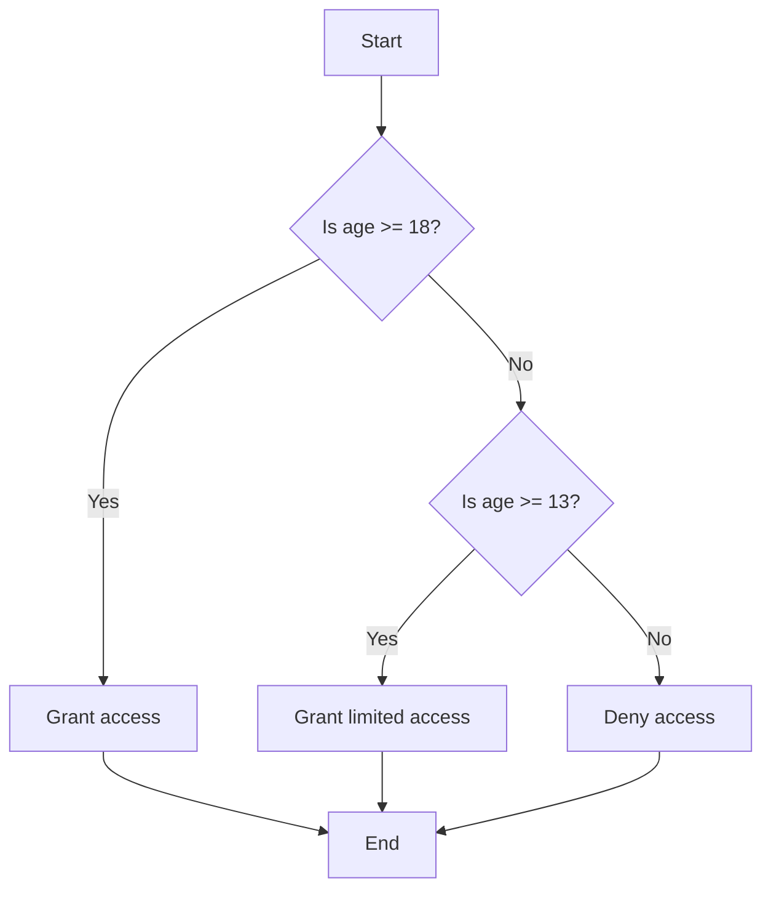
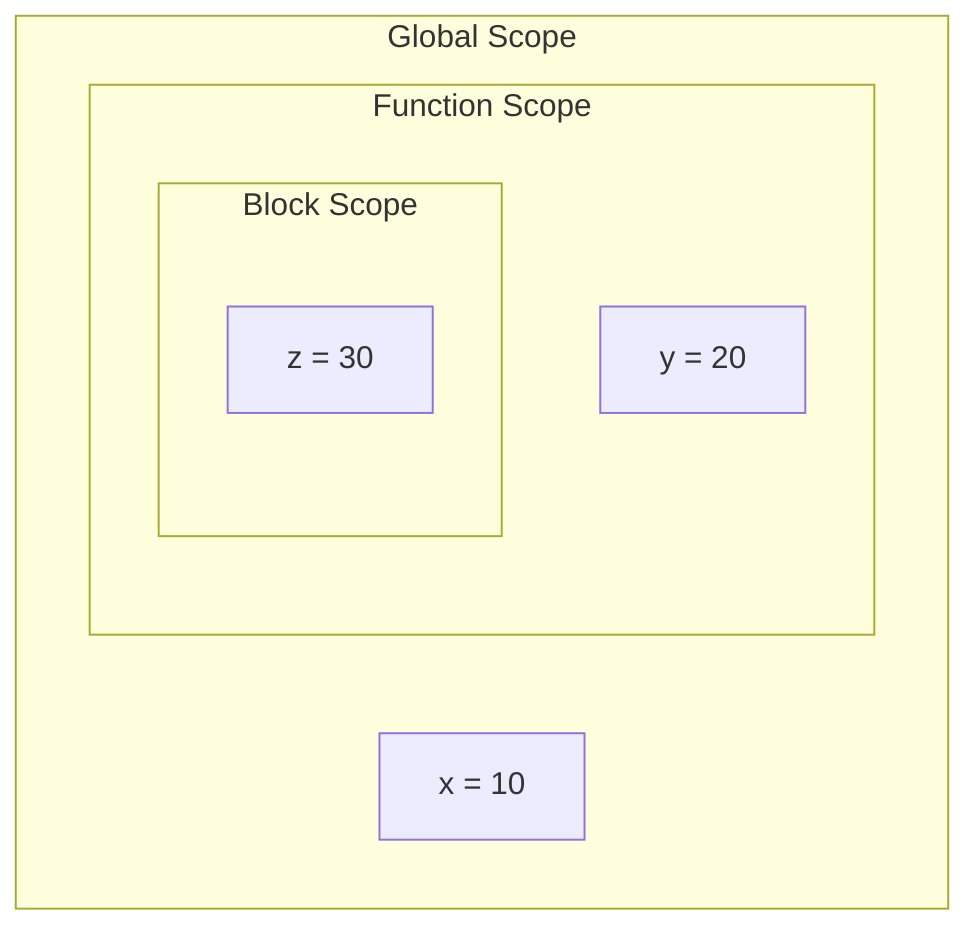
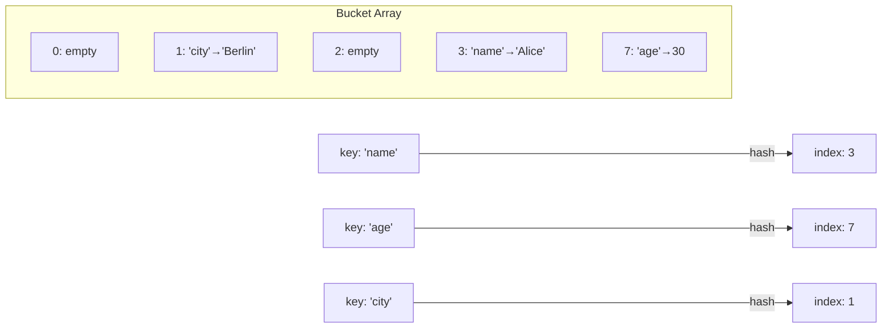
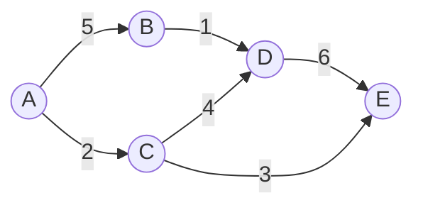
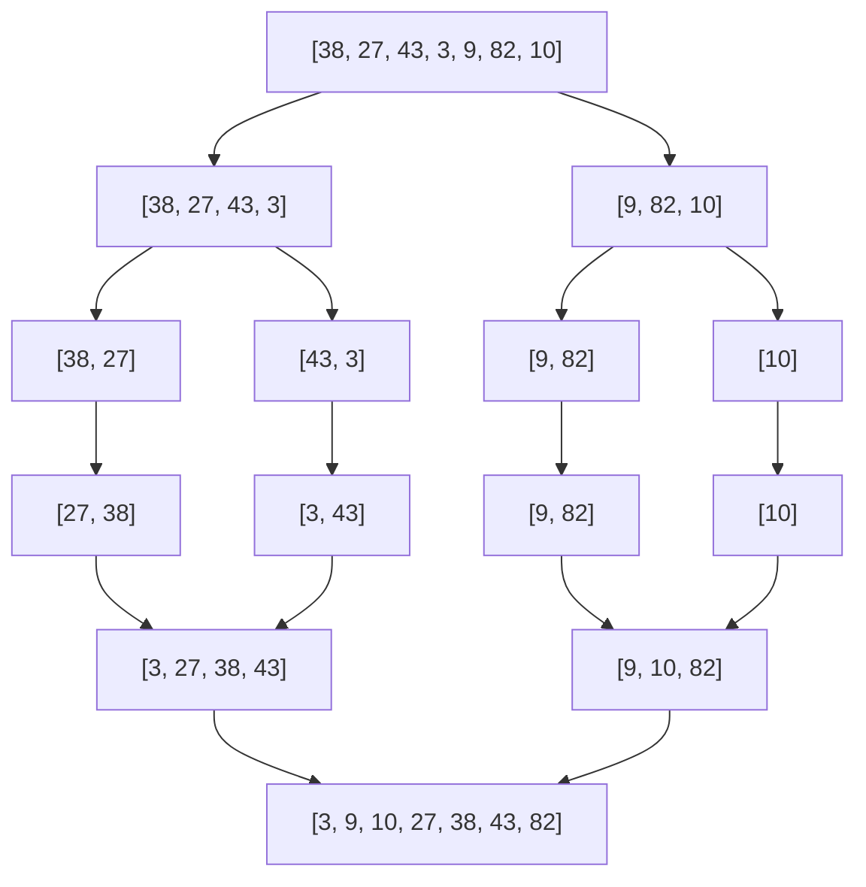
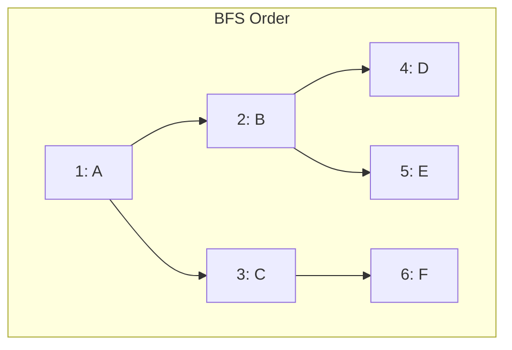
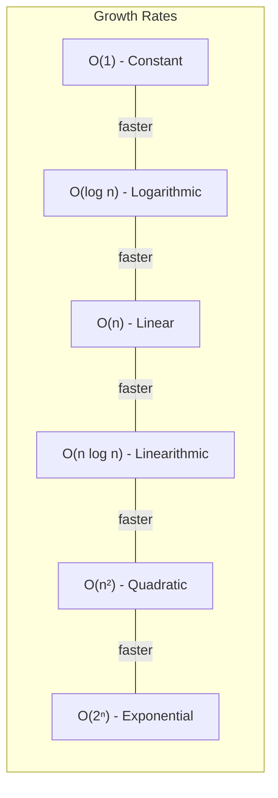
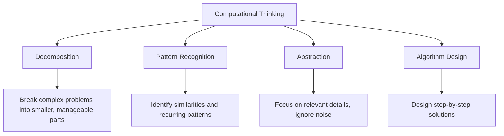

The foundation of all software engineering. Programming logic is about thinking in structured, repeatable steps — breaking problems into smaller pieces and expressing solutions in a way a machine can execute.

## Prerequisites

- Basic math (arithmetic, simple algebra)
- Ability to think step-by-step

---

## 1. Variables, Data Types, and Memory

A **variable** is a named container that holds a value. Think of it as a labeled box in memory.

### Primitive Data Types

| Type | Description | Example |
|------|-------------|---------|
| Integer | Whole numbers | `42`, `-7`, `0` |
| Float | Decimal numbers | `3.14`, `-0.001` |
| Boolean | True or false | `true`, `false` |
| Character | Single symbol | `'A'`, `'9'`, `'!'` |
| String | Sequence of characters | `"hello world"` |

### How Memory Works

When you declare a variable, the computer allocates a chunk of memory and associates your variable name with that address.

```text
Variable: age = 25

Memory:
┌──────────┬───────┐
│ Address  │ Value │
├──────────┼───────┤
│ 0x001A   │  25   │  ← "age" points here
└──────────┴───────┘
```

### Type Systems

- **Statically typed** — types are checked at compile time (Java, C, TypeScript)
- **Dynamically typed** — types are checked at runtime (Python, JavaScript)
- **Strongly typed** — no implicit type coercion (`"5" + 3` → error in Python)
- **Weakly typed** — implicit coercion allowed (`"5" + 3` → `"53"` in JavaScript)

### Key Takeaway

Variables are abstractions over memory addresses. Understanding types helps you predict how operations behave and catch bugs early.

---

## 2. Control Flow

Control flow determines the order in which statements execute. Without it, programs would be linear — top to bottom, no decisions, no repetition.

### Conditionals

```text
if condition:
    do something
elif other_condition:
    do something else
else:
    fallback action
```

### Flowchart: Conditional Logic



### Loops

Loops repeat a block of code while a condition holds.

| Loop Type | Use When |
|-----------|----------|
| `for` | You know how many iterations |
| `while` | You loop until a condition changes |
| `do-while` | You need at least one iteration |

```text
// Count from 1 to 5
for i = 1 to 5:
    print(i)

// Wait for user input
while input != "quit":
    input = read()
```

### Infinite Loops and Guards

An infinite loop runs forever. Sometimes intentional (event loops, servers), often a bug.

```text
// Bug: i never changes
while i < 10:
    print(i)
    // forgot: i = i + 1
```

Always ensure your loop has a **termination condition** that will eventually be met.

### Key Takeaway

All programs are built from three structures: **sequence** (one after another), **selection** (conditionals), and **iteration** (loops). Master these and you can express any algorithm.

---

## 3. Functions, Scope, and Recursion

### Functions

A function is a reusable block of code that takes inputs (parameters), performs work, and optionally returns an output.

```text
function add(a, b):
    return a + b

result = add(3, 4)  // result = 7
```

**Why functions matter:**

- **Reusability** — write once, call many times
- **Abstraction** — hide complexity behind a name
- **Testability** — test small units in isolation

### Scope

Scope defines where a variable is visible.



- **Global scope** — visible everywhere (avoid overuse)
- **Function scope** — visible only inside the function
- **Block scope** — visible only inside `{}` or indented block

### Recursion

A function that calls itself. Every recursive function needs:

1. **Base case** — when to stop
2. **Recursive case** — how to reduce the problem

```text
function factorial(n):
    if n <= 1:        // base case
        return 1
    return n * factorial(n - 1)  // recursive case
```

**Execution trace:**

```text
factorial(4)
→ 4 * factorial(3)
→ 4 * 3 * factorial(2)
→ 4 * 3 * 2 * factorial(1)
→ 4 * 3 * 2 * 1
→ 24
```

### Stack Overflow

Each recursive call adds a frame to the **call stack**. Too many calls without hitting the base case → stack overflow.

### Key Takeaway

Functions are the primary tool for managing complexity. Recursion is elegant but has costs (stack space). Prefer iteration for simple cases; use recursion when the problem is naturally recursive (trees, divide-and-conquer).

---

## 4. Data Structures

Data structures organize data for efficient access and modification. Choosing the right structure is often more important than choosing the right algorithm.

### Arrays (Lists)

Contiguous block of memory. Fast access by index, slow insertion in the middle.

```text
Index:  0    1    2    3    4
Value: [10] [20] [30] [40] [50]
```

| Operation | Time Complexity |
|-----------|----------------|
| Access by index | O(1) |
| Search (unsorted) | O(n) |
| Insert at end | O(1) amortized |
| Insert at position | O(n) |
| Delete at position | O(n) |

### Linked Lists

Each element (node) points to the next. Fast insertion/deletion, slow random access.

```text
[10|→] → [20|→] → [30|→] → [40|∅]
 head                          tail
```

| Operation | Time Complexity |
|-----------|----------------|
| Access by index | O(n) |
| Insert at head | O(1) |
| Insert at tail | O(1) with tail pointer |
| Delete (given node) | O(1) |
| Search | O(n) |

### Stacks (LIFO — Last In, First Out)

```text
    ┌───┐
    │ 3 │  ← top (last pushed, first popped)
    ├───┤
    │ 2 │
    ├───┤
    │ 1 │
    └───┘
```

Operations: `push(item)`, `pop()`, `peek()`

**Use cases:** undo systems, expression parsing, call stacks, backtracking.

### Queues (FIFO — First In, First Out)

```text
Front → [1] [2] [3] [4] ← Back
         ↑ dequeue        ↑ enqueue
```

Operations: `enqueue(item)`, `dequeue()`, `peek()`

**Use cases:** task scheduling, BFS, message queues, print spoolers.

### Hash Maps (Dictionaries)

Key-value pairs with O(1) average lookup. Uses a hash function to map keys to array indices.



**Collisions** happen when two keys hash to the same index. Resolved via chaining (linked list at each bucket) or open addressing (probe next slot).

| Operation | Average | Worst Case |
|-----------|---------|------------|
| Insert | O(1) | O(n) |
| Lookup | O(1) | O(n) |
| Delete | O(1) | O(n) |

### Trees

Hierarchical structure. Each node has zero or more children.

```text
        [8]
       /   \
     [3]   [10]
    /   \      \
  [1]   [6]   [14]
       /   \   /
     [4]  [7] [13]
```

**Binary Search Tree (BST):** Left child < parent < right child. Enables O(log n) search if balanced.

**Balanced trees** (AVL, Red-Black) guarantee O(log n) operations by rebalancing after insertions/deletions.

### Graphs

Nodes (vertices) connected by edges. Can be directed or undirected, weighted or unweighted.



**Representations:**

- **Adjacency matrix** — 2D array, O(1) edge lookup, O(V²) space
- **Adjacency list** — array of lists, O(V+E) space, better for sparse graphs

### Key Takeaway

There is no universally "best" data structure. Each has trade-offs. Choose based on your access patterns: frequent lookups → hash map; ordered data → tree; FIFO processing → queue.

---

## 5. Algorithms

An algorithm is a finite sequence of well-defined steps that solves a problem.

### Sorting Algorithms

| Algorithm | Best | Average | Worst | Space | Stable? |
|-----------|------|---------|-------|-------|---------|
| Bubble Sort | O(n) | O(n²) | O(n²) | O(1) | Yes |
| Selection Sort | O(n²) | O(n²) | O(n²) | O(1) | No |
| Insertion Sort | O(n) | O(n²) | O(n²) | O(1) | Yes |
| Merge Sort | O(n log n) | O(n log n) | O(n log n) | O(n) | Yes |
| Quick Sort | O(n log n) | O(n log n) | O(n²) | O(log n) | No |
| Heap Sort | O(n log n) | O(n log n) | O(n log n) | O(1) | No |

**Merge Sort — Divide and Conquer:**



### Searching Algorithms

**Linear Search** — check every element. O(n). Works on unsorted data.

**Binary Search** — divide sorted array in half repeatedly. O(log n).

```text
Searching for 7 in [1, 3, 5, 7, 9, 11, 13]:

Step 1: mid = 7 → found!

Searching for 9:
Step 1: mid = 7, 9 > 7 → search right half [9, 11, 13]
Step 2: mid = 11, 9 < 11 → search left half [9]
Step 3: mid = 9 → found!
```

### Graph Traversal

**BFS (Breadth-First Search)** — explore level by level. Uses a queue. Finds shortest path in unweighted graphs.

**DFS (Depth-First Search)** — explore as deep as possible before backtracking. Uses a stack (or recursion).



### Key Takeaway

Know the common algorithms and their complexities. In practice, you'll use library implementations — but understanding the mechanics helps you choose correctly and debug performance issues.

---

## 6. Big-O Notation and Complexity Analysis

Big-O describes how an algorithm's resource usage (time or space) grows as input size increases. It captures the **worst-case upper bound**.

### Common Complexities



| Complexity | Name | Example |
|------------|------|---------|
| O(1) | Constant | Array access, hash map lookup |
| O(log n) | Logarithmic | Binary search |
| O(n) | Linear | Linear search, single loop |
| O(n log n) | Linearithmic | Merge sort, efficient sorts |
| O(n²) | Quadratic | Nested loops, bubble sort |
| O(2ⁿ) | Exponential | Recursive Fibonacci (naive) |
| O(n!) | Factorial | Permutation generation |

### How to Analyze

1. **Count the dominant operations** (ignore constants and lower-order terms)
2. **Identify loops** — single loop over n = O(n), nested = O(n²)
3. **Recursive calls** — use the recurrence relation

```text
// O(n) — single loop
for i = 0 to n:
    print(i)

// O(n²) — nested loops
for i = 0 to n:
    for j = 0 to n:
        print(i, j)

// O(log n) — halving each step
while n > 1:
    n = n / 2
```

### Space Complexity

Same notation, applied to memory usage:

- Creating a new array of size n → O(n) space
- Recursive calls with depth d → O(d) stack space
- In-place algorithms → O(1) extra space

### Key Takeaway

Big-O is a tool for comparing algorithms at scale. An O(n²) algorithm might be faster than O(n log n) for small inputs, but will always lose for large n. Focus on the growth rate, not the constant factors.

---

## 7. Computational Thinking and Problem Decomposition

Computational thinking is the process of formulating problems in a way that allows a computer to solve them.

### Four Pillars



### Decomposition in Practice

**Problem:** Build a user registration system.

**Decomposed:**

1. Validate email format
2. Check if email already exists
3. Hash the password
4. Store user record
5. Send confirmation email
6. Return success/failure response

Each sub-problem is small enough to solve independently and test in isolation.

### Pattern Recognition

When you see the same structure repeated:

- Multiple API endpoints with similar validation → extract a validation middleware
- Several functions that transform data the same way → create a generic transformer
- Repeated error handling → centralize in a wrapper

### Abstraction

Hide unnecessary detail behind a clean interface:

```text
// Low abstraction — caller must know implementation details
bytes = read_file_bytes("config.json")
text = decode_utf8(bytes)
data = parse_json(text)

// High abstraction — caller only needs to know the intent
data = load_config("config.json")
```

### Problem-Solving Strategy

1. **Understand** — restate the problem in your own words
2. **Plan** — sketch the approach before coding
3. **Divide** — break into sub-problems
4. **Solve** — implement the smallest piece first
5. **Verify** — test with edge cases
6. **Optimize** — only after it works correctly

### Key Takeaway

Programming is problem-solving first, coding second. The best programmers spend more time thinking than typing. Decompose, find patterns, abstract, then implement.

---

## Summary

| Concept | Core Idea |
|---------|-----------|
| Variables & Types | Named memory with constraints |
| Control Flow | Sequence, selection, iteration |
| Functions | Reusable, testable units of logic |
| Data Structures | Organize data for efficient operations |
| Algorithms | Step-by-step problem solutions |
| Big-O | Measure scalability |
| Computational Thinking | Structured problem-solving approach |

These concepts are language-agnostic. Master them and you can learn any programming language quickly — the syntax changes, but the logic stays the same.
