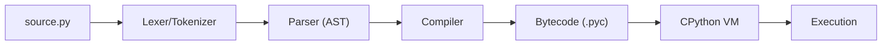

## How Python Executes Code

### The CPython Pipeline



1. **Lexer** — breaks source into tokens (`def`, `foo`, `(`, `)`, `:`)
2. **Parser** — builds an Abstract Syntax Tree (AST)
3. **Compiler** — generates bytecode (stored in `__pycache__/`)
4. **VM** — executes bytecode instruction by instruction

### Inspecting Bytecode

```python
import dis

def add(a, b):
    return a + b

dis.dis(add)
# Output:
#   2           0 LOAD_FAST                0 (a)
#               2 LOAD_FAST                1 (b)
#               4 BINARY_ADD
#               6 RETURN_VALUE
```

### Python Implementations

| Implementation | Language | Use Case |
|---------------|----------|----------|
| CPython | C | Default, reference implementation |
| PyPy | Python/RPython | JIT-compiled, 4-10x faster for long-running code |
| Jython | Java | JVM integration |
| MicroPython | C | Microcontrollers, embedded systems |
| GraalPy | Java | GraalVM polyglot |

---

## The Type System

### Everything is an Object

```python
# Even integers are objects
x = 42
type(x)        # <class 'int'>
x.bit_length() # 6 (42 in binary = 101010)
id(x)          # memory address

# Functions are objects
def greet():
    pass

type(greet)           # <class 'function'>
greet.__name__        # 'greet'
greet.__code__.co_varnames  # ()
```

### Object Identity, Type, and Value

```python
a = [1, 2, 3]
b = a           # b references the SAME object
c = [1, 2, 3]  # c is a DIFFERENT object with same value

a is b    # True — same identity (same object in memory)
a is c    # False — different identity
a == c    # True — same value

id(a) == id(b)  # True
id(a) == id(c)  # False
```

### Mutability

| Mutable | Immutable |
|---------|-----------|
| `list` | `tuple` |
| `dict` | `frozenset` |
| `set` | `str` |
| `bytearray` | `bytes` |
| Custom objects (default) | `int`, `float`, `bool` |

**Why it matters:**

```python
# Immutable — "modification" creates a new object
s = "hello"
s_upper = s.upper()  # new string; s is unchanged
id(s) != id(s_upper)  # True — different objects

# Mutable — modification changes the object in place
lst = [1, 2, 3]
lst.append(4)  # same object, modified
# All references to lst see the change

# Gotcha: mutable default arguments
def append_to(item, target=[]):  # BAD — shared across calls!
    target.append(item)
    return target

append_to(1)  # [1]
append_to(2)  # [1, 2] — not [2]!

# Fix:
def append_to(item, target=None):
    if target is None:
        target = []
    target.append(item)
    return target
```

---

## Numeric Types

### Integers — Arbitrary Precision

```python
# Python integers have no overflow — they grow as needed
big = 10 ** 100
type(big)  # <class 'int'>
# This is a 100-digit number — no problem

# Integer operations
17 // 5   # 3 (floor division)
17 % 5    # 2 (modulo)
2 ** 10   # 1024 (exponentiation)
divmod(17, 5)  # (3, 2) — quotient and remainder

# Useful methods
(255).to_bytes(2, 'big')  # b'\x00\xff'
int.from_bytes(b'\x00\xff', 'big')  # 255
bin(42)   # '0b101010'
hex(255)  # '0xff'
oct(8)    # '0o10'
```

### Floats — IEEE 754 Double Precision

```python
import math
import sys

sys.float_info.max      # 1.7976931348623157e+308
sys.float_info.epsilon  # 2.220446049250313e-16 (smallest difference from 1.0)

# Special values
float('inf')   # positive infinity
float('-inf')  # negative infinity
float('nan')   # Not a Number

math.isnan(float('nan'))  # True
math.isinf(float('inf'))  # True
math.isclose(0.1 + 0.2, 0.3, rel_tol=1e-9)  # True

# For exact decimal arithmetic
from decimal import Decimal, ROUND_HALF_UP
price = Decimal("19.99")
tax = Decimal("0.21")
total = (price * (1 + tax)).quantize(Decimal("0.01"), rounding=ROUND_HALF_UP)
# Decimal('24.19') — exact, no floating point errors
```

### Complex Numbers

```python
z = 3 + 4j
z.real      # 3.0
z.imag      # 4.0
abs(z)      # 5.0 (magnitude)
z.conjugate()  # (3-4j)
```

---

## Strings

### String Operations

```python
s = "Hello, World!"

# Slicing
s[0:5]      # "Hello"
s[7:]       # "World!"
s[-6:]      # "orld!"
s[::-1]     # "!dlroW ,olleH" (reversed)

# Methods (strings are immutable — all return new strings)
s.lower()           # "hello, world!"
s.upper()           # "HELLO, WORLD!"
s.strip()           # remove whitespace from both ends
s.split(", ")       # ["Hello", "World!"]
s.replace("World", "Python")  # "Hello, Python!"
s.startswith("Hello")  # True
s.find("World")     # 7 (index) or -1 if not found
s.count("l")        # 3

# Formatting
name, age = "Alice", 30
f"Name: {name}, Age: {age}"           # f-string (Python 3.6+)
f"Pi: {3.14159:.2f}"                   # "Pi: 3.14"
f"{'centered':^20}"                    # "      centered      "
f"{1000000:,}"                         # "1,000,000"
```

### String Encoding

```python
# Strings are Unicode (str)
text = "café"
len(text)  # 4 characters

# Encode to bytes for I/O
encoded = text.encode("utf-8")  # b'caf\xc3\xa9' (5 bytes)
decoded = encoded.decode("utf-8")  # "café"

# Common encodings
text.encode("ascii")    # UnicodeEncodeError (é not in ASCII)
text.encode("latin-1")  # b'caf\xe9' (4 bytes)
text.encode("utf-8")    # b'caf\xc3\xa9' (5 bytes)
```

---

## Collections

### Lists

```python
# Dynamic array — ordered, mutable, allows duplicates
items = [1, "two", 3.0, [4, 5]]

# Operations
items.append(6)          # add to end: O(1)
items.insert(0, "zero")  # insert at index: O(n)
items.pop()              # remove last: O(1)
items.pop(0)             # remove first: O(n)
items.extend([7, 8])     # add multiple: O(k)
items.sort()             # in-place sort: O(n log n) — requires comparable types
sorted(items)            # returns new sorted list

# List comprehension
squares = [x**2 for x in range(10)]
evens = [x for x in range(100) if x % 2 == 0]
matrix = [[0] * cols for _ in range(rows)]  # 2D list
```

### Tuples

```python
# Immutable sequence — used for fixed collections
point = (3, 4)
rgb = (255, 128, 0)

# Unpacking
x, y = point
r, g, b = rgb
first, *rest = [1, 2, 3, 4, 5]  # first=1, rest=[2,3,4,5]

# Named tuples (better than plain tuples for readability)
from collections import namedtuple
Point = namedtuple("Point", ["x", "y"])
p = Point(3, 4)
p.x  # 3 — named access
```

### Dictionaries

```python
# Hash map — O(1) average lookup
user = {"name": "Alice", "age": 30, "active": True}

# Operations
user["email"] = "alice@example.com"  # add/update
user.get("phone", "N/A")            # safe get with default
user.pop("active")                   # remove and return
user.setdefault("role", "user")      # set only if missing

# Iteration
for key in user:                     # iterate keys
for key, value in user.items():      # iterate pairs
for value in user.values():          # iterate values

# Dict comprehension
word_lengths = {w: len(w) for w in words}

# Merge (Python 3.9+)
merged = dict_a | dict_b  # b overwrites a on conflicts
```

### Sets

```python
# Unordered, unique elements, O(1) membership test
primes = {2, 3, 5, 7, 11}
evens = {2, 4, 6, 8, 10}

# Set operations
primes & evens          # {2} — intersection
primes | evens          # {2, 3, 4, 5, 6, 7, 8, 10, 11} — union
primes - evens          # {3, 5, 7, 11} — difference
primes ^ evens          # {3, 4, 5, 6, 7, 8, 10, 11} — symmetric difference

# Membership test: O(1) vs O(n) for lists
5 in primes             # True — O(1)
5 in [2, 3, 5, 7, 11]  # True — O(n)
```

---

## Hypothetical Use Cases

### Use Case: Configuration Parser

```python
from pathlib import Path
import json

def load_config(config_path: str, overrides: dict = None) -> dict:
    """Load JSON config with environment-specific overrides."""
    path = Path(config_path)
    
    if not path.exists():
        raise FileNotFoundError(f"Config not found: {config_path}")
    
    config = json.loads(path.read_text())
    
    # Apply overrides (merge dictionaries)
    if overrides:
        config = {**config, **overrides}
    
    # Validate required keys
    required = {"database_url", "secret_key", "debug"}
    missing = required - config.keys()
    if missing:
        raise ValueError(f"Missing config keys: {missing}")
    
    # Type coercion
    config["debug"] = str(config["debug"]).lower() in ("true", "1", "yes")
    
    return config
```

### Use Case: Data Deduplication

```python
def deduplicate_records(records: list[dict], key_fields: list[str]) -> list[dict]:
    """Remove duplicate records based on specified key fields."""
    seen = set()
    unique = []
    
    for record in records:
        # Create a hashable key from specified fields
        key = tuple(record.get(field) for field in key_fields)
        
        if key not in seen:
            seen.add(key)
            unique.append(record)
    
    return unique

# Usage
users = [
    {"email": "alice@example.com", "name": "Alice", "source": "web"},
    {"email": "alice@example.com", "name": "Alice A.", "source": "mobile"},
    {"email": "bob@example.com", "name": "Bob", "source": "web"},
]
unique_users = deduplicate_records(users, key_fields=["email"])
# Keeps first occurrence of each email
```

---

## Key Takeaways

1. **Python is compiled to bytecode** — not purely interpreted
2. **Everything is an object** — integers, functions, modules
3. **Mutability matters** — know which types are mutable and the implications for sharing
4. **Arbitrary precision integers** — no overflow, but slower than fixed-size
5. **Use f-strings** for formatting, **Decimal** for money, **sets** for membership tests
6. **Mutable default arguments are a trap** — always use `None` as default
