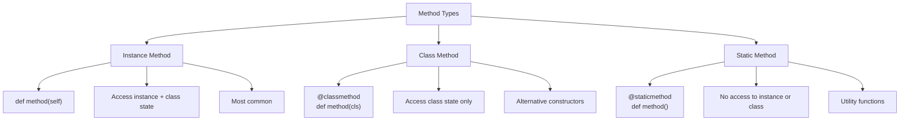
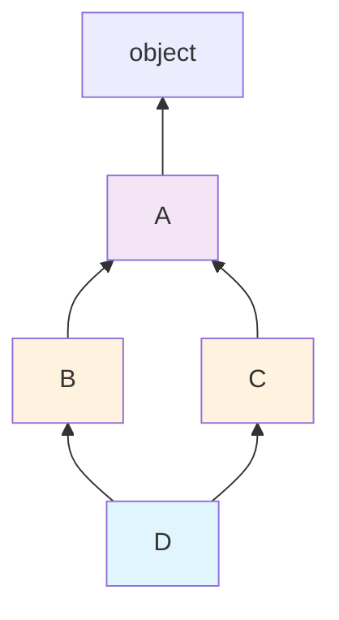
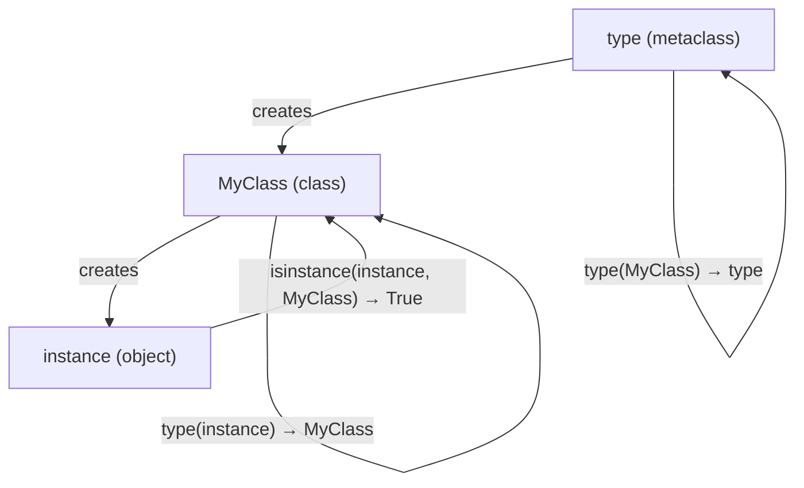

## Classes — The Fundamentals

### Anatomy of a Class

```python
class BankAccount:
    """A simple bank account with deposit/withdraw operations."""
    
    # Class variable — shared across ALL instances
    bank_name = "Python National Bank"
    _total_accounts = 0
    
    def __init__(self, owner: str, balance: float = 0.0):
        """Instance initializer (NOT a constructor — __new__ is the constructor)."""
        # Instance variables — unique to each instance
        self.owner = owner
        self._balance = balance  # Convention: "protected"
        self.__id = id(self)     # Name-mangled: becomes _BankAccount__id
        BankAccount._total_accounts += 1
    
    @property
    def balance(self) -> float:
        """Read-only property — controlled access to _balance."""
        return self._balance
    
    @balance.setter
    def balance(self, value: float):
        if value < 0:
            raise ValueError("Balance cannot be negative")
        self._balance = value
    
    def deposit(self, amount: float) -> float:
        """Instance method — operates on self."""
        if amount <= 0:
            raise ValueError("Deposit must be positive")
        self._balance += amount
        return self._balance
    
    def withdraw(self, amount: float) -> float:
        if amount > self._balance:
            raise InsufficientFundsError(self._balance, amount)
        self._balance -= amount
        return self._balance
    
    @classmethod
    def from_dict(cls, data: dict) -> "BankAccount":
        """Alternative constructor — creates instance from dictionary."""
        return cls(owner=data["owner"], balance=data.get("balance", 0))
    
    @classmethod
    def get_total_accounts(cls) -> int:
        """Access class-level state."""
        return cls._total_accounts
    
    @staticmethod
    def validate_amount(amount: float) -> bool:
        """Utility — no access to instance or class state."""
        return isinstance(amount, (int, float)) and amount > 0
    
    def __repr__(self) -> str:
        """Unambiguous representation (for developers)."""
        return f"BankAccount(owner={self.owner!r}, balance={self._balance})"
    
    def __str__(self) -> str:
        """Human-readable representation."""
        return f"{self.owner}'s account: ${self._balance:,.2f}"
```

### Instance vs Class vs Static Methods



---

## The Data Model — Dunder Methods

### Making Objects Behave Like Built-in Types

```python
class Vector:
    """2D vector with full operator support."""
    
    __slots__ = ('x', 'y')  # Memory optimization — no __dict__
    
    def __init__(self, x: float, y: float):
        self.x = x
        self.y = y
    
    # Arithmetic operators
    def __add__(self, other: "Vector") -> "Vector":
        return Vector(self.x + other.x, self.y + other.y)
    
    def __sub__(self, other: "Vector") -> "Vector":
        return Vector(self.x - other.x, self.y - other.y)
    
    def __mul__(self, scalar: float) -> "Vector":
        return Vector(self.x * scalar, self.y * scalar)
    
    def __rmul__(self, scalar: float) -> "Vector":
        """Handles: 3 * vector (scalar on the left)."""
        return self.__mul__(scalar)
    
    def __abs__(self) -> float:
        """Magnitude: abs(vector)."""
        return (self.x ** 2 + self.y ** 2) ** 0.5
    
    # Comparison
    def __eq__(self, other: object) -> bool:
        if not isinstance(other, Vector):
            return NotImplemented
        return self.x == other.x and self.y == other.y
    
    def __lt__(self, other: "Vector") -> bool:
        return abs(self) < abs(other)
    
    # Container protocol
    def __len__(self) -> int:
        return 2
    
    def __getitem__(self, index: int) -> float:
        match index:
            case 0: return self.x
            case 1: return self.y
            case _: raise IndexError(f"Vector index {index} out of range")
    
    def __iter__(self):
        yield self.x
        yield self.y
    
    # Hashing (required for use in sets/dict keys)
    def __hash__(self) -> int:
        return hash((self.x, self.y))
    
    def __repr__(self) -> str:
        return f"Vector({self.x}, {self.y})"
    
    def __format__(self, spec: str) -> str:
        if spec == "polar":
            import math
            r = abs(self)
            theta = math.atan2(self.y, self.x)
            return f"({r:.4f}, {math.degrees(theta):.2f}°)"
        return f"({self.x}, {self.y})"


# Usage
v1 = Vector(3, 4)
v2 = Vector(1, 2)

v3 = v1 + v2          # Vector(4, 6)
v4 = v1 * 2           # Vector(6, 8)
v5 = 3 * v1           # Vector(9, 12) — uses __rmul__
magnitude = abs(v1)   # 5.0
x, y = v1             # unpacking via __iter__
print(f"{v1:polar}")  # (5.0000, 53.13°)
```

### Key Dunder Methods Reference

| Category | Methods | Purpose |
|----------|---------|---------|
| Creation | `__new__`, `__init__`, `__del__` | Object lifecycle |
| Representation | `__repr__`, `__str__`, `__format__` | String conversion |
| Comparison | `__eq__`, `__lt__`, `__le__`, `__gt__`, `__ge__` | Ordering |
| Arithmetic | `__add__`, `__sub__`, `__mul__`, `__truediv__` | Operators |
| Container | `__len__`, `__getitem__`, `__setitem__`, `__contains__` | Sequence/mapping |
| Callable | `__call__` | `obj()` syntax |
| Context | `__enter__`, `__exit__` | `with` statement |
| Attribute | `__getattr__`, `__setattr__`, `__delattr__` | Attribute access |
| Hashing | `__hash__` | Sets, dict keys |

---

## Inheritance and Composition

### Method Resolution Order (MRO)

```python
class A:
    def method(self):
        return "A"

class B(A):
    def method(self):
        return "B"

class C(A):
    def method(self):
        return "C"

class D(B, C):
    pass

# MRO: D → B → C → A → object
print(D.__mro__)
# (<class 'D'>, <class 'B'>, <class 'C'>, <class 'A'>, <class 'object'>)

D().method()  # "B" — follows MRO left to right
```



### Cooperative Multiple Inheritance with super()

```python
class Serializable:
    def serialize(self) -> dict:
        return {"type": type(self).__name__}

class Timestamped:
    def __init__(self, **kwargs):
        super().__init__(**kwargs)
        from datetime import datetime
        self.created_at = datetime.now()
    
    def serialize(self) -> dict:
        data = super().serialize()
        data["created_at"] = self.created_at.isoformat()
        return data

class Identifiable:
    def __init__(self, **kwargs):
        super().__init__(**kwargs)
        import uuid
        self.id = str(uuid.uuid4())
    
    def serialize(self) -> dict:
        data = super().serialize()
        data["id"] = self.id
        return data

class Event(Identifiable, Timestamped, Serializable):
    def __init__(self, name: str, **kwargs):
        super().__init__(**kwargs)
        self.name = name
    
    def serialize(self) -> dict:
        data = super().serialize()
        data["name"] = self.name
        return data

event = Event("user_signup")
event.serialize()
# {"type": "Event", "created_at": "...", "id": "...", "name": "user_signup"}
```

### Composition Over Inheritance

```python
# BAD: Deep inheritance hierarchy
class Animal:
    def eat(self): ...
class FlyingAnimal(Animal):
    def fly(self): ...
class SwimmingAnimal(Animal):
    def swim(self): ...
class Duck(FlyingAnimal, SwimmingAnimal):  # Diamond problem
    pass

# GOOD: Composition with protocols
from typing import Protocol

class CanFly(Protocol):
    def fly(self) -> str: ...

class CanSwim(Protocol):
    def swim(self) -> str: ...

class Wings:
    def fly(self) -> str:
        return "Flapping wings"

class Fins:
    def swim(self) -> str:
        return "Using fins"

class Webbed:
    def swim(self) -> str:
        return "Paddling with webbed feet"

class Duck:
    def __init__(self):
        self._flying = Wings()
        self._swimming = Webbed()
    
    def fly(self) -> str:
        return self._flying.fly()
    
    def swim(self) -> str:
        return self._swimming.swim()
```

---

## Abstract Base Classes

```python
from abc import ABC, abstractmethod

class Shape(ABC):
    """Abstract base class — cannot be instantiated directly."""
    
    @abstractmethod
    def area(self) -> float:
        """Subclasses MUST implement this."""
        ...
    
    @abstractmethod
    def perimeter(self) -> float:
        ...
    
    def describe(self) -> str:
        """Concrete method — inherited by all subclasses."""
        return f"{type(self).__name__}: area={self.area():.2f}, perimeter={self.perimeter():.2f}"

class Circle(Shape):
    def __init__(self, radius: float):
        self.radius = radius
    
    def area(self) -> float:
        import math
        return math.pi * self.radius ** 2
    
    def perimeter(self) -> float:
        import math
        return 2 * math.pi * self.radius

# Shape()  # TypeError: Can't instantiate abstract class
c = Circle(5)
c.describe()  # "Circle: area=78.54, perimeter=31.42"
```

---

## Dataclasses — Modern Python OOP

```python
from dataclasses import dataclass, field, asdict, astuple
from typing import ClassVar

@dataclass(frozen=True, slots=True)  # Immutable + memory efficient
class Coordinate:
    latitude: float
    longitude: float
    
    def distance_to(self, other: "Coordinate") -> float:
        """Haversine distance in km."""
        import math
        R = 6371  # Earth radius in km
        dlat = math.radians(other.latitude - self.latitude)
        dlon = math.radians(other.longitude - self.longitude)
        a = (math.sin(dlat/2)**2 + 
             math.cos(math.radians(self.latitude)) * 
             math.cos(math.radians(other.latitude)) * 
             math.sin(dlon/2)**2)
        return R * 2 * math.asin(math.sqrt(a))

@dataclass
class Order:
    id: str
    customer: str
    items: list[str] = field(default_factory=list)  # Mutable default
    total: float = 0.0
    _internal: str = field(default="", repr=False, compare=False)
    
    # Class variable (not a field)
    MAX_ITEMS: ClassVar[int] = 100
    
    def __post_init__(self):
        """Validation after __init__."""
        if self.total < 0:
            raise ValueError("Total cannot be negative")
        if len(self.items) > self.MAX_ITEMS:
            raise ValueError(f"Max {self.MAX_ITEMS} items per order")

# Auto-generated: __init__, __repr__, __eq__, __hash__ (if frozen)
paris = Coordinate(48.8566, 2.3522)
london = Coordinate(51.5074, -0.1278)
paris.distance_to(london)  # ~343.5 km

order = Order(id="ORD-001", customer="Alice", items=["Widget"])
asdict(order)  # Convert to dictionary
```

---

## Descriptors — The Mechanism Behind Properties

```python
class Validated:
    """Descriptor that validates values on assignment."""
    
    def __init__(self, validator, error_msg="Invalid value"):
        self.validator = validator
        self.error_msg = error_msg
        self.attr_name = None  # Set by __set_name__
    
    def __set_name__(self, owner, name):
        self.attr_name = f"_{name}"
    
    def __get__(self, obj, objtype=None):
        if obj is None:
            return self
        return getattr(obj, self.attr_name, None)
    
    def __set__(self, obj, value):
        if not self.validator(value):
            raise ValueError(f"{self.error_msg}: {value!r}")
        setattr(obj, self.attr_name, value)

class PositiveNumber(Validated):
    def __init__(self):
        super().__init__(
            validator=lambda x: isinstance(x, (int, float)) and x > 0,
            error_msg="Must be a positive number"
        )

class NonEmptyString(Validated):
    def __init__(self):
        super().__init__(
            validator=lambda x: isinstance(x, str) and len(x.strip()) > 0,
            error_msg="Must be a non-empty string"
        )

class Product:
    name = NonEmptyString()
    price = PositiveNumber()
    quantity = PositiveNumber()
    
    def __init__(self, name: str, price: float, quantity: int):
        self.name = name      # Triggers NonEmptyString.__set__
        self.price = price    # Triggers PositiveNumber.__set__
        self.quantity = quantity

p = Product("Widget", 9.99, 100)  # OK
# Product("", 9.99, 100)   # ValueError: Must be a non-empty string
# Product("X", -1, 100)    # ValueError: Must be a positive number
```

---

## Metaclasses — Classes That Create Classes

```python
class SingletonMeta(type):
    """Metaclass that ensures only one instance of a class exists."""
    _instances = {}
    
    def __call__(cls, *args, **kwargs):
        if cls not in cls._instances:
            cls._instances[cls] = super().__call__(*args, **kwargs)
        return cls._instances[cls]

class DatabaseConnection(metaclass=SingletonMeta):
    def __init__(self, url: str = "localhost:5432"):
        self.url = url
        self.connected = False
    
    def connect(self):
        self.connected = True

# Always returns the same instance
db1 = DatabaseConnection("prod:5432")
db2 = DatabaseConnection("other:5432")  # Ignored — returns existing
db1 is db2  # True
```



---

## Hypothetical Use Cases

### Use Case: Domain Model with Validation

```python
from dataclasses import dataclass, field
from datetime import datetime, date
from enum import Enum, auto

class OrderStatus(Enum):
    PENDING = auto()
    CONFIRMED = auto()
    SHIPPED = auto()
    DELIVERED = auto()
    CANCELLED = auto()

@dataclass
class OrderItem:
    product_id: str
    name: str
    quantity: int
    unit_price: float
    
    @property
    def subtotal(self) -> float:
        return self.quantity * self.unit_price

@dataclass
class Order:
    id: str
    customer_id: str
    items: list[OrderItem] = field(default_factory=list)
    status: OrderStatus = OrderStatus.PENDING
    created_at: datetime = field(default_factory=datetime.now)
    shipped_at: datetime | None = None
    
    @property
    def total(self) -> float:
        return sum(item.subtotal for item in self.items)
    
    def add_item(self, item: OrderItem) -> None:
        if self.status != OrderStatus.PENDING:
            raise InvalidOperationError(f"Cannot modify {self.status.name} order")
        self.items.append(item)
    
    def confirm(self) -> None:
        if not self.items:
            raise InvalidOperationError("Cannot confirm empty order")
        self._transition(OrderStatus.CONFIRMED)
    
    def ship(self) -> None:
        self._transition(OrderStatus.SHIPPED)
        self.shipped_at = datetime.now()
    
    def cancel(self) -> None:
        if self.status in (OrderStatus.SHIPPED, OrderStatus.DELIVERED):
            raise InvalidOperationError("Cannot cancel shipped/delivered order")
        self._transition(OrderStatus.CANCELLED)
    
    def _transition(self, new_status: OrderStatus) -> None:
        valid_transitions = {
            OrderStatus.PENDING: {OrderStatus.CONFIRMED, OrderStatus.CANCELLED},
            OrderStatus.CONFIRMED: {OrderStatus.SHIPPED, OrderStatus.CANCELLED},
            OrderStatus.SHIPPED: {OrderStatus.DELIVERED},
        }
        allowed = valid_transitions.get(self.status, set())
        if new_status not in allowed:
            raise InvalidOperationError(
                f"Cannot transition from {self.status.name} to {new_status.name}"
            )
        self.status = new_status
```

### Use Case: Registry Pattern with Metaclass

```python
class PluginRegistry(type):
    """Auto-registers all subclasses of a base class."""
    _registry: dict[str, type] = {}
    
    def __init_subclass__(cls, **kwargs):
        super().__init_subclass__(**kwargs)
        if hasattr(cls, "name"):
            PluginRegistry._registry[cls.name] = cls
    
    @classmethod
    def get(mcs, name: str):
        return mcs._registry.get(name)
    
    @classmethod
    def list_plugins(mcs) -> list[str]:
        return list(mcs._registry.keys())

class Exporter(metaclass=PluginRegistry):
    """Base class — subclasses auto-register."""
    def export(self, data) -> bytes:
        raise NotImplementedError

class JSONExporter(Exporter):
    name = "json"
    def export(self, data) -> bytes:
        import json
        return json.dumps(data).encode()

class CSVExporter(Exporter):
    name = "csv"
    def export(self, data) -> bytes:
        # ... CSV export logic
        pass

# Usage
exporter_cls = PluginRegistry.get("json")
exporter = exporter_cls()
result = exporter.export({"key": "value"})
```

---

## Key Takeaways

1. **Properties** provide controlled attribute access without changing the API
2. **`__slots__`** saves memory by eliminating per-instance `__dict__`
3. **Dataclasses** eliminate boilerplate for data-holding classes
4. **Composition > inheritance** — prefer has-a over is-a relationships
5. **Descriptors** are the mechanism behind `property`, `classmethod`, `staticmethod`
6. **Metaclasses** are rarely needed — use `__init_subclass__` for most registration patterns
7. **ABC** enforces interface contracts at instantiation time, not at call time
