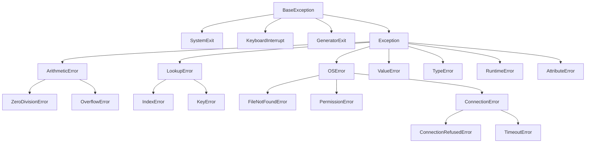

## The Exception Hierarchy



**Rule:** Never catch `BaseException` — it swallows `SystemExit` and `KeyboardInterrupt`.

---

## Exception Handling Patterns

### Basic try/except/else/finally

```python
def read_config(path: str) -> dict:
    """Demonstrates full try/except/else/finally flow."""
    import json
    
    try:
        # Code that might raise
        with open(path, "r") as f:
            data = json.load(f)
    except FileNotFoundError:
        # Handle specific exception
        print(f"Config not found at {path}, using defaults")
        return {"debug": False, "port": 8080}
    except json.JSONDecodeError as e:
        # Access exception details
        raise ConfigError(f"Invalid JSON in {path}: {e}") from e
    except PermissionError:
        raise  # Re-raise as-is
    else:
        # Runs ONLY if no exception was raised
        # Keep success logic here, not in try block
        print(f"Loaded config from {path}")
        return data
    finally:
        # ALWAYS runs — cleanup code
        # Don't put return statements here (suppresses exceptions)
        print("Config loading attempted")
```

### Exception Groups (Python 3.11+)

```python
# When multiple errors occur simultaneously (e.g., parallel tasks)
async def fetch_all(urls: list[str]) -> list[str]:
    results = []
    errors = []
    
    for url in urls:
        try:
            results.append(await fetch(url))
        except Exception as e:
            errors.append(e)
    
    if errors:
        raise ExceptionGroup("Multiple fetch failures", errors)
    return results

# Handling exception groups
try:
    data = await fetch_all(urls)
except* ConnectionError as eg:
    # Handles only ConnectionError instances from the group
    for e in eg.exceptions:
        log_connection_failure(e)
except* TimeoutError as eg:
    # Handles only TimeoutError instances
    for e in eg.exceptions:
        log_timeout(e)
```

### Exception Chaining

```python
class DatabaseError(Exception):
    """Base for all database-related errors."""
    pass

class ConnectionPoolExhausted(DatabaseError):
    pass

def get_user(user_id: int) -> dict:
    try:
        conn = pool.acquire(timeout=5)
    except TimeoutError as e:
        # Chain: preserves original cause
        raise ConnectionPoolExhausted(
            f"Cannot acquire connection for user {user_id}"
        ) from e
    # The traceback shows BOTH exceptions:
    # TimeoutError → ConnectionPoolExhausted
```

---

## Designing Custom Exceptions

### Exception Hierarchy for an Application

```python
class AppError(Exception):
    """Base exception for the application."""
    
    def __init__(self, message: str, code: str = "UNKNOWN", details: dict = None):
        super().__init__(message)
        self.code = code
        self.details = details or {}
    
    def to_dict(self) -> dict:
        return {
            "error": type(self).__name__,
            "code": self.code,
            "message": str(self),
            "details": self.details,
        }

class ValidationError(AppError):
    """Input validation failed."""
    
    def __init__(self, field: str, message: str, value=None):
        super().__init__(
            message=f"Validation failed for '{field}': {message}",
            code="VALIDATION_ERROR",
            details={"field": field, "value": repr(value)},
        )
        self.field = field

class NotFoundError(AppError):
    """Resource not found."""
    
    def __init__(self, resource_type: str, resource_id: str):
        super().__init__(
            message=f"{resource_type} '{resource_id}' not found",
            code="NOT_FOUND",
            details={"resource_type": resource_type, "id": resource_id},
        )

class AuthorizationError(AppError):
    """User lacks permission."""
    
    def __init__(self, action: str, resource: str):
        super().__init__(
            message=f"Not authorized to {action} on {resource}",
            code="FORBIDDEN",
            details={"action": action, "resource": resource},
        )

# Usage
def get_order(order_id: str, user_id: str) -> Order:
    order = db.find_order(order_id)
    if order is None:
        raise NotFoundError("Order", order_id)
    if order.customer_id != user_id:
        raise AuthorizationError("read", f"order/{order_id}")
    return order
```

---

## LBYL vs EAFP

```python
# LBYL: Look Before You Leap (common in C, Java)
# Check conditions before acting
if key in dictionary:
    value = dictionary[key]
else:
    value = default

if os.path.exists(path):
    with open(path) as f:
        data = f.read()

# EAFP: Easier to Ask Forgiveness than Permission (Pythonic)
# Try the operation, handle failure
try:
    value = dictionary[key]
except KeyError:
    value = default

try:
    with open(path) as f:
        data = f.read()
except FileNotFoundError:
    data = ""
```

**When to use which:**

| Use EAFP | Use LBYL |
|-----------|----------|
| Race conditions possible (file might be deleted between check and use) | Check is cheap and failure is expensive |
| Success is the common case | Failure is the common case |
| Atomic operations (dict lookup, attribute access) | Complex validation before expensive operation |

---

## Context Managers for Error Safety

```python
from contextlib import contextmanager, suppress

# suppress — ignore specific exceptions
from contextlib import suppress
with suppress(FileNotFoundError):
    os.remove("temp.txt")  # No error if file doesn't exist

# Custom context manager for transactions
@contextmanager
def database_transaction(connection):
    """Ensures commit on success, rollback on failure."""
    cursor = connection.cursor()
    try:
        yield cursor
        connection.commit()
    except Exception:
        connection.rollback()
        raise
    finally:
        cursor.close()

# Usage
with database_transaction(conn) as cursor:
    cursor.execute("INSERT INTO users (name) VALUES (?)", ("Alice",))
    cursor.execute("INSERT INTO audit (action) VALUES (?)", ("user_created",))
    # If either fails, both are rolled back
```

---

## Retry Patterns

```python
import time
from functools import wraps

def retry(
    max_attempts: int = 3,
    delay: float = 1.0,
    backoff: float = 2.0,
    exceptions: tuple = (Exception,),
):
    """Decorator: retry on failure with exponential backoff."""
    def decorator(func):
        @wraps(func)
        def wrapper(*args, **kwargs):
            current_delay = delay
            last_exception = None
            
            for attempt in range(1, max_attempts + 1):
                try:
                    return func(*args, **kwargs)
                except exceptions as e:
                    last_exception = e
                    if attempt == max_attempts:
                        raise
                    time.sleep(current_delay)
                    current_delay *= backoff
            
            raise last_exception  # Should never reach here
        return wrapper
    return decorator

@retry(max_attempts=3, delay=0.5, exceptions=(ConnectionError, TimeoutError))
def fetch_data(url: str) -> dict:
    response = requests.get(url, timeout=10)
    response.raise_for_status()
    return response.json()
```

---

## Structured Error Handling in APIs

```python
from dataclasses import dataclass
from typing import TypeVar, Generic

T = TypeVar("T")

@dataclass(frozen=True)
class Result(Generic[T]):
    """Rust-inspired Result type — explicit success/failure without exceptions."""
    _value: T | None = None
    _error: str | None = None
    
    @classmethod
    def ok(cls, value: T) -> "Result[T]":
        return cls(_value=value)
    
    @classmethod
    def err(cls, error: str) -> "Result[T]":
        return cls(_error=error)
    
    @property
    def is_ok(self) -> bool:
        return self._error is None
    
    def unwrap(self) -> T:
        if self._error is not None:
            raise ValueError(f"Called unwrap on error: {self._error}")
        return self._value
    
    def unwrap_or(self, default: T) -> T:
        return self._value if self.is_ok else default

# Usage — no exceptions in business logic
def parse_age(value: str) -> Result[int]:
    try:
        age = int(value)
    except ValueError:
        return Result.err(f"'{value}' is not a valid integer")
    
    if age < 0 or age > 150:
        return Result.err(f"Age {age} is out of valid range (0-150)")
    
    return Result.ok(age)

result = parse_age("25")
if result.is_ok:
    print(f"Age: {result.unwrap()}")
else:
    print(f"Error: {result._error}")
```

---

## Hypothetical Use Cases

### Use Case: Resilient API Client

```python
import logging
from typing import Any

logger = logging.getLogger(__name__)

class APIClient:
    """HTTP client with structured error handling."""
    
    def __init__(self, base_url: str, timeout: int = 30):
        self.base_url = base_url
        self.timeout = timeout
    
    def get(self, endpoint: str) -> dict[str, Any]:
        url = f"{self.base_url}/{endpoint}"
        try:
            response = self._request("GET", url)
            return self._parse_response(response)
        except ConnectionError as e:
            logger.error(f"Connection failed: {url}", exc_info=True)
            raise ServiceUnavailableError(self.base_url) from e
        except TimeoutError as e:
            logger.warning(f"Timeout: {url}")
            raise ServiceTimeoutError(url, self.timeout) from e
    
    def _parse_response(self, response) -> dict:
        if response.status_code == 404:
            raise NotFoundError("resource", response.url)
        if response.status_code == 403:
            raise AuthorizationError("access", response.url)
        if response.status_code >= 500:
            raise ServiceUnavailableError(self.base_url)
        
        try:
            return response.json()
        except ValueError as e:
            raise AppError(
                f"Invalid JSON response from {response.url}",
                code="INVALID_RESPONSE",
            ) from e
```

### Use Case: Batch Processing with Error Collection

```python
from dataclasses import dataclass, field

@dataclass
class BatchResult:
    """Collects successes and failures from batch operations."""
    successes: list = field(default_factory=list)
    failures: list = field(default_factory=list)
    
    @property
    def total(self) -> int:
        return len(self.successes) + len(self.failures)
    
    @property
    def success_rate(self) -> float:
        return len(self.successes) / self.total if self.total else 0.0

def process_batch(items: list[dict]) -> BatchResult:
    """Process items, collecting errors instead of failing fast."""
    result = BatchResult()
    
    for item in items:
        try:
            processed = transform(item)
            validate(processed)
            save(processed)
            result.successes.append(item["id"])
        except ValidationError as e:
            result.failures.append({"id": item.get("id"), "error": str(e), "type": "validation"})
        except DatabaseError as e:
            result.failures.append({"id": item.get("id"), "error": str(e), "type": "database"})
            # Database errors might indicate a systemic issue
            if len(result.failures) > 10:
                logger.critical("Too many database errors, aborting batch")
                break
    
    return result
```

---

## Key Takeaways

1. **Catch specific exceptions** — never bare `except:` or `except Exception:`
2. **Use `from e`** for exception chaining — preserves the causal chain
3. **EAFP is Pythonic** — try/except is not slow in the success path
4. **Design exception hierarchies** — callers can catch at the granularity they need
5. **`else` clause** keeps success logic out of the try block
6. **`finally` for cleanup** — but prefer context managers (`with`)
7. **Exception Groups** (3.11+) handle concurrent failures cleanly
8. **Never silence exceptions** unless you have a specific reason (use `suppress` explicitly)
