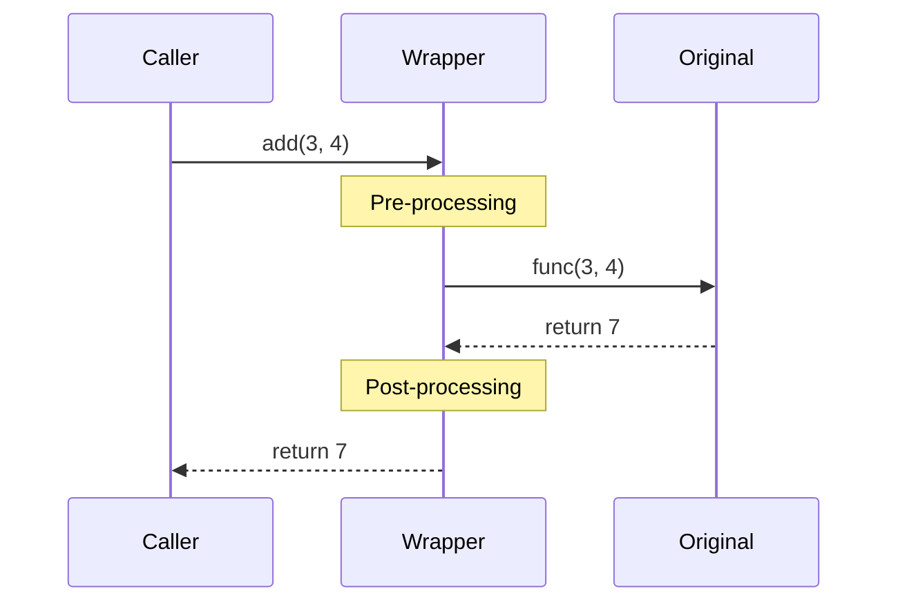

## Decorators — Functions That Modify Functions

### How Decorators Work

```python
# A decorator is a function that takes a function and returns a function
def my_decorator(func):
    def wrapper(*args, **kwargs):
        # Before the original function
        print(f"Calling {func.__name__}")
        result = func(*args, **kwargs)
        # After the original function
        print(f"{func.__name__} returned {result}")
        return result
    return wrapper

@my_decorator
def add(a, b):
    return a + b

# @my_decorator is syntactic sugar for:
# add = my_decorator(add)

add(3, 4)
# Output:
# Calling add
# Returned 7
```



### Preserving Function Metadata

```python
from functools import wraps

def timer(func):
    """Decorator that measures execution time."""
    @wraps(func)  # Preserves __name__, __doc__, __module__
    def wrapper(*args, **kwargs):
        import time
        start = time.perf_counter()
        result = func(*args, **kwargs)
        elapsed = time.perf_counter() - start
        print(f"{func.__name__} took {elapsed:.4f}s")
        return result
    return wrapper

@timer
def slow_function():
    """This docstring is preserved thanks to @wraps."""
    import time
    time.sleep(1)

slow_function.__name__  # "slow_function" (not "wrapper")
slow_function.__doc__   # "This docstring is preserved..."
```

### Decorators with Arguments

```python
from functools import wraps

def retry(max_attempts: int = 3, exceptions: tuple = (Exception,)):
    """Decorator factory — returns a decorator configured with arguments."""
    def decorator(func):
        @wraps(func)
        def wrapper(*args, **kwargs):
            for attempt in range(1, max_attempts + 1):
                try:
                    return func(*args, **kwargs)
                except exceptions as e:
                    if attempt == max_attempts:
                        raise
                    print(f"Attempt {attempt} failed: {e}")
        return wrapper
    return decorator

@retry(max_attempts=5, exceptions=(ConnectionError, TimeoutError))
def fetch_data(url):
    ...

# Three levels:
# retry(max_attempts=5) → returns decorator
# decorator(fetch_data) → returns wrapper
# wrapper(url) → calls fetch_data with retry logic
```

### Class-Based Decorators

```python
class CacheResult:
    """Decorator as a class — useful when you need state."""
    
    def __init__(self, ttl_seconds: int = 300):
        self.ttl = ttl_seconds
        self.cache = {}
    
    def __call__(self, func):
        @wraps(func)
        def wrapper(*args, **kwargs):
            import time
            key = (args, tuple(sorted(kwargs.items())))
            
            if key in self.cache:
                result, timestamp = self.cache[key]
                if time.time() - timestamp < self.ttl:
                    return result
            
            result = func(*args, **kwargs)
            self.cache[key] = (result, time.time())
            return result
        
        wrapper.clear_cache = self.cache.clear
        return wrapper
    
    def __repr__(self):
        return f"CacheResult(ttl={self.ttl}, entries={len(self.cache)})"

@CacheResult(ttl_seconds=60)
def expensive_query(user_id: int) -> dict:
    ...

expensive_query.clear_cache()  # Exposed method
```

### Stacking Decorators

```python
# Decorators apply bottom-up (closest to function first)
@log_calls          # 3rd: wraps the authenticated+validated function
@authenticate       # 2nd: wraps the validated function
@validate_input     # 1st: wraps the original function
def create_user(data: dict) -> User:
    ...

# Equivalent to:
# create_user = log_calls(authenticate(validate_input(create_user)))
```

---

## Generators — Lazy Evaluation

### Generator Functions

```python
def fibonacci():
    """Infinite Fibonacci sequence — generates values on demand."""
    a, b = 0, 1
    while True:
        yield a
        a, b = b, a + b

# Only computes values as requested
fib = fibonacci()
next(fib)  # 0
next(fib)  # 1
next(fib)  # 1
next(fib)  # 2

# Take first 10
from itertools import islice
first_10 = list(islice(fibonacci(), 10))
# [0, 1, 1, 2, 3, 5, 8, 13, 21, 34]
```

### Generator vs List — Memory Comparison

```python
import sys

# List: ALL values in memory at once
squares_list = [x**2 for x in range(1_000_000)]
sys.getsizeof(squares_list)  # ~8.4 MB

# Generator: ONE value at a time
squares_gen = (x**2 for x in range(1_000_000))
sys.getsizeof(squares_gen)   # ~200 bytes (constant!)

# Both produce the same results
sum(x**2 for x in range(1_000_000))  # Generator expression in function call
```

### yield from — Delegating to Sub-generators

```python
def flatten(nested):
    """Recursively flatten any nested iterable."""
    for item in nested:
        if isinstance(item, (list, tuple, set)):
            yield from flatten(item)  # Delegate to recursive call
        else:
            yield item

list(flatten([1, [2, 3], [4, [5, 6]], 7]))
# [1, 2, 3, 4, 5, 6, 7]

# yield from also forwards .send() and .throw() to sub-generator
def chain(*iterables):
    for it in iterables:
        yield from it

list(chain([1, 2], [3, 4], [5, 6]))  # [1, 2, 3, 4, 5, 6]
```

### Generators as Coroutines (send/throw)

```python
def running_average():
    """Generator that accepts values via .send() and yields running average."""
    total = 0.0
    count = 0
    average = None
    
    while True:
        value = yield average  # Receive value, yield current average
        if value is None:
            break
        total += value
        count += 1
        average = total / count

avg = running_average()
next(avg)          # Prime the generator (advance to first yield)
avg.send(10)       # 10.0
avg.send(20)       # 15.0
avg.send(30)       # 20.0
avg.send(None)     # StopIteration
```

### Practical Generator Patterns

```python
def read_in_chunks(file_path: str, chunk_size: int = 8192):
    """Read a large file in chunks without loading it all into memory."""
    with open(file_path, "rb") as f:
        while chunk := f.read(chunk_size):
            yield chunk

def batch(iterable, size: int):
    """Split an iterable into fixed-size batches."""
    from itertools import islice
    iterator = iter(iterable)
    while batch := list(islice(iterator, size)):
        yield batch

# Process 1M records in batches of 100
for record_batch in batch(range(1_000_000), 100):
    process_batch(record_batch)

def sliding_window(iterable, size: int):
    """Sliding window over an iterable."""
    from collections import deque
    window = deque(maxlen=size)
    for item in iterable:
        window.append(item)
        if len(window) == size:
            yield tuple(window)

list(sliding_window([1, 2, 3, 4, 5], 3))
# [(1,2,3), (2,3,4), (3,4,5)]
```

---

## Context Managers — Resource Management

### The Protocol

```python
class ManagedResource:
    """Context manager using the protocol directly."""
    
    def __init__(self, name: str):
        self.name = name
        print(f"Creating {name}")
    
    def __enter__(self):
        """Called when entering 'with' block. Return value binds to 'as'."""
        print(f"Acquiring {self.name}")
        return self  # The 'as' variable gets this value
    
    def __exit__(self, exc_type, exc_val, exc_tb):
        """Called when leaving 'with' block (even on exception).
        
        Args:
            exc_type: Exception class (or None if no exception)
            exc_val: Exception instance (or None)
            exc_tb: Traceback (or None)
        
        Returns:
            True to suppress the exception, False/None to propagate it.
        """
        print(f"Releasing {self.name}")
        if exc_type is not None:
            print(f"Exception occurred: {exc_val}")
        return False  # Don't suppress exceptions

with ManagedResource("database") as db:
    print("Using database")
# Output:
# Creating database
# Acquiring database
# Using database
# Releasing database
```

### contextlib — Decorator-Based Context Managers

```python
from contextlib import contextmanager, asynccontextmanager
import time

@contextmanager
def timer(label: str):
    """Measure execution time of a block."""
    start = time.perf_counter()
    try:
        yield  # Control passes to the 'with' block
    finally:
        elapsed = time.perf_counter() - start
        print(f"{label}: {elapsed:.4f}s")

with timer("data processing"):
    process_large_dataset()

@contextmanager
def temporary_directory():
    """Create a temp dir, clean up after use."""
    import tempfile
    import shutil
    
    path = tempfile.mkdtemp()
    try:
        yield path
    finally:
        shutil.rmtree(path)

with temporary_directory() as tmpdir:
    # Work with tmpdir
    pass  # Automatically cleaned up
```

### Nested and Stacked Context Managers

```python
from contextlib import ExitStack

def process_files(file_paths: list[str]) -> list[str]:
    """Open multiple files safely — all closed even if one fails."""
    with ExitStack() as stack:
        files = [
            stack.enter_context(open(path, "r"))
            for path in file_paths
        ]
        return [f.read() for f in files]

# ExitStack also supports dynamic cleanup
@contextmanager
def managed_connection_pool(size: int):
    """Pool that cleans up all connections on exit."""
    with ExitStack() as stack:
        connections = []
        for _ in range(size):
            conn = create_connection()
            stack.callback(conn.close)  # Register cleanup
            connections.append(conn)
        yield connections
```

### Async Context Managers

```python
from contextlib import asynccontextmanager

@asynccontextmanager
async def async_db_session():
    """Async context manager for database sessions."""
    session = await create_session()
    try:
        yield session
        await session.commit()
    except Exception:
        await session.rollback()
        raise
    finally:
        await session.close()

async def get_user(user_id: int):
    async with async_db_session() as session:
        return await session.query(User).get(user_id)
```

---

## Combining All Three

### Use Case: Instrumented Pipeline

```python
from functools import wraps
from contextlib import contextmanager
import time
import logging

logger = logging.getLogger(__name__)

# Decorator: adds timing and logging to any function
def instrumented(func):
    @wraps(func)
    def wrapper(*args, **kwargs):
        start = time.perf_counter()
        try:
            result = func(*args, **kwargs)
            elapsed = time.perf_counter() - start
            logger.info(f"{func.__name__} completed in {elapsed:.3f}s")
            return result
        except Exception as e:
            elapsed = time.perf_counter() - start
            logger.error(f"{func.__name__} failed after {elapsed:.3f}s: {e}")
            raise
    return wrapper

# Generator: lazy data pipeline
def read_records(source):
    """Generator: yields records one at a time."""
    for raw in source:
        yield parse_record(raw)

def filter_valid(records):
    """Generator: passes through only valid records."""
    for record in records:
        if record.is_valid():
            yield record

def transform(records):
    """Generator: applies business logic."""
    for record in records:
        yield record.transform()

# Context manager: manages the pipeline lifecycle
@contextmanager
def pipeline(source, destination):
    """Context manager: sets up and tears down the pipeline."""
    logger.info("Pipeline starting")
    dest = open_destination(destination)
    try:
        yield dest
    finally:
        dest.flush()
        dest.close()
        logger.info("Pipeline complete")

# Putting it all together
@instrumented
def run_etl(source_path: str, dest_path: str):
    with pipeline(source_path, dest_path) as dest:
        records = read_records(open(source_path))
        valid = filter_valid(records)
        transformed = transform(valid)
        
        for batch in batch(transformed, size=1000):
            dest.write_batch(batch)
```

---

## Key Takeaways

1. **Always use `@wraps`** — preserves function metadata for debugging and documentation
2. **Decorator factories** (decorators with arguments) add a third nesting level
3. **Generators are lazy** — use them for large datasets, infinite sequences, and pipelines
4. **`yield from`** delegates to sub-generators and forwards send/throw
5. **Context managers guarantee cleanup** — prefer them over try/finally
6. **`ExitStack`** handles dynamic numbers of context managers
7. **Combine all three** for clean, composable, resource-safe code
