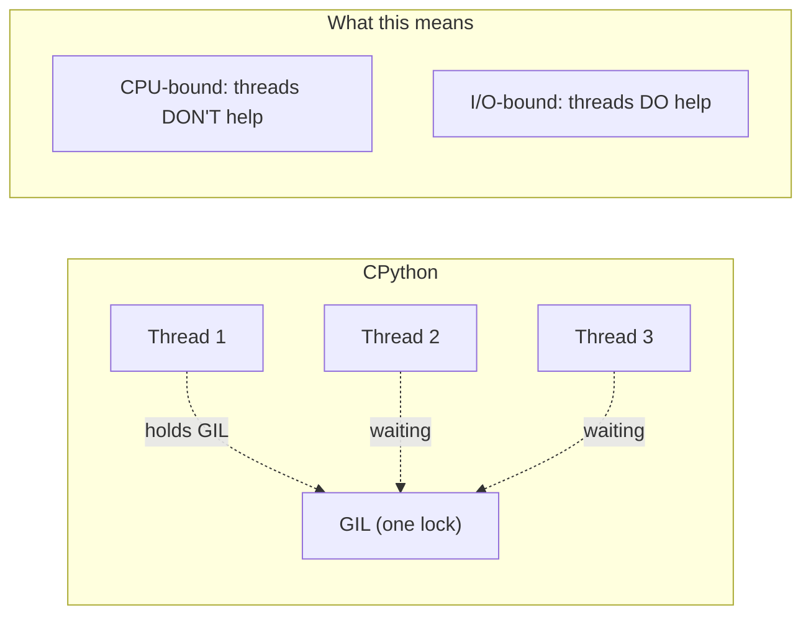
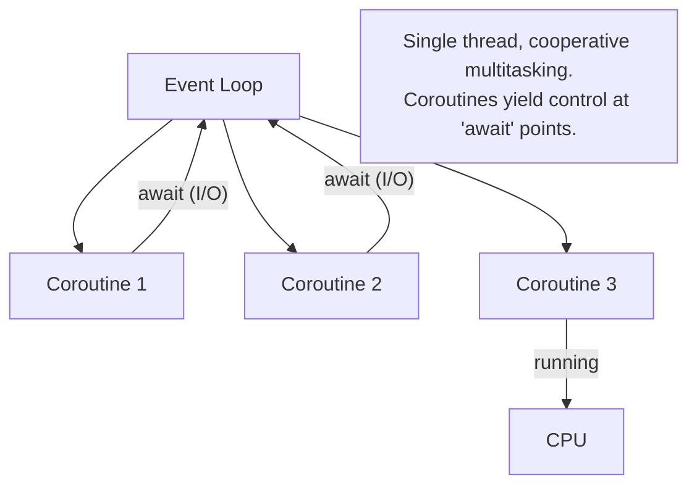

## The GIL — Global Interpreter Lock



**The GIL ensures only one thread executes Python bytecode at a time.**

| Task Type | Use | Why |
|-----------|-----|-----|
| I/O-bound (network, disk, DB) | `asyncio` or `threading` | GIL is released during I/O waits |
| CPU-bound (math, parsing, ML) | `multiprocessing` | Separate processes, each with own GIL |
| Mixed | `asyncio` + `ProcessPoolExecutor` | Async for I/O, processes for CPU |

---

## Threading — Concurrent I/O

```python
import threading
from concurrent.futures import ThreadPoolExecutor, as_completed
import time

# Basic thread
def download(url: str) -> str:
    time.sleep(1)  # Simulates network I/O
    return f"Downloaded {url}"

# ThreadPoolExecutor — the modern way
def download_all(urls: list[str]) -> list[str]:
    results = []
    with ThreadPoolExecutor(max_workers=10) as executor:
        # Submit all tasks
        futures = {executor.submit(download, url): url for url in urls}
        
        # Process results as they complete
        for future in as_completed(futures):
            url = futures[future]
            try:
                result = future.result(timeout=30)
                results.append(result)
            except Exception as e:
                print(f"Failed {url}: {e}")
    
    return results

# 10 downloads in ~1 second instead of ~10 seconds
urls = [f"http://example.com/page/{i}" for i in range(10)]
download_all(urls)
```

### Thread Safety

```python
import threading

# Race condition example
counter = 0

def increment():
    global counter
    for _ in range(100_000):
        counter += 1  # NOT atomic! Read-modify-write

threads = [threading.Thread(target=increment) for _ in range(4)]
for t in threads: t.start()
for t in threads: t.join()
print(counter)  # Less than 400,000 — race condition!

# Fix: use a Lock
lock = threading.Lock()
counter = 0

def safe_increment():
    global counter
    for _ in range(100_000):
        with lock:  # Only one thread at a time
            counter += 1

# Other synchronization primitives
event = threading.Event()       # Signal between threads
semaphore = threading.Semaphore(5)  # Limit concurrent access
barrier = threading.Barrier(3)  # Wait for N threads to arrive
```

---

## Multiprocessing — True Parallelism

```python
from multiprocessing import Pool, Process, Queue
from concurrent.futures import ProcessPoolExecutor
import os

# CPU-bound task
def compute_heavy(n: int) -> int:
    """Simulate CPU-intensive work."""
    return sum(i * i for i in range(n))

# ProcessPoolExecutor — cleanest API
def parallel_compute(tasks: list[int]) -> list[int]:
    with ProcessPoolExecutor(max_workers=os.cpu_count()) as executor:
        results = list(executor.map(compute_heavy, tasks))
    return results

# Each process has its own Python interpreter and GIL
# Data is serialized (pickled) between processes

# Pool with imap for large datasets (lazy, ordered)
def process_large_dataset(items: list) -> list:
    with Pool(processes=4) as pool:
        # imap_unordered: results come as they finish (faster)
        results = []
        for result in pool.imap_unordered(transform, items, chunksize=100):
            results.append(result)
    return results
```

### Shared State Between Processes

```python
from multiprocessing import Value, Array, Manager

# Shared memory (fast, limited types)
shared_counter = Value('i', 0)  # 'i' = integer
shared_array = Array('d', [0.0] * 10)  # 'd' = double

def worker(counter, array, index):
    with counter.get_lock():
        counter.value += 1
    array[index] = counter.value

# Manager (slower, supports complex types)
with Manager() as manager:
    shared_dict = manager.dict()
    shared_list = manager.list()
    
    # These can be passed to child processes
    # Changes are synchronized automatically
```

---

## asyncio — Asynchronous I/O

### Core Concepts



```python
import asyncio
import aiohttp

# Coroutine — defined with async def
async def fetch_url(session: aiohttp.ClientSession, url: str) -> str:
    async with session.get(url) as response:
        return await response.text()

# Run multiple coroutines concurrently
async def fetch_all(urls: list[str]) -> list[str]:
    async with aiohttp.ClientSession() as session:
        tasks = [fetch_url(session, url) for url in urls]
        return await asyncio.gather(*tasks)

# Entry point
results = asyncio.run(fetch_all(urls))
```

### asyncio Patterns

```python
import asyncio
from asyncio import Semaphore, Queue

# Rate limiting with semaphore
async def rate_limited_fetch(urls: list[str], max_concurrent: int = 5) -> list[str]:
    semaphore = Semaphore(max_concurrent)
    
    async def fetch_with_limit(url: str) -> str:
        async with semaphore:  # At most max_concurrent at a time
            return await fetch_url(url)
    
    tasks = [fetch_with_limit(url) for url in urls]
    return await asyncio.gather(*tasks)

# Producer-consumer with asyncio.Queue
async def producer(queue: Queue, items: list):
    for item in items:
        await queue.put(item)
    await queue.put(None)  # Sentinel to signal completion

async def consumer(queue: Queue, name: str):
    while True:
        item = await queue.get()
        if item is None:
            queue.task_done()
            break
        await process(item)
        queue.task_done()

async def pipeline(items: list, num_consumers: int = 3):
    queue: Queue = Queue(maxsize=100)
    
    producers = [asyncio.create_task(producer(queue, items))]
    consumers = [
        asyncio.create_task(consumer(queue, f"consumer-{i}"))
        for i in range(num_consumers)
    ]
    
    await asyncio.gather(*producers)
    await queue.join()  # Wait for all items to be processed
    
    for c in consumers:
        c.cancel()

# Timeout handling
async def fetch_with_timeout(url: str, timeout: float = 10.0) -> str:
    try:
        return await asyncio.wait_for(fetch_url(url), timeout=timeout)
    except asyncio.TimeoutError:
        return f"Timeout fetching {url}"

# TaskGroup (Python 3.11+) — structured concurrency
async def fetch_all_structured(urls: list[str]) -> list[str]:
    results = []
    async with asyncio.TaskGroup() as tg:
        for url in urls:
            tg.create_task(fetch_and_append(url, results))
    # All tasks complete or all are cancelled if one raises
    return results
```

### Async Generators and Iterators

```python
async def stream_events(url: str):
    """Async generator — yields events as they arrive."""
    async with aiohttp.ClientSession() as session:
        async with session.get(url) as response:
            async for line in response.content:
                if line.strip():
                    yield json.loads(line)

# Consuming async generators
async def process_stream():
    async for event in stream_events("http://api.example.com/events"):
        handle_event(event)

# Async comprehension
async def get_all_users() -> list[dict]:
    return [user async for user in fetch_users_paginated()]
```

---

## Combining Approaches

```python
import asyncio
from concurrent.futures import ProcessPoolExecutor

async def hybrid_pipeline(urls: list[str]) -> list[dict]:
    """Fetch data async, process CPU-heavy in parallel."""
    
    # Step 1: Fetch all data concurrently (I/O-bound → asyncio)
    raw_data = await fetch_all(urls)
    
    # Step 2: Process data in parallel (CPU-bound → multiprocessing)
    loop = asyncio.get_event_loop()
    with ProcessPoolExecutor() as pool:
        processed = await asyncio.gather(*[
            loop.run_in_executor(pool, cpu_heavy_transform, data)
            for data in raw_data
        ])
    
    return processed
```

---

## Synchronization Primitives Comparison

| Primitive | threading | asyncio | Use Case |
|-----------|-----------|---------|----------|
| Lock | `threading.Lock()` | `asyncio.Lock()` | Mutual exclusion |
| Semaphore | `threading.Semaphore(n)` | `asyncio.Semaphore(n)` | Limit concurrency |
| Event | `threading.Event()` | `asyncio.Event()` | Signal between tasks |
| Queue | `queue.Queue()` | `asyncio.Queue()` | Producer-consumer |
| Barrier | `threading.Barrier(n)` | `asyncio.Barrier(n)` | Wait for N tasks |

---

## Hypothetical Use Cases

### Use Case: Web Scraper with Rate Limiting

```python
import asyncio
import aiohttp
from dataclasses import dataclass, field
from datetime import datetime

@dataclass
class ScrapeResult:
    url: str
    status: int
    content_length: int
    elapsed_ms: float
    error: str | None = None

async def scrape_with_rate_limit(
    urls: list[str],
    max_concurrent: int = 10,
    delay_between: float = 0.1,
) -> list[ScrapeResult]:
    """Scrape URLs with concurrency limit and politeness delay."""
    semaphore = asyncio.Semaphore(max_concurrent)
    results: list[ScrapeResult] = []
    
    async def fetch_one(session: aiohttp.ClientSession, url: str) -> ScrapeResult:
        async with semaphore:
            start = datetime.now()
            try:
                async with session.get(url, timeout=aiohttp.ClientTimeout(total=30)) as resp:
                    content = await resp.read()
                    elapsed = (datetime.now() - start).total_seconds() * 1000
                    return ScrapeResult(
                        url=url, status=resp.status,
                        content_length=len(content), elapsed_ms=elapsed,
                    )
            except Exception as e:
                elapsed = (datetime.now() - start).total_seconds() * 1000
                return ScrapeResult(
                    url=url, status=0, content_length=0,
                    elapsed_ms=elapsed, error=str(e),
                )
            finally:
                await asyncio.sleep(delay_between)
    
    async with aiohttp.ClientSession() as session:
        tasks = [fetch_one(session, url) for url in urls]
        results = await asyncio.gather(*tasks)
    
    return results
```

### Use Case: Parallel Data Processing Pipeline

```python
from multiprocessing import Pool
from concurrent.futures import ProcessPoolExecutor
from pathlib import Path
import json

def process_file(file_path: str) -> dict:
    """CPU-intensive: parse, validate, transform a data file."""
    path = Path(file_path)
    data = json.loads(path.read_text())
    
    # Heavy computation
    transformed = {
        "source": path.name,
        "record_count": len(data),
        "summary": compute_statistics(data),
        "anomalies": detect_anomalies(data),
    }
    return transformed

def parallel_process_directory(data_dir: str) -> list[dict]:
    """Process all JSON files in a directory using all CPU cores."""
    files = list(Path(data_dir).glob("*.json"))
    
    with ProcessPoolExecutor() as executor:
        results = list(executor.map(
            process_file,
            [str(f) for f in files],
            chunksize=10,  # Send 10 files per worker batch
        ))
    
    return results
```

---

## Key Takeaways

1. **GIL** means threads don't help for CPU-bound work — use multiprocessing
2. **asyncio** is for I/O-bound concurrency — single thread, cooperative scheduling
3. **ThreadPoolExecutor** is the simplest way to parallelize I/O operations
4. **ProcessPoolExecutor** gives true parallelism for CPU-bound work
5. **`asyncio.gather`** runs coroutines concurrently; **`TaskGroup`** (3.11+) adds structured cancellation
6. **Semaphores** limit concurrency — essential for rate limiting
7. **Never mix blocking I/O with asyncio** — use `run_in_executor` for blocking calls
8. **Data between processes is pickled** — keep shared data minimal
