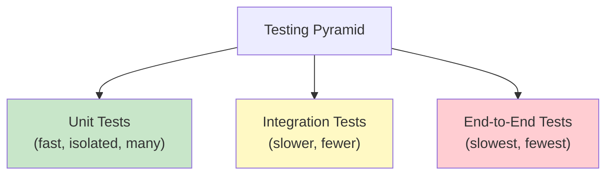

## Testing Philosophy



| Level | Tests | Speed | Scope |
|-------|-------|-------|-------|
| Unit | Hundreds | Milliseconds | Single function/class |
| Integration | Dozens | Seconds | Multiple components together |
| E2E | Few | Minutes | Full system behavior |

---

## pytest — The Standard

### Basic Tests

```python
# tests/test_calculator.py
import pytest
from my_package.calculator import add, divide, Calculator

# Simple assertion
def test_add():
    assert add(2, 3) == 5

def test_add_negative():
    assert add(-1, 1) == 0

def test_add_floats():
    assert add(0.1, 0.2) == pytest.approx(0.3)  # Float comparison

# Testing exceptions
def test_divide_by_zero():
    with pytest.raises(ZeroDivisionError, match="division by zero"):
        divide(10, 0)

def test_invalid_input():
    with pytest.raises(TypeError):
        add("a", 1)
```

### Fixtures — Setup and Teardown

```python
import pytest
from pathlib import Path
import json

@pytest.fixture
def sample_user() -> dict:
    """Simple fixture — returns test data."""
    return {"name": "Alice", "email": "alice@example.com", "age": 30}

@pytest.fixture
def temp_config(tmp_path: Path) -> Path:
    """Fixture using built-in tmp_path — creates a temp config file."""
    config = {"database_url": "sqlite:///test.db", "debug": True}
    config_path = tmp_path / "config.json"
    config_path.write_text(json.dumps(config))
    return config_path

@pytest.fixture
def db_connection():
    """Fixture with setup AND teardown."""
    conn = create_test_database()
    yield conn  # Test runs here
    conn.close()
    cleanup_test_database()

# Using fixtures
def test_user_creation(sample_user):
    user = User(**sample_user)
    assert user.name == "Alice"

def test_config_loading(temp_config):
    config = load_config(str(temp_config))
    assert config["debug"] is True
```

### Fixture Scopes

```python
@pytest.fixture(scope="session")
def database():
    """Created once for the entire test session."""
    db = create_database()
    yield db
    db.drop()

@pytest.fixture(scope="module")
def api_client():
    """Created once per test module (file)."""
    return APIClient(base_url="http://test-api.local")

@pytest.fixture(scope="function")  # Default
def clean_state(database):
    """Created fresh for each test function."""
    database.clear()
    yield database
```

### Parametrize — Data-Driven Tests

```python
@pytest.mark.parametrize("input,expected", [
    ("hello", "HELLO"),
    ("world", "WORLD"),
    ("", ""),
    ("123", "123"),
    ("Hello World", "HELLO WORLD"),
])
def test_uppercase(input, expected):
    assert input.upper() == expected

@pytest.mark.parametrize("a,b,expected", [
    (1, 2, 3),
    (-1, 1, 0),
    (0, 0, 0),
    (100, 200, 300),
    (-5, -3, -8),
])
def test_add(a, b, expected):
    assert add(a, b) == expected

# Parametrize with IDs for readable output
@pytest.mark.parametrize("status_code,should_retry", [
    pytest.param(200, False, id="success"),
    pytest.param(429, True, id="rate-limited"),
    pytest.param(500, True, id="server-error"),
    pytest.param(404, False, id="not-found"),
])
def test_retry_logic(status_code, should_retry):
    assert should_retry_request(status_code) == should_retry
```

### Markers — Categorizing Tests

```python
# conftest.py — register custom markers
def pytest_configure(config):
    config.addinivalue_line("markers", "slow: marks tests as slow")
    config.addinivalue_line("markers", "integration: integration tests")

# Usage
@pytest.mark.slow
def test_large_dataset_processing():
    ...

@pytest.mark.integration
def test_database_connection():
    ...

@pytest.mark.skipif(sys.platform == "win32", reason="Unix only")
def test_unix_permissions():
    ...

@pytest.mark.xfail(reason="Known bug #123")
def test_edge_case():
    ...
```

```bash
# Run only fast tests
pytest -m "not slow"

# Run only integration tests
pytest -m integration

# Run with verbose output
pytest -v --tb=short
```

---

## Mocking — Isolating Units

```python
from unittest.mock import Mock, patch, MagicMock, AsyncMock
from my_package.service import UserService

# patch — replace an object during the test
@patch("my_package.service.database.get_user")
def test_get_user_found(mock_get_user):
    mock_get_user.return_value = {"id": 1, "name": "Alice"}
    
    service = UserService()
    user = service.get_user(1)
    
    assert user["name"] == "Alice"
    mock_get_user.assert_called_once_with(1)

# patch as context manager
def test_api_call():
    with patch("my_package.client.requests.get") as mock_get:
        mock_get.return_value.status_code = 200
        mock_get.return_value.json.return_value = {"data": "test"}
        
        result = fetch_data("http://api.example.com")
        
        assert result == {"data": "test"}
        mock_get.assert_called_once_with("http://api.example.com", timeout=30)

# Mock with side_effect — simulate different responses
@patch("my_package.service.external_api")
def test_retry_on_failure(mock_api):
    mock_api.side_effect = [
        ConnectionError("timeout"),  # First call fails
        {"status": "ok"},            # Second call succeeds
    ]
    
    result = resilient_fetch()
    assert result == {"status": "ok"}
    assert mock_api.call_count == 2

# AsyncMock for async code
@patch("my_package.async_client.fetch", new_callable=AsyncMock)
async def test_async_fetch(mock_fetch):
    mock_fetch.return_value = {"users": []}
    result = await get_users()
    assert result == []
```

### When NOT to Mock

```python
# DON'T mock what you own — test the real thing
# DON'T mock data structures (dicts, lists)
# DON'T mock simple pure functions

# DO mock:
# - External APIs (network calls)
# - Databases (in unit tests)
# - File system (when testing logic, not I/O)
# - Time (datetime.now, time.sleep)
# - Random (when testing deterministic behavior)

# Example: mock time
from freezegun import freeze_time

@freeze_time("2026-01-15 12:00:00")
def test_token_expiry():
    token = create_token(expires_in=3600)
    assert token.expires_at == datetime(2026, 1, 15, 13, 0, 0)
```

---

## Testing Patterns

### Arrange-Act-Assert (AAA)

```python
def test_order_total_with_discount():
    # Arrange — set up test data
    order = Order(items=[
        OrderItem("Widget", price=10.00, quantity=3),
        OrderItem("Gadget", price=25.00, quantity=1),
    ])
    discount = PercentageDiscount(10)  # 10% off
    
    # Act — perform the action
    total = order.calculate_total(discount=discount)
    
    # Assert — verify the result
    assert total == pytest.approx(49.50)  # (30 + 25) * 0.9
```

### Testing Error Paths

```python
def test_insufficient_funds():
    account = BankAccount(balance=100.00)
    
    with pytest.raises(InsufficientFundsError) as exc_info:
        account.withdraw(150.00)
    
    # Verify exception details
    assert exc_info.value.balance == 100.00
    assert exc_info.value.amount == 150.00
    assert "insufficient funds" in str(exc_info.value).lower()
    
    # Verify account state unchanged
    assert account.balance == 100.00

def test_validation_collects_all_errors():
    """Test that validation reports ALL errors, not just the first."""
    data = {"name": "", "email": "invalid", "age": -5}
    
    errors = validate_user(data)
    
    assert len(errors) == 3
    assert any(e.field == "name" for e in errors)
    assert any(e.field == "email" for e in errors)
    assert any(e.field == "age" for e in errors)
```

### Property-Based Testing with Hypothesis

```python
from hypothesis import given, strategies as st, assume

@given(st.lists(st.integers()))
def test_sort_is_idempotent(lst):
    """Sorting twice gives the same result as sorting once."""
    assert sorted(sorted(lst)) == sorted(lst)

@given(st.lists(st.integers(), min_size=1))
def test_sort_preserves_length(lst):
    assert len(sorted(lst)) == len(lst)

@given(st.text(min_size=1), st.text(min_size=1))
def test_concat_length(a, b):
    assert len(a + b) == len(a) + len(b)

@given(st.integers(min_value=0, max_value=1000))
def test_encode_decode_roundtrip(n):
    """Encoding then decoding returns the original value."""
    encoded = encode(n)
    decoded = decode(encoded)
    assert decoded == n
```

---

## Test Configuration

```toml
# pyproject.toml
[tool.pytest.ini_options]
testpaths = ["tests"]
addopts = [
    "-ra",              # Show summary of all non-passing tests
    "--strict-markers", # Error on unknown markers
    "--tb=short",       # Shorter tracebacks
    "-q",               # Quiet output
]
markers = [
    "slow: marks tests as slow (deselect with '-m \"not slow\"')",
    "integration: integration tests requiring external services",
]
filterwarnings = [
    "error",  # Treat warnings as errors
    "ignore::DeprecationWarning:third_party_lib.*",
]

[tool.coverage.run]
source = ["src"]
branch = true

[tool.coverage.report]
fail_under = 80
show_missing = true
exclude_lines = [
    "pragma: no cover",
    "if TYPE_CHECKING:",
    "if __name__ == .__main__.",
    "@overload",
]
```

```bash
# Run with coverage
pytest --cov=my_package --cov-report=term-missing --cov-report=html

# Run specific test
pytest tests/test_core.py::test_add

# Run tests matching a pattern
pytest -k "test_user and not slow"

# Parallel execution
pytest -n auto  # requires pytest-xdist
```

---

## Hypothetical Use Case: Testing a REST API Client

```python
import pytest
import respx
import httpx
from my_package.api_client import APIClient, APIError

@pytest.fixture
def client():
    return APIClient(base_url="https://api.example.com", api_key="test-key")

class TestAPIClient:
    @respx.mock
    def test_get_user_success(self, client):
        respx.get("https://api.example.com/users/123").mock(
            return_value=httpx.Response(200, json={"id": 123, "name": "Alice"})
        )
        
        user = client.get_user(123)
        
        assert user["name"] == "Alice"
    
    @respx.mock
    def test_get_user_not_found(self, client):
        respx.get("https://api.example.com/users/999").mock(
            return_value=httpx.Response(404, json={"error": "Not found"})
        )
        
        with pytest.raises(APIError) as exc_info:
            client.get_user(999)
        
        assert exc_info.value.status_code == 404
    
    @respx.mock
    def test_retry_on_server_error(self, client):
        route = respx.get("https://api.example.com/users/1")
        route.side_effect = [
            httpx.Response(503),
            httpx.Response(503),
            httpx.Response(200, json={"id": 1, "name": "Bob"}),
        ]
        
        user = client.get_user(1)
        
        assert user["name"] == "Bob"
        assert route.call_count == 3
    
    @respx.mock
    def test_timeout_raises_api_error(self, client):
        respx.get("https://api.example.com/users/1").mock(
            side_effect=httpx.ReadTimeout("Connection timed out")
        )
        
        with pytest.raises(APIError, match="timed out"):
            client.get_user(1)
```

---

## Key Takeaways

1. **pytest is the standard** — use it over unittest for cleaner syntax
2. **Fixtures** manage test setup/teardown — use scopes to control lifecycle
3. **Parametrize** eliminates duplicate test functions — one test, many inputs
4. **Mock external dependencies** (APIs, DBs, time) — never mock what you own
5. **AAA pattern** (Arrange-Act-Assert) keeps tests readable
6. **Property-based testing** (Hypothesis) finds edge cases you'd never think of
7. **Coverage is a guide, not a goal** — 80% is a good target, 100% is often wasteful
8. **Test behavior, not implementation** — tests should survive refactoring
