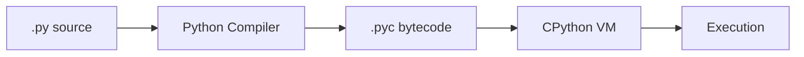
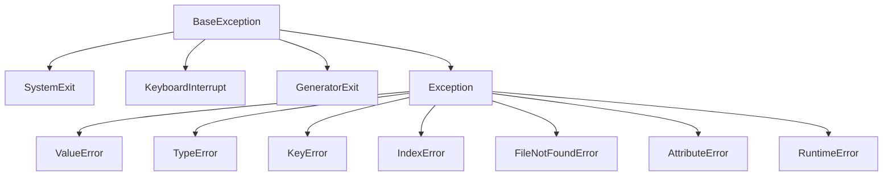
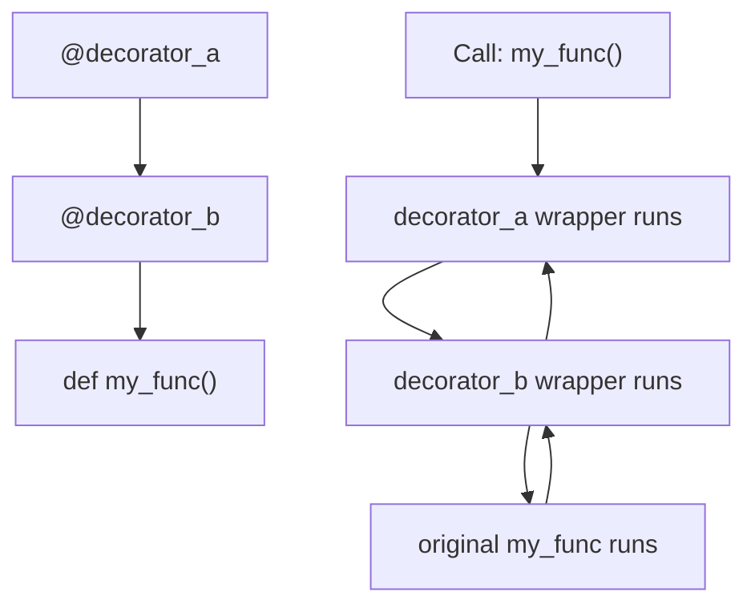
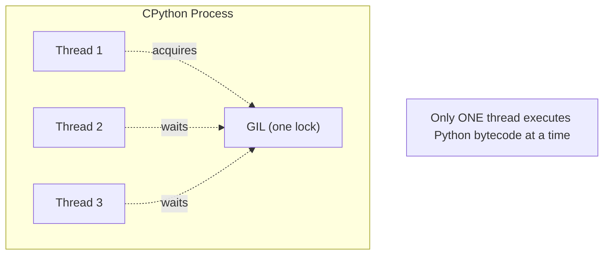
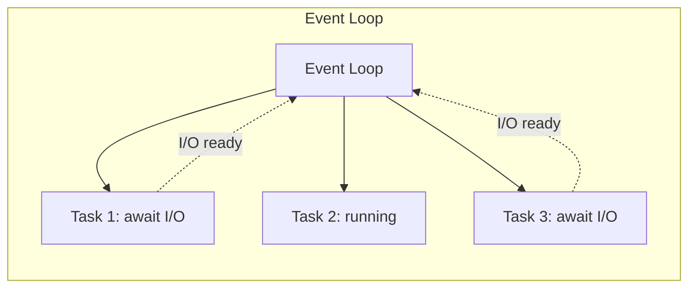

Python is a high-level, dynamically typed, interpreted language designed for readability and rapid development. It dominates in data science, automation, web backends, and scripting.

## Prerequisites

- Programming Logic (variables, control flow, functions, data structures)

---

## 1. Syntax, Types, and the Interpreter

### How Python Runs



Python is **compiled to bytecode**, then **interpreted** by the CPython virtual machine. It's not purely interpreted — there's a compilation step, but it happens transparently.

### Basic Types

```python
# Integers — arbitrary precision (no overflow)
x = 42
big = 10**100  # Python handles this natively

# Floats — IEEE 754 double precision
pi = 3.14159

# Strings — immutable sequences of Unicode
name = "Alice"
multiline = """
This spans
multiple lines
"""

# Booleans
is_active = True  # True and False are capitalized

# None — the absence of a value
result = None
```

### Type System

Python is **strongly typed** (no implicit coercion) and **dynamically typed** (types checked at runtime).

```python
"5" + 3      # TypeError — no implicit conversion
"5" + str(3) # "53" — explicit conversion required
int("5") + 3 # 8
```

### Everything is an Object

In Python, everything — integers, functions, classes, modules — is an object with an identity, type, and value.

```python
x = 42
type(x)    # <class 'int'>
id(x)      # memory address
isinstance(x, int)  # True
```

### Key Takeaway

Python trades execution speed for developer speed. Its clean syntax and dynamic typing make prototyping fast, but you pay for it with runtime errors that static languages catch at compile time.

---

## 2. Control Flow, Functions, and Modules

### Conditionals

```python
if score >= 90:
    grade = "A"
elif score >= 80:
    grade = "B"
elif score >= 70:
    grade = "C"
else:
    grade = "F"

# Ternary expression
status = "adult" if age >= 18 else "minor"
```

### Loops

```python
# For loop — iterates over any iterable
for item in [1, 2, 3]:
    print(item)

# With index
for i, item in enumerate(["a", "b", "c"]):
    print(f"{i}: {item}")

# While loop
while not done:
    result = process()
    done = result.is_complete

# Loop control
for n in range(100):
    if n % 2 == 0:
        continue  # skip even numbers
    if n > 50:
        break     # stop entirely
    print(n)
```

### Comprehensions

Concise syntax for building collections:

```python
# List comprehension
squares = [x**2 for x in range(10)]

# With filter
evens = [x for x in range(100) if x % 2 == 0]

# Dict comprehension
word_lengths = {word: len(word) for word in ["hello", "world"]}

# Set comprehension
unique_lengths = {len(word) for word in words}

# Generator expression (lazy — doesn't build full list)
total = sum(x**2 for x in range(1_000_000))
```

### Functions

```python
def greet(name: str, greeting: str = "Hello") -> str:
    """Return a greeting string."""
    return f"{greeting}, {name}!"

# *args and **kwargs
def flexible(*args, **kwargs):
    print(args)    # tuple of positional args
    print(kwargs)  # dict of keyword args

# First-class functions
def apply(func, value):
    return func(value)

result = apply(lambda x: x * 2, 5)  # 10
```

### Modules and Packages

```python
# Import a module
import os
from pathlib import Path
from collections import defaultdict, Counter

# Relative imports (within a package)
from .utils import helper
from ..config import settings
```

**Package structure:**

```text
my_package/
├── __init__.py
├── core.py
├── utils/
│   ├── __init__.py
│   └── helpers.py
└── tests/
    └── test_core.py
```

### Key Takeaway

Python's control flow is minimal by design — indentation replaces braces, and comprehensions replace verbose loops. Functions are first-class objects, enabling functional programming patterns alongside OOP.

---

## 3. Object-Oriented Programming

### Classes

```python
class BankAccount:
    """A simple bank account."""
    
    # Class variable — shared across all instances
    bank_name = "PyBank"
    
    def __init__(self, owner: str, balance: float = 0.0):
        # Instance variables — unique per instance
        self.owner = owner
        self._balance = balance  # convention: _ means "private"
    
    @property
    def balance(self) -> float:
        """Read-only access to balance."""
        return self._balance
    
    def deposit(self, amount: float) -> None:
        if amount <= 0:
            raise ValueError("Deposit must be positive")
        self._balance += amount
    
    def withdraw(self, amount: float) -> None:
        if amount > self._balance:
            raise InsufficientFundsError(self._balance, amount)
        self._balance -= amount
    
    def __repr__(self) -> str:
        return f"BankAccount(owner={self.owner!r}, balance={self._balance})"
    
    def __str__(self) -> str:
        return f"{self.owner}'s account: ${self._balance:.2f}"
```

### Inheritance

```python
class SavingsAccount(BankAccount):
    def __init__(self, owner: str, balance: float = 0.0, interest_rate: float = 0.02):
        super().__init__(owner, balance)
        self.interest_rate = interest_rate
    
    def apply_interest(self) -> None:
        interest = self._balance * self.interest_rate
        self.deposit(interest)
```

### Dunder (Magic) Methods

| Method | Purpose | Triggered By |
|--------|---------|--------------|
| `__init__` | Constructor | `MyClass()` |
| `__repr__` | Developer string | `repr(obj)` |
| `__str__` | User string | `str(obj)`, `print(obj)` |
| `__len__` | Length | `len(obj)` |
| `__getitem__` | Indexing | `obj[key]` |
| `__iter__` | Iteration | `for x in obj` |
| `__eq__` | Equality | `obj1 == obj2` |
| `__hash__` | Hashing | `hash(obj)`, dict keys |
| `__enter__`/`__exit__` | Context manager | `with obj:` |

### Protocols and Duck Typing

Python uses **duck typing** — if it walks like a duck and quacks like a duck, it's a duck.

```python
# Any object with __iter__ and __next__ works in a for loop
# Any object with __enter__ and __exit__ works with `with`
# No interface declaration needed
```

### Key Takeaway

Python's OOP is flexible — no access modifiers (just conventions), multiple inheritance via MRO, and protocols over interfaces. Use classes when you need state + behavior together; use functions and modules when you don't.

---

## 4. Standard Library Highlights

### Collections

```python
from collections import defaultdict, Counter, deque, namedtuple

# defaultdict — auto-creates missing keys
word_count = defaultdict(int)
for word in words:
    word_count[word] += 1

# Counter — count occurrences
Counter("mississippi")  # Counter({'s': 4, 'i': 4, 'p': 2, 'm': 1})

# deque — O(1) append/pop from both ends
queue = deque([1, 2, 3])
queue.appendleft(0)  # deque([0, 1, 2, 3])
queue.pop()          # 3

# namedtuple — lightweight immutable data class
Point = namedtuple("Point", ["x", "y"])
p = Point(3, 4)
p.x  # 3
```

### itertools

```python
from itertools import chain, islice, groupby, product, combinations

# chain — flatten iterables
list(chain([1, 2], [3, 4]))  # [1, 2, 3, 4]

# islice — slice any iterable (lazy)
list(islice(range(1000), 5, 10))  # [5, 6, 7, 8, 9]

# product — cartesian product
list(product("AB", "12"))  # [('A','1'), ('A','2'), ('B','1'), ('B','2')]

# combinations
list(combinations("ABCD", 2))  # [('A','B'), ('A','C'), ...]
```

### pathlib

```python
from pathlib import Path

# Modern file path handling
config = Path.home() / ".config" / "myapp" / "settings.json"
config.parent.mkdir(parents=True, exist_ok=True)
config.write_text('{"key": "value"}')
data = config.read_text()

# Glob
for py_file in Path("src").rglob("*.py"):
    print(py_file)
```

### Key Takeaway

Python's standard library is vast ("batteries included"). Before reaching for a third-party package, check if the stdlib already solves your problem.

---

## 5. Error Handling and Debugging

### Exception Hierarchy



### Try/Except Pattern

```python
try:
    result = risky_operation()
except ValueError as e:
    logger.warning(f"Invalid value: {e}")
    result = default_value
except (IOError, OSError) as e:
    logger.error(f"IO error: {e}")
    raise  # re-raise after logging
else:
    # Runs only if no exception occurred
    process(result)
finally:
    # Always runs — cleanup
    cleanup()
```

### Custom Exceptions

```python
class AppError(Exception):
    """Base exception for this application."""
    pass

class InsufficientFundsError(AppError):
    def __init__(self, balance: float, amount: float):
        self.balance = balance
        self.amount = amount
        super().__init__(
            f"Cannot withdraw ${amount:.2f} from balance ${balance:.2f}"
        )
```

### Best Practices

- **Catch specific exceptions** — never bare `except:`
- **Fail fast** — raise early when preconditions aren't met
- **Use `else`** — keep the `try` block minimal
- **Custom exceptions** — for domain-specific errors
- **Don't silence errors** — log them at minimum

### Key Takeaway

Exceptions are for exceptional situations, not control flow. Design your code so the happy path doesn't rely on catching exceptions.

---

## 6. Decorators, Generators, and Context Managers

### Decorators

A decorator wraps a function to modify its behavior without changing its code.

```python
import functools
import time

def timer(func):
    """Measure execution time."""
    @functools.wraps(func)
    def wrapper(*args, **kwargs):
        start = time.perf_counter()
        result = func(*args, **kwargs)
        elapsed = time.perf_counter() - start
        print(f"{func.__name__} took {elapsed:.4f}s")
        return result
    return wrapper

@timer
def slow_function():
    time.sleep(1)

# Equivalent to: slow_function = timer(slow_function)
```

**Decorator chain execution order:**



Decorators apply bottom-up but execute top-down.

### Generators

Functions that `yield` values lazily — producing one item at a time instead of building an entire list in memory.

```python
def fibonacci():
    """Infinite Fibonacci sequence."""
    a, b = 0, 1
    while True:
        yield a
        a, b = b, a + b

# Use with islice for bounded consumption
from itertools import islice
first_10 = list(islice(fibonacci(), 10))
# [0, 1, 1, 2, 3, 5, 8, 13, 21, 34]
```

**Why generators matter:**

- Process files larger than RAM line by line
- Represent infinite sequences
- Pipeline data transformations without intermediate lists

### Context Managers

Guarantee cleanup via `__enter__` and `__exit__`:

```python
# Using a class
class DatabaseConnection:
    def __enter__(self):
        self.conn = connect_to_db()
        return self.conn
    
    def __exit__(self, exc_type, exc_val, exc_tb):
        self.conn.close()
        return False  # don't suppress exceptions

# Using contextlib
from contextlib import contextmanager

@contextmanager
def temp_directory():
    path = create_temp_dir()
    try:
        yield path
    finally:
        remove_dir(path)

with temp_directory() as tmp:
    # work with tmp
    pass
# tmp is cleaned up here
```

### Key Takeaway

Decorators, generators, and context managers are Python's power tools. They enable clean separation of concerns: decorators for cross-cutting behavior, generators for lazy evaluation, context managers for resource lifecycle.

---

## 7. Type Hints and Static Analysis

### Basic Type Hints

```python
from typing import Optional, Union

def process(data: list[str], limit: int = 10) -> dict[str, int]:
    return {item: len(item) for item in data[:limit]}

def find_user(user_id: int) -> Optional[User]:
    """Returns User or None."""
    ...

# Union types (Python 3.10+)
def handle(value: int | str) -> None: ...
```

### Generics

```python
from typing import TypeVar, Generic

T = TypeVar("T")

class Stack(Generic[T]):
    def __init__(self) -> None:
        self._items: list[T] = []
    
    def push(self, item: T) -> None:
        self._items.append(item)
    
    def pop(self) -> T:
        return self._items.pop()

# Usage
int_stack: Stack[int] = Stack()
int_stack.push(42)
```

### Protocols (Structural Typing)

```python
from typing import Protocol

class Drawable(Protocol):
    def draw(self) -> None: ...

def render(obj: Drawable) -> None:
    obj.draw()

# Any class with a draw() method satisfies Drawable
# No inheritance required
```

### Running mypy

```bash
# Install
pip install mypy

# Check
mypy src/ --strict

# Common flags
mypy --ignore-missing-imports --disallow-untyped-defs src/
```

### Key Takeaway

Type hints are optional but invaluable for large codebases. They catch bugs before runtime, serve as documentation, and enable IDE autocompletion. Use them progressively — start with function signatures, then add internal annotations as needed.

---

## 8. Concurrency

### The GIL (Global Interpreter Lock)



The GIL means **CPU-bound** Python threads don't run in parallel. But **I/O-bound** threads do benefit from threading because the GIL is released during I/O waits.

### Threading (I/O-bound)

```python
from concurrent.futures import ThreadPoolExecutor
import requests

urls = ["https://api.example.com/1", "https://api.example.com/2", ...]

def fetch(url: str) -> str:
    return requests.get(url).text

with ThreadPoolExecutor(max_workers=10) as executor:
    results = list(executor.map(fetch, urls))
```

### Multiprocessing (CPU-bound)

```python
from concurrent.futures import ProcessPoolExecutor

def heavy_computation(n: int) -> int:
    return sum(i * i for i in range(n))

with ProcessPoolExecutor() as executor:
    results = list(executor.map(heavy_computation, [10**6, 10**7, 10**8]))
```

### asyncio (I/O-bound, single-threaded)

```python
import asyncio
import aiohttp

async def fetch(session: aiohttp.ClientSession, url: str) -> str:
    async with session.get(url) as response:
        return await response.text()

async def main():
    async with aiohttp.ClientSession() as session:
        tasks = [fetch(session, url) for url in urls]
        results = await asyncio.gather(*tasks)

asyncio.run(main())
```



### When to Use What

| Scenario | Tool | Why |
|----------|------|-----|
| Many HTTP requests | asyncio or threading | I/O-bound, GIL released |
| Image processing | multiprocessing | CPU-bound, bypasses GIL |
| File I/O | threading | GIL released during disk I/O |
| Simple script | sequential | Concurrency adds complexity |

### Key Takeaway

Python's concurrency story is shaped by the GIL. Use threading for I/O, multiprocessing for CPU, and asyncio when you need thousands of concurrent I/O operations without thread overhead.

---

## 9. Packaging and Dependency Management

### Virtual Environments

```bash
# Create
python -m venv .venv

# Activate
source .venv/bin/activate  # Linux/macOS
.venv\Scripts\activate     # Windows

# Deactivate
deactivate
```

### Project Structure

```text
my-project/
├── pyproject.toml          # Modern project metadata
├── src/
│   └── my_package/
│       ├── __init__.py
│       ├── core.py
│       └── utils.py
├── tests/
│   ├── conftest.py
│   ├── test_core.py
│   └── test_utils.py
├── .venv/                  # Not committed
└── README.md
```

### pyproject.toml

```toml
[project]
name = "my-package"
version = "1.0.0"
requires-python = ">=3.11"
dependencies = [
    "requests>=2.28",
    "pydantic>=2.0",
]

[project.optional-dependencies]
dev = [
    "pytest>=7.0",
    "mypy>=1.0",
    "ruff>=0.1",
]

[build-system]
requires = ["hatchling"]
build-backend = "hatchling.build"
```

### Dependency Tools

| Tool | Purpose |
|------|---------|
| pip | Install packages |
| venv | Isolated environments |
| pip-tools | Pin dependencies with `pip-compile` |
| poetry | All-in-one (deps + packaging + publishing) |
| uv | Fast pip/venv replacement (Rust-based) |

### Key Takeaway

Always use virtual environments. Pin your dependencies. Use `pyproject.toml` as the single source of project metadata.

---

## 10. Testing

### pytest Basics

```python
# test_math.py
import pytest
from my_package.math import divide

def test_divide_normal():
    assert divide(10, 2) == 5.0

def test_divide_by_zero():
    with pytest.raises(ZeroDivisionError):
        divide(10, 0)

@pytest.mark.parametrize("a,b,expected", [
    (10, 2, 5.0),
    (9, 3, 3.0),
    (0, 5, 0.0),
])
def test_divide_parametrized(a, b, expected):
    assert divide(a, b) == expected
```

### Fixtures

```python
@pytest.fixture
def db_connection():
    """Create and teardown a test database connection."""
    conn = create_test_db()
    yield conn  # test runs here
    conn.close()
    drop_test_db()

def test_insert_user(db_connection):
    db_connection.execute("INSERT INTO users ...")
    assert db_connection.query("SELECT COUNT(*) FROM users") == 1
```

### Mocking

```python
from unittest.mock import patch, MagicMock

@patch("my_package.api.requests.get")
def test_fetch_data(mock_get):
    mock_get.return_value = MagicMock(
        status_code=200,
        json=lambda: {"name": "Alice"}
    )
    
    result = fetch_user(1)
    assert result["name"] == "Alice"
    mock_get.assert_called_once_with("https://api.example.com/users/1")
```

### Test Organization

```text
tests/
├── conftest.py          # Shared fixtures
├── unit/
│   ├── test_models.py
│   └── test_utils.py
├── integration/
│   └── test_api.py
└── e2e/
    └── test_workflow.py
```

### Key Takeaway

Write tests as you write code, not after. pytest's fixture system and parametrize make it easy to cover edge cases without repetition. Mock external dependencies, not your own code.

---

## Summary

| Topic | Core Concept |
|-------|-------------|
| Syntax & Types | Everything is an object, dynamic + strong typing |
| Control Flow | Comprehensions over verbose loops |
| OOP | Duck typing, protocols, flexible inheritance |
| Standard Library | Batteries included — check before installing |
| Error Handling | Specific exceptions, fail fast |
| Decorators/Generators | Separation of concerns, lazy evaluation |
| Type Hints | Optional but essential for large codebases |
| Concurrency | GIL shapes the strategy: threading/multiprocessing/asyncio |
| Packaging | venv + pyproject.toml + pinned deps |
| Testing | pytest fixtures + parametrize + mock externals |

Python's philosophy: **readability counts**, **explicit is better than implicit**, **there should be one obvious way to do it**. When in doubt, run `import this`.
