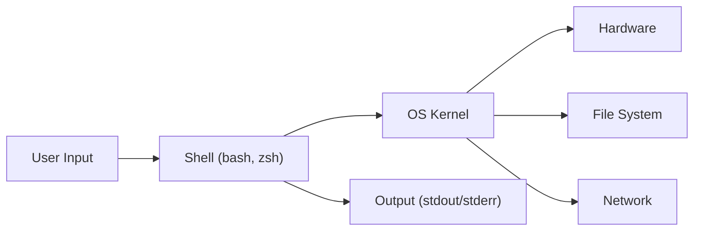
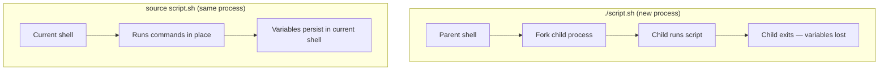

## What is a Shell?

A shell is a command-line interpreter — a program that reads text commands, interprets them, and executes them by calling the operating system's kernel. It serves two roles: an interactive environment for running commands one at a time, and a programming language for automating sequences of commands.



The shell is NOT the terminal. The terminal is the window application (iTerm2, GNOME Terminal). The shell is the program running inside it.

---

## Shell Types

| Shell | Path | Description | Use Case |
|-------|------|-------------|----------|
| `sh` | `/bin/sh` | POSIX shell — minimal, portable | System scripts, Docker |
| `bash` | `/bin/bash` | Bourne Again Shell — most common | Linux scripting (default) |
| `zsh` | `/bin/zsh` | Z Shell — extended features | macOS default, interactive use |
| `dash` | `/bin/dash` | Debian Almquist Shell — fast | Debian/Ubuntu system scripts |
| `fish` | `/usr/bin/fish` | Friendly Interactive Shell | Interactive use (not POSIX) |

### How to Check Your Shell

```bash
echo $SHELL          # login shell
echo $0              # current shell
cat /etc/shells      # all available shells
```

### Choosing a Shell for Scripts

- **bash** — default choice for scripts. Available everywhere on Linux, feature-rich
- **sh** — when portability matters (Docker Alpine, BSD, embedded)
- **zsh** — avoid for scripts (not guaranteed on servers)

---

## Script Structure

Every shell script follows this pattern:

```bash
#!/bin/bash
# Shebang — tells the OS which interpreter to use

# Description: What this script does
# Author: Your name

set -euo pipefail  # Strict mode (critical for reliability)

# Constants
readonly LOG_DIR="/var/log/myapp"

# Functions
log() {
    echo "[$(date '+%Y-%m-%d %H:%M:%S')] $*"
}

# Main logic
log "Script started"
log "Script completed"
```

### The Shebang Line

The shebang (`#!`) must be the very first line — no blank lines or comments before it.

```bash
#!/bin/bash          # Use bash explicitly
#!/bin/sh            # POSIX shell (portable)
#!/usr/bin/env bash  # Find bash in PATH (more portable across systems)
```

`#!/usr/bin/env bash` is preferred when bash might be in different locations (e.g., `/usr/local/bin/bash` on macOS with Homebrew).

---

## Running Scripts

### Three Ways to Execute

```bash
# 1. Make executable and run directly
chmod +x script.sh
./script.sh

# 2. Run with interpreter explicitly (shebang ignored)
bash script.sh

# 3. Source — runs in CURRENT shell (variables persist)
source script.sh
. script.sh          # POSIX equivalent
```

### Execute vs Source



When to source:

- Loading environment variables (`.env` files)
- Loading shell functions for interactive use
- Modifying the current shell's state (cd, export)

When to execute:

- Running automation scripts
- Anything that should be isolated from your shell

---

## Strict Mode: `set -euo pipefail`

This single line prevents the majority of shell scripting bugs:

| Flag | Effect | Without It |
|------|--------|-----------|
| `-e` | Exit on any command failure | Script continues after errors |
| `-u` | Error on unset variables | Unset vars expand to empty string |
| `-o pipefail` | Pipe fails if any command fails | Only last command's exit code matters |

### Why Each Matters

```bash
# Without -e: script continues after failure
cp important.dat /backup/    # fails if /backup/ doesn't exist
rm important.dat             # deletes the only copy!

# Without -u: typos cause silent bugs
filename="report.txt"
rm "$filname"                # typo! expands to empty string

# Without pipefail: hidden failures in pipes
curl http://api.example.com | jq '.data'
# If curl fails, jq gets empty input, pipe "succeeds"
```

### When to Temporarily Disable

```bash
set -euo pipefail

# Some commands legitimately return non-zero
set +e
grep "pattern" file.txt   # returns 1 if no match
result=$?
set -e

# Or use || true
grep "pattern" file.txt || true
```

---

## Exit Codes

Every command returns an exit code (0-255):

| Code | Meaning |
|------|---------|
| 0 | Success |
| 1 | General error |
| 2 | Misuse of shell command |
| 126 | Command found but not executable |
| 127 | Command not found |
| 128+N | Killed by signal N (e.g., 137 = SIGKILL) |

```bash
# Check last exit code
ls /nonexistent
echo $?    # 2

# Use in conditionals
if command; then
    echo "Success"
else
    echo "Failed with code $?"
fi

# Set your own exit code
exit 0     # success
exit 1     # failure
```

---

## Interactive vs Non-Interactive

| Aspect | Interactive | Non-Interactive (Script) |
|--------|-------------|------------------------|
| Reads from | Keyboard | File |
| Loads | `.bashrc`, `.bash_profile` | Nothing (unless sourced) |
| Prompt | Yes (`PS1`) | No |
| Job control | Yes | Limited |
| PATH | Full user PATH | May be minimal |

This matters for cron jobs and CI/CD — your script won't have the same PATH or aliases as your interactive shell.

```bash
# In scripts, always use full paths or set PATH explicitly
PATH="/usr/local/bin:/usr/bin:/bin"
export PATH
```

---

## Key Takeaways

1. **Always use a shebang** — `#!/bin/bash` or `#!/usr/bin/env bash`
2. **Always use strict mode** — `set -euo pipefail` prevents silent failures
3. **Execute for isolation, source for environment** — know the difference
4. **Exit codes are your API** — 0 means success, anything else is failure
5. **Scripts don't inherit your interactive environment** — set PATH explicitly in cron/CI
6. **Use bash for scripts** unless you specifically need POSIX portability
