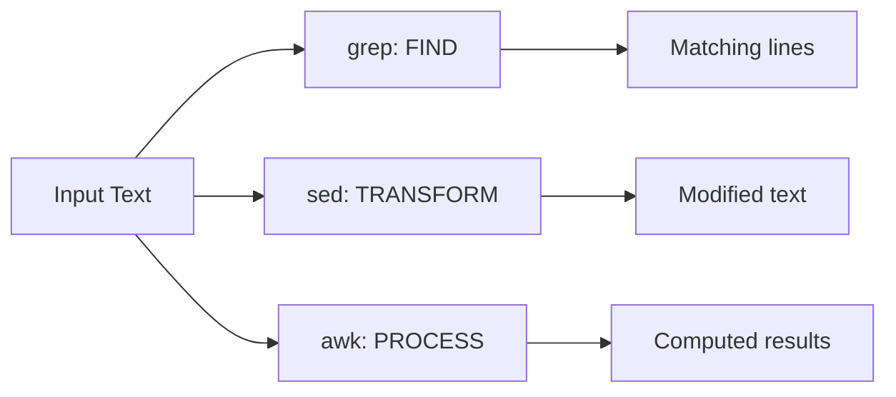

## The Big Three: grep, sed, awk

These three tools handle 90% of text processing needs on any Unix system:

| Tool | Purpose | Think of it as |
|------|---------|---------------|
| `grep` | Find lines matching a pattern | Filter |
| `sed` | Transform text (find & replace) | Editor |
| `awk` | Process structured/columnar data | Spreadsheet |



---

## grep — Search for Patterns

### Basic Usage

```bash
grep "error" logfile.txt              # lines containing "error"
grep -i "error" logfile.txt           # case-insensitive
grep -n "error" logfile.txt           # show line numbers
grep -c "error" logfile.txt           # count matches
grep -l "TODO" src/*.py               # list files with matches
grep -L "test" src/*.py               # list files WITHOUT matches
grep -v "debug" logfile.txt           # invert (exclude matches)
grep -r "TODO" src/                   # recursive search
grep -w "error" logfile.txt           # whole word only
```

### Extended Regex (`-E`)

```bash
grep -E "error|warning|critical" log  # alternation (OR)
grep -E "^[0-9]{4}-[0-9]{2}" log     # lines starting with date
grep -E "HTTP/[12]\.[01]\" [45]" log  # 4xx/5xx responses
grep -oE "[0-9]+\.[0-9]+\.[0-9]+\.[0-9]+" log  # extract IPs
```

### Common Patterns

```bash
# Find function definitions in Python
grep -rn "^def " src/

# Find TODO/FIXME comments
grep -rn "TODO\|FIXME\|HACK" --include="*.py" .

# Count errors per log file
grep -c "ERROR" /var/log/*.log

# Lines between two patterns
grep -A5 "Exception" log    # 5 lines After match
grep -B3 "Exception" log    # 3 lines Before match
grep -C2 "Exception" log    # 2 lines Context (before + after)
```

---

## sed — Stream Editor

### Substitution (Most Common Use)

```bash
# Replace first occurrence per line
sed 's/old/new/' file

# Replace ALL occurrences per line
sed 's/old/new/g' file

# Case-insensitive replace
sed 's/error/ERROR/gi' file

# In-place editing
sed -i 's/old/new/g' file        # Linux
sed -i '' 's/old/new/g' file     # macOS (requires empty string)
```

### Line Operations

```bash
# Delete lines
sed '/^#/d' file                 # delete comment lines
sed '/^$/d' file                 # delete empty lines
sed '1,5d' file                  # delete lines 1-5

# Print specific lines
sed -n '10,20p' file             # print lines 10-20
sed -n '/START/,/END/p' file     # print between patterns

# Insert/append
sed '1i\Header line' file        # insert before line 1
sed '$a\Footer line' file        # append after last line
```

### Practical Examples

```bash
# Remove trailing whitespace
sed 's/[[:space:]]*$//' file

# Replace environment variable placeholders
sed "s/\${DB_HOST}/$DB_HOST/g" template.conf > config.conf

# Comment out a line
sed -i '/dangerous_setting/s/^/# /' config.ini

# Extract value from key=value
sed -n 's/^version=//p' config.ini
```

### Multiple Operations

```bash
# Chain with -e
sed -e 's/foo/bar/g' -e 's/baz/qux/g' file

# Or use semicolons
sed 's/foo/bar/g; s/baz/qux/g' file
```

---

## awk — Pattern Scanning and Processing

### Column Extraction

```bash
# Print specific columns (whitespace-delimited)
awk '{print $1, $3}' file

# Custom delimiter
awk -F',' '{print $2}' data.csv      # CSV
awk -F':' '{print $1}' /etc/passwd   # colon-separated
```

### Filtering

```bash
# Where clause (column conditions)
awk '$3 > 100 {print $1, $3}' file
awk '$2 == "ERROR" {print}' log
awk 'NF > 3' file                    # lines with more than 3 fields
awk 'length > 80' file               # lines longer than 80 chars
```

### Built-in Variables

| Variable | Meaning |
|----------|---------|
| `$0` | Entire line |
| `$1`-`$N` | Field N |
| `NR` | Current line number |
| `NF` | Number of fields in current line |
| `FS` | Field separator (input) |
| `OFS` | Output field separator |

```bash
# Number lines
awk '{print NR": "$0}' file

# Print last field
awk '{print $NF}' file

# Print second-to-last field
awk '{print $(NF-1)}' file
```

### Aggregation

```bash
# Sum a column
awk '{sum += $2} END {print "Total:", sum}' sales.txt

# Average
awk '{sum += $2; n++} END {print "Avg:", sum/n}' data.txt

# Count by category
awk '{count[$1]++} END {for (k in count) print k, count[k]}' log

# Max value
awk 'BEGIN{max=0} $3>max{max=$3} END{print "Max:", max}' data.txt
```

### BEGIN and END Blocks

```bash
awk '
BEGIN { FS=","; OFS="\t"; print "Name\tAge\tCity" }
NR > 1 { print $1, $2, $3 }
END { print "---"; print NR-1, "records processed" }
' data.csv
```

---

## cut, sort, uniq — Simple but Powerful

### cut — Extract Columns

```bash
cut -d',' -f1,3 data.csv         # fields 1 and 3, comma-delimited
cut -d':' -f1 /etc/passwd        # usernames
cut -c1-10 file                  # characters 1-10
```

### sort

```bash
sort file                        # alphabetical
sort -n file                     # numeric
sort -k2 -t',' file              # by field 2, comma-delimited
sort -r file                     # reverse
sort -u file                     # unique (deduplicate)
sort -h file                     # human-readable numbers (1K, 2M)
```

### uniq (requires sorted input)

```bash
sort file | uniq                 # remove duplicates
sort file | uniq -c              # count occurrences
sort file | uniq -d              # show only duplicates
sort file | uniq -c | sort -rn  # frequency ranking
```

---

## Combining Tools

```bash
# Top 10 IP addresses in access log
awk '{print $1}' access.log | sort | uniq -c | sort -rn | head -10

# Count HTTP status codes
awk '{print $9}' access.log | sort | uniq -c | sort -rn

# Find largest files
find . -type f -exec du -h {} \; | sort -rh | head -20

# Extract unique error messages
grep "ERROR" app.log | sed 's/.*ERROR //' | sort -u
```

---

## Key Takeaways

1. **grep finds, sed transforms, awk processes** — know which to reach for
2. **grep -E** for extended regex (alternation, quantifiers)
3. **sed 's/old/new/g'** for find-and-replace (add `-i` for in-place)
4. **awk '{print $N}'** for column extraction
5. **sort | uniq -c | sort -rn** is the frequency analysis pattern
6. **Combine tools with pipes** — each does one thing well
